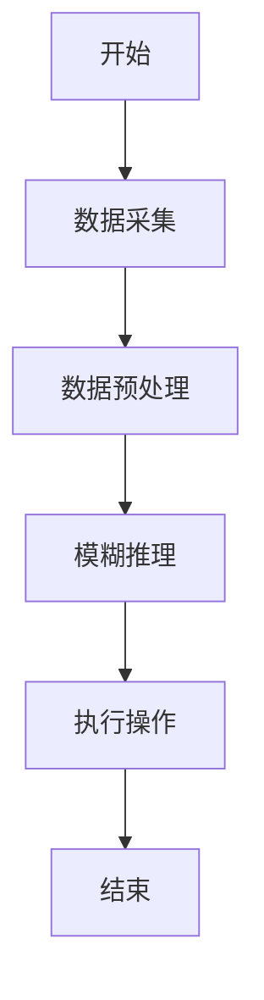
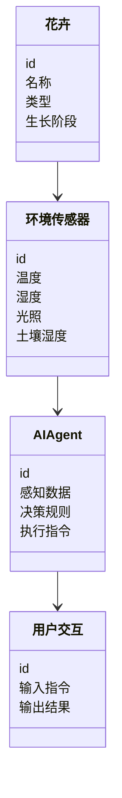
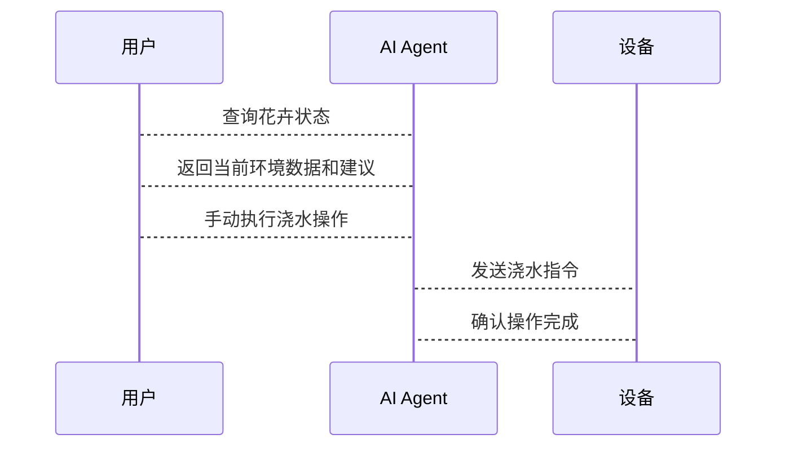

                 


```markdown
# 智能花瓶：AI Agent的花卉养护专家

## 关键词：智能花瓶，AI Agent，花卉养护，智能家居，物联网，AI算法

## 摘要：  
本文将详细介绍智能花瓶这一创新的AI Agent应用，探讨其在花卉养护中的核心作用。通过分析花卉养护的关键要素，结合AI Agent的感知、决策和执行能力，展示如何利用智能技术实现精准养护。文章涵盖从背景分析到系统架构设计的全过程，并通过实际案例展示智能花瓶的优势和潜力。

---

## 第一部分: 背景介绍

### 第1章: 花卉养护的智能化需求

#### 1.1 问题背景
##### 1.1.1 花卉养护的现状与挑战
现代生活中，越来越多的家庭选择在家中种植花卉，但花卉养护却常常面临诸多挑战。例如，新手养花者常因缺乏专业知识而难以维持花卉的健康生长。此外，传统养护方式依赖人工观察和经验判断，效率低下且容易出错。

##### 1.1.2 传统花卉养护方式的局限性
- **人工依赖性**：需要定期浇水、施肥、修剪，耗时耗力。
- **经验不足**：非专业人士难以准确判断花卉的健康状况。
- **环境变化**：室内外温湿度变化对花卉的影响难以实时感知。

##### 1.1.3 智能化养护的需求与趋势
随着智能家居和物联网技术的普及，人们对智能设备的需求日益增长。花卉养护领域的智能化转型成为必然趋势，AI Agent的引入为这一领域带来了新的可能性。

#### 1.2 问题描述
##### 1.2.1 花卉生长的关键影响因素
花卉的健康生长依赖于光照、温度、湿度、土壤湿度等多个因素。这些因素的变化往往难以被人工准确感知和处理。

##### 1.2.2 养护过程中的常见问题
- **浇水不当**：过量或不足都会影响花卉的健康。
- **光照不足或过强**：不同花卉对光照的需求不同。
- **病虫害**：早期症状难以发现，导致病情扩散。

##### 1.2.3 智能化解决方案的必要性
通过智能传感器和AI算法，实时监测并优化花卉生长环境，实现精准养护。

#### 1.3 问题解决
##### 1.3.1 AI Agent在花卉养护中的作用
AI Agent能够实时感知环境数据，分析花卉需求，并通过自动化设备执行养护操作。

##### 1.3.2 智能花瓶的核心功能与目标
- **环境感知**：实时监测温度、湿度、光照、土壤湿度等参数。
- **智能决策**：基于感知数据和AI算法，制定养护策略。
- **自动化执行**：通过连接智能设备（如喷雾器、补光灯）自动执行养护操作。

##### 1.3.3 解决方案的实现路径
从环境数据采集、AI算法分析到设备执行，构建一个闭环的智能养护系统。

#### 1.4 边界与外延
##### 1.4.1 智能花瓶的功能边界
- 仅限于花卉养护，不涉及其他智能家居设备的控制。
- 适用于家庭、办公室等小型环境，不支持大规模种植。

##### 1.4.2 解决方案的适用范围
- 适用于常见室内花卉，针对不同花卉可定制养护策略。
- 支持多种传感器和设备的扩展。

##### 1.4.3 与其他智能设备的协同关系
通过智能家居平台，可与空调、加湿器等设备联动，进一步优化环境条件。

#### 1.5 核心要素组成
##### 1.5.1 硬件部分
- **环境传感器**：温度、湿度、光照、土壤湿度传感器。
- **智能花瓶主体**：包含传感器和控制模块。
- **执行设备**：喷雾器、补光灯、风扇等。

##### 1.5.2 软件部分
- **AI算法**：用于数据分析和决策。
- **用户交互界面**：手机APP或网页端，供用户查看数据和控制设备。
- **数据存储**：记录历史数据，支持后续分析和优化。

##### 1.5.3 数据采集与处理
- **实时采集**：传感器持续采集环境数据。
- **数据传输**：通过无线通信（如Wi-Fi、蓝牙）传输至云端或本地服务器。
- **数据处理**：AI算法分析数据，生成养护建议。

---

## 第二部分: 核心概念与联系

### 第2章: AI Agent与花卉养护的核心概念

#### 2.1 核心概念原理
##### 2.1.1 AI Agent的基本原理
AI Agent是一种智能代理系统，能够通过感知环境、分析信息并执行动作来实现目标。在花卉养护中，AI Agent充当“智能管家”，实时监控环境数据并调整养护策略。

##### 2.1.2 花卉养护中的AI Agent功能解析
- **感知环境**：通过传感器获取实时数据。
- **分析数据**：结合历史数据和AI算法，判断花卉的健康状况。
- **制定策略**：根据分析结果，制定最优的养护方案。
- **执行操作**：通过连接的设备自动执行浇水、补光等操作。

##### 2.1.3 多模态感知与智能决策
AI Agent能够同时处理多种数据源（如温度、湿度、光照），并通过融合分析做出更精准的决策。

#### 2.2 核心概念属性对比
##### 2.2.1 不同AI Agent的对比分析
| 特性                | 传统自动化设备 | 基于规则的AI Agent | 基于学习的AI Agent |
|---------------------|----------------|--------------------|--------------------|
| 决策方式            | 固定规则       | 基于预设规则       | 基于数据学习       |
| 灵活性              | 低             | 中等               | 高                 |
| 学习能力            | 无             | 无                 | 有                 |

##### 2.2.2 花卉养护场景下的属性特征
| 属性                | 描述                                       |
|---------------------|------------------------------------------|
| 实时性              | 需要快速响应环境变化                     |
| 精准性              | 养护策略需要根据具体环境和花卉需求调整   |
| 可扩展性            | 支持多种花卉和环境条件                   |

##### 2.2.3 系统性能指标对比
| 指标                | 传统方法 | AI Agent |
|---------------------|----------|----------|
| 环境监测响应时间    | 高       | 低       |
| 养护策略优化能力    | 无       | 有       |
| 系统维护复杂度      | 高       | 低       |

#### 2.3 ER实体关系图

```mermaid
erDiagram
    class 花卉 {
        id
        名称
        类型
        生长阶段
    }
    class 环境传感器 {
        id
        温度
        湿度
        光照
        土壤湿度
    }
    class AI Agent {
        id
        感知数据
        决策规则
        执行指令
    }
    class 用户交互 {
        id
        输入指令
        输出结果
    }
    花卉 --|{1,多} 感知数据
    环境传感器 --|{1,多} 感知数据
    AI Agent --|{1,1} 感知数据
    AI Agent --|{1,1} 决策规则
    AI Agent --|{1,多} 执行指令
    用户交互 --|{1,1} 决策规则
    用户交互 --|{1,多} 执行指令
```

---

## 第三部分: 算法原理讲解

### 第3章: AI Agent的算法实现

#### 3.1 算法原理
##### 3.1.1 模糊逻辑控制算法
模糊逻辑控制是一种适合处理非线性、复杂系统的控制方法。在花卉养护中，可以用于处理光照、温度等多因素的综合决策。

##### 3.1.2 算法流程
1. **数据采集**：获取环境传感器数据。
2. **数据预处理**：去除噪声，提取特征。
3. **模糊推理**：根据模糊规则生成控制指令。
4. **执行操作**：通过设备执行指令。

##### 3.1.3 算法实现代码
```python
# 模糊逻辑控制算法实现
import numpy as np

class FuzzyController:
    def __init__(self):
        self.rules = [
            # 模糊规则示例
            ('湿度高且光照不足', '增加光照'),
            ('湿度低且光照充足', '减少浇水频率'),
            # 其他规则...
        ]
    
    def apply_rules(self, humidity, light):
        # 简单的模糊判断
        if humidity > 70 and light < 50:
            return '增加光照'
        elif humidity < 30 and light > 80:
            return '减少浇水频率'
        else:
            return '保持当前状态'
    
    def control(self, humidity, light):
        recommendation = self.apply_rules(humidity, light)
        return recommendation

# 示例使用
controller = FuzzyController()
humidity = 40
light = 60
result = controller.control(humidity, light)
print(f"系统建议：{result}")
```

#### 3.2 算法流程图


---

## 第四部分: 系统分析与架构设计

### 第4章: 系统架构设计

#### 4.1 项目场景介绍
智能花瓶系统旨在为用户提供智能化的花卉养护解决方案，通过实时监测和智能决策，优化花卉生长环境。

#### 4.2 系统功能设计
##### 4.2.1 领域模型


##### 4.2.2 系统架构


##### 4.2.3 接口设计
- **传感器接口**：用于连接温度、湿度等传感器。
- **用户交互接口**：手机APP或网页端，供用户查看数据和控制设备。
- **设备控制接口**：连接喷雾器、补光灯等设备的控制接口。

##### 4.2.4 交互设计


---

## 第五部分: 项目实战

### 第5章: 智能花瓶的实现

#### 5.1 环境安装
- **硬件安装**：安装环境传感器和智能设备。
- **软件安装**：安装AI Agent和用户交互界面。

#### 5.2 核心代码实现
##### 5.2.1 数据采集模块
```python
import serial

# 假设使用Arduino作为传感器节点
ser = serial.Serial('COM3', 9600)
data = ser.readline().decode().strip()
print(data)
```

##### 5.2.2 AI算法模块
```python
from sklearn import tree

# 示例数据
X = [[20, 50], [25, 60], [30, 70]]
y = ['增加光照', '保持当前', '减少浇水']

# 训练决策树模型
clf = tree.DecisionTreeClassifier()
clf = clf.fit(X, y)

# 预测新数据
new_data = [[28, 65]]
prediction = clf.predict(new_data)
print(f"系统建议：{prediction[0]}")
```

##### 5.2.3 设备控制模块
```python
import serial

ser = serial.Serial('COM3', 9600)
ser.write(b'execute浇水命令\n')
ser.close()
```

#### 5.3 代码解读与分析
- **数据采集**：通过串口读取传感器数据。
- **AI算法**：使用决策树进行分类，根据环境数据生成养护建议。
- **设备控制**：通过串口发送指令，控制执行设备。

#### 5.4 实际案例分析
假设用户种植的是多肉植物，AI Agent根据当前温度（25℃）和湿度（65%）判断需要增加光照，自动打开补光灯。

#### 5.5 项目小结
通过实际案例，展示了智能花瓶的高效性和便捷性，AI Agent能够显著提升花卉养护的成功率。

---

## 第六部分: 总结与展望

### 第6章: 项目总结与未来展望

#### 6.1 项目成果总结
- 成功实现了智能花瓶的环境监测和智能养护功能。
- 提供了高效、精准的花卉养护解决方案。
- 提升了用户体验，降低了养护难度。

#### 6.2 最佳实践 tips
- 定期校准传感器，确保数据准确性。
- 根据花卉种类调整AI算法参数。
- 及时更新系统，优化养护策略。

#### 6.3 小结
智能花瓶作为AI Agent在智能家居领域的重要应用，通过实时感知、智能分析和自动化执行，为用户提供了全新的花卉养护方式。

#### 6.4 注意事项
- 确保设备正常运行，定期维护传感器和执行设备。
- 注意数据安全，避免用户信息泄露。
- 遵守相关法律法规，确保系统合规运行。

#### 6.5 拓展阅读
- 《人工智能在智能家居中的应用》
- 《基于物联网的智能花卉养护系统研究》
- 《模糊逻辑在智能控制中的应用》

---

## 结语
通过本文的详细讲解，读者可以全面了解智能花瓶的原理、设计和实现过程。AI Agent在花卉养护中的应用不仅提升了养护效率，也为智能家居的发展提供了新的思路。未来，随着技术的进步，智能花瓶将变得更加智能化和个性化，为用户带来更优质的生活体验。
```

