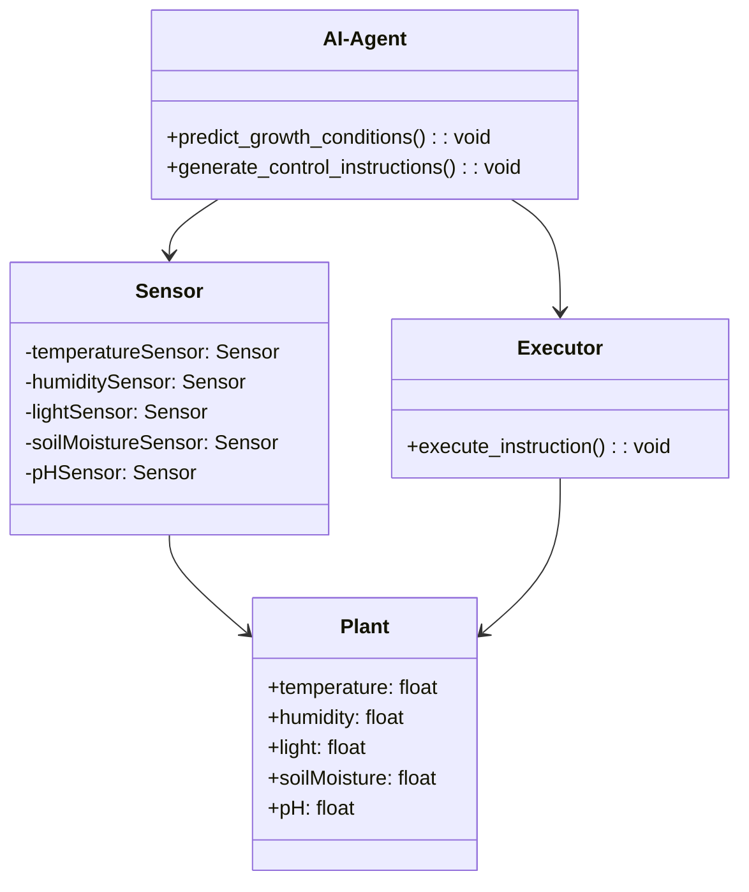
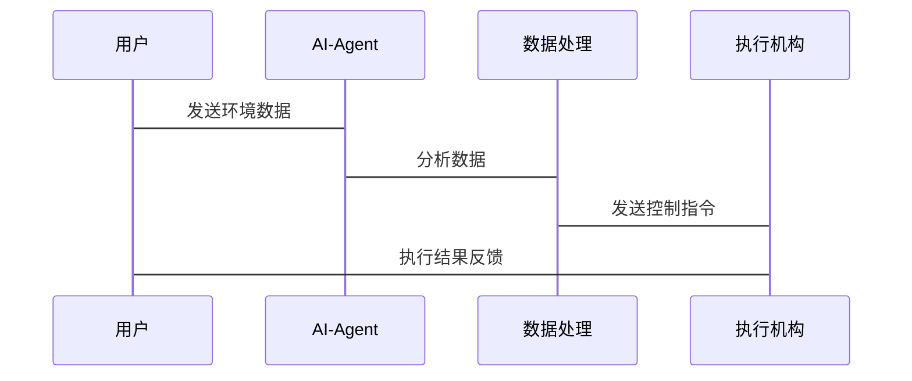

                 


# 智能花盆：AI Agent的植物生长优化管理器

## 关键词
智能花盆, AI Agent, 植物生长优化, 物联网, 人工智能

## 摘要
本文详细探讨了智能花盆的设计与实现，结合AI Agent技术，介绍了智能花盆的感知系统、决策系统和执行系统。通过分析植物生长的关键因素，提出了基于机器学习的优化算法，并展示了系统的架构设计与实际应用场景。文章还提供了项目实战部分，指导读者如何构建一个智能花盆系统，并总结了最佳实践与注意事项。

---

# 第一部分: 智能花盆的背景与概念

## 第1章: 智能花盆的发展与应用背景

### 1.1 智能花盆的定义与特点
#### 1.1.1 传统花盆与智能花盆的对比
传统的花盆仅提供基本的种植容器，依赖人工浇水、施肥和调整光照。而智能花盆通过传感器和AI技术，能够自动监测植物的生长环境并进行智能调控。

| 特性 | 传统花盆 | 智能花盆 |
|------|----------|----------|
| 感知 | 无       | 有       |
| 决策 | 人工     | 自动     |
| 执行 | 手动     | 自动     |

#### 1.1.2 智能花盆的核心功能与优势
- **环境监测**：实时监测温度、湿度、光照、土壤pH值等关键参数。
- **智能决策**：基于历史数据和AI算法，优化植物生长条件。
- **远程控制**：通过手机APP或云端平台远程监控和调整。

#### 1.1.3 智能花盆的应用场景与目标用户
- **应用场景**：家庭种植、办公室绿化、农业大棚等。
- **目标用户**：园艺爱好者、企业用户、农业从业者。

### 1.2 AI Agent在智能花盆中的作用
#### 1.2.1 AI Agent的基本概念
AI Agent是一种能够感知环境、自主决策并执行任务的智能体。在智能花盆中，AI Agent负责分析传感器数据，制定优化策略。

#### 1.2.2 AI Agent在植物生长管理中的应用
- 数据采集与分析：通过传感器获取环境数据，分析植物的生长状况。
- 决策优化：基于历史数据和机器学习模型，预测最佳生长条件。
- 自动控制：根据决策结果，控制水泵、风扇等执行机构。

#### 1.2.3 智能花盆中的AI Agent与传统自动化控制的区别
传统自动化控制基于固定的规则，而AI Agent能够学习和适应环境变化，提供更智能的解决方案。

### 1.3 智能花盆的市场现状与发展趋势
#### 1.3.1 智能家居与物联网技术的推动
随着物联网技术的普及，智能家居设备逐渐进入家庭，智能花盆作为其中的一部分，市场需求快速增长。

#### 1.3.2 智能花盆市场的现状分析
- **市场规模**：逐年增长，预计未来几年将保持较高增速。
- **主要厂商**：市场上已有多家厂商推出智能花盆产品。

#### 1.3.3 未来智能花盆的发展方向与技术趋势
- **智能化升级**：结合更复杂的AI算法，实现更精准的植物管理。
- **生态化发展**：与其他智能家居设备联动，构建完整的家庭生态系统。

### 1.4 本章小结
本章介绍了智能花盆的定义、特点及应用场景，重点分析了AI Agent在其中的作用，并探讨了市场现状和发展趋势。

---

# 第二部分: 智能花盆的核心技术与实现原理

## 第2章: 智能花盆的感知系统

### 2.1 智能花盆的传感器技术
#### 2.1.1 温度、湿度、光照传感器的原理与应用
- **温度传感器**：通过热敏电阻或红外传感器测量环境温度。
- **湿度传感器**：利用电容或电阻的变化测量空气湿度。
- **光照传感器**：通过光敏电阻或光电传感器测量光照强度。

#### 2.1.2 土壤湿度与pH值的检测方法
- **土壤湿度传感器**：通过电极测量土壤中的水分含量。
- **pH传感器**：利用离子选择性电极测量土壤酸碱度。

#### 2.1.3 传感器数据的采集与处理
- 数据采集：通过模数转换器（ADC）将模拟信号转换为数字信号。
- 数据处理：对采集到的数据进行滤波、归一化处理，确保数据准确性。

#### 2.1.4 数据采集流程
1. 传感器采集环境数据。
2. 数据通过ADC转换为数字信号。
3. 中央处理器（CPU）接收数据并进行处理。
4. 数据存储或传输到云端。

#### 2.1.5 传感器布置与布局优化
- 布置位置：传感器应均匀分布，确保数据的全面性。
- 布置密度：根据种植面积调整传感器数量，避免冗余。

### 2.2 数据采集与传输
#### 2.2.1 数据的无线传输技术
- **Wi-Fi**：适用于家庭环境，但功耗较高。
- **蓝牙**：低功耗，适合短距离传输。
- **ZigBee**：低功耗、高可靠性，适合物联网设备。

#### 2.2.2 数据存储与管理
- **本地存储**：将数据存储在智能花盆的本地存储器中。
- **云端存储**：通过物联网平台将数据上传到云端，方便远程监控和分析。

### 2.3 感知系统的设计与优化
#### 2.3.1 感知系统的整体架构
1. 传感器模块：负责数据采集。
2. 数据处理模块：对数据进行预处理。
3. 传输模块：将数据传输到云端或本地。

#### 2.3.2 传感器布置与布局优化
- 布置位置：传感器应均匀分布，确保数据的全面性。
- 布置密度：根据种植面积调整传感器数量，避免冗余。

#### 2.3.3 数据采集的精度与稳定性分析
- **精度**：传感器的测量精度直接影响决策的准确性。
- **稳定性**：传感器应具备良好的抗干扰能力，确保数据的稳定性。

### 2.4 本章小结
本章详细介绍了智能花盆的感知系统，包括传感器技术、数据采集与传输，以及系统设计与优化。

---

## 第3章: 智能花盆的AI Agent决策系统

### 3.1 AI Agent的核心算法
#### 3.1.1 机器学习算法在植物生长管理中的应用
- **监督学习**：基于历史数据训练模型，预测植物生长状况。
- **无监督学习**：通过聚类分析，发现异常情况。

#### 3.1.2 基于规则的决策系统
- **规则设定**：根据植物生长的条件，制定相应的控制策略。
- **规则优化**：通过机器学习不断优化规则，提高决策准确性。

#### 3.1.3 深度学习算法的适用场景
- **图像识别**：识别植物的生长状态。
- **时间序列分析**：预测植物生长趋势。

### 3.2 植物生长模型的构建
#### 3.2.1 植物生长的关键影响因素
- 温度、湿度、光照、土壤pH值等。

#### 3.2.2 基于历史数据的生长模型训练
- 数据收集：收集不同环境条件下的植物生长数据。
- 模型训练：使用机器学习算法训练模型，预测最佳生长条件。

#### 3.2.3 生长模型的验证与优化
- **验证**：通过实验验证模型的准确性。
- **优化**：根据实际数据不断优化模型，提高预测精度。

### 3.3 AI Agent的决策逻辑与实现
#### 3.3.1 数据分析与决策规则的制定
- 数据分析：对传感器数据进行分析，判断当前环境是否适宜植物生长。
- 决策规则：根据分析结果，制定相应的控制策略。

#### 3.3.2 基于实时数据的动态调整策略
- **实时监控**：持续监测环境数据，动态调整控制策略。
- **反馈机制**：根据执行结果调整决策，确保植物生长的最佳状态。

#### 3.3.3 决策结果的输出与执行
- **输出**：生成控制指令，如“开启水泵”、“调节光照强度”。
- **执行**：通过执行机构执行指令，调整环境条件。

### 3.4 本章小结
本章详细介绍了智能花盆的AI Agent决策系统，包括核心算法、生长模型的构建与优化，以及决策逻辑的实现。

---

## 第4章: 智能花盆的执行系统

### 4.1 执行机构的设计与实现
#### 4.1.1 水泵、风扇、LED灯等执行机构的原理与应用
- **水泵**：通过电机控制水流，实现自动浇水。
- **风扇**：通过电机调节风速，实现环境降温。
- **LED灯**：通过PWM调制，调节光照强度。

#### 4.1.2 执行机构的控制方式与接口设计
- **控制方式**：通过继电器或MOS管实现对执行机构的控制。
- **接口设计**：使用I2C或GPIO接口连接执行机构。

#### 4.1.3 执行机构的选型与性能分析
- **选型**：根据功率需求选择合适的执行机构。
- **性能分析**：分析执行机构的响应速度、功耗等性能指标。

### 4.2 执行系统的控制流程
#### 4.2.1 基于AI Agent的控制指令生成
- **指令生成**：AI Agent根据环境数据生成控制指令。
- **指令传输**：通过I2C或GPIO将指令传输到执行机构。

#### 4.2.2 执行机构的驱动与反馈机制
- **驱动**：执行机构根据指令进行动作。
- **反馈**：执行机构将动作状态反馈到系统，确保指令正确执行。

#### 4.2.3 控制流程的优化与调试
- **优化**：通过调整控制策略，提高执行效率。
- **调试**：通过实验验证控制流程的准确性。

### 4.3 执行系统的可靠性与安全性
#### 4.3.1 系统故障的检测与处理
- **故障检测**：通过传感器监测执行机构的状态，发现异常情况。
- **故障处理**：通过反馈机制，自动调整或提示用户处理。

#### 4.3.2 系统安全性的设计与实现
- **安全性设计**：防止未经授权的访问，确保系统安全。
- **安全性实现**：通过加密技术保护系统数据。

### 4.4 本章小结
本章详细介绍了智能花盆的执行系统，包括执行机构的设计与实现、控制流程的优化与调试，以及系统的可靠性与安全性设计。

---

# 第三部分: 系统分析与架构设计

## 第5章: 智能花盆的系统分析与架构设计

### 5.1 系统场景介绍
- **家庭种植**：用户在家中种植植物，通过智能花盆实现自动管理。
- **办公室绿化**：企业通过智能花盆优化办公室环境。

### 5.2 系统功能设计
#### 5.2.1 领域模型设计


#### 5.2.2 系统架构设计


#### 5.2.3 系统接口与交互流程


### 5.3 系统功能实现
- **环境监测**：实时采集环境数据。
- **智能决策**：基于AI算法生成控制指令。
- **自动控制**：执行机构根据指令调整环境条件。

---

# 第四部分: 项目实战

## 第6章: 项目实战

### 6.1 环境安装
- **硬件安装**：安装传感器、执行机构和中央处理器。
- **软件安装**：安装AI算法和系统控制软件。

### 6.2 核心代码实现
#### 6.2.1 数据采集与处理
```python
import RPi.GPIO as GPIO
import Adafruit_DHT

def read_sensor():
    humidity, temperature = Adafruit_DHT.read_retry(22, 4)
    return temperature, humidity
```

#### 6.2.2 AI Agent算法实现
```python
def predict_growth_conditions(temp, humidity):
    if temp < 15 or humidity < 40:
        return "adjust temperature and humidity"
    else:
        return "ideal conditions"
```

#### 6.2.3 执行机构控制
```python
def control_irrigation(pump_pin):
    GPIO.output(pump_pin, GPIO.HIGH)
    time.sleep(30)
    GPIO.output(pump_pin, GPIO.LOW)
```

### 6.3 实际案例分析
- **案例1**：用户种植的植物因温度过低导致生长缓慢，AI Agent自动调整温度和湿度，促进植物生长。
- **案例2**：传感器检测到土壤pH值异常，AI Agent自动调节灌溉溶液，恢复土壤酸碱度。

### 6.4 本章小结
本章通过实际项目案例，详细讲解了智能花盆的环境安装、核心代码实现和实际应用。

---

# 第五部分: 最佳实践与小结

## 第7章: 最佳实践与小结

### 7.1 最佳实践
- **传感器校准**：定期校准传感器，确保数据准确性。
- **系统维护**：定期检查系统硬件，确保正常运行。
- **数据备份**：定期备份系统数据，防止数据丢失。

### 7.2 注意事项
- **系统稳定性**：确保系统在复杂环境下稳定运行。
- **数据隐私**：保护用户数据，防止数据泄露。

### 7.3 拓展阅读
- **相关书籍**：《物联网技术与应用》、《人工智能入门》
- **技术博客**：推荐关注智能家居和人工智能领域的技术博客。

### 7.4 本章小结
本章总结了智能花盆的使用注意事项和维护方法，并推荐了相关的拓展阅读材料。

---

# 结语
通过本文的详细介绍，读者可以全面了解智能花盆的设计与实现，掌握其核心技术与实际应用。希望本文能够为智能花盆的开发和应用提供有价值的参考。

