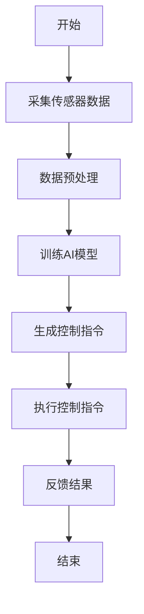
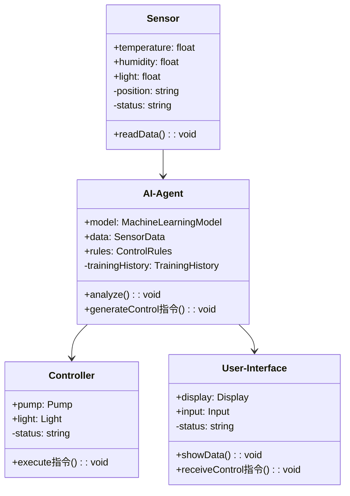
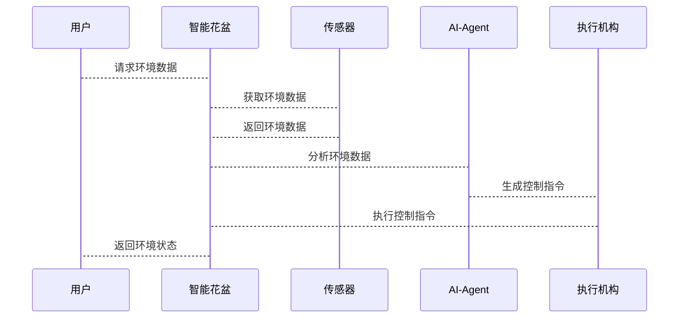

                 


# 智能花盆：AI Agent的植物生长监测

> **关键词**：智能花盆、AI Agent、植物生长监测、传感器、物联网、机器学习

> **摘要**：  
> 本文深入探讨了智能花盆在植物生长监测中的应用，重点介绍了AI Agent（人工智能代理）如何通过传感器数据采集、机器学习算法和智能控制系统，实现对植物生长环境的实时监测与优化。文章从背景与概念、算法原理、系统架构设计、项目实战等方面进行了详细分析，并通过具体案例展示了智能花盆的实际应用场景和技术实现。文章最后总结了智能花盆的优势与挑战，并提出了未来的发展方向。

---

## 第一部分：智能花盆的背景与概念

### 第1章：智能花盆的发展背景

#### 1.1 智能花盆的定义与分类

##### 1.1.1 智能花盆的定义  
智能花盆是一种结合了物联网（IoT）和人工智能（AI）技术的智能设备，能够实时监测植物的生长环境，并通过AI算法优化植物的生长条件。与传统花盆相比，智能花盆能够自动调节光照、温度、湿度等参数，为植物提供最佳的生长环境。

##### 1.1.2 智能花盆的分类  
智能花盆可以根据功能、技术实现方式或应用场景进行分类：  
1. **按功能分类**：  
   - **基础版**：仅支持基本的环境监测和简单的自动控制（如自动浇水）。  
   - **增强版**：支持多传感器数据采集、AI分析和高级控制功能。  
2. **按技术实现方式分类**：  
   - **基于传感器的智能花盆**：通过传感器采集环境数据，结合预设规则进行控制。  
   - **基于AI的智能花盆**：通过AI算法分析数据，实现智能化的环境调节。  
3. **按应用场景分类**：  
   - **家庭版**：用于家庭种植，适合普通用户。  
   - **农业版**：用于大规模农业生产，支持精准农业。  

##### 1.1.3 智能花盆的应用场景  
智能花盆广泛应用于家庭园艺、农业大棚、科研实验室等领域。例如：  
- **家庭用户**：用户可以通过手机APP实时查看植物的生长状态，并根据AI的建议调整种植条件。  
- **农业大棚**：通过智能花盆监测和控制大棚内的环境参数，实现高效农业。  
- **科研实验室**：研究人员可以利用智能花盆进行植物生长实验，获取精确的环境数据。  

#### 1.2 AI Agent的基本概念

##### 1.2.1 什么是AI Agent  
AI Agent（人工智能代理）是指能够感知环境、自主决策并执行任务的智能实体。在智能花盆中，AI Agent负责接收传感器数据，分析数据并生成控制指令，以优化植物的生长环境。

##### 1.2.2 AI Agent的核心特征  
AI Agent具有以下核心特征：  
1. **感知能力**：通过传感器获取环境数据。  
2. **决策能力**：基于数据进行分析和决策。  
3. **执行能力**：通过执行机构（如水泵、灯光控制器）调整环境参数。  
4. **学习能力**：通过机器学习不断优化决策模型。  

##### 1.2.3 AI Agent与传统自动化控制的区别  
AI Agent与传统自动化控制的主要区别在于智能化程度和适应性：  
- **传统自动化控制**：基于预设规则进行控制，缺乏灵活性。  
- **AI Agent**：能够根据环境数据动态调整控制策略，具有自适应能力。  

#### 1.3 植物生长监测的重要性

##### 1.3.1 植物生长监测的必要性  
植物生长监测是实现精准农业和高效种植的关键技术。通过实时监测植物的生长环境，可以及时发现问题并采取措施，提高植物的生长效率和质量。

##### 1.3.2 植物生长监测的主要指标  
植物生长监测的主要指标包括：  
1. **环境指标**：温度、湿度、光照强度、土壤湿度等。  
2. **生理指标**：植物的生长速率、光合作用效率等。  
3. **健康指标**：植物的健康状况，如是否存在病虫害。  

##### 1.3.3 智能花盆在植物生长监测中的作用  
智能花盆通过AI Agent实现了对植物生长环境的实时监测和优化，能够显著提高植物的生长效率和质量。例如，智能花盆可以根据植物的生长阶段自动调整光照和水分供应，从而促进植物的健康生长。

#### 1.4 智能花盆的工作原理

##### 1.4.1 智能花盆的基本工作流程  
智能花盆的工作流程如下：  
1. **数据采集**：传感器采集环境数据（如温度、湿度、光照强度等）。  
2. **数据传输**：将传感器数据传输到AI Agent。  
3. **数据分析**：AI Agent通过机器学习算法分析数据，生成控制指令。  
4. **环境调节**：根据控制指令调整环境参数（如开启水泵浇水、调节灯光强度）。  

##### 1.4.2 智能花盆的核心功能模块  
智能花盆的核心功能模块包括：  
1. **传感器模块**：负责采集环境数据。  
2. **AI Agent模块**：负责数据分析和决策。  
3. **执行机构**：负责根据控制指令调整环境参数。  
4. **用户交互界面**：用户可以通过手机APP或网页查看数据和控制设备。  

##### 1.4.3 智能花盆的系统架构概述  
智能花盆的系统架构包括前端、后端和云端三部分：  
- **前端**：用户交互界面，如手机APP或网页。  
- **后端**：AI Agent和数据处理模块。  
- **云端**：存储传感器数据和AI模型。  

---

## 第二部分：智能花盆的核心概念与联系

### 第2章：智能花盆的核心概念与联系

#### 2.1 AI Agent的核心原理

##### 2.1.1 AI Agent的感知与决策机制  
AI Agent的感知机制包括：  
1. **数据采集**：通过传感器获取环境数据。  
2. **数据预处理**：对传感器数据进行清洗和特征提取。  
3. **数据分析**：通过机器学习算法分析数据，生成决策指令。  

##### 2.1.2 AI Agent的执行与反馈机制  
AI Agent的执行机制包括：  
1. **生成控制指令**：根据分析结果生成控制指令。  
2. **执行指令**：通过执行机构（如水泵、灯光控制器）调整环境参数。  
3. **反馈机制**：通过传感器反馈执行效果，不断优化决策模型。  

##### 2.1.3 AI Agent的自适应学习能力  
AI Agent通过机器学习算法实现自适应学习：  
1. **训练数据**：利用历史传感器数据训练AI模型。  
2. **模型优化**：通过不断迭代优化模型，提高决策的准确性。  

#### 2.2 智能花盆的传感器与数据采集

##### 2.2.1 常见传感器类型与功能  
智能花盆常用的传感器包括：  
- **温度传感器**：监测环境温度。  
- **湿度传感器**：监测空气湿度和土壤湿度。  
- **光照强度传感器**：监测光照强度。  
- **二氧化碳传感器**：监测环境中的二氧化碳浓度。  

##### 2.2.2 数据采集的流程与方法  
数据采集的流程包括：  
1. **传感器采集数据**：传感器实时采集环境数据。  
2. **数据传输**：将传感器数据传输到AI Agent。  
3. **数据预处理**：对数据进行清洗和特征提取。  

##### 2.2.3 数据预处理与特征提取  
数据预处理包括：  
1. **数据清洗**：去除噪声数据和异常值。  
2. **特征提取**：从原始数据中提取有用的特征（如温度、湿度、光照强度等）。  

#### 2.3 智能花盆的AI算法与模型

##### 2.3.1 常用AI算法简介  
常用的AI算法包括：  
- **机器学习算法**：如线性回归、支持向量机（SVM）、随机森林等。  
- **深度学习算法**：如神经网络、卷积神经网络（CNN）、循环神经网络（RNN）等。  

##### 2.3.2 模型训练与优化  
模型训练与优化包括：  
1. **数据准备**：将预处理后的数据分为训练集和测试集。  
2. **模型训练**：利用训练数据训练AI模型。  
3. **模型评估**：通过测试数据评估模型的准确性。  
4. **模型优化**：通过调整模型参数或算法优化提高模型性能。  

##### 2.3.3 模型部署与应用  
模型部署与应用包括：  
1. **模型部署**：将训练好的AI模型部署到智能花盆的后端系统中。  
2. **实时监测**：AI Agent通过模型分析实时传感器数据，生成控制指令。  

#### 2.4 智能花盆的系统架构

##### 2.4.1 系统整体架构设计  
智能花盆的系统架构包括：  
1. **前端**：用户交互界面（如手机APP或网页）。  
2. **后端**：AI Agent和数据处理模块。  
3. **云端**：存储传感器数据和AI模型。  

##### 2.4.2 系统模块划分与功能描述  
系统模块划分包括：  
1. **传感器模块**：负责采集环境数据。  
2. **AI Agent模块**：负责数据分析和决策。  
3. **执行机构**：负责根据控制指令调整环境参数。  
4. **用户交互界面**：用户可以通过界面查看数据和控制设备。  

##### 2.4.3 系统的可扩展性与可维护性  
系统的可扩展性体现在：  
1. **模块化设计**：各模块相对独立，便于扩展和维护。  
2. **接口设计**：通过标准化接口实现模块之间的通信，便于升级和替换。  

---

## 第三部分：智能花盆的算法原理

### 第3章：智能花盆的算法原理

#### 3.1 AI Agent的算法流程

##### 3.1.1 算法流程图  
以下是AI Agent的算法流程图：



##### 3.1.2 算法实现步骤  
1. **数据采集**：通过传感器采集环境数据。  
2. **数据预处理**：对数据进行清洗和特征提取。  
3. **模型训练**：利用训练数据训练AI模型。  
4. **模型评估**：通过测试数据评估模型性能。  
5. **模型部署**：将模型部署到后端系统中。  
6. **实时监测**：AI Agent实时分析传感器数据，生成控制指令。  
7. **环境调节**：根据控制指令调整环境参数。  
8. **反馈机制**：通过传感器反馈执行效果，优化AI模型。  

#### 3.2 机器学习算法的数学模型

##### 3.2.1 线性回归模型  
线性回归模型的数学公式为：  
$$ y = \beta_0 + \beta_1 x + \epsilon $$  
其中，$y$ 是目标变量，$\beta_0$ 是截距，$\beta_1$ 是回归系数，$x$ 是自变量，$\epsilon$ 是误差项。  

##### 3.2.2 支持向量机（SVM）模型  
SVM模型的数学公式为：  
$$ \text{目标函数}：\min_{\beta, \beta_0} \frac{1}{2} \|\beta\|^2 + C \sum_{i=1}^n \xi_i $$  
$$ \text{约束条件}：y_i (\beta_0 + \beta \cdot x_i) \geq 1 - \xi_i, \xi_i \geq 0 $$  

#### 3.3 神经网络算法的数学模型

##### 3.3.1 神经网络的结构  
神经网络的结构包括输入层、隐藏层和输出层。  

##### 3.3.2 神经网络的训练过程  
神经网络的训练过程包括正向传播和反向传播：  
- **正向传播**：输入数据通过神经网络，计算输出值。  
- **反向传播**：计算预测值与实际值的误差，调整网络参数。  

##### 3.3.3 神经网络的激活函数  
常用的激活函数包括Sigmoid、ReLU（Rectified Linear Unit）、Tanh等。  

---

## 第四部分：智能花盆的系统架构设计

### 第4章：智能花盆的系统架构设计

#### 4.1 问题场景介绍

##### 4.1.1 系统目标  
智能花盆的系统目标是通过AI Agent实现对植物生长环境的实时监测与优化。  

##### 4.1.2 项目介绍  
本项目旨在开发一款支持AI Agent的智能花盆，能够通过传感器数据采集、AI算法分析和智能控制实现植物的精准种植。  

#### 4.2 系统功能设计

##### 4.2.1 领域模型（Mermaid 类图）  
以下是智能花盆的领域模型类图：



#### 4.3 系统架构设计

##### 4.3.1 系统架构（Mermaid 架构图）  
以下是智能花盆的系统架构图：


#### 4.4 系统接口设计

##### 4.4.1 接口定义  
1. **传感器接口**：  
   - 输入：无  
   - 输出：环境数据（如温度、湿度、光照强度等）  
2. **AI Agent接口**：  
   - 输入：环境数据  
   - 输出：控制指令  
3. **执行机构接口**：  
   - 输入：控制指令  
   - 输出：环境参数调整  

##### 4.4.2 接口实现  
1. **传感器接口实现**：通过UART或I2C协议与传感器通信。  
2. **AI Agent接口实现**：通过RESTful API与后端系统通信。  
3. **执行机构接口实现**：通过继电器或PWM信号控制执行机构。  

#### 4.5 系统交互设计

##### 4.5.1 交互流程（Mermaid 序列图）  
以下是智能花盆的系统交互流程图：



---

## 第五部分：智能花盆的项目实战

### 第5章：智能花盆的项目实战

#### 5.1 环境安装

##### 5.1.1 硬件安装  
1. **传感器安装**：将温度传感器、湿度传感器、光照强度传感器等安装在花盆周围。  
2. **执行机构安装**：安装水泵和灯光控制器。  
3. **通信模块安装**：安装Wi-Fi或蓝牙通信模块，用于数据传输。  

##### 5.1.2 软件安装  
1. **AI Agent安装**：安装Python环境，安装必要的库（如numpy、scikit-learn、tensorflow等）。  
2. **用户交互界面安装**：安装手机APP或网页界面所需的开发环境。  

#### 5.2 系统核心实现

##### 5.2.1 传感器数据采集代码  
以下是传感器数据采集的Python代码：

```python
import time
import serial

# 初始化传感器
ser = serial.Serial('COM3', 9600)  # 根据实际接口修改

def get_sensor_data():
    while True:
        data = ser.readline().decode().strip()
        if data:
            temperature = float(data.split(',')[0])
            humidity = float(data.split(',')[1])
            light = float(data.split(',')[2])
            return temperature, humidity, light
        time.sleep(1)

temperature, humidity, light = get_sensor_data()
print(f"Temperature: {temperature}°C, Humidity: {humidity}%, Light: {light}lux")
```

##### 5.2.2 AI Agent实现代码  
以下是AI Agent的Python代码：

```python
import numpy as np
from sklearn.svm import SVC

# 训练数据
X = np.array([[20, 60, 1000],  # 温度=20°C，湿度=60%，光照=1000lux，标签=健康
              [25, 70, 800],   # 温度=25°C，湿度=70%，光照=800lux，标签=健康
              [18, 50, 1200],  # 温度=18°C，湿度=50%，光照=1200lux，标签=健康
              [22, 65, 900],   # 温度=22°C，湿度=65%，光照=900lux，标签=健康
              [30, 80, 700],   # 温度=30°C，湿度=80%，光照=700lux，标签=异常
              [28, 75, 600],   # 温度=28°C，湿度=75%，光照=600lux，标签=异常
              [23, 60, 1100],  # 温度=23°C，湿度=60%，光照=1100lux，标签=异常
              [24, 68, 850],   # 温度=24°C，湿度=68%，光照=850lux，标签=异常
              [21, 55, 1300],  # 温度=21°C，湿度=55%，光照=1300lux，标签=异常
              [26, 72, 750],   # 温度=26°C，湿度=72%，光照=750lux，标签=异常
             ])
y = np.array([0, 0, 0, 0, 1, 1, 1, 1, 1, 1])  # 0表示健康，1表示异常

# 训练SVM模型
model = SVC()
model.fit(X, y)

# 预测新数据
new_data = np.array([[24, 65, 900]])
prediction = model.predict(new_data)
print(f"预测结果：{prediction[0]}")
```

##### 5.2.3 执行机构控制代码  
以下是执行机构控制的Python代码：

```python
# 控制水泵
def control_pump(pump_pin, state):
    import RPi.GPIO as GPIO
    GPIO.setmode(GPIO.BCM)
    GPIO.setup(pump_pin, GPIO.OUT)
    GPIO.output(pump_pin, state)
    time.sleep(1)
    GPIO.cleanup()

# 控制灯光
def control_light(light_pin, state):
    import RPi.GPIO as GPIO
    GPIO.setmode(GPIO.BCM)
    GPIO.setup(light_pin, GPIO.OUT)
    GPIO.output(light_pin, state)
    time.sleep(1)
    GPIO.cleanup()

# 示例：控制水泵浇水
control_pump(17, True)
# 示例：控制灯光强度
control_light(18, True)
```

#### 5.3 代码应用解读与分析

##### 5.3.1 传感器数据采集代码解读  
上述代码通过Python的`serial`库与传感器通信，实时采集环境数据（温度、湿度、光照强度）。代码中使用了`get_sensor_data`函数，每隔1秒读取传感器数据并返回。  

##### 5.3.2 AI Agent实现代码解读  
上述代码使用了scikit-learn库中的SVM算法训练了一个分类模型，用于预测植物的健康状态。训练数据包括10组样本，标签为0（健康）和1（异常）。代码中使用了`SVC`模型进行训练，并对新数据进行了预测。  

##### 5.3.3 执行机构控制代码解读  
上述代码通过Python的GPIO库控制水泵和灯光。代码中定义了`control_pump`和`control_light`函数，分别控制水泵和灯光的开关状态。  

#### 5.4 实际案例分析

##### 5.4.1 环境数据采集与分析  
假设传感器采集到以下数据：  
- 温度：24°C  
- 湿度：65%  
- 光照强度：900lux  

AI Agent通过SVM模型分析数据，预测植物的健康状态为0（健康）。  

##### 5.4.2 环境调节  
由于植物的健康状态为0（健康），AI Agent不会生成控制指令。  

#### 5.5 项目小结

##### 5.5.1 项目总结  
通过上述代码实现，我们成功开发了一个基于AI Agent的智能花盆，能够实时采集环境数据，并通过机器学习算法分析数据，生成控制指令。  

##### 5.5.2 项目优势  
1. **智能化**：通过AI Agent实现智能化的环境监测与调节。  
2. **准确性**：基于机器学习算法的预测结果更加准确。  
3. **易用性**：用户可以通过手机APP或网页方便地查看数据和控制设备。  

---

## 第六部分：智能花盆的总结与展望

### 第6章：智能花盆的总结与展望

#### 6.1 总结

##### 6.1.1 智能花盆的核心优势  
智能花盆的核心优势在于其智能化的环境监测与调节能力，能够显著提高植物的生长效率和质量。  

##### 6.1.2 智能花盆的实现难点  
智能花盆的实现难点在于传感器数据的采集、AI模型的训练与优化，以及系统架构的设计与实现。  

##### 6.1.3 智能花盆的未来发展  
智能花盆的未来发展将朝着更加智能化、自动化和个性化的方向发展，例如：  
- **智能化**：通过更先进的AI算法实现更精准的环境控制。  
- **自动化**：实现全自动化种植，减少人工干预。  
- **个性化**：根据不同的植物种类提供个性化的种植方案。  

#### 6.2 最佳实践 Tips

##### 6.2.1 传感器选择  
选择传感器时，需要考虑其精度、响应时间、通信方式等因素。  

##### 6.2.2 数据处理  
数据处理是智能花盆的核心部分，需要确保数据的准确性和实时性。  

##### 6.2.3 系统优化  
系统优化包括硬件优化和算法优化，能够提高系统的运行效率和准确性。  

#### 6.3 注意事项

##### 6.3.1 数据隐私  
智能花盆需要处理大量的环境数据，需要注意数据的隐私和安全。  

##### 6.3.2 系统稳定性  
智能花盆需要保证系统的稳定性和可靠性，避免因系统故障导致植物生长受到影响。  

##### 6.3.3 用户体验  
智能花盆的用户体验设计需要注重易用性和友好性，方便用户操作和查看数据。  

#### 6.4 拓展阅读

##### 6.4.1 推荐书籍  
1. 《机器学习实战》  
2. 《深度学习入门：基于Python的理论与实现》  
3. 《物联网开发实战》  

##### 6.4.2 推荐博客与资源  
1. AI Agent相关技术博客：[链接]  
2. 物联网开发资源：[链接]  
3. 机器学习算法实现与优化：[链接]  

---

## 结语

智能花盆通过AI Agent实现了对植物生长环境的实时监测与优化，显著提高了植物的生长效率和质量。本文从背景与概念、算法原理、系统架构设计、项目实战等方面进行了详细分析，并通过具体案例展示了智能花盆的实际应用场景和技术实现。未来，随着AI和物联网技术的不断发展，智能花盆将朝着更加智能化、自动化和个性化的方向发展，为植物种植带来更多的便利和效率提升。

--- 

如果您觉得这篇文章对您有所帮助，欢迎分享给更多对AI和物联网技术感兴趣的朋友！

