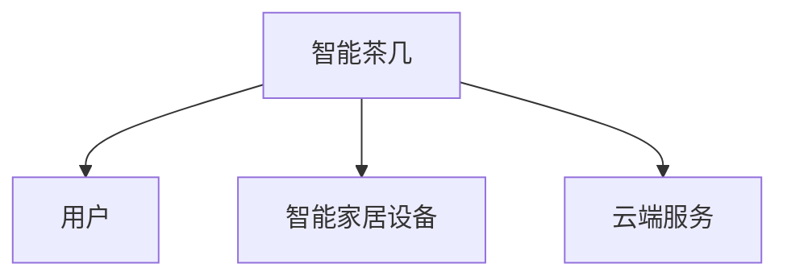
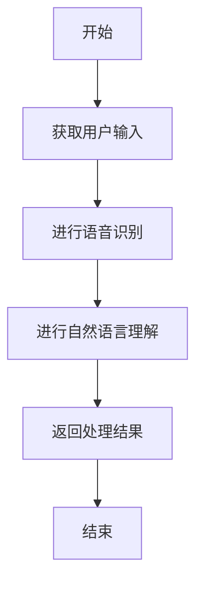
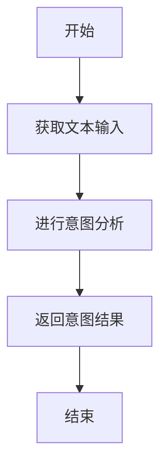
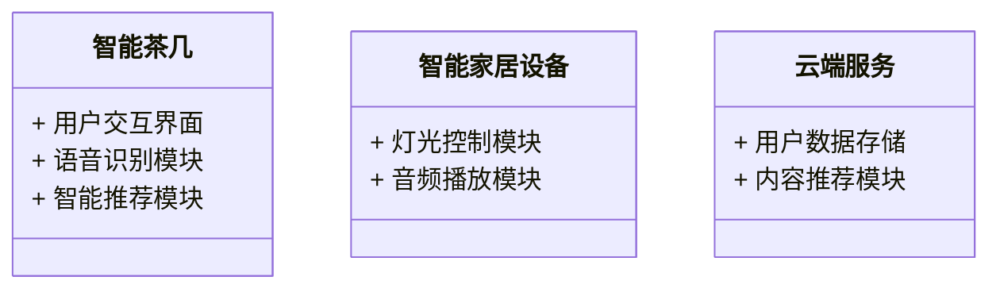

                 


# 智能茶几：AI Agent的客厅使用模式分析

> 关键词：智能茶几，AI Agent，智能家居，客厅使用模式，智能交互

> 摘要：本文详细分析了智能茶几作为AI Agent在客厅中的使用模式，探讨其技术原理、系统架构和实际应用场景。通过自然语言处理和意图识别算法的实现，结合系统架构设计和项目实战，展示了智能茶几在提升客厅智能化体验中的重要作用，并展望了未来的发展方向。

---

## 目录

1. [背景介绍](#背景介绍)
   - 1.1 智能茶几的概念与特点
   - 1.2 客厅使用模式的背景
   - 1.3 AI Agent的基本原理
2. [AI Agent的核心概念与联系](#ai-agent的核心概念与联系)
   - 2.1 AI Agent的功能与应用场景
   - 2.2 实体关系图与系统架构
3. [AI Agent的算法原理](#ai-agent的算法原理)
   - 3.1 自然语言处理算法
   - 3.2 意图识别算法
4. [系统分析与架构设计](#系统分析与架构设计)
   - 4.1 系统功能设计
   - 4.2 系统架构设计
   - 4.3 系统接口设计
5. [项目实战](#项目实战)
   - 5.1 环境搭建与核心功能实现
   - 5.2 实际案例分析
6. [最佳实践与未来展望](#最佳实践与未来展望)
   - 6.1 使用中的注意事项
   - 6.2 未来发展方向

---

## 背景介绍

### 1.1 智能茶几的概念与特点

智能茶几是一种结合了智能家居和人工智能技术的家具，其核心在于通过AI Agent实现与用户的智能交互。与传统茶几相比，智能茶几不仅具备基本的家具功能，还能够通过语音或触控方式提供多种智能化服务，如播放音乐、查询信息、控制家电等。

#### 1.1.1 智能茶几的定义与特点
- **定义**：智能茶几是一种支持AI交互的家具，能够通过语音或触控方式与用户进行互动，并连接智能家居设备。
- **特点**：
  - 多功能集成：支持娱乐、办公、社交等多种场景。
  - 智能交互：通过AI技术实现自然语言处理和意图识别。
  - 连接性：能够与智能家居设备、云端服务无缝连接。

#### 1.1.2 智能茶几与传统茶几的区别
| 特性          | 智能茶几                   | 传统茶几                  |
|---------------|---------------------------|---------------------------|
| 功能          | 多功能集成（娱乐、办公等） | 单一功能（摆放物品、喝茶）|
| 技术          | 集成AI技术                 | 无技术集成                |
| 连接性        | 支持物联网                 | 无网络连接                |
| 用户交互方式  | 语音、触控                 | 仅物理操作               |

### 1.2 客厅使用模式的背景

随着智能家居的普及，客厅逐渐成为家庭智能化的核心区域。智能茶几作为客厅中的重要设备，通过AI Agent实现多种智能化功能，为用户提供了更便捷的使用体验。

#### 1.2.1 客厅智能化的现状
- 当前，客厅智能化主要体现在电视、音箱、灯光等设备的智能化控制。
- 智能茶几的引入进一步提升了客厅的智能化水平，使其成为一个多功能的交互中心。

#### 1.2.2 智能家居的发展趋势
- **趋势分析**：智能家居设备逐渐普及，用户对设备间的联动需求增加。
- **问题描述**：传统智能家居设备的功能单一，缺乏统一的交互入口。

#### 1.2.3 智能茶几在客厅中的角色定位
- **角色**：智能茶几作为客厅中的交互中心，连接其他智能家居设备，提供统一的控制入口。
- **优势**：通过AI Agent实现智能化交互，提升用户体验。

### 1.3 AI Agent的基本原理

AI Agent是一种能够感知环境并主动执行任务的智能体，通过自然语言处理、意图识别等技术实现与用户的交互。

#### 1.3.1 AI Agent的定义
- **定义**：AI Agent是一种能够感知环境、理解用户需求并执行相应任务的智能体。
- **核心功能**：
  - 语音交互：通过语音识别和自然语言处理技术与用户进行对话。
  - 智能推荐：根据用户行为和偏好推荐相关内容。
  - 客户行为分析：分析用户行为数据，优化服务体验。

#### 1.3.2 AI Agent的核心功能
- **语音交互**：通过语音识别技术将用户的语音指令转化为文本，再通过自然语言理解技术分析指令并执行相应操作。
- **智能推荐**：基于用户的历史行为和偏好，推荐相关内容或服务。
- **客户行为分析**：通过分析用户的行为数据，优化服务流程，提升用户体验。

---

## AI Agent的核心概念与联系

### 2.1 AI Agent的功能与应用场景

#### 2.1.1 实体关系图
智能茶几作为AI Agent，与用户、智能家居设备和云端服务之间存在交互关系。以下是其实体关系图：



---

## AI Agent的算法原理

### 3.1 自然语言处理算法

#### 3.1.1 算法流程图
以下是自然语言处理算法的流程图：



#### 3.1.2 Python实现代码

```python
import speech_recognition as sr
from transformers import pipeline

# 初始化语音识别器
r = sr.Recognizer()

# 获取用户输入
with sr.Microphone() as source:
    print("请开始发言：")
    audio = r.listen(source)

# 转换为文本
try:
    text = r.recognize_google(audio)
    print("识别到的文本：", text)
except sr.UnknownValueError:
    print("无法识别音频")
```

---

### 3.2 意图识别算法

#### 3.2.1 算法流程图
以下是意图识别算法的流程图：



#### 3.2.2 Python实现代码

```python
from transformers import pipeline

# 初始化意图识别模型
intent_classifier = pipeline("text-classification", model="snli")

# 获取用户输入
text = "播放音乐"

# 进行意图识别
result = intent_classifier(text)
print("意图识别结果：", result)
```

---

## 系统分析与架构设计

### 4.1 系统功能设计

#### 4.1.1 系统功能模块
以下是系统功能模块图：



---

## 项目实战

### 5.1 环境搭建与核心功能实现

#### 5.1.1 环境搭建
- **硬件**：智能茶几、麦克风、智能家居设备。
- **软件**：Python编程环境、相关库（如`speech_recognition`、`transformers`）。

#### 5.1.2 核心功能实现
以下是智能茶几的核心功能实现代码：

```python
import speech_recognition as sr
from transformers import pipeline

# 初始化语音识别器和意图识别模型
r = sr.Recognizer()
intent_classifier = pipeline("text-classification", model="snli")

# 获取用户输入
with sr.Microphone() as source:
    print("请开始发言：")
    audio = r.listen(source)

# 转换为文本
try:
    text = r.recognize_google(audio)
    print("识别到的文本：", text)
    
    # 进行意图识别
    result = intent_classifier(text)
    print("意图识别结果：", result)
except sr.UnknownValueError:
    print("无法识别音频")
```

---

## 最佳实践与未来展望

### 6.1 使用中的注意事项

- **语音识别**：确保环境安静，避免背景噪声干扰。
- **意图识别**：需要不断优化模型，提升识别准确率。
- **系统兼容性**：确保智能茶几能够与各种智能家居设备无缝连接。

### 6.2 未来发展方向

- **多模态交互**：结合视觉、触觉等多种交互方式，提升用户体验。
- **个性化服务**：基于用户行为数据，提供更加个性化的推荐服务。
- **设备联动优化**：进一步优化设备间的联动，实现更加智能化的家居体验。

---

## 总结

智能茶几作为AI Agent在客厅中的应用，通过自然语言处理和意图识别等技术，为用户提供了更加智能化的交互体验。本文详细分析了智能茶几的技术背景、算法原理和系统架构，并通过实际案例展示了其在客厅中的应用场景。未来，随着AI技术的不断发展，智能茶几将具备更多的功能，为用户带来更加便捷和智能的生活体验。

