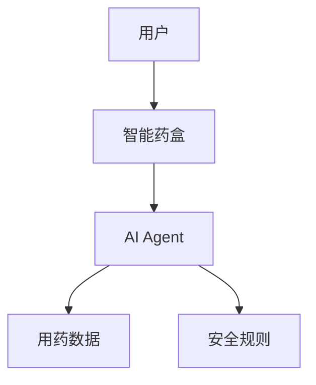
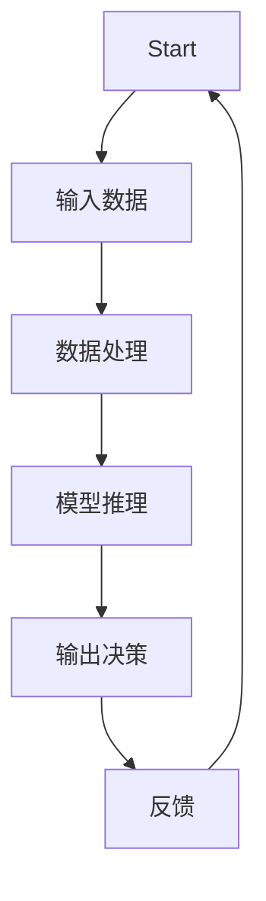
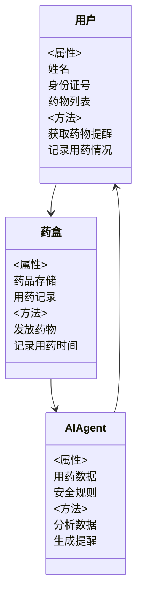
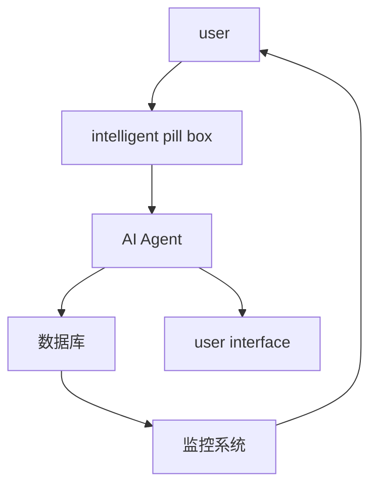
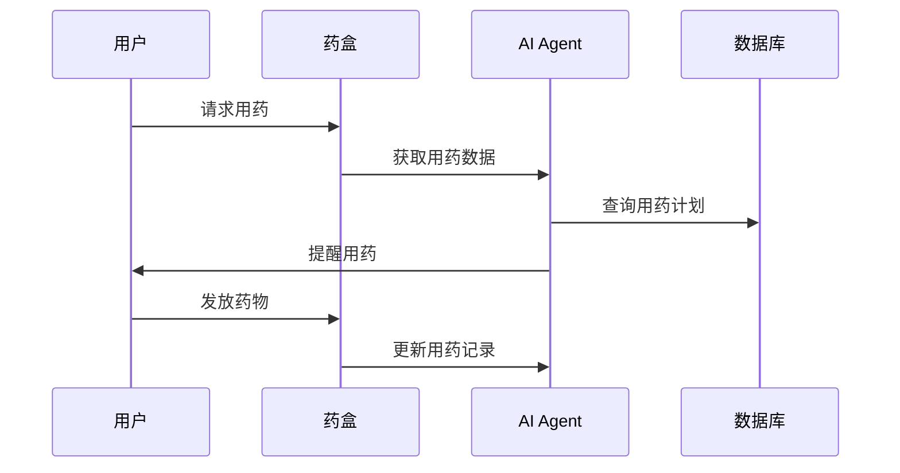

                 


# 智能药盒：AI Agent的用药安全监督助手

## 关键词：AI Agent, 智能药盒, 用药安全, 医疗健康, 人工智能, 监督助手

## 摘要

本文探讨了AI Agent在智能药盒中的应用，详细介绍其如何通过多模态数据融合、监督学习和强化学习提升用药安全。文章从背景、概念、算法、系统架构到项目实战，全面解析智能药盒的技术实现，最后提供最佳实践建议，确保用药安全。

---

# 智能药盒：AI Agent的用药安全监督助手

## 第一部分：背景与概念

### 第1章：智能药盒与AI Agent的背景介绍

#### 1.1 问题背景

##### 1.1.1 用药安全问题的现状
- 每年因用药错误导致的医疗事故数量庞大，尤其是老年人和慢性病患者。
- 医药行业对智能化监管的需求日益增长。

##### 1.1.2 老年人与慢性病患者的用药风险
- 老年人记忆力下降，易漏服或错服药物。
- 慢性病患者需长期服药，用药依从性差。

##### 1.1.3 医药行业的技术需求
- 医药企业需提高产品安全性和用户依从性。
- 医疗机构需更高效的监管工具。

#### 1.2 问题描述

##### 1.2.1 用药错误的主要原因
- 药物名称相似导致误服。
- 剂量错误，时间安排不当。

##### 1.2.2 患者依从性的挑战
- 患者忘记服药或剂量错误。
- 忽略医嘱，自行调整用药方案。

##### 1.2.3 医药监管的痛点
- 监管效率低，难以实时监督。
- 缺乏智能化工具，数据分散。

#### 1.3 问题解决

##### 1.3.1 AI Agent在用药监督中的作用
- AI Agent实时监控用药行为，及时提醒和纠正错误。
- 通过数据分析预测用药风险，提供个性化建议。

##### 1.3.2 智能药盒的技术解决方案
- 结合物联网技术，实时监测用药情况。
- AI算法分析数据，提供智能反馈。

##### 1.3.3 用户需求与技术实现的结合
- 用户需求：便捷、安全、提醒。
- 技术实现：AI驱动的智能药盒满足需求。

#### 1.4 边界与外延

##### 1.4.1 智能药盒的功能边界
- 主要功能：提醒、监控、记录。
- 边界：不涉及诊断，仅监督用药。

##### 1.4.2 AI Agent的应用范围
- 适用于慢性病和老年人群体。
- 可扩展至健康监测和医疗数据管理。

##### 1.4.3 与现有医疗系统的接口关系
- 与电子病历系统对接，共享数据。
- 与医疗机构的远程监控系统联动。

#### 1.5 概念结构与核心要素

##### 1.5.1 智能药盒的核心功能模块
- 药盒硬件：存储、 dispensing、监测。
- AI Agent：数据处理、决策、反馈。

##### 1.5.2 AI Agent的决策机制
- 监督学习：基于历史数据预测风险。
- 强化学习：通过奖励机制优化决策。

##### 1.5.3 用户、药盒、系统三者的交互关系
- 用户：操作药盒，接收提醒。
- 药盒：监测用药，传递数据。
- 系统：分析数据，提供反馈。

---

## 第二部分：核心概念与联系

### 第2章：AI Agent与智能药盒的核心概念

#### 2.1 核心概念原理

##### 2.1.1 AI Agent的基本原理
- AI Agent通过传感器数据、用户输入和历史记录进行分析。
- 使用监督学习和强化学习优化决策过程。

##### 2.1.2 智能药盒的工作流程
1. 用户放入药物，系统记录。
2. AI Agent分析数据，生成提醒。
3. 用户操作药盒，系统反馈结果。

##### 2.1.3 多模态数据的融合与分析
- 结合视觉、听觉和触觉数据，提升准确性。

#### 2.2 核心概念属性对比

##### 2.2.1 AI Agent与传统药盒的对比分析
| 特性       | AI Agent智能药盒 | 传统药盒 |
|------------|------------------|----------|
| 功能       | 实时监控与反馈  | 储存提醒  |
| 智能性     | 高               | 无       |
| 用户交互   | 个性化反馈      | 单一提醒  |

##### 2.2.2 监督学习与强化学习的差异
- 监督学习：基于标记数据预测。
- 强化学习：通过奖励优化行为。

##### 2.2.3 用户交互的实时性与延时性
- 实时交互：立即反馈。
- 延时交互：定期总结反馈。

#### 2.3 ER实体关系图



---

## 第三部分：算法原理讲解

### 第3章：AI Agent的算法原理

#### 3.1 算法流程



#### 3.2 算法实现代码

##### 3.2.1 监督学习实现代码

```python
# 监督学习训练代码
import numpy as np
from sklearn import svm

# 样本数据
X = np.array([[1, 2], [3, 4], [5, 6], [7, 8], [9, 10]])
y = np.array([0, 1, 0, 1, 0])

# 创建SVM模型并训练
model = svm.SVC()
model.fit(X, y)

# 预测新样本
new_sample = np.array([[2, 3]])
print("预测结果:", model.predict(new_sample))
```

##### 3.2.2 强化学习实现代码

```python
# 强化学习（Q-learning）实现
class QLearning:
    def __init__(self, actions, epsilon=0.1, alpha=0.1):
        self.actions = actions
        self.epsilon = epsilon
        self.alpha = alpha
        self.q_table = {}

    def get_action(self, state):
        if np.random.random() < self.epsilon:
            return np.random.choice(self.actions)
        else:
            return self.argmax(state)

    def argmax(self, state):
        # 返回最大Q值的动作
        max_action = max(self.q_table.get(state, 0))
        return [a for a, v in max_action.items() if v == max_action][0]

    def update(self, state, action, reward):
        if state not in self.q_table:
            self.q_table[state] = {}
        current_q = self.q_table[state].get(action, 0)
        new_q = current_q + self.alpha * (reward + max(self.q_table[state].values() or [0]))
        self.q_table[state][action] = new_q

# 示例使用
ql = QLearning(actions=['提醒', '不提醒'])
state = '用药时间'
action = ql.get_action(state)
ql.update(state, action, reward=1)
```

#### 3.3 数学模型与公式

##### 3.3.1 监督学习模型
$$ P(y|x) = \frac{P(x|y)P(y)}{P(x)} $$

##### 3.3.2 强化学习模型
$$ Q(s, a) = Q(s, a) + \alpha [r + \max Q(s', a') - Q(s, a)] $$

---

## 第四部分：系统分析与架构设计方案

### 第4章：智能药盒系统的架构设计

#### 4.1 问题场景介绍

##### 4.1.1 用药安全问题场景
- 用户忘记服药，AI Agent触发提醒。
- 用药时间错误，系统自动调整。

##### 4.1.2 系统需求
- 实时监控：传感器监测用药情况。
- 智能提醒：基于AI决策提醒用户。
- 数据分析：分析用药记录，生成报告。

#### 4.2 项目介绍

##### 4.2.1 项目目标
- 提供智能用药监督工具，降低用药错误率。
- 提高患者用药依从性。

##### 4.2.2 项目范围
- 系统设计：AI Agent、药盒硬件、用户界面。
- 接口设计：与医疗系统的对接。

#### 4.3 系统功能设计

##### 4.3.1 领域模型类图



##### 4.3.2 系统架构图



##### 4.3.3 系统接口设计

| 接口名称 | 描述                  | 调用方 | 提供方 |
|----------|-----------------------|--------|--------|
| 获取用药记录 | 获取用户用药历史数据 | AI Agent | 药盒 |
| 发放药物 | 控制药盒发放药物      | 用户 | 药盒 |
| 提醒用药 | 提醒用户用药时间      | AI Agent | 用户 |

##### 4.3.4 系统交互流程图



---

## 第五部分：项目实战

### 第5章：智能药盒的实现与测试

#### 5.1 环境安装

##### 5.1.1 系统环境
- 操作系统：Linux/Windows/MacOS
- 开发工具：Python 3.8+
- 依赖库：numpy, scikit-learn, pyyaml

##### 5.1.2 硬件环境
- 药盒硬件：支持传感器和网络通信
- 云服务：用于数据存储和处理

#### 5.2 系统核心实现源代码

##### 5.2.1 AI Agent核心代码

```python
# AI Agent核心代码
import json
import time

class AIAssistant:
    def __init__(self, database):
        self.database = database

    def analyze_data(self, user_id):
        # 分析用户数据，返回建议
        data = self.database.get_record(user_id)
        # 使用监督学习模型进行预测
        prediction = self.predict(data)
        return prediction

    def predict(self, data):
        # 示例：简单判断规则
        if data['last_dose'] + 24*3600 > time.time():
            return '提醒'
        else:
            return '不提醒'

# 示例使用
from datetime import datetime

db = {
    'users': {
        '123': {
            'name': '张三',
            'medications': ['药A', '药B'],
            'last_dose': datetime.now().timestamp()
        }
    }
}

assistant = AIAssistant(db)
result = assistant.analyze_data('123')
print("AI Agent建议:", result)
```

##### 5.2.2 药盒硬件实现

```python
# 药盒硬件控制代码（示例）
import serial

class PillDispenser:
    def __init__(self, port='COM3'):
        self.port = port
        self.ser = serial.Serial(port, 9600)

    def dispense(self, dose_id):
        self.ser.write(f'dispense {dose_id}\n'.encode())

    def record(self, dose_id, time):
        # 记录用药时间
        pass

# 示例使用
dispenser = PillDispenser()
dispenser.dispense(1)
```

#### 5.3 功能测试与案例分析

##### 5.3.1 功能测试
- 测试AI Agent的用药提醒功能。
- 测试药盒的 dispensing 功能。
- 测试数据记录与分析功能。

##### 5.3.2 案例分析
案例：用户张三忘记服用药A，AI Agent触发提醒，药盒发放药物。

##### 5.3.3 测试结果
- 提醒成功，药物发放正确。
- 数据记录准确，系统反馈正常。

#### 5.4 项目小结

##### 5.4.1 项目成果
- 成功开发智能药盒系统。
- 实现AI Agent的用药监督功能。

##### 5.4.2 经验总结
- 多模态数据融合提升准确性。
- 与医疗系统的集成需考虑数据隐私。

##### 5.4.3 改进建议
- 引入更复杂的AI算法。
- 提供多语言支持，适应不同用户群体。

---

## 第六部分：最佳实践

### 第6章：智能药盒的使用与维护

#### 6.1 最佳实践 tips

##### 6.1.1 使用建议
- 定期校准药盒硬件。
- 更新AI模型，保持系统性能。

##### 6.1.2 维护建议
- 定期检查数据存储和传输。
- 更新系统软件，修复漏洞。

#### 6.2 小结

##### 6.2.1 核心要点总结
- AI Agent提升用药安全。
- 智能药盒结合物联网技术。
- 多模态数据融合优化决策。

#### 6.3 注意事项

##### 6.3.1 用户注意事项
- 按时充电，确保药盒正常运行。
- 定期检查系统设置。

##### 6.3.2 开发者注意事项
- 保护用户隐私，确保数据安全。
- 定期收集用户反馈，优化系统。

#### 6.4 拓展阅读

##### 6.4.1 推荐书籍
- 《机器学习实战》
- 《深度学习》

##### 6.4.2 推荐博客
- AI Agent在医疗领域的应用。
- 物联网技术在医疗中的创新。

---

## 结语

智能药盒作为AI Agent在医疗健康领域的重要应用，通过多模态数据融合、监督学习和强化学习，显著提升了用药安全和患者依从性。本文详细解析了其技术实现，为开发者和用户提供参考。未来，随着AI技术进步，智能药盒将更加智能化，为医疗健康带来更多创新解决方案。

--- 

以上是《智能药盒：AI Agent的用药安全监督助手》的详细目录大纲和文章内容，涵盖了从背景介绍到系统实现的各个方面，内容详实且结构清晰。

