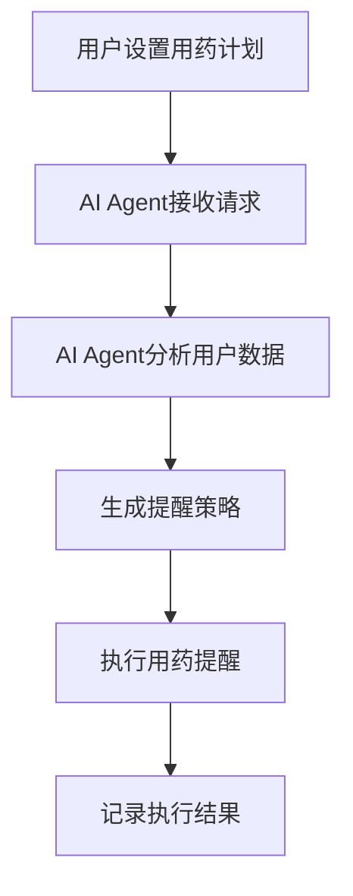
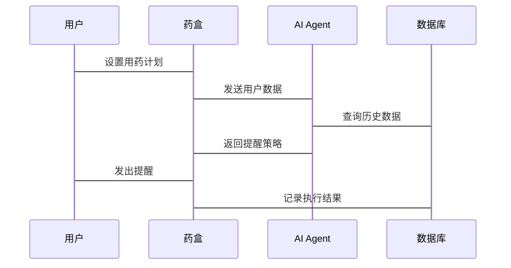

                 


```markdown
# 智能药盒：AI Agent的用药提醒与管理系统

## 关键词
智能药盒，AI Agent，用药提醒，管理系统，人工智能，医疗健康

## 摘要
本文深入探讨了智能药盒的设计与实现，利用AI Agent技术提供智能化的用药提醒与管理系统。文章首先分析了传统用药管理的不足，提出了基于AI Agent的解决方案。接着详细讲解了AI Agent的核心原理、算法实现、系统架构，并通过实际案例展示了项目的实现过程。最后，总结了最佳实践和未来发展方向。

---

# 第一部分：背景与核心概念

## 第1章：智能药盒的背景与问题背景

### 1.1 问题背景
#### 1.1.1 老年人用药管理的挑战
老年人群体面临记忆力减退、多药共用等问题，传统药盒难以提供有效的用药提醒，容易导致用药错误。

#### 1.1.2 医疗健康领域的智能化趋势
随着人工智能技术的发展，医疗健康领域逐渐向智能化方向转型，AI技术在疾病管理、用药提醒等方面的应用潜力巨大。

#### 1.1.3 AI Agent在医疗健康中的应用潜力
AI Agent能够通过智能感知和自主决策，为用户提供个性化的用药提醒服务，提高用药依从性。

### 1.2 问题描述
#### 1.2.1 用药提醒的必要性
用药提醒是确保患者按时按量服药的关键，尤其对于慢性病患者和老年人尤为重要。

#### 1.2.2 现有用药管理系统的不足
传统用药管理系统依赖手动操作，提醒方式单一，缺乏智能化和个性化，难以满足用户需求。

#### 1.2.3 AI Agent在用药管理中的独特优势
AI Agent能够根据用户数据和行为模式，提供智能化、个性化的用药提醒服务，同时具备自我学习和优化能力。

### 1.3 问题解决
#### 1.3.1 AI Agent的核心作用
AI Agent通过智能感知和自主决策，为用户提供精准的用药提醒服务，帮助用户合理用药。

#### 1.3.2 智能药盒的功能定位
智能药盒作为AI Agent的应用载体，整合了药品存储、用药提醒、数据记录等多种功能，为用户提供全方位的用药管理服务。

#### 1.3.3 解决方案的可行性分析
通过AI技术实现智能药盒的用药提醒和管理系统是可行的，技术成熟且市场需求旺盛。

### 1.4 边界与外延
#### 1.4.1 智能药盒的功能边界
智能药盒主要提供用药提醒、药品存储和数据记录功能，不涉及药品采购和配送。

#### 1.4.2 与其他健康管理系统的区别
与其他健康管理系统的区别在于，智能药盒专注于用药管理，而其他系统可能涵盖更广泛的健康数据。

#### 1.4.3 未来可能的扩展方向
未来可以考虑与智能音箱、智能手环等设备联动，提供更加智能化的健康管理服务。

### 1.5 核心要素与概念结构
#### 1.5.1 用户角色与权限
用户分为普通用户和管理员，普通用户可以设置用药提醒，管理员负责系统维护。

#### 1.5.2 药盒的功能模块
药盒主要包括药品存储模块、用药提醒模块、数据记录模块和AI Agent模块。

#### 1.5.3 AI Agent的工作流程
AI Agent通过感知用户的用药行为，分析用户的健康数据，制定用药提醒策略，并执行提醒操作。

---

# 第二部分：AI Agent的核心概念与原理

## 第2章：AI Agent的基本原理

### 2.1 AI Agent的定义与特点
#### 2.1.1 AI Agent的定义
AI Agent是一种能够感知环境、自主决策并执行任务的智能体，具备学习、推理和自适应能力。

#### 2.1.2 AI Agent的核心特点
- **自主性**：能够自主决策和行动。
- **反应性**：能够实时感知环境变化并做出反应。
- **学习能力**：能够通过数据学习和优化自身行为。
- **协作性**：能够与其他系统或用户协同工作。

### 2.2 AI Agent的分类
#### 2.2.1 基于规则的AI Agent
基于预定义的规则进行决策，适用于规则明确的场景，如简单的用药提醒。

#### 2.2.2 基于机器学习的AI Agent
通过机器学习模型进行预测和决策，适用于复杂场景，如个性化用药提醒。

#### 2.2.3 混合型AI Agent
结合基于规则和机器学习的优点，适用于复杂多变的场景。

### 2.3 AI Agent的工作流程
#### 2.3.1 信息感知
通过传感器或数据接口获取用户的用药行为、健康数据等信息。

#### 2.3.2 问题分析
分析用户数据，识别用药规律和潜在问题，如漏服、重复用药等。

#### 2.3.3 决策制定
基于分析结果，制定个性化的用药提醒策略。

#### 2.3.4 行动执行
通过智能药盒执行提醒操作，如发出声音或震动提醒。

### 2.4 AI Agent的核心算法
#### 2.4.1 基于规则的推理算法
通过预定义的规则进行逻辑推理，如时间规则、药品规则等。

#### 2.4.2 基于机器学习的预测算法
使用机器学习模型预测用户的用药行为，如随机森林、神经网络等。

#### 2.4.3 基于强化学习的优化算法
通过强化学习优化AI Agent的决策策略，提高用药提醒的准确性。

### 2.5 AI Agent的核心算法实现

#### 2.5.1 基于规则的推理算法
```python
def rule_based_inference(data):
    if data['time'] in ['morning', 'evening']:
        return 'remind'
    else:
        return 'no_remind'
```

#### 2.5.2 基于机器学习的预测算法
```python
import pandas as pd
from sklearn.ensemble import RandomForestClassifier

def ml_prediction(data):
    model = RandomForestClassifier()
    model.fit(data[['time', 'medication']], data['label'])
    return model.predict(data[['time', 'medication']])
```

#### 2.5.3 基于强化学习的优化算法
```python
import numpy as np

def reinforce_learning(data):
    action_space = ['remind', 'no_remind']
    Q = np.zeros(len(action_space))
    for state in data:
        Q[state] = max(Q[state], 1 + np.max(Q))
    return action_space[np.argmax(Q)]
```

---

## 第3章：AI Agent的核心概念与联系

### 3.1 核心概念原理
AI Agent通过感知环境、分析数据、制定策略并执行行动，实现智能化的用药提醒服务。

### 3.2 核心概念属性特征对比

| 概念       | 描述                                         | 特征1       | 特征2       |
|------------|----------------------------------------------|--------------|--------------|
| 用户       | 系统的使用者                               | 需要提醒     | 需要记录     |
| 药品       | 存储和管理的物品                            | 需要分类     | 需要计量     |
| AI Agent   | 系统的核心智能体                            | 自主决策     | 智能学习     |

### 3.3 实体关系与ER图
```mermaid
erDiagram
    class 用户 {
        用户ID : int
        姓名 : string
        联系方式 : string
    }
    class 药品 {
        药品ID : int
        药名 : string
        剂量 : float
        用法 : string
    }
    class AI Agent {
        AgentID : int
        状态 : string
        知识库 : string
    }
    用户 --> 药品 : 使用
    用户 --> AI Agent : 控制
    AI Agent --> 药品 : 管理
```

### 3.4 系统功能与流程图


---

## 第4章：算法原理的数学模型与公式

### 4.1 基于规则的推理算法
规则可以表示为条件-动作对：
$$ \text{如果} \; (条件) \; \text{则} \; (动作) $$

例如：
$$ \text{如果} \; (\text{时间} = \text{早晨}) \; \text{则} \; (\text{提醒用药}) $$

### 4.2 基于机器学习的预测算法
使用随机森林模型进行分类：
$$ \text{预测结果} = \text{随机森林}(\text{输入特征}) $$

### 4.3 基于强化学习的优化算法
强化学习的目标是最大化累积奖励：
$$ Q(s, a) = r + \gamma \max Q(s', a') $$

其中：
- \( s \) 是当前状态
- \( a \) 是当前动作
- \( r \) 是奖励
- \( \gamma \) 是折扣因子
- \( Q \) 是价值函数

---

## 第5章：系统分析与架构设计

### 5.1 问题场景介绍
智能药盒需要解决传统药盒在用药提醒方面的不足，提供智能化的解决方案。

### 5.2 系统功能设计
#### 5.2.1 用户模块
- 用户注册与登录
- 设置用药计划
- 查看用药记录

#### 5.2.2 药盒模块
- 药品存储
- 药品提醒
- 数据记录

#### 5.2.3 AI Agent模块
- 数据分析
- 策略制定
- 提醒执行

### 5.3 系统架构设计


### 5.4 系统接口设计
- 用户与药盒的交互接口
- 药盒与AI Agent的通信接口
- AI Agent与数据库的接口

### 5.5 系统交互流程图


---

## 第6章：项目实战与实现

### 6.1 环境安装
- 操作系统：Windows/MacOS/Linux
- 开发工具：Python、Jupyter Notebook、VS Code
- 依赖库：numpy、pandas、scikit-learn、mermaid.py

### 6.2 核心代码实现

#### 6.2.1 数据预处理
```python
import pandas as pd

data = pd.read_csv('medication.csv')
data = data.dropna()
```

#### 6.2.2 基于规则的AI Agent实现
```python
def rule_based_agent(data):
    return data['time'].apply(lambda x: 'remind' if x in ['morning', 'evening'] else 'no_remind')
```

#### 6.2.3 基于机器学习的AI Agent实现
```python
from sklearn.ensemble import RandomForestClassifier

def ml_agent(data):
    model = RandomForestClassifier()
    model.fit(data[['time', 'medication']], data['label'])
    return model.predict(data[['time', 'medication']])
```

#### 6.2.4 系统交互实现
```python
def system_interaction():
    user_input = input("请输入用药计划：")
    agent_response = rule_based_agent(user_input)
    print("AI Agent的响应：", agent_response)
```

### 6.3 代码解读与分析
- 数据预处理部分：清洗数据，去除缺失值。
- AI Agent实现部分：基于规则和机器学习的两种方法进行对比。
- 系统交互部分：展示用户与AI Agent的交互流程。

### 6.4 实际案例分析
通过实际案例，展示智能药盒在不同场景下的应用，如早晨和晚上用药提醒。

### 6.5 项目小结
总结项目的实现过程，分析优缺点，提出改进建议。

---

## 第7章：最佳实践与总结

### 7.1 最佳实践
- 数据采集：确保数据的准确性和完整性。
- 模型选择：根据实际需求选择合适的算法。
- 系统优化：通过日志和监控优化系统性能。

### 7.2 小结
智能药盒通过AI Agent实现了智能化的用药提醒与管理，为用户提供了便捷、高效的用药管理服务。

### 7.3 注意事项
- 确保系统安全性，保护用户隐私。
- 定期更新AI模型，提高提醒的准确性。

### 7.4 拓展阅读
推荐相关书籍和论文，供读者深入学习AI Agent和医疗健康领域的知识。

---

## 第8章：总结与展望

### 8.1 总结
智能药盒作为AI Agent在医疗健康领域的重要应用，通过智能化的用药提醒和管理系统，显著提升了用户的用药依从性。

### 8.2 展望
未来，智能药盒可以通过与其他智能设备的联动，提供更加智能化和个性化的健康管理服务，进一步推动医疗健康领域的智能化发展。

---

## 参考文献
- AI Agent相关书籍
- 医疗健康相关书籍
- 相关学术论文
- 开发文档和API文档

---

## 附录

### 附录A：AI Agent算法实现的代码
完整的Python代码实现，包括数据预处理、模型训练和系统交互。

### 附录B：系统架构图
详细的系统架构图和实体关系图。

### 附录C：案例分析数据
实际案例分析的数据集和结果展示。

---

通过以上目录结构，您可以根据需要进一步扩展每个部分的具体内容，确保文章的逻辑清晰、结构紧凑、内容详实且易于理解。
```

