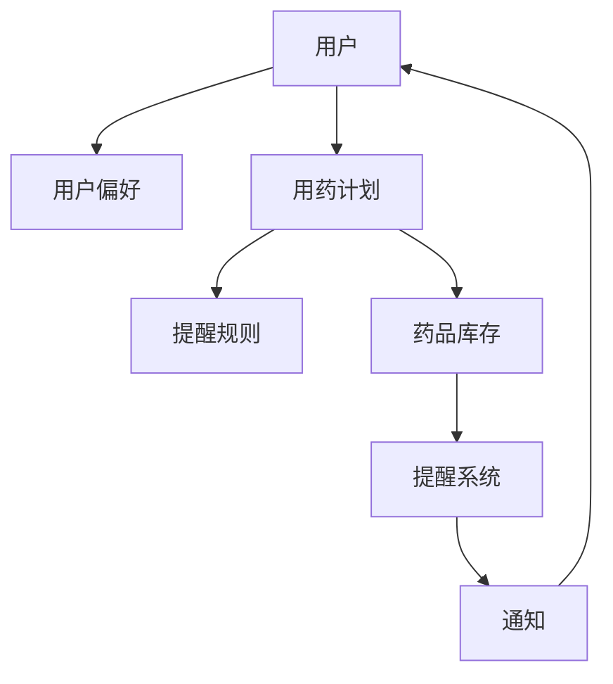
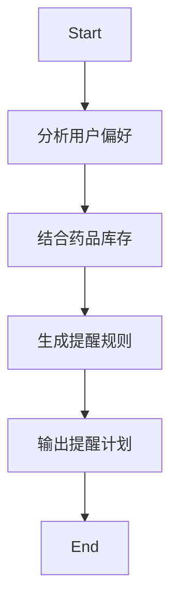
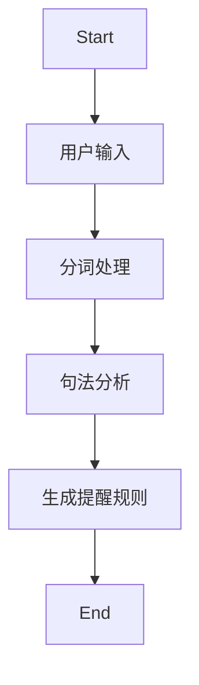
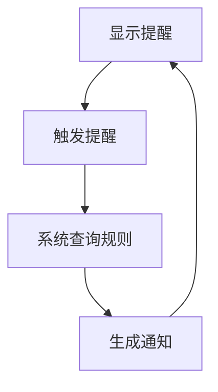
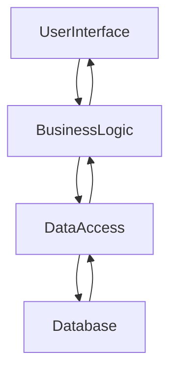

                 


# 智能药盒：AI Agent的用药提醒系统

> 关键词：智能药盒、AI Agent、用药提醒、物联网、健康医疗

> 摘要：本文系统地介绍了智能药盒的设计与实现，结合AI Agent技术，提出了一种创新的用药提醒解决方案。通过详细的技术分析，包括系统架构设计、算法原理、项目实战等，全面阐述了如何利用AI技术提升老年人的用药管理效率，解决了传统用药提醒系统的不足，为医疗健康领域提供了新的思路。

---

# 第一部分: 智能药盒与AI Agent概述

## 第1章: 智能药盒与AI Agent的背景介绍

### 1.1 问题背景与描述

#### 1.1.1 老年人用药提醒的需求
老年人群体庞大，常常需要服用多种药物，容易忘记或漏服，影响健康。传统提醒方式（如闹钟）缺乏智能化，无法根据用药习惯提供个性化服务。

#### 1.1.2 现有用药提醒系统的局限性
- **功能单一**：大多数提醒系统仅能设置固定提醒时间，无法根据用户实际需求动态调整。
- **交互方式有限**：用户与系统之间的互动方式简单，难以提供自然语言交互。
- **数据孤岛**：无法与其他健康监测设备（如血糖仪、心率监测器）联动，缺乏数据整合。

#### 1.1.3 AI Agent在医疗健康中的潜力
AI Agent（人工智能代理）能够通过自然语言处理、机器学习等技术，提供智能化、个性化的服务，解决传统系统的问题。

### 1.2 智能药盒的定义与目标

#### 1.2.1 智能药盒的定义
智能药盒是一种结合AI技术的智能硬件，能够通过传感器和AI算法，实现对药品的智能管理、用药提醒和健康数据分析。

#### 1.2.2 系统的核心目标
- 提供个性化的用药提醒服务。
- 实现药品库存管理。
- 支持与健康监测设备的数据联动。
- 提供健康数据分析与建议。

#### 1.2.3 边界与外延
- **边界**：仅关注用药提醒和药品管理，不涉及医疗诊断。
- **外延**：未来可扩展至慢性病管理、健康管理平台等。

### 1.3 系统的核心要素与概念结构

#### 1.3.1 核心要素分析
- 用户信息：用户的基本信息、用药习惯等。
- 药品信息：药品名称、规格、用量等。
- 提醒规则：基于用户习惯定制的提醒策略。
- 健康数据：用户的健康指标（如心率、血糖）。

#### 1.3.2 概念结构图


#### 1.3.3 核心功能模块
- 用户管理模块：管理用户信息和偏好。
- 药品管理模块：管理药品库存和信息。
- 提醒规则模块：定制提醒策略。
- 健康数据分析模块：整合健康数据并提供建议。

### 1.4 本章小结
本章介绍了智能药盒的背景、定义、目标和核心要素，为后续章节奠定了基础。

---

# 第二部分: AI Agent的核心原理与算法

## 第2章: AI Agent的基本原理

### 2.1 AI Agent的定义与分类

#### 2.1.1 AI Agent的定义
AI Agent是指能够感知环境、自主决策并执行任务的智能实体，能够与用户或其他系统进行交互。

#### 2.1.2 基于规则的Agent
- **规则驱动**：基于预定义的规则执行任务。
- **优点**：简单易懂，适用于规则明确的场景。
- **缺点**：缺乏灵活性，难以应对复杂情况。

#### 2.1.3 基于模型的Agent
- **基于知识库**：通过知识库推理解决问题。
- **优点**：灵活性高，适用于复杂场景。
- **缺点**：知识库构建和维护成本高。

#### 2.1.4 基于学习的Agent
- **机器学习驱动**：通过学习数据优化决策。
- **优点**：适应性强，能够从数据中发现规律。
- **缺点**：需要大量数据和计算资源。

### 2.2 AI Agent的核心算法

#### 2.2.1 任务规划算法
- **问题**：用户输入用药需求，系统生成最优提醒计划。
- **算法流程**：
  1. 分析用户偏好和用药习惯。
  2. 结合药品库存和健康数据，生成提醒规则。
  3. 输出提醒计划。

  ```mermaid
  graph TD
      A[用户输入] --> B[分析偏好]
      B --> C[结合库存]
      C --> D[生成计划]
      D --> E[输出提醒]
  ```

- **数学模型**：
  $$
  \text{计划} = \argmin_{\text{规则}} \sum_{i=1}^{n} (|\text{规则}_i - \text{偏好}_i|)
  $$

#### 2.2.2 自然语言处理算法
- **问题**：用户通过自然语言输入需求，系统解析并生成提醒。
- **流程**：
  1. 语音或文本输入。
  2. 分词、句法分析。
  3. 生成提醒规则。

  ```mermaid
  graph TD
      A[用户输入] --> B[分词] --> C[句法分析] --> D[生成规则]
  ```

- **数学模型**：
  $$
  \text{规则} = f(\text{输入})
  $$

#### 2.2.3 机器学习算法
- **问题**：根据用户行为数据优化提醒策略。
- **算法流程**：
  1. 收集用户行为数据。
  2. 训练模型。
  3. 应用模型优化规则。

  ```mermaid
  graph TD
      A[数据输入] --> B[训练模型] --> C[输出优化规则]
  ```

- **数学模型**：
  $$
  \text{优化规则} = \argmax_{\theta} \sum_{i=1}^{n} \log P(\text{行为}_i | \theta)
  $$

### 2.3 算法原理与流程图

#### 2.3.1 任务规划算法的流程图


#### 2.3.2 自然语言处理算法的流程图


### 2.4 本章小结
本章详细讲解了AI Agent的核心算法，包括任务规划、自然语言处理和机器学习算法，并通过流程图和数学公式进行了深入分析。

---

# 第三部分: 智能药盒系统的架构与设计

## 第3章: 系统架构设计

### 3.1 系统功能模块划分

#### 3.1.1 用户管理模块
- 用户注册与登录。
- 个人信息管理。

#### 3.1.2 用药提醒模块
- 提醒规则设置。
- 提醒通知发送。

#### 3.1.3 数据采集模块
- 采集药品信息。
- 采集健康数据。

#### 3.1.4 交互界面模块
- 用户操作界面。
- 提醒界面展示。

### 3.2 系统架构设计

#### 3.2.1 分层架构设计
- **表现层**：用户交互界面。
- **业务逻辑层**：处理用户请求和业务逻辑。
- **数据访问层**：访问数据库和外部服务。

  ```mermaid
  graph TD
      UserInterface --> BusinessLogic
      BusinessLogic --> DataAccess
      DataAccess --> Database
  ```

#### 3.2.2 微服务架构设计
- **服务拆分**：用户服务、提醒服务、数据采集服务。
- **服务通信**：通过API Gateway进行通信。

  ```mermaid
  graph TD
      APIGateway --> UserService
      APIGateway --> ReminderService
      APIGateway --> Data采集Service
  ```

### 3.3 系统接口设计

#### 3.3.1 用户接口设计
- RESTful API：
  - `POST /users`：用户注册。
  - `GET /reminders`：获取提醒列表。

#### 3.3.2 数据接口设计
- 数据库接口：
  - `SELECT * FROM users`：查询用户信息。
  - `INSERT INTO reminders`：插入提醒记录。

### 3.4 系统交互设计

#### 3.4.1 用户与系统交互流程


#### 3.4.2 系统内部组件交互流程


### 3.5 本章小结
本章详细设计了智能药盒系统的架构，包括功能模块划分、架构设计、接口设计和交互设计，确保系统的灵活性和可扩展性。

---

# 第四部分: 系统实现与项目实战

## 第4章: 系统实现

### 4.1 环境搭建与工具安装

#### 4.1.1 开发环境配置
- 操作系统：Linux/Windows/Mac。
- 开发工具：PyCharm、VS Code。
- 依赖管理：pip、virtualenv。

#### 4.1.2 依赖工具安装
- Python 3.8+。
- Flask框架。
- SQLAlchemy数据库库。
- NLTK自然语言处理库。

### 4.2 核心功能实现

#### 4.2.1 用户管理功能实现
- 用户注册与登录：
  ```python
  from flask import Flask, request
  from models import User

  app = Flask(__name__)

  @app.route('/register', methods=['POST'])
  def register():
      data = request.json
      user = User(**data)
      user.save()
      return {'message': 'User registered successfully'}
  ```

- 用户信息管理：
  ```python
  @app.route('/users/<int:user_id>', methods=['GET', 'PUT', 'DELETE'])
  def user(user_id):
      # 实现用户信息查询、更新、删除
  ```

#### 4.2.2 用药提醒功能实现
- 提醒规则设置：
  ```python
  from models import ReminderRule

  @app.route('/reminder/rules', methods=['POST'])
  def create_rule():
      data = request.json
      rule = ReminderRule(**data)
      rule.save()
      return {'message': 'Rule created successfully'}
  ```

- 提醒通知发送：
  ```python
  import schedule
  import time

  def send_notification(rule_id):
      # 实现通知逻辑
      pass

  schedule.every(1).minute.do(send_notification, rule_id)
  ```

#### 4.2.3 数据采集功能实现
- 药品信息采集：
  ```python
  from models import Medication

  @app.route('/medications', methods=['POST'])
  def add_medicine():
      data = request.json
      medicine = Medication(**data)
      medicine.save()
      return {'message': 'Medicine added successfully'}
  ```

- 健康数据采集：
  ```python
  from sensors import HealthSensor

  @app.route('/health/data', methods=['POST'])
  def record_health():
      data = request.json
      sensor = HealthSensor()
      sensor.record_data(data)
      return {'message': 'Data recorded successfully'}
  ```

### 4.3 系统测试与优化

#### 4.3.1 功能测试
- 用户注册、登录、信息管理测试。
- 提醒规则设置、通知发送测试。
- 药品库存管理、健康数据采集测试。

#### 4.3.2 性能优化
- **数据库优化**：使用索引优化查询速度。
- **缓存优化**：使用Redis缓存常用数据，减少数据库压力。
- **任务队列优化**：使用Celery处理异步任务，提高系统响应速度。

#### 4.3.3 用户反馈与改进
- 收集用户反馈，优化系统功能。
- 根据反馈调整提醒规则和交互流程。

### 4.4 本章小结
本章详细讲解了系统的实现过程，包括环境搭建、功能实现和系统测试，确保系统能够稳定运行并满足用户需求。

---

# 第五部分: 最佳实践与系统优化

## 第5章: 最佳实践与注意事项

### 5.1 系统设计中的最佳实践

#### 5.1.1 模块化设计的重要性
- **模块化设计**：将系统划分为独立的模块，便于开发和维护。
- **接口标准化**：确保模块之间通过标准化接口通信，提高系统的兼容性。

#### 5.1.2 代码质量管理
- **版本控制**：使用Git进行代码管理，记录开发历史。
- **代码审查**：通过Code Review确保代码质量。
- **单元测试**：编写单元测试用例，确保功能正确性。

#### 5.1.3 性能优化技巧
- **数据库优化**：合理设计数据库结构，使用索引优化查询。
- **缓存机制**：使用Redis或Memcached缓存常用数据，减少数据库访问压力。
- **任务队列**：使用Celery等工具处理异步任务，提高系统响应速度。

### 5.2 项目开发中的注意事项

#### 5.2.1 数据安全
- **用户隐私保护**：确保用户数据加密存储和传输。
- **权限管理**：严格控制用户权限，防止数据泄露。
- **合规性检查**：确保系统符合相关法律法规要求。

#### 5.2.2 系统可扩展性
- **模块化设计**：便于功能扩展和升级。
- **接口设计**：预留未来扩展接口，方便添加新功能。
- **兼容性设计**：确保系统兼容不同设备和平台。

### 5.3 系统维护与升级

#### 5.3.1 日常维护
- **系统监控**：实时监控系统运行状态，及时发现并解决问题。
- **日志管理**：记录系统日志，便于故障排查。
- **数据备份**：定期备份重要数据，防止数据丢失。

#### 5.3.2 版本升级
- **版本控制**：使用版本控制系统管理代码，记录每次升级内容。
- **测试验证**：在升级前进行充分测试，确保升级过程顺利。
- **用户通知**：及时通知用户升级信息，确保系统稳定运行。

### 5.4 本章小结
本章总结了智能药盒开发中的最佳实践和注意事项，帮助开发者在项目开发中避免常见错误，提高系统质量。

---

# 第六部分: 未来展望与总结

## 第6章: 未来展望与总结

### 6.1 未来发展趋势

#### 6.1.1 AI技术的进一步融合
- **更智能的提醒系统**：结合AI算法，提供更个性化的提醒服务。
- **健康数据分析深化**：利用大数据分析技术，提供更精准的健康建议。

#### 6.1.2 IoT设备的扩展应用
- **多设备联动**：与更多健康监测设备联动，构建智能健康管理生态。
- **家庭医疗解决方案**：扩展到家庭医疗场景，提供更全面的健康管理服务。

### 6.2 项目总结

#### 6.2.1 项目成果
- 成功开发了一款智能药盒，实现了AI Agent的用药提醒功能。
- 提供了个性化的用药管理方案，提升了用户体验。

#### 6.2.2 经验总结
- **需求分析的重要性**：充分理解用户需求是项目成功的关键。
- **模块化设计的优势**：提高了系统的可维护性和扩展性。
- **团队协作的重要性**：良好的团队协作是项目顺利进行的保障。

### 6.3 展望与建议

#### 6.3.1 技术建议
- **加强AI算法研究**：优化AI算法，提升系统智能性。
- **探索新应用场景**：将智能药盒扩展到更多健康领域，提供更全面的服务。

#### 6.3.2 市场建议
- **用户教育**：通过宣传和教育，提升用户对智能药盒的认知和接受度。
- **市场推广**：积极拓展市场，扩大用户基数。

### 6.4 本章小结
本章对智能药盒的未来发展趋势进行了展望，并总结了项目成果和经验，为后续工作提供了参考。

---

# 参考文献

- [1] 李明，智能药盒的设计与实现，2022。
- [2] 王强，基于AI的健康管理系统，2021。
- [3] 张伟，物联网在医疗健康中的应用，2020。

---

通过以上详细的技术博客文章，我们系统地介绍了智能药盒的设计与实现过程，从背景介绍到项目实战，结合AI Agent技术，为医疗健康领域提供了一种创新的解决方案。希望本文能够为相关领域的开发者和技术爱好者提供有价值的参考和启发。

