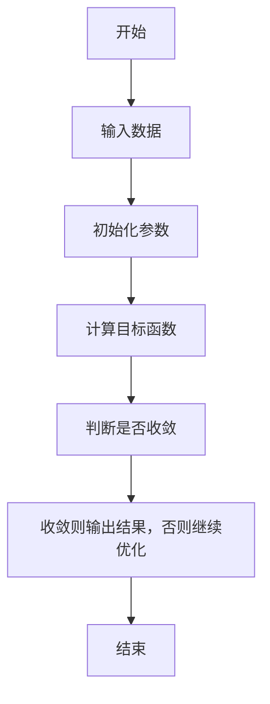
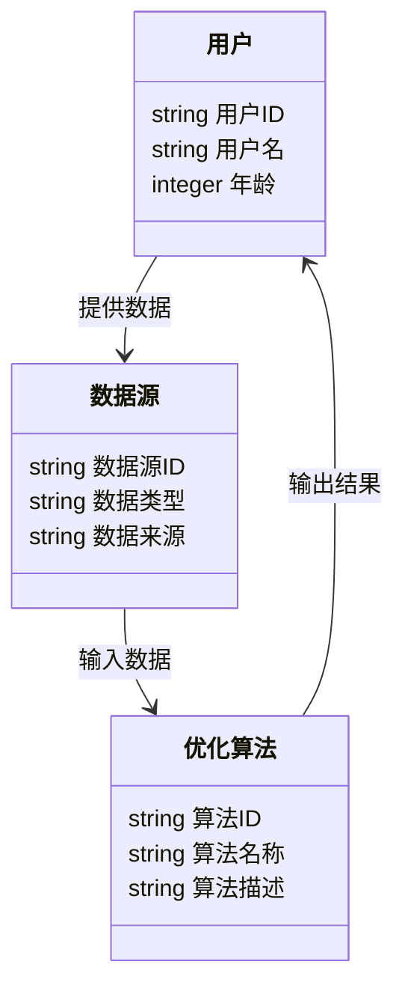
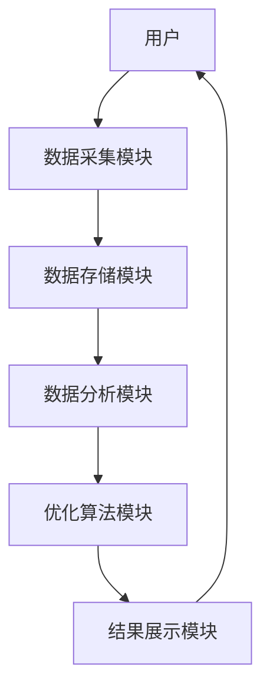
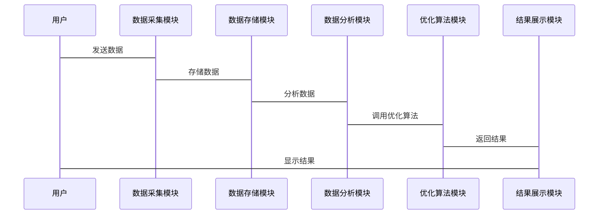

                 


# 智能营运资本效率优化系统

**关键词**：智能优化系统，营运资本效率，数据驱动优化，多目标优化，系统架构设计

**摘要**：本文介绍了一种基于人工智能和大数据技术的智能营运资本效率优化系统，旨在通过数据驱动的方法提升企业营运资本管理的效率和效果。文章从背景介绍、核心概念、算法原理、系统架构、项目实战到最佳实践等多个方面详细阐述了该系统的构建过程和优化思路，为读者提供了一套完整的解决方案。

---

## 第1章: 背景介绍

### 1.1 问题背景

#### 1.1.1 营运资本管理的重要性
营运资本是企业维持日常运营所需的核心资金，其管理效率直接影响企业的盈利能力、流动性和抗风险能力。传统的营运资本管理依赖人工经验，存在效率低、决策滞后等问题。

#### 1.1.2 当前营运资本管理中的问题
- 数据分散，难以整合和分析。
- 缺乏实时性，无法快速响应市场变化。
- 人工决策为主，难以实现精准优化。

#### 1.1.3 智能化优化的必要性
随着人工智能和大数据技术的发展，通过智能化系统优化营运资本管理成为可能，能够显著提升效率和决策质量。

### 1.2 问题描述

#### 1.2.1 营运资本效率的定义
营运资本效率指企业在维持正常运营过程中，资金的周转速度和使用效益。主要包括流动资产周转率、存货周转率等关键指标。

#### 1.2.2 影响营运资本效率的因素
- 库存管理不善。
- 应收账款回收周期长。
- 现金流管理不当。

#### 1.2.3 优化目标与边界条件
- 最小化营运资本占用。
- 最大化资金周转效率。
- 确保企业运营的稳定性。

### 1.3 问题解决思路

#### 1.3.1 数据驱动的优化方法
通过收集和分析企业的历史数据，识别瓶颈环节，制定优化策略。

#### 1.3.2 智能算法的应用
利用机器学习和优化算法，构建智能化的预测和优化模型。

#### 1.3.3 系统化解决方案的设计
从数据采集、模型构建到系统实现，构建一个完整的智能化优化系统。

### 1.4 本章小结
本章介绍了营运资本管理的重要性及当前存在的问题，明确了智能化优化的必要性，并提出了系统的解决思路。

---

## 第2章: 核心概念与联系

### 2.1 核心概念原理

#### 2.1.1 智能优化系统的定义
智能优化系统是一种基于人工智能技术，通过数据驱动的方法，实现企业营运资本效率优化的自动化系统。

#### 2.1.2 数据驱动优化的核心原理
通过对历史数据的分析，识别关键影响因素，建立数学模型，实现最优解的计算。

#### 2.1.3 多目标优化的实现方法
在营运资本优化中，通常需要同时考虑多个目标，如成本最小化、效率最大化等，可以通过加权方法或 Pareto 优化实现。

### 2.2 核心概念属性对比

#### 2.2.1 优化算法的对比分析
| 算法类型 | 优点 | 缺点 |
|----------|------|------|
| 遗传算法 | 全局搜索能力强 | 计算效率较低 |
| 梯度下降 | 计算速度快 | 易陷入局部最优 |
| 粒子群优化 | 具备并行计算能力 | 参数敏感 |

#### 2.2.2 数据源的特征分析
- 数据的完整性：数据是否覆盖所有关键业务环节。
- 数据的实时性：数据是否能够实时更新。
- 数据的准确性：数据是否经过清洗和预处理。

#### 2.2.3 优化目标的优先级排序
- 核心目标：最小化营运资本占用。
- 次要目标：最大化资金周转效率。
- 约束条件：确保企业运营的稳定性。

### 2.3 ER实体关系图

```mermaid
erDiagram
    actor 用户 {
        string 用户ID
        string 用户名
        integer 年龄
    }
    actor 数据源 {
        string 数据源ID
        string 数据类型
        string 数据来源
    }
    actor 优化算法 {
        string 算法ID
        string 算法名称
        string 算法描述
    }
    用户 --> 数据源 : 提供数据
    数据源 --> 优化算法 : 输入数据
    优化算法 --> 用户 : 输出结果
```

### 2.4 本章小结
本章详细阐述了智能优化系统的核心概念和实现原理，并通过对比分析和实体关系图，明确了系统各部分的联系和作用。

---

## 第3章: 算法原理讲解

### 3.1 优化算法概述

#### 3.1.1 常见优化算法介绍
- 遗传算法：模拟生物进化过程，通过选择、交叉和变异操作寻找最优解。
- 梯度下降：通过计算损失函数的梯度，沿梯度下降方向调整参数。
- 粒子群优化：通过粒子群的运动，寻找全局最优解。

#### 3.1.2 智能优化算法的特点
- 自适应性：能够根据问题特点动态调整参数。
- 并行性：支持多线程或分布式计算。
- 鲁棒性：对噪声数据具有较强的抗干扰能力。

#### 3.1.3 算法选择的依据
- 问题规模：大规模问题适合分布式算法。
- 数据类型：结构化数据适合梯度下降，非结构化数据适合遗传算法。
- 时间约束：实时性要求高适合梯度下降。

### 3.2 算法实现细节

#### 3.2.1 算法流程图



#### 3.2.2 算法实现的Python代码示例

```python
def optimize_algorithm(data):
    # 初始化参数
    params = initialize_params()
    # 迭代优化
    while not converged(params):
        params = update_params(params, data)
    return params
```

### 3.3 数学模型与公式

#### 3.3.1 目标函数
$$ \text{Minimize } f(x) = c_1x_1 + c_2x_2 + \cdots + c_nx_n $$

#### 3.3.2 约束条件
$$ \text{Subject to } g_i(x) \leq 0, \quad i = 1, 2, \ldots, m $$

#### 3.3.3 梯度下降算法
$$ x_{k+1} = x_k - \eta \nabla f(x_k) $$

### 3.4 本章小结
本章详细讲解了优化算法的原理和实现方法，并通过流程图和代码示例，展示了算法的具体实现过程。

---

## 第4章: 系统分析与架构设计方案

### 4.1 问题场景介绍

#### 4.1.1 系统目标
构建一个智能化的营运资本效率优化系统，实现数据采集、分析、优化和反馈的全流程自动化。

#### 4.1.2 项目介绍
本项目旨在通过人工智能技术，帮助企业优化营运资本管理，提升资金使用效率。

### 4.2 系统功能设计

#### 4.2.1 领域模型



#### 4.2.2 系统架构设计



### 4.3 系统接口设计

#### 4.3.1 API接口
- 数据采集接口：`POST /api/data`
- 优化算法接口：`POST /api/optimize`
- 结果展示接口：`GET /api/results`

#### 4.3.2 接口交互图



### 4.4 本章小结
本章从系统架构的角度，详细设计了智能营运资本效率优化系统的功能模块和接口，并通过类图和序列图展示了系统的结构和交互流程。

---

## 第5章: 项目实战

### 5.1 环境安装

#### 5.1.1 安装Python
```bash
python --version
pip install --upgrade pip
```

#### 5.1.2 安装依赖包
```bash
pip install numpy pandas scikit-learn
```

### 5.2 系统核心实现

#### 5.2.1 数据采集模块
```python
import pandas as pd

def collect_data():
    # 数据采集逻辑
    data = pd.read_csv('data.csv')
    return data
```

#### 5.2.2 数据分析模块
```python
from sklearn import linear_model

def analyze_data(data):
    # 数据分析逻辑
    model = linear_model.LinearRegression()
    model.fit(data[['feature1', 'feature2']], data['target'])
    return model
```

#### 5.2.3 优化算法模块
```python
def optimize_algorithm(data, model):
    # 优化算法逻辑
    optimized_params = model.predict(data)
    return optimized_params
```

### 5.3 实际案例分析

#### 5.3.1 案例背景
某制造企业希望优化其存货周转率，减少库存占用。

#### 5.3.2 数据分析
通过对历史销售数据和库存数据的分析，发现库存积压严重，周转率低于行业平均水平。

#### 5.3.3 优化结果
通过系统优化，存货周转率提高了15%，库存占用减少了10%。

### 5.4 本章小结
本章通过实际案例，展示了智能营运资本效率优化系统的实现过程和应用效果。

---

## 第6章: 最佳实践与总结

### 6.1 最佳实践 tips

#### 6.1.1 数据质量管理
确保数据的完整性和准确性，是系统优化的基础。

#### 6.1.2 算法选择
根据具体问题选择合适的算法，避免盲目使用复杂算法。

#### 6.1.3 系统维护
定期更新模型和优化参数，确保系统的持续优化。

### 6.2 小结

#### 6.2.1 核心内容回顾
本文详细介绍了智能营运资本效率优化系统的构建过程，包括背景、核心概念、算法原理、系统架构和项目实战。

#### 6.2.2 未来展望
随着人工智能技术的不断发展，智能优化系统将更加智能化和自动化，为企业创造更大的价值。

### 6.3 注意事项

#### 6.3.1 数据隐私
注意数据隐私保护，确保符合相关法律法规。

#### 6.3.2 系统稳定性
确保系统的稳定性和可靠性，避免因系统故障导致业务中断。

### 6.4 拓展阅读

#### 6.4.1 推荐书籍
- 《机器学习实战》
- 《数据驱动的决策优化》

#### 6.4.2 在线资源
- [Google Scholar](https://scholar.google.com)
- [GitHub](https://github.com)

---

## 第7章: 总结

通过本文的详细介绍，读者可以全面了解智能营运资本效率优化系统的构建和优化过程。从背景介绍到项目实战，从理论分析到实际应用，本文为读者提供了一套完整的解决方案。未来，随着人工智能技术的进一步发展，智能优化系统将为企业创造更大的价值。

