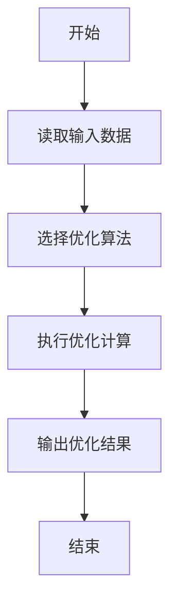
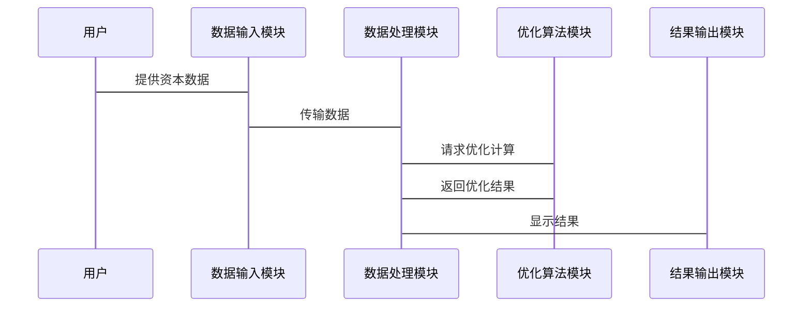

                 


# 智能营运资本管理优化系统

## 关键词：智能资本管理、优化算法、人工智能、系统架构、营运资本

## 摘要：智能营运资本管理优化系统是一种结合人工智能技术，用于优化企业营运资本管理的系统。本文详细介绍了该系统的背景、核心概念、算法原理、系统架构、项目实现以及最佳实践，帮助读者全面了解和应用这一技术。

---

# 第一部分: 智能营运资本管理优化系统概述

## 第1章: 智能营运资本管理优化系统背景介绍

### 1.1 营运资本管理的定义与意义

#### 1.1.1 营运资本的定义
营运资本是指企业在日常运营中用于支持业务活动的流动资金，包括现金、存货、应收账款等。有效的营运资本管理能够确保企业资金流动性，支持业务扩张和应对突发事件。

#### 1.1.2 营运资本管理的重要性
- 支持日常运营：确保企业有足够的资金进行采购、生产和销售。
- 提高资金效率：通过优化资金分配，降低资金闲置和浪费。
- 降低财务风险：合理管理营运资本可以减少企业因资金链断裂带来的风险。

#### 1.1.3 智能化管理的必要性
随着市场竞争加剧和经济环境复杂化，传统的人工管理方式已难以应对快速变化的市场。智能化管理能够实时监控资本流动，预测资金需求，优化资源配置，提升管理效率。

### 1.2 智能营运资本管理优化系统的概念

#### 1.2.1 系统的定义
智能营运资本管理优化系统是一种利用人工智能技术，通过数据分析和优化算法，帮助企业实现营运资本高效管理的系统。

#### 1.2.2 系统的核心目标
- 实时监控资本流动
- 预测资金需求
- 优化资本分配
- 风险预警与控制

#### 1.2.3 系统的边界与外延
- 边界：系统主要处理企业内部的营运资本数据，不涉及外部投资。
- 外延：系统可以与其他管理系统（如ERP、CRM）集成，扩展应用范围。

### 1.3 智能营运资本管理优化系统的组成要素

#### 1.3.1 数据输入模块
负责收集企业内部和外部的资本相关数据，如销售数据、采购订单、银行账户信息等。

#### 1.3.2 数据处理模块
对输入的数据进行清洗、转换和分析，提取有用的信息用于优化算法。

#### 1.3.3 优化算法模块
应用机器学习算法（如线性回归、支持向量机）或优化算法（如遗传算法）进行资本分配优化。

#### 1.3.4 结果输出模块
将优化结果输出为报告或直接集成到企业的管理系统中，指导资本运作。

---

## 第2章: 智能营运资本管理优化系统的核心概念与联系

### 2.1 核心概念原理

#### 2.1.1 数据驱动的优化原理
通过收集和分析大量数据，利用数据驱动的模型进行资本优化，提高决策的科学性。

#### 2.1.2 人工智能在资本管理中的应用
- 机器学习用于预测资金需求和风险评估。
- 自然语言处理用于分析财务报告和市场新闻。

#### 2.1.3 优化算法的基本原理
优化算法通过数学建模，找到资本分配的最佳方案，最大化企业价值或最小化风险。

### 2.2 核心概念属性特征对比表

| 概念       | 特征1       | 特征2       | 特征3       |
|------------|-------------|-------------|-------------|
| 数据输入   | 类型         | 格式         | 来源         |
| 数据处理   | 方法         | 工具         | 标准         |
| 优化算法   | 类型         | 参数         | 结果         |

### 2.3 ER实体关系图

```mermaid
erd
    营运资本
    投资决策
    资金流动
    风险评估
    优化方案
    监控反馈
    营运资本与投资决策之间存在关联关系
    资金流动与风险评估之间存在依赖关系
    优化方案与监控反馈之间存在反馈循环
```

### 2.4 本章小结
本章介绍了智能营运资本管理优化系统的核心概念和相关联系，强调了数据驱动和人工智能在系统中的重要性。

---

## 第3章: 智能营运资本管理优化系统的算法原理讲解

### 3.1 算法原理概述

#### 3.1.1 优化算法的选择依据
- 数据类型和规模
- 优化目标和约束条件
- 计算资源和时间限制

#### 3.1.2 算法的优缺点分析
- 优点：提高决策效率，减少人为错误。
- 缺点：依赖数据质量和算法设计，可能存在过拟合风险。

#### 3.1.3 算法的适用场景
- 资金分配优化
- 风险预测和管理
- 资金流动预测

### 3.2 算法原理的数学模型

#### 3.2.1 线性规划模型
$$ \text{目标函数：} \quad \min \quad c^T x $$
$$ \text{约束条件：} \quad A x \leq b $$

#### 3.2.2 非线性规划模型
$$ \text{目标函数：} \quad f(x) = x^2 + y^2 $$
$$ \text{约束条件：} \quad g(x) = x + y \leq 1 $$`

### 3.3 算法实现的Python代码

```python
import numpy as np
from scipy.optimize import minimize

def objective_function(x):
    return x[0]**2 + x[1]**2

def constraint_function(x):
    return x[0] + x[1] - 1

# 初始猜测值
x0 = np.array([0, 0])

# 定义约束
constraints = {'type': 'ineq', 'fun': constraint_function}

# 使用SLSQP方法求解
result = minimize(objective_function, x0, constraints=constraints, method='SLSQP')

# 输出结果
print(result)
```

### 3.4 算法流程图



### 3.5 本章小结
本章详细讲解了智能营运资本管理优化系统中常用的优化算法，包括数学模型和Python实现，帮助读者理解算法原理和应用场景。

---

## 第4章: 智能营运资本管理优化系统的系统分析与架构设计

### 4.1 系统分析

#### 4.1.1 问题场景介绍
企业面临营运资本管理效率低下、资金分配不合理等问题，亟需智能化解决方案。

#### 4.1.2 需求分析
- 实时监控资本流动
- 预测资金需求
- 优化资本分配
- 提供风险预警

### 4.2 系统架构设计

#### 4.2.1 领域模型类图


#### 4.2.2 系统架构图


### 4.3 接口和交互设计

#### 4.3.1 接口设计
- 数据接口：与企业ERP系统对接，获取实时数据。
- 结果接口：输出优化报告，供管理层参考。

#### 4.3.2 交互流程图



### 4.4 本章小结
本章通过系统分析和架构设计，明确了智能营运资本管理优化系统的结构和功能模块，为后续开发奠定了基础。

---

## 第5章: 智能营运资本管理优化系统的项目实战

### 5.1 环境安装与配置

#### 5.1.1 安装Python和相关库
```bash
pip install numpy scipy matplotlib
```

#### 5.1.2 安装Jupyter Notebook
```bash
pip install jupyter
```

### 5.2 核心代码实现

#### 5.2.1 数据处理代码

```python
import pandas as pd
import numpy as np

# 读取数据
data = pd.read_csv('capital_data.csv')

# 数据清洗
data = data.dropna()
data['date'] = pd.to_datetime(data['date'])
```

#### 5.2.2 优化算法实现

```python
from scipy.optimize import minimize

def objective(x):
    return (x[0] - 1000)**2 + (x[1] - 500)**2

result = minimize(objective, [0, 0], method='Nelder-Mead')
print(result)
```

### 5.3 实际案例分析

#### 5.3.1 案例背景
某制造企业面临库存积压和现金流不足的问题，希望通过系统优化资本分配。

#### 5.3.2 数据分析与优化
- 数据分析显示，库存周转率低，导致资金占用过多。
- 优化算法建议减少库存，增加应收账款回收。

#### 5.3.3 实施效果
- 库存占用降低20%
- 应收账款回收周期缩短15%
- 现金流改善，支持新项目投资

### 5.4 项目小结
本章通过实际案例展示了智能营运资本管理优化系统的应用效果，验证了系统的实用性和高效性。

---

## 第6章: 智能营运资本管理优化系统的最佳实践

### 6.1 项目经验总结

#### 6.1.1 成功经验
- 数据质量是系统优化的基础，需确保数据的准确性和完整性。
- 算法选择需结合具体业务需求，不同场景可能需要不同的算法。

#### 6.1.2 项目教训
- 忽略业务规则可能导致优化结果不可行。
- 系统上线前需进行充分的测试和验证。

### 6.2 小结与展望

#### 6.2.1 小结
智能营运资本管理优化系统通过数据驱动和人工智能技术，帮助企业实现资本管理的智能化和高效化。

#### 6.2.2 展望
未来，随着人工智能和大数据技术的进一步发展，系统将更加智能化，能够实时适应市场变化，为企业提供更精准的资本管理方案。

### 6.3 注意事项

#### 6.3.1 数据安全
系统运行过程中需注意数据安全，防止数据泄露和篡改。

#### 6.3.2 算法更新
定期更新和优化算法，以应对市场变化和业务需求的变化。

### 6.4 拓展阅读

#### 6.4.1 推荐书籍
- 《机器学习实战》
- 《资本预算与投资决策》

#### 6.4.2 推荐博客
- https://towardsdatascience.com/
- https://medium.com/ai-in-business

### 6.5 本章小结
本章总结了项目的成功经验与教训，提出了系统的注意事项和未来展望，为读者提供了宝贵的实践参考。

---

## 结论

智能营运资本管理优化系统通过结合人工智能和大数据技术，为企业提供了智能化的资本管理解决方案。本文从系统背景、核心概念、算法原理、系统架构、项目实战到最佳实践，全面介绍了系统的各个方面，帮助读者深入了解其工作原理和应用价值。未来，随着技术的进步，系统将更加智能化，为企业创造更大的价值。

