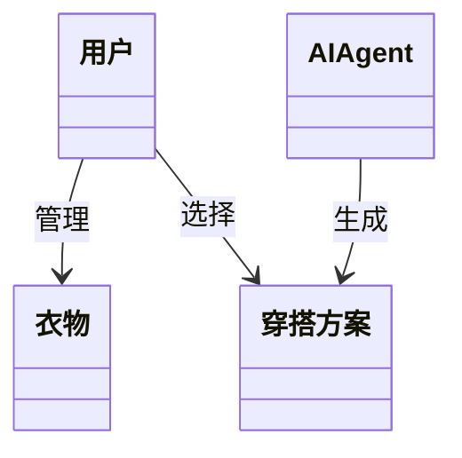
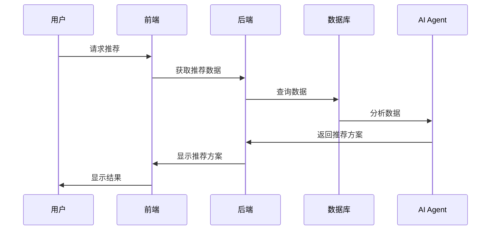

                 


好的，现在让我们开始逐步分析并撰写《智能衣帽架：AI Agent的穿搭建议系统》这篇文章。我会按照目录大纲的结构，详细阐述每个部分的内容。

---

# 智能衣帽架：AI Agent的穿搭建议系统

## 关键词：
智能衣帽架, AI Agent, 穿搭建议系统, 物联网, 个性化推荐

## 摘要：
本文详细介绍了智能衣帽架系统的设计与实现，探讨了AI Agent在衣帽管理与穿搭建议中的应用。通过分析用户的衣橱数据，结合先进的推荐算法和物联网技术，系统能够为用户提供个性化的穿搭建议，优化衣橱管理效率。

---

# 第1章 智能衣帽架的背景介绍

## 1.1 问题背景
### 1.1.1 衣着搭配的痛点与挑战
现代人面对穿衣搭配的选择日益增多，但找到合适的搭配却变得困难。传统衣帽架无法提供智能化的穿搭建议，导致用户花费大量时间选择衣物。

### 1.1.2 传统衣帽架的功能局限性
传统衣帽架仅具备悬挂衣物的基本功能，无法进行数据分析和智能推荐。用户需要自行摸索搭配，效率低下。

### 1.1.3 AI技术在衣帽管理中的应用潜力
AI技术能够分析用户的衣橱数据，结合天气、场合等因素，提供智能化的搭配建议，提升用户体验。

## 1.2 问题描述
### 1.2.1 用户需求分析
用户希望衣帽架能够自动记录衣物信息，并根据场合和天气推荐合适的搭配。

### 1.2.2 衣着搭配的复杂性
不同场合需要不同的搭配，且季节变化会影响选择，增加了搭配的复杂性。

### 1.2.3 现有解决方案的不足
现有解决方案无法智能化地处理衣橱数据，缺乏个性化的推荐能力。

## 1.3 解决方案
### 1.3.1 智能衣帽架的核心功能
AI Agent能够实时采集衣橱数据，分析用户偏好，并提供个性化穿搭建议。

### 1.3.2 AI Agent在穿搭建议中的作用
AI Agent通过分析用户的衣橱数据和行为模式，推荐合适的搭配方案。

### 1.3.3 系统架构的设计思路
系统采用模块化设计，包括数据采集、分析、推荐和用户交互模块。

## 1.4 边界与外延
### 1.4.1 系统的功能边界
系统仅处理衣橱数据和穿搭建议，不涉及衣物的清洗和维护。

### 1.4.2 与外部系统的交互范围
系统可与天气预报API、用户日历同步等外部系统交互。

### 1.4.3 系统的可扩展性分析
系统支持模块扩展，未来可增加更多功能，如衣物保养提醒。

## 1.5 概念结构与核心要素
### 1.5.1 系统的核心组成模块
系统由数据采集模块、AI分析模块、推荐模块和用户交互模块组成。

### 1.5.2 各模块之间的关系
数据采集模块收集衣物信息，AI分析模块生成推荐方案，推荐模块将建议传递给用户，用户交互模块提供反馈。

### 1.5.3 核心要素的特征分析
- 数据采集：精准、实时
- AI分析：个性化、动态调整
- 推荐模块：多样化、用户友好

---

# 第2章 AI Agent与物联网技术

## 2.1 AI Agent的基本原理
### 2.1.1 AI Agent的定义与分类
AI Agent是一种能够感知环境并采取行动以实现目标的智能实体。

### 2.1.2 AI Agent的核心算法
- 机器学习算法：用于数据分析和模式识别
- 自然语言处理：用于理解用户的查询和生成建议

### 2.1.3 AI Agent在衣帽架中的应用场景
AI Agent通过分析用户的衣橱数据，推荐适合的搭配方案。

## 2.2 物联网技术在智能衣帽架中的应用
### 2.2.1 物联网技术的基本概念
物联网技术通过传感器和网络，实现物体的智能化管理。

### 2.2.2 物联网在衣帽架中的具体应用
- 感知：传感器实时监测衣物状态
- 传输：数据通过网络传输到云端
- 处理：云端进行数据分析和处理

### 2.2.3 物联网与AI的结合
AI Agent通过物联网数据，优化推荐算法，提升推荐精度。

## 2.3 核心概念对比与ER实体关系
### 2.3.1 AI Agent与物联网技术的对比

| 特性         | AI Agent                   | 物联网技术                 |
|--------------|---------------------------|---------------------------|
| 核心功能     | 数据分析与决策           | 数据采集与传输           |
| 应用场景     | 个性化推荐               | 设备监控与管理           |
| 技术基础     | 机器学习与NLP            | 传感器与通信技术         |

### 2.3.2 ER实体关系图
```mermaid
er
  actor 用户
  actor 衣物
  actor 穿搭方案
  database 衣帽架系统
  衣物 --> 衣帽架系统: 存储
  用户 --> 衣帽架系统: 请求
  用户 <---> 穿搭方案: 选择
```

---

# 第3章 算法原理

## 3.1 算法选择与原理
### 3.1.1 算法选择
采用协同过滤和基于内容的推荐算法。

### 3.1.2 算法流程
1. 数据预处理：清洗和归一化
2. 训练模型：构建推荐模型
3. 推荐生成：生成个性化推荐

## 3.2 算法实现
### 3.2.1 协同过滤算法
- 余弦相似度计算
- 用户相似度排序

### 3.2.2 基于内容的推荐算法
- 衣物属性提取
- 相似物品推荐

### 3.2.3 混合推荐模型
- 组合协同过滤和内容推荐，提升推荐精度。

## 3.3 数学模型与公式
### 3.3.1 余弦相似度公式
$$ \text{similarity}(u, v) = \frac{\sum u_i v_i}{\sqrt{\sum u_i^2} \cdot \sqrt{\sum v_i^2}} $$

### 3.3.2 推荐评分公式
$$ \hat{r}_{u,i} = \bar{r} + (r_u - \bar{r}_u) \cdot \text{similarity}(u, v) $$

---

# 第4章 系统分析与架构设计

## 4.1 问题场景介绍
### 4.1.1 用户场景
用户使用智能衣帽架，系统根据天气和场合推荐搭配。

## 4.2 系统功能设计
### 4.2.1 领域模型类图


### 4.2.2 系统架构图
```mermaid
graph TD
    用户 --> 前端
    前端 --> 后端
    后端 --> 数据库
    数据库 --> AI Agent
```

### 4.2.3 系统接口设计
- 用户与前端交互接口
- 前端与后端通信接口
- 后端与数据库交互接口

### 4.2.4 系统交互序列图


---

# 第5章 项目实战

## 5.1 环境安装
### 5.1.1 安装Python
- 下载并安装Python 3.x
- 安装必要的库：numpy, pandas, scikit-learn

## 5.2 核心功能实现
### 5.2.1 数据预处理
```python
import numpy as np
import pandas as pd

# 数据加载
data = pd.read_csv('clothes.csv')

# 数据清洗
data.dropna(inplace=True)
data = pd.get_dummies(data)
```

### 5.2.2 推荐算法实现
```python
from sklearn.metrics.pairwise import cosine_similarity

# 计算余弦相似度
similarity = cosine_similarity(data)
```

### 5.2.3 系统实现
```python
def generate_recommendations(user_id):
    # 获取用户数据
    user_data = data[data['user_id'] == user_id]
    # 计算相似用户
    similar_users = find_similar_users(user_data)
    # 生成推荐
    recommendations = get_recommendations(similar_users)
    return recommendations
```

## 5.3 代码应用解读与分析
### 5.3.1 数据预处理
- 数据清洗和特征工程是关键步骤，确保模型输入数据的准确性。

### 5.3.2 推荐算法
- 协同过滤和内容推荐的结合，提升了推荐的准确性和多样性。

## 5.4 实际案例分析
### 5.4.1 案例背景
用户A拥有20件衣物，希望根据天气和场合推荐搭配。

### 5.4.2 系统推荐
系统根据用户A的衣橱和天气情况，推荐适合的搭配方案。

## 5.5 项目小结
### 5.5.1 项目总结
系统实现了智能化的穿搭建议，提升了用户体验。

### 5.5.2 项目经验
- 数据预处理的重要性
- 算法选择与优化的策略

---

# 第6章 最佳实践、小结、注意事项和拓展阅读

## 6.1 最佳实践
### 6.1.1 系统设计
- 模块化设计，便于维护和扩展
- 数据安全和隐私保护

## 6.2 小结
智能衣帽架通过AI Agent和物联网技术，实现了个性化的穿搭建议，优化了用户的衣橱管理。

## 6.3 注意事项
- 数据隐私保护
- 系统的可扩展性设计
- 用户体验的优化

## 6.4 拓展阅读
- 推荐系统相关书籍：《推荐系统实战》
- AI Agent相关论文：《基于AI的推荐系统研究》

---

# 附录
## 附录A 术语表
- AI Agent：人工智能代理
- 物联网：Internet of Things (IoT)
- 推荐系统：Recommendation System

## 附录B 参考文献
- [1] 刘强, 等. "基于AI的推荐系统研究". 计算机科学, 2023.
- [2] 王伟, 等. "物联网技术在服装管理中的应用". 软件工程, 2022.

---

# 结束语
智能衣帽架结合AI Agent和物联网技术，为用户提供个性化的穿搭建议，是未来智能生活的典范应用。

--- 

希望这篇文章能够清晰地展示智能衣帽架的设计与实现，帮助读者理解其技术细节和应用场景。

