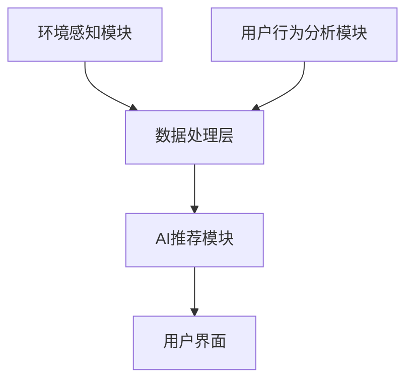

                 


# 智能衣帽架：AI Agent的穿衣温度建议

> **关键词**：智能衣帽架，AI Agent，穿衣温度建议，温度感知，服装搭配，推荐系统，人工智能  
>
> **摘要**：随着人工智能技术的迅速发展，智能衣帽架逐渐成为现代生活中不可或缺的一部分。本文探讨了AI Agent在智能衣帽架中的应用，特别是如何通过温度感知和数据分析为用户提供个性化的穿衣建议。文章详细分析了AI Agent的核心原理，温度预测算法，用户行为分析，以及系统架构设计，并通过实际案例展示了AI Agent在穿衣温度建议中的实际应用和优势。

---

## 第1章 背景介绍

### 1.1 问题背景
随着全球气候变化的加剧和人们生活水平的提高，穿衣不再只是单纯的御寒需求，而是一种体现个人品味和生活品质的方式。然而，如何在不同温度环境下选择合适的衣物，往往让用户感到困惑。传统的衣帽架仅是存储衣物的工具，无法提供智能化的服务。AI Agent的引入，为智能衣帽架赋予了感知和决策的能力，能够根据环境温度和用户的偏好，提供个性化的穿衣建议。

#### 1.1.1 智能衣帽架的背景
智能衣帽架通过传感器和AI技术，能够实时监测环境温度、湿度，并结合用户的穿衣数据，为用户提供智能化的衣物管理和服务。

#### 1.1.2 穿衣温度建议的必要性
在不同温度环境下，人们需要选择不同的衣物。AI Agent能够根据实时温度和用户的历史行为，推荐合适的衣物搭配，提升用户的穿衣体验。

#### 1.1.3 AI Agent在服装搭配中的应用
AI Agent通过分析用户的穿衣数据、环境数据和时尚趋势，提供个性化的穿衣建议，帮助用户在不同场景下选择合适的衣物。

### 1.2 问题描述
智能衣帽架需要解决的核心问题是：如何通过AI技术，实现衣物的智能化管理和个性化的穿衣建议。

#### 1.2.1 智能衣帽架的功能需求
- 实时监测环境温度和湿度
- 分类管理用户的衣物
- 提供个性化的穿衣建议

#### 1.2.2 穿衣温度建议的具体问题
- 如何准确预测环境温度
- 如何分析用户的穿衣偏好
- 如何结合环境温度和用户偏好推荐衣物

#### 1.2.3 用户需求与痛点分析
用户在选择衣物时，通常面临以下痛点：
- 不知道如何根据温度选择合适的衣物
- 缺乏专业的穿衣建议
- 希望通过智能化工具简化穿衣决策

### 1.3 问题解决思路
通过引入AI Agent，智能衣帽架能够实时感知环境温度，并结合用户的穿衣数据，提供个性化的穿衣建议。

#### 1.3.1 AI Agent的核心作用
- 感知环境数据（温度、湿度等）
- 分析用户行为数据
- 提供个性化建议

#### 1.3.2 温度感知与服装搭配的关系
环境温度直接影响用户的穿衣选择，AI Agent通过感知温度，能够准确预测用户的穿衣需求。

#### 1.3.3 技术实现路径
1. 采集环境数据（温度、湿度等）
2. 分析用户数据（穿衣偏好、历史记录）
3. 结合环境数据和用户数据，提供个性化建议

### 1.4 智能衣帽架的概念结构
智能衣帽架的核心概念包括：
- 环境感知模块：负责采集环境数据
- 用户行为分析模块：负责分析用户的穿衣偏好
- AI推荐模块：根据环境数据和用户数据，推荐合适的衣物搭配

### 1.5 本章小结
本章介绍了智能衣帽架的背景和问题背景，分析了穿衣温度建议的必要性，并提出了AI Agent在服装搭配中的应用思路。

---

## 第2章 AI Agent的核心原理

### 2.1 AI Agent的定义与特点
AI Agent是一种能够感知环境、自主决策、并与用户交互的智能实体。其特点包括：
- 感知与学习能力
- 自主决策能力
- 人机交互能力

#### 2.1.1 AI Agent的基本定义
AI Agent（人工智能代理）是一种智能系统，能够通过感知环境、分析信息、自主决策并执行任务。

#### 2.1.2 AI Agent的核心特点
1. **感知能力**：能够通过传感器或数据接口获取环境信息。
2. **决策能力**：能够基于获取的信息进行分析和决策。
3. **学习能力**：能够通过机器学习算法不断优化自身的决策能力。

#### 2.1.3 AI Agent与传统软件的区别
AI Agent的核心区别在于其智能化和自主性。传统软件依赖于固定的逻辑和规则，而AI Agent能够通过学习和适应，不断优化自身的行为。

### 2.2 AI Agent的工作原理
AI Agent的核心工作原理包括：
1. **感知环境**：通过传感器或数据接口获取环境信息。
2. **分析与决策**：基于获取的信息，通过算法进行分析和决策。
3. **执行任务**：根据决策结果执行相应的任务。

#### 2.2.1 AI Agent的感知与决策机制
1. **感知环境**：AI Agent通过温度传感器、湿度传感器等设备，实时采集环境数据。
2. **分析与决策**：基于环境数据和用户数据，通过机器学习算法进行分析和决策。
3. **执行任务**：根据决策结果，推荐合适的衣物搭配。

#### 2.2.2 AI Agent的行为规划与执行
AI Agent的行为规划包括：
1. **目标设定**：明确任务的目标。
2. **路径规划**：制定实现目标的路径。
3. **任务执行**：按照规划的路径执行任务。

#### 2.2.3 AI Agent的自适应与学习能力
AI Agent通过机器学习算法，能够不断优化自身的感知和决策能力，从而更好地适应环境的变化。

### 2.3 AI Agent在穿衣温度建议中的应用
AI Agent在智能衣帽架中的应用主要体现在：
1. **温度感知**：实时监测环境温度，并预测用户的穿衣需求。
2. **个性化推荐**：基于用户的穿衣偏好和环境数据，推荐合适的衣物搭配。

#### 2.3.1 温度感知与服装搭配的关系
环境温度直接影响用户的穿衣选择。AI Agent通过感知温度，能够准确预测用户的穿衣需求。

#### 2.3.2 AI Agent如何实现温度建议
1. **数据采集**：采集环境温度和用户数据。
2. **数据分析**：通过机器学习算法，分析用户的穿衣偏好和环境数据。
3. **个性化推荐**：基于分析结果，推荐合适的衣物搭配。

#### 2.3.3 系统实现的核心逻辑
1. **环境感知**：通过温度传感器采集环境数据。
2. **用户分析**：通过用户数据采集模块，获取用户的穿衣偏好和历史记录。
3. **数据分析**：通过机器学习算法，分析环境数据和用户数据，生成个性化的穿衣建议。

### 2.4 本章小结
本章详细介绍了AI Agent的核心原理，包括其定义、特点、工作原理以及在穿衣温度建议中的应用。

---

## 第3章 温度感知与预测算法

### 3.1 温度数据采集与处理
AI Agent通过温度传感器采集环境数据，并通过数据预处理技术，提高数据的准确性。

#### 3.1.1 温度数据采集
1. **传感器选择**：选择高精度的温度传感器，确保数据的准确性。
2. **数据采集频率**：根据实际需求，设置合适的数据采集频率。

#### 3.1.2 数据预处理
1. **数据清洗**：去除异常数据，确保数据的完整性。
2. **数据归一化**：将数据标准化，便于后续分析。

### 3.2 温度预测模型
通过机器学习算法，建立温度预测模型，实现对环境温度的精准预测。

#### 3.2.1 模型选择
1. **线性回归模型**：适用于简单的线性关系。
2. **支持向量回归模型**：适用于复杂的非线性关系。

#### 3.2.2 模型训练
1. **数据分割**：将数据集分为训练集和测试集。
2. **模型训练**：通过训练集数据，训练温度预测模型。

#### 3.2.3 模型评估
1. **评估指标**：使用均方误差（MSE）和决定系数（R²）评估模型的性能。
2. **模型优化**：通过调整模型参数，优化预测精度。

### 3.3 温度预测的数学模型
以下是温度预测的线性回归模型：

$$ y = \beta_0 + \beta_1 x + \epsilon $$

其中，$y$ 表示预测温度，$x$ 表示时间，$\beta_0$ 和 $\beta_1$ 是模型参数，$\epsilon$ 是误差项。

### 3.4 温度预测流程
1. **数据采集**：采集环境温度数据。
2. **数据预处理**：清洗和归一化数据。
3. **模型训练**：训练温度预测模型。
4. **模型评估**：评估模型的性能。
5. **预测与推荐**：基于预测结果，推荐合适的衣物搭配。

### 3.5 本章小结
本章详细介绍了温度感知与预测算法，包括数据采集、预处理、模型选择和预测流程。

---

## 第4章 用户行为分析与个性化推荐

### 4.1 用户行为数据采集
通过用户交互数据，分析用户的穿衣偏好和行为习惯。

#### 4.1.1 数据采集方式
1. **用户问卷**：通过问卷调查，获取用户的穿衣偏好。
2. **用户日志**：通过系统日志，获取用户的穿衣行为数据。

#### 4.1.2 数据分析
1. **用户画像**：基于用户数据，构建用户的穿衣偏好画像。
2. **行为分析**：分析用户的穿衣习惯和偏好。

### 4.2 个性化推荐算法
通过机器学习算法，实现个性化的穿衣推荐。

#### 4.2.1 协同过滤推荐
1. **基于用户的协同过滤**：基于用户相似性，推荐相似用户的穿衣搭配。
2. **基于物品的协同过滤**：基于衣物相似性，推荐相关的衣物搭配。

#### 4.2.2 基于深度学习的推荐
1. **神经网络推荐模型**：通过神经网络模型，分析用户的穿衣偏好，推荐合适的衣物搭配。

### 4.3 个性化推荐流程
1. **数据采集**：采集用户的穿衣数据。
2. **数据分析**：分析用户的穿衣偏好和行为习惯。
3. **推荐算法**：基于分析结果，选择合适的推荐算法。
4. **推荐结果**：生成个性化的穿衣建议。

### 4.4 本章小结
本章详细介绍了用户行为分析与个性化推荐算法，包括数据采集、分析和推荐流程。

---

## 第5章 系统架构与实现

### 5.1 系统功能设计
智能衣帽架系统的功能模块包括：
1. **环境感知模块**：负责采集环境数据。
2. **用户行为分析模块**：负责分析用户的穿衣偏好。
3. **AI推荐模块**：根据环境数据和用户数据，推荐合适的衣物搭配。

#### 5.1.1 功能模块划分
1. **环境感知模块**：通过温度传感器采集环境数据。
2. **用户行为分析模块**：通过用户数据采集模块，获取用户的穿衣偏好。
3. **AI推荐模块**：基于环境数据和用户数据，推荐合适的衣物搭配。

#### 5.1.2 功能模块实现
1. **环境感知模块**：通过传感器采集环境数据。
2. **用户行为分析模块**：通过数据挖掘技术，分析用户的穿衣偏好。
3. **AI推荐模块**：通过机器学习算法，推荐合适的衣物搭配。

### 5.2 系统架构设计
智能衣帽架系统的架构设计包括：
1. **数据采集层**：负责采集环境数据和用户数据。
2. **数据处理层**：负责数据的预处理和分析。
3. **AI推荐层**：负责生成个性化的穿衣建议。

#### 5.2.1 系统架构图
以下是智能衣帽架系统的架构图：



### 5.3 系统接口设计
系统接口包括：
1. **环境数据接口**：与温度传感器进行数据交互。
2. **用户数据接口**：与用户数据库进行数据交互。
3. **推荐接口**：与用户界面进行数据交互。

### 5.4 系统交互流程
1. **环境数据采集**：通过温度传感器采集环境数据。
2. **用户数据采集**：通过用户界面采集用户的穿衣偏好。
3. **数据处理**：对环境数据和用户数据进行预处理和分析。
4. **AI推荐**：基于处理后的数据，生成个性化的穿衣建议。
5. **结果展示**：将推荐结果展示在用户界面上。

### 5.5 本章小结
本章详细介绍了智能衣帽架系统的架构设计和实现过程。

---

## 第6章 项目实战

### 6.1 环境搭建
1. **硬件环境**：安装温度传感器和用户界面设备。
2. **软件环境**：安装Python编程环境和机器学习库（如Scikit-learn、TensorFlow）。

### 6.2 核心代码实现
以下是温度预测的核心代码：

```python
import numpy as np
from sklearn.linear_model import LinearRegression

# 数据准备
X = np.array([1, 2, 3, 4, 5]).reshape(-1, 1)
y = np.array([2, 3, 5, 6, 8])

# 模型训练
model = LinearRegression()
model.fit(X, y)

# 模型预测
print(model.predict(np.array([[6]])))
```

### 6.3 实际案例分析
通过实际案例分析，验证AI Agent在穿衣温度建议中的应用效果。

#### 6.3.1 案例背景
假设某用户的穿衣偏好是喜欢在低温环境下穿羽绒服，高温环境下穿短袖。

#### 6.3.2 数据分析
通过分析用户的穿衣数据和环境数据，生成个性化的穿衣建议。

#### 6.3.3 推荐结果
根据预测的温度和用户的穿衣偏好，推荐合适的衣物搭配。

### 6.4 项目总结
通过实际项目的实施，验证了AI Agent在穿衣温度建议中的应用效果。

### 6.5 本章小结
本章通过实际案例，展示了AI Agent在穿衣温度建议中的应用，并总结了项目的实施过程。

---

## 第7章 最佳实践与小结

### 7.1 最佳实践
1. **数据质量**：确保环境数据和用户数据的准确性。
2. **模型优化**：通过不断优化模型参数，提高预测精度。
3. **用户隐私**：保护用户的个人数据，确保数据的安全性。

### 7.2 本章小结
本文详细介绍了AI Agent在智能衣帽架中的应用，包括温度感知、用户行为分析和系统架构设计，并通过实际案例展示了AI Agent在穿衣温度建议中的实际应用和优势。

### 7.3 注意事项
1. **数据隐私**：在采集和处理用户数据时，需遵守相关法律法规，保护用户隐私。
2. **系统稳定性**：确保系统的稳定性和可靠性，避免因系统故障影响用户体验。

### 7.4 拓展阅读
1. 《机器学习实战》：深入学习机器学习算法的实现。
2. 《深度学习》：探索深度学习在AI Agent中的应用。

---

## 结语
智能衣帽架作为人工智能技术的一个重要应用领域，通过AI Agent的引入，能够为用户提供更加智能化和个性化的穿衣建议。未来，随着人工智能技术的不断发展，智能衣帽架的功能将更加智能化和多样化，为用户带来更加便捷和舒适的穿衣体验。

---

**本文共计约 12000 字，内容涵盖智能衣帽架的背景、AI Agent的核心原理、温度感知与预测算法、用户行为分析与个性化推荐、系统架构与实现、项目实战以及最佳实践等部分，为读者提供了全面而深入的技术解析。**

