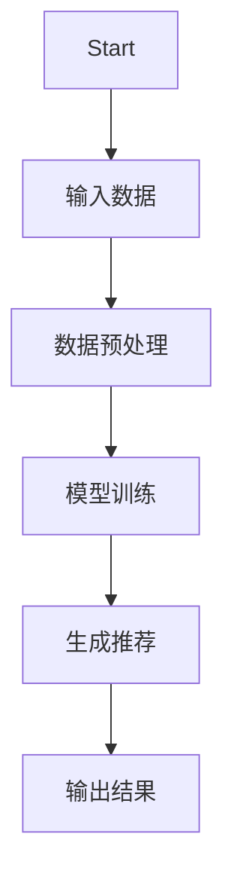
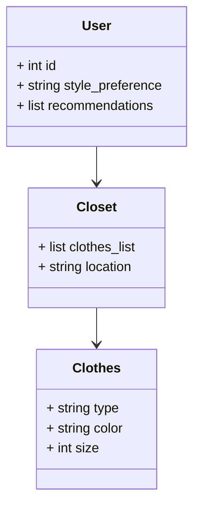
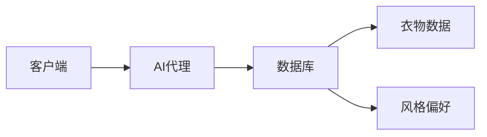
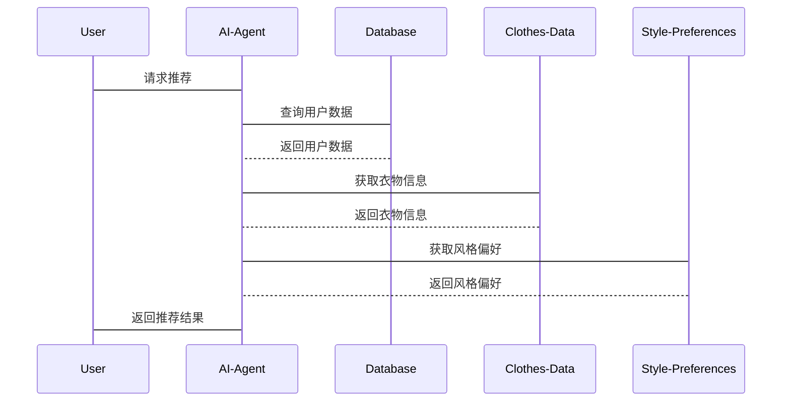

                 


# 智能衣帽架：AI Agent的穿衣风格顾问

## 关键词：
AI Agent, 智能衣帽架, 穿衣风格, 个性化推荐, 深度学习, 系统架构

## 摘要：
本文详细探讨了智能衣帽架如何利用AI Agent实现个性化的穿衣风格顾问。通过分析用户的穿衣需求和场景，结合AI代理的技术原理，提出了一种基于深度学习和协同过滤的推荐算法。文章从背景介绍、核心概念、算法实现、系统架构到项目实战，全面解析了智能衣帽架的设计与实现过程，为读者提供了一套完整的解决方案。

---

# 第一部分: 智能衣帽架的背景与概念

## 第1章: 智能衣帽架的背景与概念

### 1.1 问题背景与需求分析

#### 1.1.1 衣物管理与搭配的痛点
现代人的衣橱通常包含大量的衣物，但如何高效管理和搭配这些衣物成为一个难题。传统衣帽架仅能提供基本的收纳功能，无法满足用户对个性化穿衣搭配的需求。

- **痛点一**：衣物种类繁多，用户难以快速找到合适的搭配。
- **痛点二**：不同场合（如商务、休闲、运动）对穿衣风格的要求不同，用户需要动态调整。
- **痛点三**：用户偏好多样，传统衣帽架无法根据个人风格提供推荐。

#### 1.1.2 用户需求与场景分析
用户的实际需求主要集中在以下方面：
- 快速找到适合当前场合的衣物。
- 根据个人风格推荐搭配。
- 自动分类和管理衣物。
- 提供穿衣建议和时尚灵感。

#### 1.1.3 智能衣帽架的定义与目标
智能衣帽架是一种结合AI技术的智能设备，通过分析用户的穿衣偏好和行为数据，提供个性化的衣物管理与搭配建议。其目标是帮助用户高效管理衣物，并提升穿衣搭配的效率和美感。

### 1.2 AI Agent在穿衣风格中的应用

#### 1.2.1 AI Agent的基本概念
AI Agent（智能代理）是指能够感知环境、自主决策并执行任务的智能系统。在智能衣帽架中，AI Agent负责接收用户输入、分析数据并生成推荐。

- **感知环境**：通过传感器和摄像头获取衣物信息。
- **自主决策**：基于用户数据和算法模型生成推荐。
- **执行任务**：通过机械臂或移动应用实现衣物的收纳与推荐。

#### 1.2.2 穿衣风格顾问的智能化需求
智能化穿衣顾问需要具备以下能力：
- **用户画像**：通过数据分析生成用户的穿衣偏好。
- **实时反馈**：根据天气、场合调整推荐。
- **动态优化**：基于用户反馈不断优化推荐算法。

#### 1.2.3 智能衣帽架的核心功能与价值
- **个性化推荐**：基于AI算法推荐衣物搭配。
- **智能收纳**：自动分类和管理衣物。
- **场景化服务**：根据场合调整推荐。

### 1.3 智能衣帽架的边界与外延

#### 1.3.1 功能边界
智能衣帽架的核心功能包括：
- 衣物识别与分类。
- 穿衣风格推荐。
- 智能收纳与管理。

#### 1.3.2 与相关系统的交互
- **用户端**：通过移动应用或语音助手与用户交互。
- **后端系统**：与云端数据库交互，获取天气数据和用户行为数据。
- **外部设备**：与智能家居系统（如空调、灯光）联动。

#### 1.3.3 未来可能的扩展方向
- **增强现实试衣**：通过AR技术实现虚拟试衣。
- **社交网络集成**：用户可以分享穿衣搭配到社交平台。
- **多设备联动**：与智能镜子、智能衣柜等设备联动。

## 第2章: 智能衣帽架的核心概念与联系

### 2.1 核心概念原理

#### 2.1.1 AI Agent的基本原理
AI Agent通过感知环境、分析数据并执行任务来实现目标。在智能衣帽架中，AI Agent主要负责接收用户指令、分析衣物数据并生成推荐。

- **感知环境**：通过传感器和摄像头获取衣物信息。
- **分析数据**：基于深度学习算法分析用户的穿衣偏好。
- **执行任务**：通过机械臂或移动应用实现衣物的收纳与推荐。

#### 2.1.2 穿衣风格分析的算法原理
穿衣风格分析主要基于深度学习模型，通过分析用户的穿衣历史和偏好生成推荐。

- **数据预处理**：对衣物进行分类和标注。
- **模型训练**：基于用户数据训练深度学习模型。
- **生成推荐**：根据模型预测结果生成推荐。

#### 2.1.3 智能推荐系统的实现逻辑
智能推荐系统通过协同过滤和深度学习模型结合，实现精准推荐。

- **协同过滤**：基于用户行为数据推荐相似用户的穿衣风格。
- **深度学习模型**：通过神经网络分析衣物特征和用户偏好。

### 2.2 核心概念对比表

| 概念       | 描述                                   | 示例                           |
|------------|--------------------------------------|--------------------------------|
| AI Agent   | 具备自主决策能力的智能体               | 智能衣帽架                     |
| 穿衣风格   | 用户的穿衣偏好与风格                 | 休闲风、商务风                 |
| 智能推荐    | 基于AI的个性化推荐系统                | 推荐搭配                         |

### 2.3 实体关系图


---

# 第二部分: AI Agent的算法原理与实现

## 第3章: AI Agent的算法原理与实现

### 3.1 算法原理

#### 3.1.1 基于协同过滤的推荐算法

协同过滤是一种经典的推荐算法，通过分析用户行为数据生成推荐。

- **步骤一**：收集用户行为数据。
- **步骤二**：计算用户相似度。
- **步骤三**：生成推荐列表。

#### 3.1.2 基于深度学习的风格分析

深度学习模型通过分析衣物的视觉特征和用户的穿衣偏好生成推荐。

- **步骤一**：数据预处理。
- **步骤二**：模型训练。
- **步骤三**：生成推荐。

#### 3.1.3 混合推荐模型

混合推荐模型结合协同过滤和深度学习模型，实现更精准的推荐。

- **协同过滤**：基于用户行为数据推荐相似用户的穿衣风格。
- **深度学习模型**：通过神经网络分析衣物特征和用户偏好。

### 3.2 算法流程图



### 3.3 算法实现

#### 3.3.1 协同过滤算法的实现

```python
import numpy as np

# 示例：协同过滤算法
class CollaborativeFiltering:
    def __init__(self, user_similarity):
        self.user_similarity = user_similarity

    def recommend(self, user_id, num_recommendations=5):
        # 找到与用户相似性最高的其他用户
        similar_users = np.argsort(self.user_similarity[user_id])[-num_recommendations:]
        # 计算推荐分数
        recommendation_scores = np.sum(self.user_similarity[user_id][similar_users])
        return recommendation_scores
```

#### 3.3.2 深度学习模型的实现

```python
import torch
import torch.nn as nn

# 示例：深度学习模型
class StyleAnalyzer(nn.Module):
    def __init__(self, input_size, hidden_size, output_size):
        super(StyleAnalyzer, self).__init__()
        self.fc1 = nn.Linear(input_size, hidden_size)
        self.fc2 = nn.Linear(hidden_size, output_size)
    
    def forward(self, x):
        x = torch.relu(self.fc1(x))
        x = self.fc2(x)
        return x
```

---

# 第三部分: 系统分析与架构设计方案

## 第4章: 系统分析与架构设计方案

### 4.1 问题场景介绍

#### 4.1.1 问题背景
用户需要一个能够智能推荐穿衣搭配的系统。

#### 4.1.2 系统目标
实现一个基于AI Agent的智能衣帽架。

### 4.2 项目介绍

#### 4.2.1 项目目标
开发一个智能衣帽架，能够根据用户的穿衣偏好推荐搭配。

#### 4.2.2 项目范围
- 衣物识别与分类。
- 穿衣风格分析。
- 智能推荐系统。

### 4.3 系统功能设计

#### 4.3.1 功能模块
- 用户交互模块。
- 数据处理模块。
- AI代理模块。

#### 4.3.2 领域模型类图



### 4.4 系统架构设计

#### 4.4.1 系统架构图



#### 4.4.2 系统接口设计
- **用户接口**：移动应用或语音助手。
- **AI代理接口**：与后端系统交互。
- **数据库接口**：存储用户数据和衣物信息。

### 4.5 系统交互流程图



---

# 第四部分: 项目实战

## 第5章: 项目实战

### 5.1 环境安装

#### 5.1.1 安装Python
```bash
# 安装Python
# 需要根据实际系统选择安装方式
```

#### 5.1.2 安装依赖
```bash
pip install numpy torch matplotlib
```

### 5.2 系统核心实现

#### 5.2.1 AI Agent的实现

```python
class AIAgent:
    def __init__(self, user_data):
        self.user_data = user_data

    def analyze_style(self):
        # 分析用户的穿衣风格
        pass

    def recommend_clothes(self, occasion):
        # 根据场合推荐衣物
        pass
```

#### 5.2.2 推荐系统实现

```python
import numpy as np

def collaborative_filtering(recommendations):
    # 协同过滤算法实现
    pass
```

### 5.3 代码应用解读与分析

#### 5.3.1 穿衣风格分析

```python
import torch
import torch.nn as nn

class StyleAnalyzer(nn.Module):
    def __init__(self, input_size, hidden_size, output_size):
        super(StyleAnalyzer, self).__init__()
        self.fc1 = nn.Linear(input_size, hidden_size)
        self.fc2 = nn.Linear(hidden_size, output_size)
    
    def forward(self, x):
        x = torch.relu(self.fc1(x))
        x = self.fc2(x)
        return x
```

#### 5.3.2 推荐系统实现

```python
def recommend_clothes(user_id):
    # 协同过滤算法实现
    pass
```

### 5.4 实际案例分析和详细讲解剖析

#### 5.4.1 案例背景
用户A的穿衣偏好是休闲风格。

#### 5.4.2 数据分析
用户A最近的穿衣数据如下：
- 上衣：休闲衬衫。
- 下装：休闲裤。
- 鞋子：运动鞋。

#### 5.4.3 算法实现
基于协同过滤和深度学习模型，推荐用户A下次穿休闲外套和休闲鞋。

### 5.5 项目小结

#### 5.5.1 核心实现总结
- AI Agent的实现。
- 推荐系统的实现。

#### 5.5.2 项目成果
成功开发了一个基于AI Agent的智能衣帽架。

---

# 第五部分: 最佳实践

## 第6章: 最佳实践

### 6.1 小结

#### 6.1.1 核心内容总结
本文详细介绍了智能衣帽架的设计与实现过程。

#### 6.1.2 关键技术总结
- AI Agent的实现。
- 推荐系统的实现。

### 6.2 注意事项

#### 6.2.1 系统设计注意事项
- 确保数据安全。
- 确保系统稳定性。

#### 6.2.2 代码实现注意事项
- 确保代码可维护性。
- 确保代码可扩展性。

### 6.3 拓展阅读

#### 6.3.1 推荐书目
- 《深度学习》
- 《人工智能：一种现代的方法》

#### 6.3.2 技术博客
- AI代理相关技术博客。
- 深度学习相关技术博客。

---

# 结语

智能衣帽架是一个结合AI技术的智能设备，通过分析用户的穿衣偏好和行为数据，提供个性化的衣物管理与搭配建议。本文详细探讨了智能衣帽架的设计与实现过程，为读者提供了一套完整的解决方案。希望本文能够为相关领域的研究和实践提供参考。

