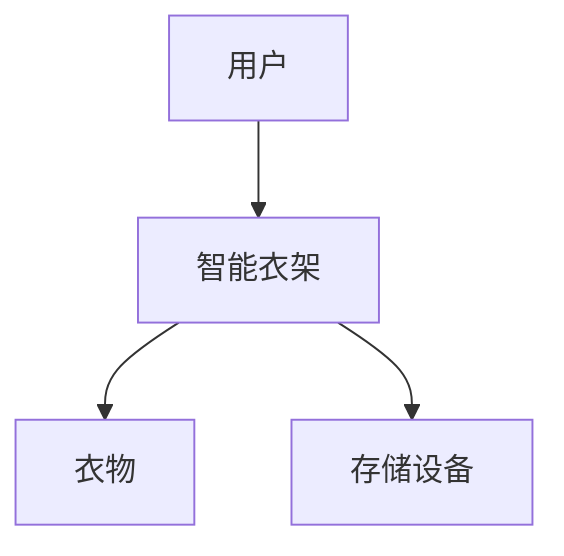
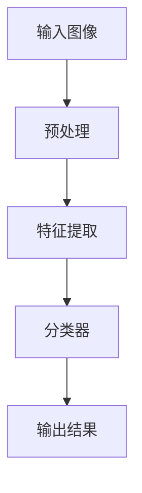
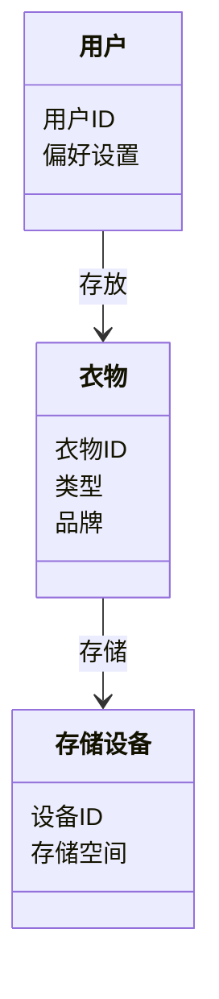
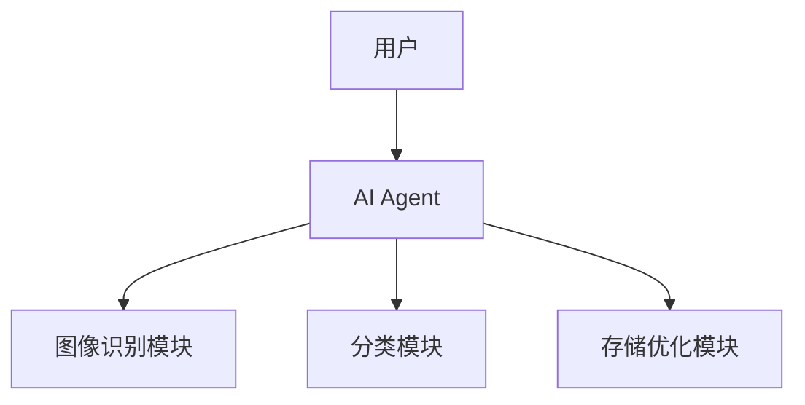
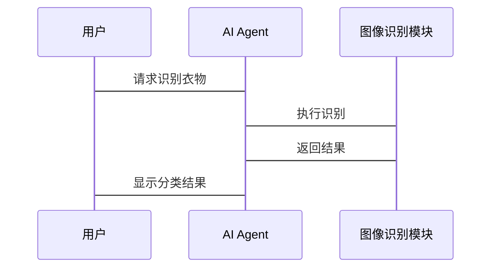

                 


# 智能衣架：AI Agent的衣物保养与存储优化

> 关键词：智能衣架、AI Agent、衣物保养、存储优化、图像识别、分类算法、系统架构

> 摘要：本文将详细探讨智能衣架的设计与实现，结合AI Agent技术，通过图像识别和分类算法优化衣物的保养与存储管理。从系统背景到核心算法，再到项目实现，全面解析智能衣架的原理与应用。

---

## 第一部分：背景与概述

### 第1章：智能衣架的概念与背景

#### 1.1 问题背景与描述

传统的衣物管理方式存在诸多痛点：
- 衣物分类混乱，难以快速找到所需衣物。
- 缺乏智能化的保养提醒，容易导致衣物损坏。
- 存储空间利用率低，衣物摆放无序。

#### 1.2 智能衣架的核心目标

智能衣架旨在通过AI技术解决上述问题，实现：
- 智能识别衣物种类。
- 自动分类和存储衣物。
- 提供科学的保养建议。

#### 1.3 智能衣架的边界与外延

- **边界**：仅关注衣物的识别、分类和存储优化。
- **外延**：可扩展功能包括环境监测（温湿度）、远程控制等。

---

## 第二部分：核心概念与原理

### 第2章：AI Agent的基本原理

#### 2.1 AI Agent的核心概念

- **定义**：AI Agent是一种能够感知环境并采取行动以实现目标的智能体。
- **特点**：自主性、反应性、持续性。
- **分类**：基于规则的Agent、基于模型的Agent、学习型Agent。

#### 2.2 AI Agent与衣物管理的结合

- **衣物识别**：AI Agent通过图像识别技术识别衣物种类。
- **衣物分类**：AI Agent根据识别结果自动分类衣物。

#### 2.3 实体关系图（Mermaid）



---

## 第三部分：算法原理与数学模型

### 第3章：图像识别与分类算法

#### 3.1 图像识别算法

- **CNN（卷积神经网络）**：用于提取衣物图像的特征。
- **流程图（Mermaid）**



#### 3.2 分类算法的数学模型

- **CNN的数学模型**
  - 卷积层：$f(x) = \max(0, x \cdot w + b)$
  - 池化层：$pool(x) = \max(x)$
  - 全连接层：$y = Wx + b$

- **损失函数与优化方法**
  - 损失函数：交叉熵损失
  - 优化方法：随机梯度下降（SGD）

---

## 第四部分：系统分析与架构设计

### 第4章：系统架构设计

#### 4.1 问题场景介绍

智能衣架系统需解决衣物识别、分类和存储优化问题。

#### 4.2 项目介绍

- 系统功能：衣物识别、分类、存储优化。
- 系统目标：提高管理效率，降低损坏率。

#### 4.3 系统功能设计（领域模型）



#### 4.4 系统架构设计（Mermaid）



#### 4.5 系统接口设计与交互序列图



---

## 第五部分：项目实战

### 第5章：项目实现与案例分析

#### 5.1 环境安装

- Python 3.8+
- PyTorch 1.9+
- OpenCV 4.5+

#### 5.2 核心代码实现

```python
import torch
import cv2
import numpy as np

class ImageClassifier:
    def __init__(self, model_path):
        self.model = torch.load(model_path)
        self.model.eval()

    def preprocess_image(self, image):
        # 转换为张量
        image = cv2.resize(image, (224, 224))
        image = np.array(image, dtype=np.float32) / 255.0
        image = torch.from_numpy(image).permute(2, 0, 1).unsqueeze(0)
        return image

    def classify(self, image):
        inputs = self.preprocess_image(image)
        outputs = self.model(inputs)
        return np.argmax(outputs.numpy(), axis=1)
```

#### 5.3 案例分析

- **案例1**：识别一件羊毛大衣，分类到“冬季衣物”类别。
- **案例2**：识别一条棉质裤子，分类到“夏季衣物”类别。

---

## 第六部分：最佳实践与总结

### 第6章：总结与展望

#### 6.1 小结

智能衣架通过AI Agent技术实现了衣物的智能化管理，提升了用户体验。

#### 6.2 注意事项

- 确保数据安全。
- 定期更新模型以提高识别精度。

#### 6.3 拓展阅读

- 《深度学习入门》
- 《Python机器学习实战》

---

通过以上内容，我们详细探讨了智能衣架的设计与实现，结合AI Agent技术，优化了衣物的保养与存储管理。希望本文能为相关领域的研究者和开发者提供有价值的参考。

