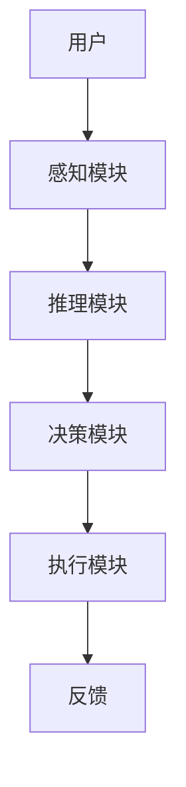
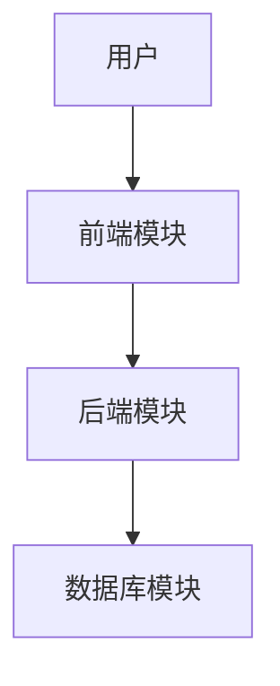

                 


# 《智能衣架：AI Agent的衣物护理建议》

---

## 关键词：  
智能衣架、AI Agent、衣物护理、目标识别、分类算法、系统架构

---

## 摘要：  
本文将探讨智能衣架这一创新概念，结合人工智能技术，深入分析其在衣物护理中的应用场景。通过背景介绍、核心概念、算法原理、系统架构和项目实战等多维度的阐述，展示AI Agent如何赋能衣物护理，为用户提供智能化的衣物管理解决方案。本文旨在为技术爱好者、开发者和相关领域研究者提供理论与实践相结合的深度解析。

---

## 第1章：智能衣架的背景与问题背景

### 1.1 智能衣架的背景介绍  
智能衣架是一种结合人工智能技术的创新产品，旨在通过AI Agent实现衣物的智能化管理与护理。传统的衣物护理方式存在效率低、成本高、难以个性化等问题，而智能衣架通过引入AI技术，能够实现衣物的自动识别、分类、护理建议生成等功能，为用户提供了更加智能化、便捷的衣物管理体验。

#### 1.1.1 衣物护理的传统方式与痛点  
- 传统衣物护理依赖人工操作，效率低下，且难以实现个性化护理。  
- 衣物分类和存储缺乏系统性，容易导致衣物损坏或丢失。  
- 缺乏智能化的护理建议，用户难以根据衣物材质和使用场景选择合适的护理方法。  

#### 1.1.2 AI技术在衣物护理中的应用潜力  
- 利用AI技术，可以实现衣物的自动识别与分类。  
- 通过数据挖掘与分析，为用户提供个性化的护理建议。  
- 结合物联网技术，实现衣物管理的智能化与自动化。  

#### 1.1.3 智能衣架的定义与目标  
智能衣架是一种结合AI技术的衣物管理设备，其目标是通过智能化的方式优化衣物护理流程，提升用户体验。

---

### 1.2 问题背景与问题描述  
智能衣架的核心目标是解决传统衣物护理中的痛点，具体包括以下问题：  
- 衣物分类不清晰，导致护理方法不当。  
- 缺乏智能化的护理建议，用户难以掌握正确的护理方式。  
- 衣物管理缺乏系统性，容易导致衣物损坏或丢失。  

智能衣架需要通过AI技术实现以下目标：  
- 实现衣物的自动识别与分类。  
- 提供个性化的护理建议。  
- 优化衣物的存储与管理流程。  

---

### 1.3 问题解决与核心要素  
智能衣架的核心要素包括：  
1. **AI Agent**：负责衣物的识别、分类和护理建议生成。  
2. **传感器与硬件**：用于采集衣物的状态信息。  
3. **数据库**：存储衣物信息及护理知识库。  
4. **用户界面**：提供友好的交互体验。  

---

## 第2章：AI Agent的核心概念与原理  

### 2.1 AI Agent的基本概念  
AI Agent（智能体）是一种能够感知环境、自主决策并执行任务的智能系统。在智能衣架中，AI Agent负责衣物的识别、分类和护理建议生成。

#### 2.1.1 AI Agent的定义与分类  
- **定义**：AI Agent是一种具有感知、推理、决策和执行能力的智能系统。  
- **分类**：根据功能和应用场景的不同，AI Agent可以分为监督型、无监督型和强化学习型三种类型。  

#### 2.1.2 AI Agent的核心特征  
- **自主性**：能够在没有外部干预的情况下自主运行。  
- **反应性**：能够实时感知环境并做出反应。  
- **目标导向**：以特定目标为导向，优化决策过程。  

#### 2.1.3 AI Agent与传统算法的区别  
- AI Agent具有自主性和目标导向性，而传统算法通常仅用于特定任务。  
- AI Agent能够适应环境变化，而传统算法需要手动调整参数。  

---

### 2.2 AI Agent的感知与推理  
AI Agent的核心能力之一是感知环境并进行推理。  

#### 2.2.1 感知模块的功能与实现  
- **功能**：通过传感器或图像识别技术感知衣物的状态信息。  
- **实现**：使用深度学习模型（如卷积神经网络）进行图像识别。  

#### 2.2.2 推理模块的逻辑与算法  
- **逻辑**：基于感知到的信息，结合知识库进行推理。  
- **算法**：使用概率推理或符号逻辑推理方法。  

#### 2.2.3 知识表示与知识库构建  
- **知识表示**：采用语义网络或规则库的形式表示知识。  
- **知识库构建**：通过数据标注和知识抽取技术构建衣物护理知识库。  

---

### 2.3 AI Agent的决策与执行  
AI Agent的决策能力是其实现智能化的核心。  

#### 2.3.1 决策模块的策略选择  
- **策略选择**：基于推理结果和目标函数选择最优决策。  
- **策略优化**：通过强化学习不断优化决策策略。  

#### 2.3.2 执行模块的实现方式  
- **执行方式**：通过控制硬件设备或输出建议信息实现决策的执行。  

#### 2.3.3 决策与执行的协同机制  
- **协同机制**：通过事件驱动或状态机的方式实现决策与执行的协同。  

---

## 第3章：智能衣架的系统架构与算法实现  

### 3.1 系统架构设计  

#### 3.1.1 系统功能设计  
- **衣物识别与分类**：通过图像识别技术实现衣物的自动分类。  
- **智能护理建议生成**：基于衣物信息和环境数据生成护理建议。  
- **用户交互与反馈**：提供友好的用户界面，并根据用户反馈优化系统。  

#### 3.1.2 系统架构的模块划分  
- **感知模块**：负责衣物的图像采集与特征提取。  
- **推理模块**：负责衣物的分类与知识推理。  
- **决策模块**：负责生成护理建议并控制执行模块。  
- **执行模块**：负责输出护理建议或控制硬件设备。  

#### 3.1.3 系统的整体流程图  


---

### 3.2 算法实现  

#### 3.2.1 目标识别与分类算法  
- **目标识别算法**：使用卷积神经网络（CNN）实现衣物的图像识别。  
- **分类算法**：基于CNN的特征提取，使用支持向量机（SVM）或随机森林（Random Forest）进行分类。  

#### 3.2.2 算法实现的数学模型  
- **卷积神经网络模型**：  
  $$ \text{CNN}(x) = \sigma(W \cdot x + b) $$  
- **分类模型**：  
  $$ \text{SVM}(x) = \text{sign}(w \cdot x + c) $$  

#### 3.2.3 算法实现的代码示例  
```python
import tensorflow as tf
from tensorflow.keras import layers

# 构建卷积神经网络模型
model = tf.keras.Sequential([
    layers.Conv2D(32, (3,3), activation='relu', input_shape=(224, 224, 3)),
    layers.MaxPooling2D((2,2)),
    layers.Conv2D(64, (3,3), activation='relu'),
    layers.MaxPooling2D((2,2)),
    layers.Flatten(),
    layers.Dense(128, activation='relu'),
    layers.Dense(10, activation='softmax')
])
model.compile(optimizer='adam', loss='sparse_categorical_crossentropy', metrics=['accuracy'])
```

---

## 第4章：智能衣架的系统架构设计  

### 4.1 系统架构设计  

#### 4.1.1 系统架构的模块划分  
- **前端模块**：负责用户交互与数据展示。  
- **后端模块**：负责数据处理与业务逻辑。  
- **数据库模块**：负责数据的存储与管理。  

#### 4.1.2 系统架构的mermaid图  


---

## 第5章：智能衣架的项目实战  

### 5.1 项目实战  

#### 5.1.1 环境安装  
- **Python**：安装Python 3.8及以上版本。  
- **依赖库**：安装TensorFlow、Keras、OpenCV等库。  

#### 5.1.2 系统核心实现  
```python
import cv2
import numpy as np

def image_preprocessing(image):
    # 图像预处理代码
    return preprocessed_image

def model_predict(image):
    # 使用预训练模型进行预测
    prediction = model.predict(image)
    return prediction

# 主函数
def main():
    image = cv2.imread("input.jpg")
    preprocessed_image = image_preprocessing(image)
    prediction = model_predict(preprocessed_image)
    print("Prediction result:", prediction)

if __name__ == "__main__":
    main()
```

---

## 第6章：智能衣架的最佳实践  

### 6.1 最佳实践  

#### 6.1.1 小结  
智能衣架通过AI Agent实现了衣物的智能化管理与护理，为用户提供了更加便捷和高效的衣物管理体验。  

#### 6.1.2 注意事项  
- 确保系统的数据安全与隐私保护。  
- 定期更新模型以提升识别与分类的准确性。  

#### 6.1.3 拓展阅读  
- 《深度学习入门》  
- 《人工智能与物联网》  

---

## 总结  

智能衣架作为AI技术在衣物护理领域的重要应用，通过AI Agent实现了衣物的智能化管理与护理。本文从背景、核心概念、算法原理、系统架构和项目实战等多个维度进行了深入分析，为读者提供了理论与实践相结合的深度解析。希望本文能够为相关领域的研究者和开发者提供有价值的参考。

