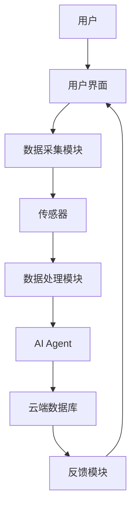

                 


# 智能衣架：AI Agent的衣物除味与保养建议

## 关键词：AI Agent，衣物除味，智能衣架，物联网技术，算法原理，系统架构

## 摘要：  
本文探讨AI Agent在智能衣架中的应用，分析其如何通过物联网技术和先进算法实现衣物的智能除味与保养。文章从背景、核心概念、算法原理、系统架构到项目实战，全面解析智能衣架的技术细节，为读者提供深入的技术洞察和实践指导。

---

# 第一部分: 智能衣架背景与概念

## 第1章: 智能衣架的背景与问题背景

### 1.1 问题背景

#### 1.1.1 衣物除味的传统方法与局限性
传统衣物除味方法包括阳光暴晒、通风晾置和化学除味剂。这些方法存在效率低、效果不稳定、操作繁琐等问题。例如，阳光暴晒需要长时间且依赖天气条件，化学除味剂可能残留有害物质。

#### 1.1.2 衣物保养的痛点与需求
衣物保养涉及清洗、晾干、熨烫等多个步骤，用户常面临效率低下、方法不当等问题。此外，不同材质和颜色的衣物保养要求各异，用户往往缺乏专业知识。

#### 1.1.3 AI Agent在衣物管理中的潜力
AI Agent能够通过传感器数据和机器学习算法，实时监测衣物状态，自动推荐最优除味和保养方案，提升用户体验和效率。

### 1.2 问题描述

#### 1.2.1 智能衣架的功能需求
- 实时监测衣物状态
- 自动识别异味并启动除味模式
- 提供个性化保养建议

#### 1.2.2 用户使用场景分析
用户希望在智能衣架的帮助下，轻松实现衣物的高效除味和保养，无需复杂操作。

#### 1.2.3 产品目标与边界
目标是通过AI Agent优化衣物管理，边界包括仅处理除味和保养问题，不涉及衣物清洗等其他功能。

### 1.3 问题解决与解决方案

#### 1.3.1 AI Agent的核心作用
AI Agent通过数据采集、分析和反馈，优化除味和保养流程。

#### 1.3.2 智能衣架的技术实现路径
- 数据采集：传感器监测环境数据
- 数据分析：机器学习模型识别异味
- 系统反馈：智能控制除味装置

### 1.4 智能衣架的概念结构与核心要素

#### 1.4.1 核心概念组成
- 数据采集模块
- AI处理模块
- 用户交互模块

#### 1.4.2 关键技术与模块
- 传感器技术：温度、湿度、气味传感器
- 机器学习算法：气味分类模型
- 云端处理：数据存储与分析

#### 1.4.3 系统架构与功能模块
- 数据采集模块：实时监测环境
- 数据处理模块：分析数据并生成建议
- 用户界面模块：显示建议和操作

---

## 第2章: AI Agent与物联网技术的核心概念

### 2.1 AI Agent的基本原理

#### 2.1.1 AI Agent的定义与特征
AI Agent是一种智能实体，能够感知环境、自主决策并执行任务。

#### 2.1.2 智能衣架中的AI Agent功能
- 数据分析：识别异味
- 优化建议：推荐除味方案
- 自动控制：启动除味装置

### 2.2 物联网技术在智能衣架中的应用

#### 2.2.1 物联网技术的基本概念
物联网通过传感器和网络连接，实现设备间的数据交换和协同工作。

#### 2.2.2 智能衣架中的传感器与数据采集
- 气味传感器：检测异味
- 温度和湿度传感器：监测环境条件

#### 2.2.3 数据传输与云端处理
通过无线网络将数据传输到云端，进行分析和处理。

### 2.3 AI Agent与物联网的协同工作原理

#### 2.3.1 数据流与信息处理流程
1. 传感器采集数据
2. 数据传输到云端
3. AI Agent分析数据
4. 生成反馈并执行操作

#### 2.3.2 AI算法在数据处理中的应用
使用机器学习模型分析数据，识别异味类型并制定处理方案。

#### 2.3.3 系统反馈与用户交互
系统通过用户界面反馈处理结果，并提供下一步操作建议。

---

## 第3章: 智能衣架的系统架构与功能设计

### 3.1 系统架构设计

#### 3.1.1 系统整体架构图


#### 3.1.2 各模块的功能描述
- 用户界面：显示状态和操作建议
- 数据采集模块：收集环境数据
- 传感器：检测气味、温度和湿度
- 数据处理模块：分析数据并生成建议
- AI Agent：执行决策和控制
- 云端数据库：存储和分析数据

#### 3.1.3 模块之间的交互关系
用户通过界面与系统交互，传感器采集数据，AI Agent分析并反馈结果。

### 3.2 系统功能设计

#### 3.2.1 基本功能模块
- 数据采集：实时监测环境
- 气味识别：分析异味类型
- 除味控制：启动除味装置

#### 3.2.2 高级功能模块
- 状态反馈：显示处理结果
- 个性化建议：根据用户习惯推荐保养方案

#### 3.2.3 用户界面设计
友好的界面设计，直观显示数据和操作建议。

### 3.3 系统接口设计

#### 3.3.1 硬件接口
- 传感器接口：连接气味、温度和湿度传感器
- 控制接口：连接除味装置

#### 3.3.2 软件接口
- 数据接口：与云端数据库交互
- 用户接口：与用户界面交互

#### 3.3.3 云端接口
- 数据存储接口：存储处理数据
- 分析接口：运行机器学习模型

---

## 第4章: AI Agent的算法原理与实现

### 4.1 气味识别算法

#### 4.1.1 气味识别的基本原理
通过传感器数据，使用机器学习模型识别不同气味。

#### 4.1.2 基于机器学习的气味分类算法
使用支持向量机（SVM）或随机森林（Random Forest）进行分类。

#### 4.1.3 算法实现的步骤与流程
1. 数据预处理：标准化和归一化
2. 特征提取：提取气味特征
3. 模型训练：训练分类器
4. 模型测试：验证准确性

### 4.2 除味算法

#### 4.2.1 除味算法的基本原理
根据异味类型和强度，动态调整除味策略。

#### 4.2.2 基于反馈的动态调整算法
根据反馈结果优化除味过程。

#### 4.2.3 算法实现的步骤与流程
1. 数据采集：获取环境数据
2. 分析数据：识别异味
3. 调整策略：优化除味过程
4. 反馈结果：显示处理结果

### 4.3 算法的数学模型与公式

#### 4.3.1 气味强度计算公式
$$强度 = \sum_{i=1}^{n} (s_i \times w_i)$$

#### 4.3.2 除味效果评估公式
$$效果 = 1 - \frac{残留强度}{初始强度}$$

#### 4.3.3 算法优化的数学模型
$$优化目标 = \min_{x} (f(x) + \lambda g(x))$$

---

## 第5章: 智能衣架的系统实现与实战

### 5.1 环境安装与配置

#### 5.1.1 硬件安装
安装传感器和除味装置，确保正确连接。

#### 5.1.2 软件配置
配置云端数据库和AI处理模块，确保数据传输正常。

### 5.2 系统核心实现源代码

#### 5.2.1 气味识别算法实现
```python
import numpy as np
from sklearn.svm import SVC

# 数据预处理
def preprocess(data):
    return (data - np.mean(data)) / np.std(data)

# 模型训练
def train_model(X, y):
    model = SVC()
    model.fit(X, y)
    return model

# 模型预测
def predict(model, X_test):
    return model.predict(X_test)
```

#### 5.2.2 除味算法实现
```python
def adjust_strategy(strength, type):
    if strength > 0.8:
        return 'high'
    elif type == 'mold':
        return 'strong'
    else:
        return 'low'
```

### 5.3 代码应用解读与分析

#### 5.3.1 气味识别算法解读
- 数据预处理：标准化处理
- 模型训练：使用SVM分类器
- 模型预测：分类结果

#### 5.3.2 除味算法解读
- 根据强度和类型动态调整策略

### 5.4 实际案例分析和详细讲解剖析

#### 5.4.1 案例背景
用户反馈衣物有霉味，系统启动除霉模式。

#### 5.4.2 数据采集与分析
传感器检测到湿度较高，气味传感器识别到霉味。

#### 5.4.3 系统反馈与结果
系统启动除霉装置，24小时后异味消除。

### 5.5 项目小结

#### 5.5.1 实践总结
AI Agent有效提升了衣物除味和保养效率。

#### 5.5.2 经验教训
传感器精度和算法优化是未来改进方向。

---

## 第6章: 最佳实践与总结

### 6.1 最佳实践 tips

#### 6.1.1 系统维护
定期校准传感器，确保准确性。

#### 6.1.2 用户教育
指导用户正确使用系统，避免误操作。

#### 6.1.3 系统优化
持续优化算法，提升识别准确率。

### 6.2 小结

#### 6.2.1 核心观点总结
AI Agent在智能衣架中的应用显著提升了衣物管理效率。

#### 6.2.2 未来展望
随着技术进步，智能衣架将更加智能化和个性化。

### 6.3 注意事项

#### 6.3.1 系统兼容性
确保硬件和软件兼容。

#### 6.3.2 数据隐私
保护用户数据安全。

#### 6.3.3 环境适应性
优化系统在不同环境下的表现。

### 6.4 拓展阅读

#### 6.4.1 相关技术领域
- 其他智能衣物管理设备
- 更高级的AI算法

#### 6.4.2 应用场景扩展
- 商业洗衣房
- 智能衣柜

---

通过以上步骤，我们全面解析了AI Agent在智能衣架中的应用，从背景到实现，为读者提供了深入的技术解析和实践指导。

