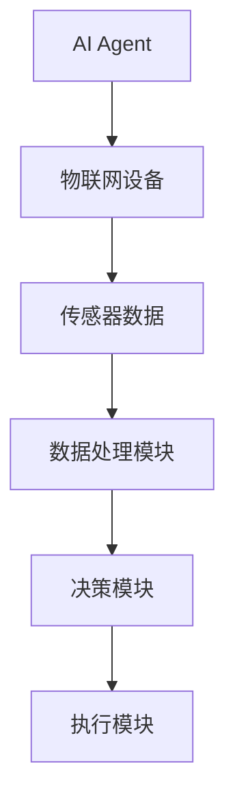

                 

## 《智能衣架：AI Agent的衣物除味系统》

### 关键词：智能衣架, AI Agent, 物联网, 衣物除味, 传感器, 数据分析

### 摘要：  
《智能衣架：AI Agent的衣物除味系统》是一本深入探讨AI代理在衣物除味系统中应用的技术博客文章。文章从背景介绍、核心概念、算法原理到系统架构，再到项目实战和最佳实践，全面解析了如何利用AI技术解决衣物除味问题。通过结合物联网技术，文章展示了如何设计一个高效、智能的衣物除味系统，为智能家居领域提供了新的思路。

---

### 第一部分: 背景介绍与核心概念

#### 第1章: 智能衣架的背景与问题背景

##### 1.1 问题背景

###### 1.1.1 衣物除味的重要性  
衣物在日常生活中扮演着重要角色，但衣物上的异味问题却一直困扰着人们。异味不仅影响穿着体验，还可能对身体健康造成潜在危害。传统的除味方法（如喷洒化学除味剂、晾晒等）存在效率低、效果有限、可能对人体或环境造成伤害等问题。

###### 1.1.2 传统衣物除味方法的局限性  
传统的除味方法依赖于化学喷雾或自然晾晒，但这些方法存在以下问题：  
- **化学喷雾**：可能对人体健康和环境造成负面影响。  
- **自然晾晒**：依赖天气条件，效率低下。  
- **手动操作**：需要用户手动操作，不够便捷。  

###### 1.1.3 智能化除味的需求与趋势  
随着智能家居和物联网技术的普及，用户对智能化、自动化除味的需求日益增长。智能衣架通过结合AI代理和物联网技术，能够实时感知环境并自动执行除味操作，满足了用户对高效、便捷、健康的除味需求。

##### 1.2 问题描述

###### 1.2.1 衣物除味的核心问题  
智能衣架的核心问题是如何通过传感器和AI代理实时感知衣物状态，并自动启动除味操作。  
- **传感器数据采集**：通过传感器获取衣物的状态信息（如湿度、温度、气味强度等）。  
- **智能决策**：基于传感器数据，AI代理决定是否启动除味功能。  
- **执行操作**：通过执行机构（如紫外线灯、气泵等）完成除味操作。  

###### 1.2.2 智能衣架的功能需求  
智能衣架需要具备以下功能：  
- **实时监测**：通过传感器实时监测衣物状态。  
- **智能决策**：基于监测数据，AI代理做出决策。  
- **自动执行**：根据决策结果，自动启动除味功能。  
- **用户反馈**：通过手机APP或LED显示反馈除味状态。  

###### 1.2.3 用户痛点与市场分析  
- **用户痛点**：  
  - 现有除味方法效率低、效果差。  
  - 手动操作麻烦，用户体验差。  
- **市场分析**：  
  - 智能家居市场快速增长，用户对智能化家居设备的需求日益增加。  
  - 智能衣架作为智能家居的一部分，具有广阔的市场前景。  

##### 1.3 问题解决思路

###### 1.3.1 AI Agent在衣物除味中的应用  
AI代理在智能衣架中的应用主要体现在以下几个方面：  
- **状态感知**：通过传感器实时感知衣物状态。  
- **智能决策**：基于感知数据，AI代理做出是否启动除味的决策。  
- **自适应优化**：通过学习用户习惯和环境变化，优化除味策略。  

###### 1.3.2 物联网技术的整合  
物联网技术为智能衣架提供了数据传输和远程控制的可能：  
- **数据传输**：通过Wi-Fi或蓝牙将传感器数据传输到云端或手机APP。  
- **远程控制**：用户可以通过手机APP远程启动或关闭除味功能。  
- **数据存储与分析**：云端存储传感器数据，通过大数据分析优化除味策略。  

###### 1.3.3 多传感器融合的解决方案  
通过融合多种传感器（如温湿度传感器、气味传感器、光照传感器等），智能衣架可以更准确地感知衣物状态，并做出更精准的决策。  

##### 1.4 边界与外延

###### 1.4.1 智能衣架的功能边界  
智能衣架的主要功能是除味，不涉及衣物的存储、分类等其他功能。  

###### 1.4.2 与其他智能家居设备的协同  
智能衣架可以与其他智能家居设备协同工作，例如：  
- **智能空调**：根据衣物除味需求调节室内温湿度。  
- **智能灯**：通过光照辅助除味。  

###### 1.4.3 未来可能的扩展方向  
- **智能化分类**：通过图像识别技术对衣物进行分类。  
- **健康监测**：通过传感器监测衣物的健康状态（如霉菌生长）。  
- **能源优化**：通过优化除味策略降低能耗。  

##### 1.5 概念结构与核心要素

###### 1.5.1 核心概念组成  
- **AI代理**：负责感知、决策和执行。  
- **物联网技术**：负责数据传输和远程控制。  
- **传感器**：负责数据采集。  
- **执行机构**：负责实际除味操作。  

###### 1.5.2 系统架构的核心要素  
- **传感器模块**：温湿度传感器、气味传感器等。  
- **数据处理模块**：数据采集、分析和存储。  
- **AI决策模块**：基于传感器数据做出决策。  
- **执行模块**：启动除味功能。  

###### 1.5.3 功能模块的逻辑关系  
传感器模块采集数据 → 数据处理模块分析数据 → AI决策模块做出决策 → 执行模块执行操作。

---

#### 第2章: AI Agent与物联网技术的核心概念

##### 2.1 AI Agent的基本原理

###### 2.1.1 AI Agent的定义与分类  
AI代理（AI Agent）是指能够感知环境、自主决策并执行任务的智能实体。根据智能水平，AI代理可以分为基于规则的代理和基于学习的代理。  

###### 2.1.2 基于规则的AI Agent  
基于规则的AI代理通过预定义的规则进行决策。例如：  
- 如果湿度 > 60% 且气味强度 > 5，启动除味功能。  

###### 2.1.3 基于学习的AI Agent  
基于学习的AI代理通过机器学习模型（如神经网络）进行决策。例如：  
- 使用训练好的分类模型预测是否需要启动除味功能。  

##### 2.2 物联网技术的核心原理

###### 2.2.1 物联网的基本架构  
物联网的基本架构包括：  
- **感知层**：通过传感器采集数据。  
- **网络层**：通过通信网络传输数据。  
- **应用层**：处理数据并提供服务。  

###### 2.2.2 传感器与数据采集  
传感器是物联网的核心组件，常用的传感器包括：  
- **温湿度传感器**：检测衣物的温湿度。  
- **气味传感器**：检测衣物的气味强度。  

###### 2.2.3 数据传输与处理  
通过Wi-Fi或蓝牙将传感器数据传输到云端或手机APP，进行数据存储和分析。  

##### 2.3 AI Agent与物联网的结合

###### 2.3.1 数据融合与智能决策  
通过融合多种传感器数据，AI代理可以做出更精准的决策。例如：  
- 如果湿度 > 60% 且气味传感器检测到异味，启动除味功能。  

###### 2.3.2 实时反馈与自适应优化  
AI代理可以根据实时数据不断优化除味策略。例如：  
- 根据历史数据调整除味阈值。  

###### 2.3.3 系统的可扩展性与灵活性  
通过模块化设计，智能衣架可以方便地扩展功能。例如：  
- 增加光照传感器，通过光照辅助除味。  

---

#### 第3章: 核心概念的原理与联系

##### 3.1 AI Agent的核心原理

###### 3.1.1 状态感知与环境建模  
AI代理通过传感器数据建立环境模型，并根据模型做出决策。例如：  
- 根据温湿度和气味数据，建立衣物状态模型。  

###### 3.1.2 行为决策与执行  
AI代理根据环境模型做出决策，并通过执行机构执行操作。例如：  
- 决策启动除味功能，通过紫外线灯照射除味。  

###### 3.1.3 自适应学习与优化  
AI代理通过机器学习模型不断优化决策策略。例如：  
- 使用强化学习算法优化除味阈值。  

##### 3.2 物联网技术的核心原理

###### 3.2.1 传感器数据采集  
物联网通过传感器采集环境数据，并通过网络传输到云端或手机APP。  

###### 3.2.2 数据传输与网络通信  
通过Wi-Fi或蓝牙等通信技术，将传感器数据传输到云端或手机APP。  

###### 3.2.3 数据处理与存储  
云端接收数据后，进行数据存储和分析，为AI代理提供决策支持。  

##### 3.3 核心概念的联系与对比

###### 3.3.1 AI Agent与物联网技术的对比  
| 特性          | AI Agent                | 物联网技术              |  
|---------------|-------------------------|--------------------------|  
| 核心功能      | 感知、决策、执行         | 数据采集、传输、存储     |  
| 依赖          | 数据分析与学习          | 传感器与通信网络         |  
| 应用场景      | 智能决策与自动化控制     | 数据传输与远程控制       |  

###### 3.3.2 核心概念的属性特征对比  
| 属性          | AI Agent                | 物联网技术              |  
|---------------|-------------------------|--------------------------|  
| 感知能力      | 强                     | 弱                       |  
| 决策能力      | 强                     | 无                       |  
| 执行能力      | 强                     | 弱                       |  

###### 3.3.3 ER实体关系图架构  

---

通过以上思考，我可以开始撰写完整的文章内容。每个章节都需要详细展开，包括背景介绍、核心概念、算法原理、系统架构、项目实战和最佳实践。我会按照逻辑顺序，逐步深入讲解每个部分的核心内容，确保文章内容丰富、条理清晰、易于理解。

