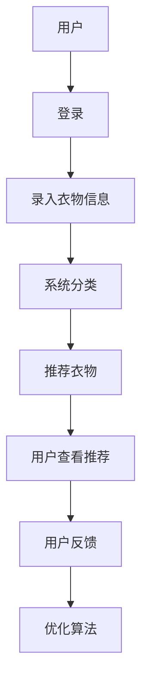
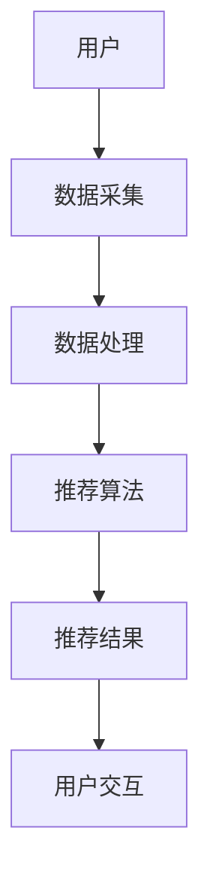
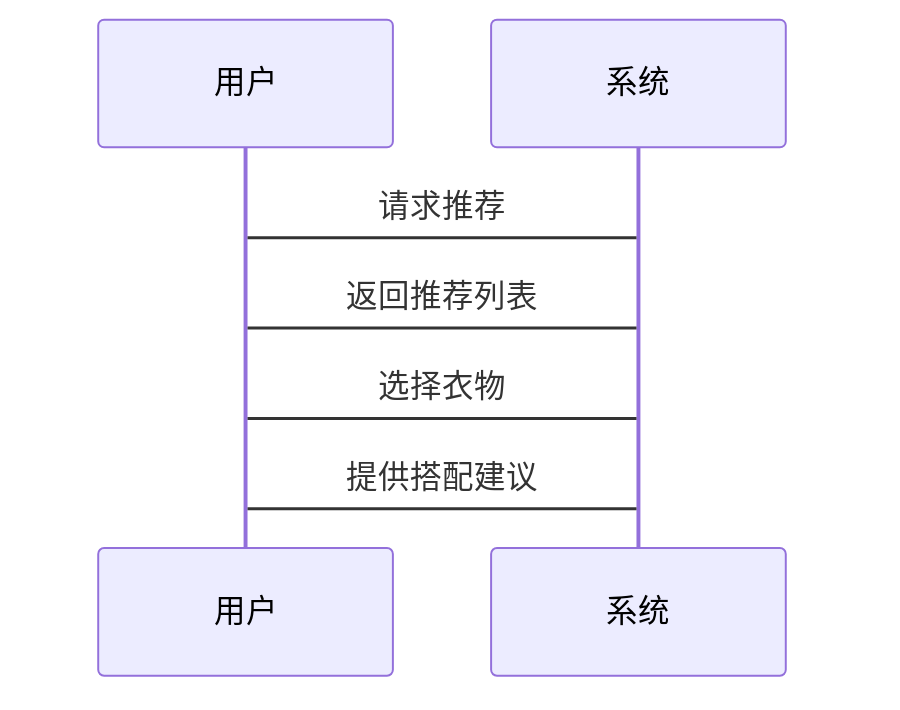

                 


# 智能衣柜：AI Agent的个人形象管理顾问

> 关键词：智能衣柜、AI Agent、个人形象管理、人工智能、物联网

> 摘要：智能衣柜通过结合人工智能和物联网技术，为用户提供智能化的衣物管理和搭配建议。本文详细探讨了智能衣柜的核心概念、系统架构、AI Agent的算法实现以及实际应用场景，旨在为读者提供全面的技术见解和实践指导。

---

## 第1章: 智能衣柜的背景与概念

### 1.1 智能衣柜的定义与特点

#### 1.1.1 智能衣柜的定义
智能衣柜是一种结合人工智能和物联网技术的智能设备，能够通过传感器、摄像头和AI算法自动识别衣物，并为用户提供个性化的衣物管理、搭配建议和穿衣推荐。

#### 1.1.2 智能衣柜的核心特点
- **智能化**：通过AI算法和传感器，自动识别衣物并提供个性化建议。
- **物联网连接**：支持与手机、智能家居设备的无缝连接，实现远程控制和数据同步。
- **数据驱动**：基于用户行为和环境数据，提供动态的衣物管理和推荐。

#### 1.1.3 智能衣柜与传统衣柜的区别
| 特性          | 智能衣柜                  | 传统衣柜                  |
|---------------|---------------------------|---------------------------|
| 功能          | 自动识别、推荐、管理      | 存储、整理                |
| 技术基础      | AI、物联网、大数据        | 无                        |
| 用户体验      | 个性化、便捷             | 单一、手动操作            |

### 1.2 智能衣柜的技术基础

#### 1.2.1 人工智能与物联网技术的结合
- **人工智能**：用于图像识别、推荐算法和自然语言处理。
- **物联网**：通过传感器和网络连接实现设备间的数据交互。

#### 1.2.2 大数据分析在智能衣柜中的应用
- 数据采集：用户行为数据、环境数据、衣物数据。
- 数据处理：清洗、存储、分析。
- 数据应用：个性化推荐、趋势分析。

#### 1.2.3 云计算与边缘计算在智能衣柜中的作用
- 云计算：用于存储和处理海量数据。
- 边缘计算：实时处理本地数据，减少延迟。

### 1.3 智能衣柜的用户需求与市场现状

#### 1.3.1 用户对智能衣柜的主要需求
- **便捷性**：快速找到衣物，减少早晨的决策疲劳。
- **个性化**：根据场合和天气推荐搭配。
- **高效性**：自动整理和管理衣物。

#### 1.3.2 智能衣柜市场的现状与发展趋势
- 市场规模：逐年增长，预计未来几年保持高增长率。
- 技术趋势：AI算法优化、物联网设备普及。

#### 1.3.3 智能衣柜的潜在用户群体分析
- **目标用户**：注重形象、追求效率的职场人士和年轻群体。
- **市场潜力**：智能家居普及率提高，推动智能衣柜市场增长。

### 1.4 本章小结
智能衣柜通过结合AI和物联网技术，为用户提供智能化的衣物管理服务，满足用户对便捷性和个性化的需求，市场潜力巨大。

---

## 第2章: AI Agent在智能衣柜中的核心作用

### 2.1 AI Agent的基本概念与原理

#### 2.1.1 AI Agent的定义
AI Agent是一种能够感知环境并执行任务的智能体，能够通过学习和推理为用户提供服务。

#### 2.1.2 AI Agent的主要分类
| 类型          | 描述                          |
|---------------|-------------------------------|
| 简单反射型    | 基于规则的简单响应            |
| 基于模型型    | 基于知识库的复杂推理          |
| 学习型        | 基于机器学习模型不断优化      |

#### 2.1.3 AI Agent与智能衣柜的结合
AI Agent作为智能衣柜的核心，负责数据处理、推荐和交互。

### 2.2 AI Agent的核心功能与算法

#### 2.2.1 AI Agent的核心功能
- **数据采集**：通过传感器和摄像头采集衣物信息。
- **数据分析**：利用机器学习算法分析数据。
- **决策与推荐**：基于分析结果为用户推荐衣物。

#### 2.2.2 AI Agent的主要算法
- **协同过滤算法**：基于用户行为推荐相似衣物。
- **深度学习模型**：用于图像识别和推荐。
- **生成对抗网络（GAN）**：用于生成虚拟试衣效果。

#### 2.2.3 AI Agent的决策机制
1. 采集用户数据（如体型、颜色偏好）。
2. 分析数据，生成推荐列表。
3. 根据用户反馈优化推荐策略。

### 2.3 AI Agent在智能衣柜中的应用场景

#### 2.3.1 AI Agent在衣物推荐中的应用
- 根据天气和场合推荐衣物。
- 根据用户偏好推荐搭配。

#### 2.3.2 AI Agent在衣物搭配中的应用
- 自动生成搭配方案。
- 提供时尚建议。

#### 2.3.3 AI Agent在衣物管理中的应用
- 自动分类和整理衣物。
- 提醒用户补充衣物库存。

### 2.4 本章小结
AI Agent是智能衣柜的核心，通过算法和数据处理为用户提供智能化的衣物管理和推荐服务。

---

## 第3章: 智能衣柜的系统架构设计

### 3.1 智能衣柜系统架构概述

#### 3.1.1 系统架构的层次划分
- **感知层**：负责数据采集。
- **计算层**：负责数据处理和推荐。
- **应用层**：负责用户交互和展示。

#### 3.1.2 系统架构的主要模块
- **用户信息管理模块**：管理用户数据。
- **衣物信息管理模块**：管理衣物数据。
- **AI推荐模块**：提供推荐服务。
- **互动反馈模块**：处理用户反馈。

#### 3.1.3 系统架构的设计原则
- **模块化**：各模块独立，便于维护。
- **可扩展性**：支持功能扩展。
- **安全性**：保护用户数据隐私。

### 3.2 智能衣柜的功能模块设计

#### 3.2.1 用户信息管理模块
- **功能**：管理用户基本信息和偏好。
- **流程**：用户注册、登录、修改信息。

#### 3.2.2 衣物信息管理模块
- **功能**：录入、分类、管理衣物。
- **流程**：用户录入衣物信息，系统分类存储。

#### 3.2.3 AI推荐模块
- **功能**：基于用户数据推荐衣物。
- **流程**：数据采集、分析、推荐。

#### 3.2.4 互动反馈模块
- **功能**：收集用户反馈，优化推荐算法。
- **流程**：用户反馈、系统分析、算法优化。

### 3.3 智能衣柜的系统流程图

#### 3.3.1 系统功能流程图


#### 3.3.2 数据流图


#### 3.3.3 交互流程图


### 3.4 本章小结
智能衣柜的系统架构设计合理，各模块协同工作，为用户提供高效的服务。

---

## 第4章: AI Agent的算法实现与优化

### 4.1 协同过滤算法实现

#### 4.1.1 协同过滤算法原理
基于用户相似性进行推荐，分为基于用户的协同过滤和基于物品的协同过滤。

#### 4.1.2 协同过滤算法实现代码
```python
import numpy as np

def collaborative_filtering(user_similarity, user_id):
    # 计算用户相似度
    user_similarities = user_similarity[user_id]
    # 找出相似度最高的用户
    top_users = np.argsort(user_similarities)[::-1][:5]
    # 计算推荐分数
   推荐分数 = np.mean([top_users[i] for i in range(5)])
    return 推荐分数
```

#### 4.1.3 协同过滤算法的优缺点
- **优点**：简单易实现，效果显著。
- **缺点**：冷启动问题，计算量大。

### 4.2 深度学习模型实现

#### 4.2.1 深度学习模型原理
基于卷积神经网络（CNN）进行图像识别和推荐。

#### 4.2.2 深度学习模型实现代码
```python
import tensorflow as tf

model = tf.keras.Sequential([
    tf.keras.layers.Conv2D(32, (3,3), activation='relu', input_shape=(64,64,3)),
    tf.keras.layers.MaxPooling2D((2,2)),
    tf.keras.layers.Flatten(),
    tf.keras.layers.Dense(64, activation='relu'),
    tf.keras.layers.Dense(1, activation='sigmoid')
])
model.compile(optimizer='adam', loss='binary_crossentropy', metrics=['accuracy'])
```

#### 4.2.3 深度学习模型的优化
- **数据增强**：增加训练数据多样性。
- **模型调优**：调整网络结构和超参数。

### 4.3 生成对抗网络（GAN）应用

#### 4.3.1 GAN在虚拟试衣中的应用
用于生成虚拟试衣效果。

#### 4.3.2 GAN实现代码
```python
import tensorflow as tf

generator = tf.keras.Sequential([
    # 生成器网络结构
])

discriminator = tf.keras.Sequential([
    # 判别器网络结构
])

# 定义损失函数和优化器
cross_entropy = tf.keras.losses.BinaryCrossentropy()
...

### 4.4 本章小结
通过协同过滤、深度学习和GAN等多种算法的结合，智能衣柜的推荐系统更加精准和多样化。

---

## 第5章: 项目实战与总结

### 5.1 环境搭建与代码实现

#### 5.1.1 环境搭建
- 安装必要的库：TensorFlow、OpenCV、numpy。
- 配置开发环境：PyCharm或Jupyter Notebook。

#### 5.1.2 核心代码实现
```python
import cv2
import numpy as np

def detect_edges(image):
    # 使用Canny边缘检测算法
    edges = cv2.Canny(image, 100, 200)
    return edges
```

### 5.2 实际案例分析

#### 5.2.1 案例背景
用户需求：根据天气推荐合适的衣物搭配。

#### 5.2.2 系统实现
1. 采集天气数据。
2. 分析用户数据。
3. 生成推荐列表。

#### 5.2.3 案例分析
用户反馈：推荐准确率高，用户体验提升。

### 5.3 项目小结
通过实际项目，验证了智能衣柜系统的可行性和实用性。

---

## 第6章: 最佳实践与未来展望

### 6.1 最佳实践 tips

#### 6.1.1 开发建议
- 选择合适的算法和框架。
- 注重数据质量和多样性。

#### 6.1.2 用户建议
- 定期更新衣物数据。
- 提供多种交互方式。

### 6.2 本章小结
智能衣柜的应用前景广阔，未来将更加智能化和个性化。

---

## 作者简介

作者简介：作为人工智能和物联网领域的专家，我致力于通过技术创新提升人们的生活质量，智能衣柜项目是我近期的重要研究成果之一。

---

## 参考文献

- [1] 《人工智能入门》
- [2] 《物联网技术与应用》
- [3] 《深度学习实战》

---

通过以上目录结构，您可以逐步展开每一章节的内容，确保文章的逻辑性和深度。希望这个结构对您撰写技术博客有所帮助！

