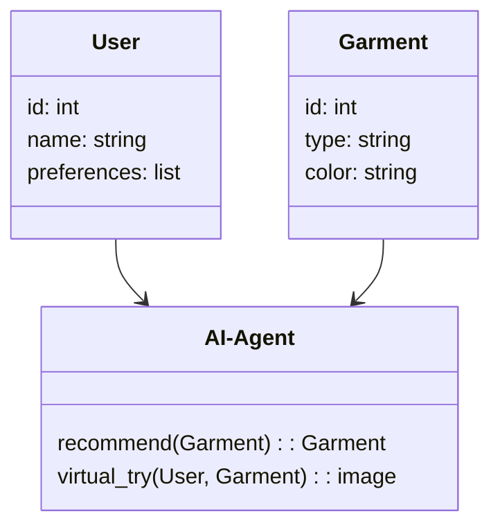
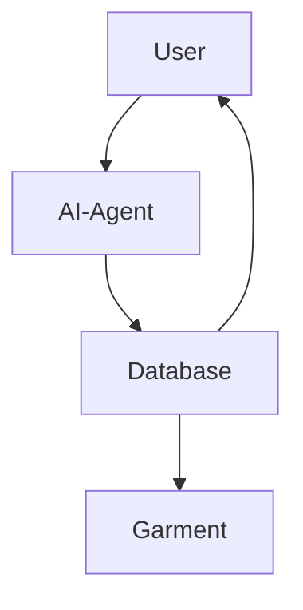
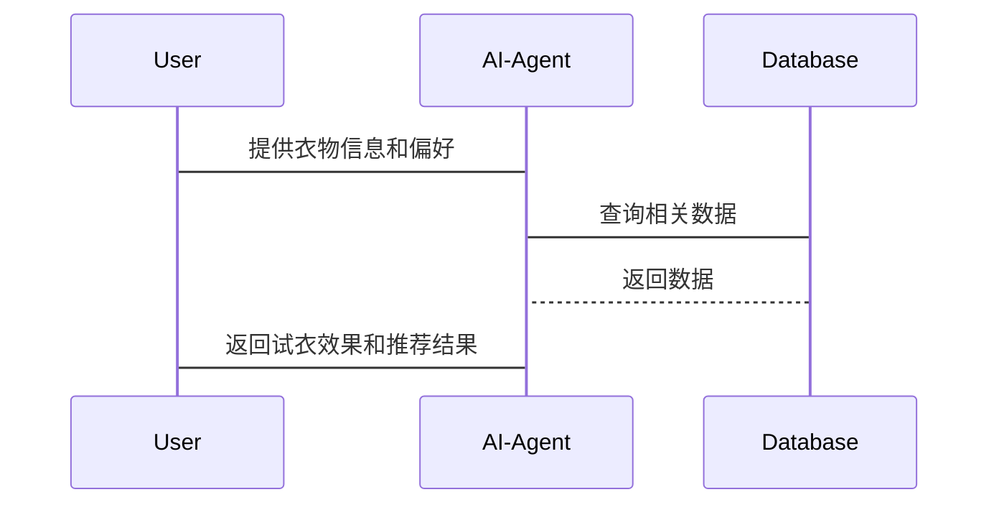

                 


# 智能衣柜：AI Agent的虚拟试衣与搭配建议

## 关键词：智能衣柜，AI Agent，虚拟试衣，个性化搭配，推荐系统

## 摘要：智能衣柜通过AI Agent技术实现虚拟试衣与个性化搭配建议，利用计算机视觉、机器学习等技术提升用户体验。本文深入分析其核心概念、算法实现及系统设计，探讨实际应用中的挑战与解决方案。

---

# 第一部分: 智能衣柜的背景与核心概念

## 第1章: 智能衣柜概述

### 1.1 智能衣柜的概念与背景

#### 1.1.1 传统衣柜的痛点与局限
传统衣柜存在以下问题：
- **空间利用不足**：衣物混放导致空间浪费，查找不便。
- **搭配困难**：用户难以快速找到合适的搭配。
- **个性化不足**：无法根据个人风格推荐衣物。

#### 1.1.2 AI技术在服装领域的应用潜力
AI技术在服装领域的应用包括：
- **虚拟试衣**：通过图像处理技术让用户在线试衣。
- **个性化推荐**：基于用户数据推荐衣物。
- **搭配建议**：AI生成衣物搭配方案。

#### 1.1.3 智能衣柜的定义与目标
**智能衣柜**：通过AI技术实现衣物管理、虚拟试衣和个性化搭配建议的智能系统。目标是提升用户体验，优化衣物管理和搭配效率。

### 1.2 智能衣柜的核心功能

#### 1.2.1 虚拟试衣功能
- 用户上传照片，AI生成试衣效果。
- 支持多角度查看，提升试衣体验。

#### 1.2.2 个性化搭配建议
- 基于用户数据推荐搭配方案。
- 提供多种风格选择，满足个性化需求。

#### 1.2.3 智能推荐系统
- 根据用户行为和偏好推荐衣物。
- 实现实时更新，确保推荐的准确性。

### 1.3 智能衣柜的用户需求分析

#### 1.3.1 用户需求层次划分
- **基本需求**：试衣功能、搭配建议。
- **进阶需求**：个性化推荐、数据同步。

#### 1.3.2 不同用户群体的需求特点
- **普通用户**：简单试衣和搭配需求。
- **时尚爱好者**：个性化和多样化的搭配需求。

#### 1.3.3 需求与功能的对应关系
| 用户需求          | 对应功能             |
|-------------------|--------------------|
| 虚拟试衣          | 虚拟试衣功能         |
| 个性化搭配        | 搭配建议功能         |
| 智能推荐          | 智能推荐系统         |

### 1.4 本章小结
本章介绍了智能衣柜的概念、核心功能及用户需求，为后续技术实现奠定了基础。

---

# 第二部分: AI Agent的核心原理与技术

## 第2章: AI Agent的基本原理

### 2.1 AI Agent的定义与分类

#### 2.1.1 AI Agent的定义
**AI Agent**：智能体，能够感知环境并做出决策以实现目标的实体。

#### 2.1.2 分类与应用场景
- **分类**：
  - **简单反射型**：基于规则的反应。
  - **基于模型的反应式**：基于环境模型做出反应。
  - **目标驱动型**：以目标为导向。
- **应用场景**：智能衣柜中的虚拟试衣和搭配建议。

### 2.2 AI Agent的核心技术

#### 2.2.1 机器学习算法
- **监督学习**：基于标记数据进行训练。
- **无监督学习**：从数据中发现模式。
- **强化学习**：通过奖励机制优化决策。

#### 2.2.2 自然语言处理
- **文本理解**：解析用户需求。
- **对话生成**：与用户进行自然对话。

#### 2.2.3 计算机视觉
- **图像识别**：识别衣物特征。
- **图像生成**：生成试衣效果。

### 2.3 AI Agent的决策机制

#### 2.3.1 基于规则的决策
- **规则定义**：如“深色衣物搭配浅色鞋子”。
- **优点**：简单易实现，但灵活性差。

#### 2.3.2 基于数据驱动的决策
- **机器学习模型**：基于数据训练模型。
- **优点**：灵活性高，适应性强。

#### 2.3.3 混合决策模型
- **结合规则和数据驱动**：兼顾灵活性和准确性。

### 2.4 本章小结
本章分析了AI Agent的核心技术及其在智能衣柜中的应用。

---

# 第三部分: 虚拟试衣与搭配建议的算法实现

## 第3章: 虚拟试衣的算法原理

### 3.1 虚拟试衣的核心算法

#### 3.1.1 基于图像处理的试衣算法
- **图像分割**：提取人体轮廓。
- **图像融合**：将衣物图像叠加在人体轮廓上。

#### 3.1.2 基于三维建模的试衣算法
- **三维人体建模**：创建用户的人体模型。
- **衣物模型生成**：将衣物模型叠加在人体模型上。

#### 3.1.3 基于深度学习的试衣算法
- **深度学习模型**：如GAN和CNN用于图像生成和处理。

### 3.2 算法实现流程

#### 3.2.1 数据采集与预处理
- **数据来源**：用户照片和衣物数据。
- **预处理**：图像归一化、特征提取。

#### 3.2.2 模型训练与优化
- **训练数据**：虚拟试衣数据集。
- **优化目标**：最小化试衣效果的误差。

#### 3.2.3 算法部署与应用
- **API接口**：用户通过API调用试衣功能。
- **用户体验**：实时显示试衣效果。

### 3.3 算法的优缺点分析

| 算法类型         | 优点               | 缺点                 |
|------------------|--------------------|---------------------|
| 基于规则         | 实现简单           | 灵活性差             |
| 基于数据驱动     | 灵活性高           | 训练数据需求大         |
| 混合模型         | 兼具规则和数据驱动的优势 | 实现复杂             |

### 3.4 本章小结
本章详细讲解了虚拟试衣的算法实现及其优缺点。

---

# 第四部分: 个性化搭配建议的系统设计

## 第4章: 搭配建议的核心算法

### 4.1 搭配建议的实现思路

#### 4.1.1 基于协同过滤的推荐算法
- **协同过滤**：基于用户相似性推荐衣物。
- **公式**：$$ sim(u, v) = \frac{\sum_{i} (r_{u,i} - \bar{r}_u)(r_{v,i} - \bar{r}_v)}{\sqrt{\sum_{i} (r_{u,i} - \bar{r}_u)^2} \sqrt{\sum_{i} (r_{v,i} - \bar{r}_v)^2}} $$

#### 4.1.2 基于内容的推荐算法
- **内容分析**：分析衣物属性，如颜色、款式。
- **相似度计算**：基于属性相似度推荐衣物。

#### 4.1.3 基于混合模型的推荐算法
- **结合协同过滤和内容分析**：提升推荐准确度。

### 4.2 算法实现步骤

#### 4.2.1 数据收集与特征提取
- **数据来源**：用户行为数据、衣物属性数据。
- **特征提取**：提取颜色、款式等特征。

#### 4.2.2 模型训练与调优
- **训练数据**：用户行为数据。
- **调优方法**：交叉验证优化模型参数。

#### 4.2.3 推荐结果
- **输出结果**：推荐衣物列表。
- **动态更新**：实时更新推荐结果。

### 4.3 本章小结
本章详细讲解了个性化搭配建议的实现思路及算法选择。

---

# 第五部分: 系统分析与架构设计

## 第5章: 系统分析与架构设计

### 5.1 问题场景介绍
- **用户需求**：虚拟试衣和个性化搭配建议。
- **系统目标**：实现高效、准确的试衣和推荐功能。

### 5.2 系统功能设计

#### 5.2.1 领域模型类图


### 5.3 系统架构设计

#### 5.3.1 系统架构图


### 5.4 系统接口设计
- **输入接口**：用户输入衣物信息和偏好。
- **输出接口**：试衣效果和推荐结果。

### 5.5 系统交互序列图



### 5.6 本章小结
本章详细描述了系统的架构设计和交互流程。

---

# 第六部分: 项目实战

## 第6章: 项目实战

### 6.1 环境安装与配置
- **工具安装**：安装Python、TensorFlow、Keras。
- **数据准备**：收集用户数据和衣物数据。

### 6.2 核心代码实现

#### 6.2.1 数据预处理
```python
import numpy as np
from sklearn.preprocessing import StandardScaler

# 数据预处理
X = ...  # 特征数据
scaler = StandardScaler()
X_scaled = scaler.fit_transform(X)
```

#### 6.2.2 模型训练
```python
from sklearn.neighbors import NearestNeighbors

# 协同过滤模型训练
model = NearestNeighbors(n_neighbors=5, algorithm='brute')
model.fit(X_scaled)
```

#### 6.2.3 推荐结果
```python
# 查询用户推荐
distances, indices = model.kneighbors(X_scaled[new_user], n_neighbors=5)
print(indices)
```

### 6.3 代码解读与分析
- **数据预处理**：标准化特征数据。
- **模型训练**：基于协同过滤算法训练推荐模型。
- **推荐结果**：返回最相似的用户或物品。

### 6.4 案例分析
- **案例1**：用户A偏好休闲风格，推荐休闲衣物。
- **案例2**：用户B偏好正式风格，推荐商务衣物。

### 6.5 本章小结
本章通过实际项目展示了智能衣柜的核心实现过程。

---

# 第七部分: 最佳实践与总结

## 第7章: 最佳实践

### 7.1 小结
- **智能衣柜的核心价值**：提升用户体验，优化衣物管理。
- **AI Agent的应用潜力**：在服装领域具有广泛的应用前景。

### 7.2 注意事项
- **数据隐私**：保护用户数据安全。
- **算法优化**：持续优化推荐算法，提升推荐准确度。
- **用户体验**：注重用户反馈，持续改进系统。

### 7.3 拓展阅读
- **推荐系统**：深入学习推荐算法。
- **计算机视觉**：研究图像处理技术。

### 7.4 本章小结
本章总结了智能衣柜的应用价值，并提出了改进建议。

---

# 结语
智能衣柜作为AI技术在服装领域的典型应用，通过虚拟试衣和个性化搭配建议，显著提升了用户体验。未来，随着AI技术的不断发展，智能衣柜将具备更多功能，为用户带来更便捷的服务。

---

# 参考文献
（此处列出相关文献和资料）

---

通过以上详细的大纲和内容，您可以开始撰写完整的博客文章。确保每个章节都包含丰富的细节和具体示例，以帮助读者深入理解智能衣柜的设计与实现。

