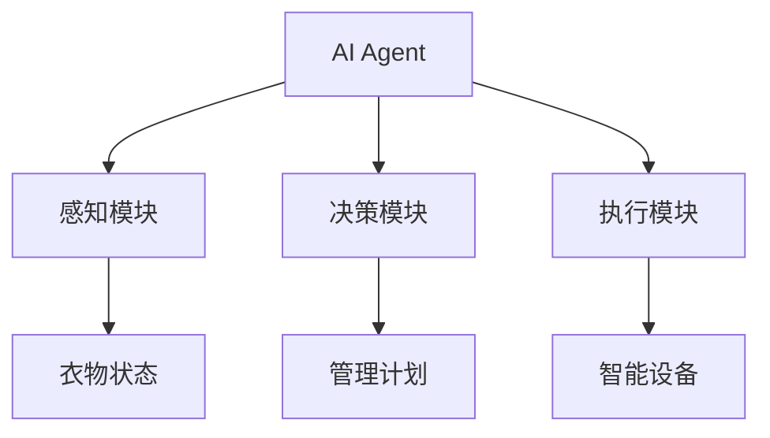
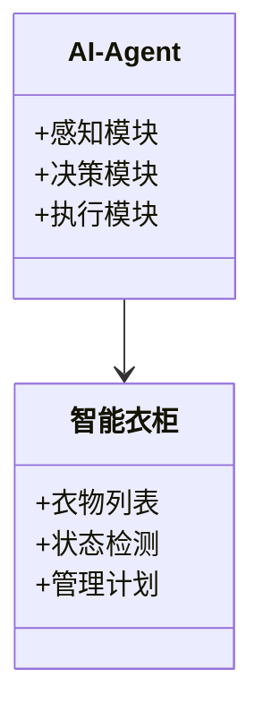
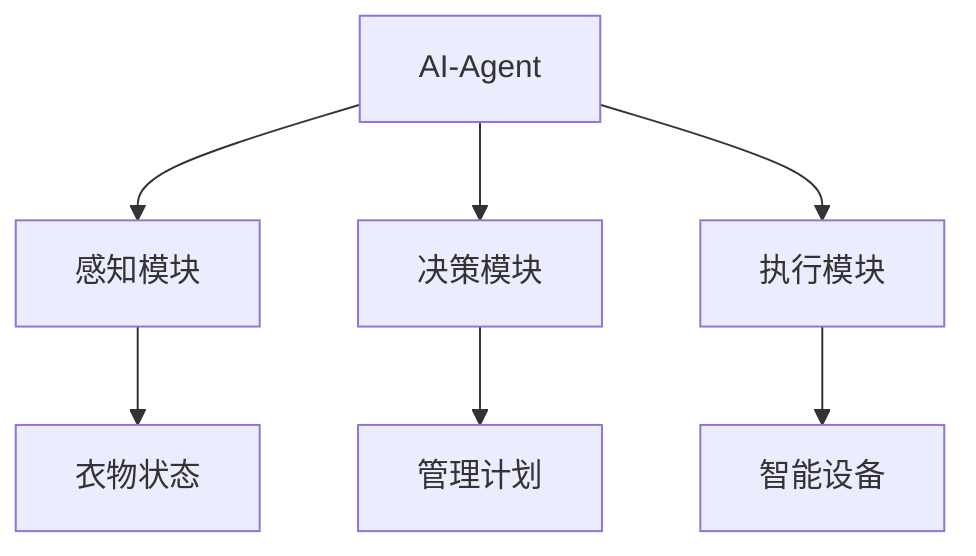

                 


# 智能衣柜：AI Agent的衣物保养提醒

## 关键词：
- AI Agent
- 智能衣柜
- 衣物保养提醒
- 人工智能
- 物联网

## 摘要：
本文探讨了AI Agent在智能衣柜中的应用，详细介绍了AI Agent如何通过感知、决策和执行模块实现衣物的智能管理。文章从背景介绍、核心概念、算法原理、系统架构、项目实战到总结，全面分析了智能衣柜的实现过程，为读者提供了从理论到实践的详细指导。

---

## 目录
1. [背景介绍](#背景介绍)
2. [核心概念与联系](#核心概念与联系)
3. [算法原理讲解](#算法原理讲解)
4. [系统分析与架构设计](#系统分析与架构设计)
5. [项目实战](#项目实战)
6. [总结与展望](#总结与展望)

---

## 正文

### 1. 背景介绍

#### 1.1 问题背景
衣物的日常保养是一个繁琐且容易被忽视的任务。许多人因为忙碌或忘记而未能及时清洗或晾晒衣物，导致衣物损坏或产生异味。传统的衣柜管理方式依赖于用户的记忆和手动操作，效率低下且容易出错。

#### 1.2 问题描述
- 衣物保养的痛点包括：
  - 忘记清洗或晾晒的时间。
  - 不同材质的衣物需要不同的清洗方式。
  - 缺乏智能化的管理工具。
- AI Agent（人工智能代理）可以解决这些问题，通过自动化提醒和优化建议提升衣物管理效率。

#### 1.3 问题解决
- AI Agent通过感知、决策和执行模块实现衣物管理的自动化：
  - 感知模块：检测衣物的状态（如是否潮湿、是否有褶皱）。
  - 决策模块：根据检测结果制定清洗或晾晒计划。
  - 执行模块：通过智能设备执行任务。

#### 1.4 边界与外延
- 智能衣柜的功能边界：
  - 仅限于衣物的状态检测和管理，不涉及衣物的物理操作。
- 外延：
  - 可与智能家居设备（如洗衣机、晾衣架）联动。
  - 未来可能扩展到衣物的自动分类和库存管理。

### 2. 核心概念与联系

#### 2.1 核心概念原理
- AI Agent的基本原理是通过感知环境、做出决策并执行操作。在智能衣柜中，环境即为衣物的状态和用户的管理需求。

#### 2.2 概念属性特征对比
| 模块 | 功能 | 属性 |
|------|------|------|
| 感知模块 | 检测衣物状态 | 高精度、实时性 |
| 决策模块 | 制定管理计划 | 智能性、优化性 |
| 执行模块 | 执行管理任务 | 自动化、可靠性 |

#### 2.3 实体关系图


### 3. 算法原理讲解

#### 3.1 感知算法
- 感知模块通过图像识别技术检测衣物的状态。例如，使用OpenCV库进行图像处理。

```python
import cv2

# 示例：检测衣物是否潮湿
def detect_moisture(image_path):
    img = cv2.imread(image_path)
    gray = cv2.cvtColor(img, cv2.COLOR_BGR2GRAY)
    # 使用阈值分割检测潮湿区域
    _, binary = cv2.threshold(gray, 127, 255, cv2.THRESH_BINARY)
    return "潮湿" if cv2.countNonZero(binary) > 0 else "干燥"
```

#### 3.2 决策算法
- 决策模块使用逻辑回归模型预测最佳清洗时间。

```python
import numpy as np
from sklearn.linear_model import LogisticRegression

# 示例：预测清洗时间
X = np.array([[moisture_level], [temperature], [time_since_last_wash]])
model = LogisticRegression()
model.fit(X, y)  # y为标签（清洗或不清洗）
prediction = model.predict([[moisture_level, temperature, time_since_last_wash]])
```

#### 3.3 数学模型
- 逻辑回归模型的数学表达式：
  $$ P(y=1|x) = \frac{e^{\beta_0 + \beta_1x}}{1 + e^{\beta_0 + \beta_1x}} $$
  其中，$x$ 是输入特征，$\beta$ 是模型参数。

### 4. 系统分析与架构设计

#### 4.1 领域模型


#### 4.2 系统架构


### 5. 项目实战

#### 5.1 环境安装
- 安装必要的库：
  ```bash
  pip install opencv-python scikit-learn
  ```

#### 5.2 核心代码实现
```python
import cv2
from sklearn.linear_model import LogisticRegression

# 示例：衣物状态检测
def detect_status(image_path):
    img = cv2.imread(image_path)
    # 图像处理
    return "干净" if condition met else "需要清洗"

# 示例：决策模块
model = LogisticRegression()
model.fit(X_train, y_train)
predictions = model.predict(X_test)
```

#### 5.3 实际案例分析
- 案例：用户忘记清洗一件潮湿的衣物，AI Agent检测到衣物状态并提醒用户清洗，随后执行模块启动洗衣机。

### 6. 总结与展望

#### 6.1 总结
- AI Agent通过智能化的管理方式解决了衣物保养的痛点，提高了管理效率和衣物寿命。

#### 6.2 展望
- 未来的智能衣柜可能集成更多功能，如自动分类和库存管理。
- 数据隐私和系统维护是需要重点关注的问题。

#### 6.3 注意事项
- 确保数据的准确性和模型的可解释性。
- 定期更新算法以提高检测精度。

---

通过本文的详细讲解，读者可以深入了解AI Agent在智能衣柜中的应用，掌握从理论到实践的实现过程，并为未来的智能化衣物管理提供参考。

