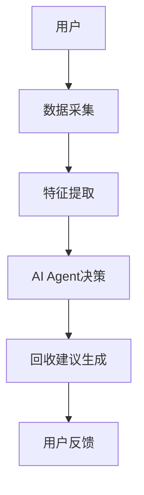
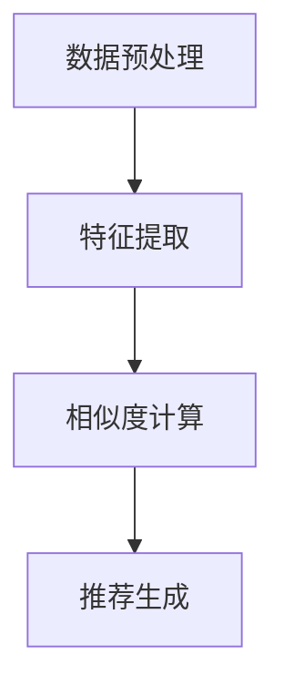
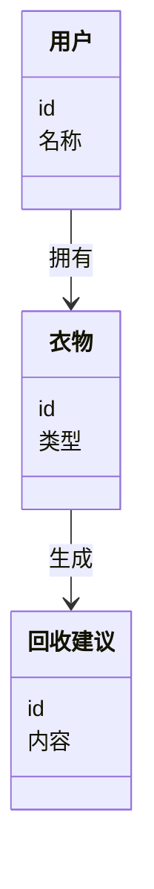
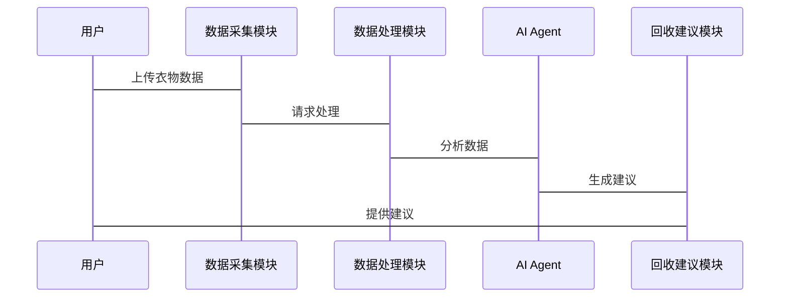

                 


# 智能衣柜：AI Agent的衣物回收建议系统

> 关键词：智能衣柜，AI Agent，衣物回收，机器学习，推荐系统，可持续发展

> 摘要：本文介绍了一种基于AI Agent的衣物回收建议系统，旨在通过智能算法优化衣柜利用率，减少资源浪费和环境污染。文章详细探讨了系统的核心概念、算法原理、系统架构，并通过实际案例展示了系统的实现和应用。

---

# 第一部分: 智能衣柜系统背景与核心概念

## 第1章: 智能衣柜系统背景介绍

### 1.1 问题背景与描述

#### 1.1.1 衣物管理与回收的现状
现代衣柜管理面临以下问题：
- **空间浪费**：衣物数量多，但利用率低。
- **资源浪费**：大量衣物被闲置或丢弃，导致资源浪费。
- **环境污染**：衣物处理不当会导致环境问题。

#### 1.1.2 传统衣柜管理的痛点
- 用户难以快速找到所需衣物。
- 衣物分类和管理效率低下。
- 缺乏智能化的衣物回收建议。

#### 1.1.3 AI Agent在衣物管理中的应用潜力
AI Agent可以通过以下方式优化衣柜管理：
- 智能分类和推荐衣物。
- 提供衣物回收建议，减少资源浪费。
- 帮助用户做出更环保的决策。

### 1.2 问题解决思路

#### 1.2.1 AI Agent在衣物回收中的角色
AI Agent可以：
- 分析用户衣物数据。
- 提供衣物使用建议。
- 推荐回收选项。

#### 1.2.2 系统目标与功能定位
系统目标：
- 最大化衣柜利用率。
- 提供个性化衣物使用建议。
- 优化衣物回收流程。

系统功能定位：
- 数据采集与分析。
- 衣物分类与推荐。
- 回收建议生成。

#### 1.2.3 解决方案的边界与外延
- 系统边界：仅关注衣柜内的衣物管理与回收。
- 外延：不涉及衣物的生产和采购。

### 1.3 系统核心概念与结构

#### 1.3.1 核心概念定义
- **AI Agent**：能够感知环境并执行任务的智能体。
- **衣物回收系统**：用于管理和建议衣物回收的系统。

#### 1.3.2 概念属性特征对比表
| 概念        | 属性       | 特征对比 |
|-------------|------------|----------|
| AI Agent    | 智能性     | 高       |
| 衣服         | 分类       | 多样性    |

#### 1.3.3 ER实体关系图架构
```mermaid
er
    %% 衣物回收系统 ER 图
    entity 用户 {
        id 用户ID
        姓名
    }
    entity 衣物 {
        id 衣物ID
        类型
        品牌
    }
    entity 回收建议 {
        id 建议ID
        建议内容
    }
    用户 --> 回收建议 : 提出
    衣物 --> 回收建议 : 基于
```

---

## 第2章: AI Agent与衣物回收系统核心概念

### 2.1 AI Agent的核心原理

#### 2.1.1 AI Agent的基本定义
AI Agent是能够感知环境并采取行动以实现目标的智能体。

#### 2.1.2 AI Agent的行为模式
- **反应式AI Agent**：根据当前环境做出反应。
- **规划式AI Agent**：基于目标进行规划。

#### 2.1.3 AI Agent的决策机制
- 数据采集与分析。
- 模型推理与决策。
- 行为执行与反馈。

### 2.2 衣物回收系统的关键要素

#### 2.2.1 衣物分类与特征提取
- 分类标准：类型、品牌、使用频率。
- 特征提取：颜色、材质、尺寸。

#### 2.2.2 回收需求分析
- 用户需求：衣物使用频率、偏好。
- 环境因素：环保目标。

#### 2.2.3 系统交互流程


### 2.3 AI Agent与衣物回收系统的协同关系

#### 2.3.1 系统整体
AI Agent与衣物回收系统协同工作，实现智能化衣物管理。

---

# 第二部分: AI Agent的衣物回收建议系统实现

## 第3章: AI Agent的算法原理

### 3.1 算法原理介绍

#### 3.1.1 算法选择
- **协同过滤推荐算法**：基于用户行为和偏好推荐衣物。

#### 3.1.2 算法流程


#### 3.1.3 算法实现
使用Python实现协同过滤算法：
```python
import numpy as np
from sklearn.metrics.pairwise import cosine_similarity

# 示例数据：用户-衣物矩阵
X = np.array([[1, 0, 1],
              [0, 1, 1],
              [1, 1, 0]])

# 计算余弦相似度
similarity = cosine_similarity(X)
print(similarity)
```

### 3.2 数学模型

#### 3.2.1 相似度计算模型
$$\text{sim}(i,j) = \frac{\sum_{k} w_{ik}w_{jk}}{\sqrt{\sum_{i} w_{ik}^2} \sqrt{\sum_{j} w_{jk}^2}}}$$

#### 3.2.2 推荐评分模型
$$r(i,j) = \mu + b_i + b_j + \sum_{k} a_k x_{ijk}$$
其中：
- $\mu$：全局平均评分。
- $b_i$：物品的偏置。
- $a_k$：因子权重。
- $x_{ijk}$：因子k在用户i和物品j上的表现。

---

## 第4章: 系统分析与架构设计

### 4.1 系统分析

#### 4.1.1 问题场景
- 用户上传衣物数据。
- 系统分析数据，提供回收建议。

#### 4.1.2 系统功能设计


### 4.2 系统架构设计

#### 4.2.1 分层架构
- 数据层：数据存储与管理。
- 业务逻辑层：算法实现。
- 用户界面层：交互与展示。

#### 4.2.2 接口设计
- RESTful API：提供数据接口。

#### 4.2.3 交互流程图


---

## 第5章: 项目实战与案例分析

### 5.1 项目实战

#### 5.1.1 环境安装
- 安装Python和相关库：
  ```bash
  pip install numpy scikit-learn pandas
  ```

#### 5.1.2 核心实现
- 数据采集与处理：
  ```python
  import pandas as pd

  data = pd.DataFrame({
      '衣物ID': [1, 2, 3],
      '类型': ['T恤', '裤子', '鞋子']
  })
  ```

- 推荐算法实现：
  ```python
  from sklearn.metrics.pairwise import cosine_similarity

  X = data[['类型']]
  similarity = cosine_similarity(X)
  ```

#### 5.1.3 案例分析
- 用户登录：
  ```bash
  用户名：user1
  密码：password
  ```

- 数据上传：
  ```bash
  衣物列表：
  1: T恤
  2: 裤子
  3: 鞋子
  ```

- 回收建议：
  ```bash
  建议1：将T恤捐赠给慈善机构。
  建议2：将裤子进行回收处理。
  ```

---

## 第6章: 总结与展望

### 6.1 总结
本文详细介绍了基于AI Agent的衣物回收建议系统，包括系统背景、核心概念、算法原理和系统架构。通过实际案例展示了系统的实现和应用。

### 6.2 未来展望
- **优化算法**：引入深度学习模型。
- **扩展功能**：增加衣物修复建议。
- **提升用户体验**：优化交互界面。

### 6.3 最佳实践

#### 6.3.1 小结
- 系统实现了智能化衣物管理。
- AI Agent提供了个性化回收建议。

#### 6.3.2 注意事项
- 数据隐私保护至关重要。
- 系统需要定期更新以保持准确性。

#### 6.3.3 拓展阅读
- 推荐阅读相关领域的最新研究论文。

---

**结论**
通过本文的介绍，读者可以全面了解基于AI Agent的衣物回收建议系统的实现和应用。该系统不仅优化了衣柜管理，还为可持续发展提供了技术支持。

