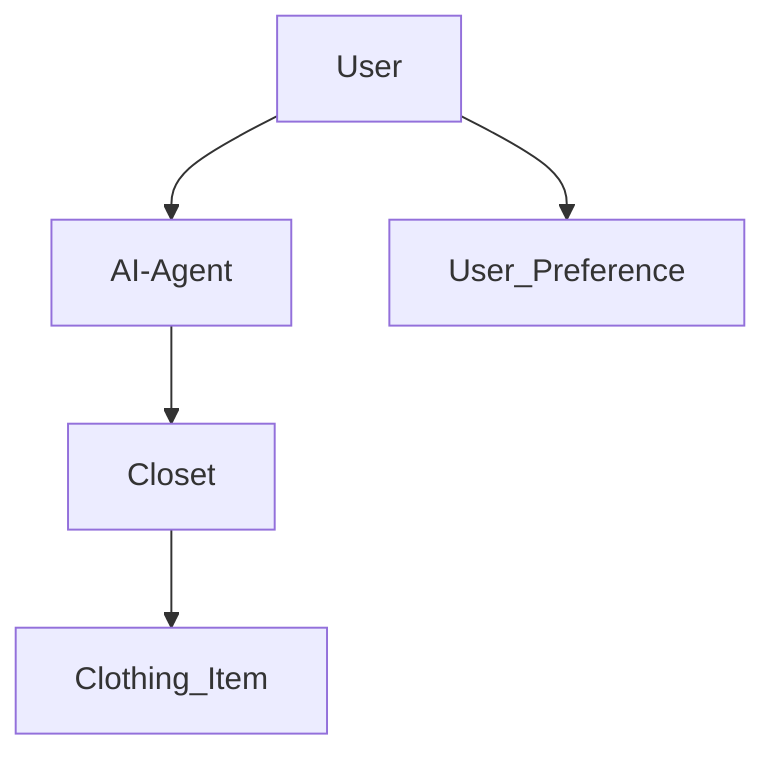
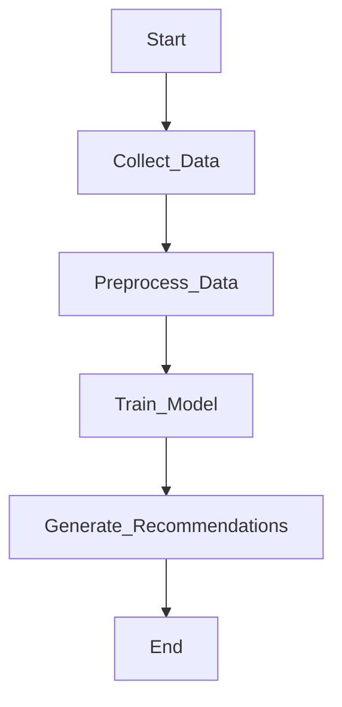
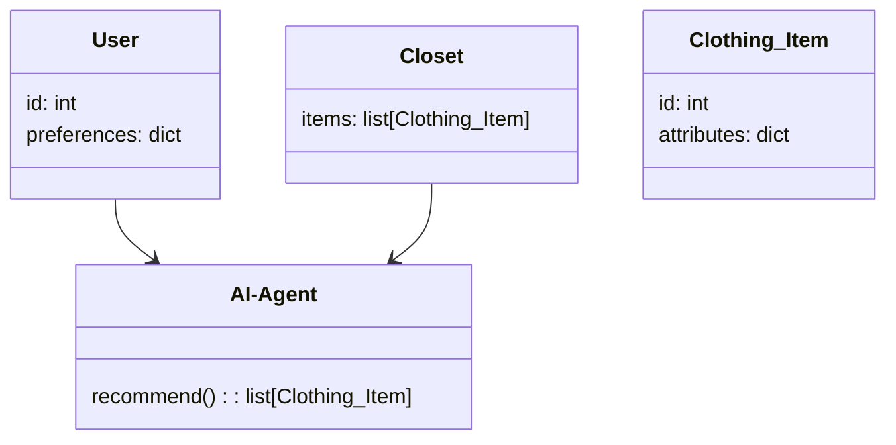

                 


# 智能衣柜：AI Agent的衣物搭配推荐

**关键词**：AI Agent、智能衣柜、衣物搭配、推荐系统、深度学习

**摘要**：本文探讨AI Agent在智能衣柜中的应用，分析其如何通过衣物特征、用户偏好和场景需求进行搭配推荐。结合算法原理、系统架构和项目实战，深入解析实现细节，为实际应用提供指导。

---

# 第一部分: 智能衣柜与AI Agent概述

## 第1章: 智能衣柜的发展与AI Agent的引入

### 1.1 智能衣柜的发展历程

#### 1.1.1 传统衣柜的功能与局限性
传统衣柜主要依赖手动整理，缺乏智能化，难以满足用户的个性化需求。

#### 1.1.2 智能化技术在衣柜中的应用
随着物联网技术的发展，智能衣柜开始具备数据采集和初步分析能力。

#### 1.1.3 AI Agent在衣物管理中的潜力
AI Agent能够实时分析数据，提供个性化推荐，解决用户搭配难题。

### 1.2 AI Agent的核心概念

#### 1.2.1 AI Agent的定义与特点
AI Agent是一种智能体，能够感知环境并采取行动以实现目标。

#### 1.2.2 AI Agent在智能衣柜中的角色
AI Agent通过分析数据，为用户提供衣物搭配建议。

#### 1.2.3 AI Agent与传统推荐系统的区别
AI Agent更具主动性和适应性，能够实时调整推荐策略。

### 1.3 智能衣柜的用户需求与场景分析

#### 1.3.1 用户需求分析
用户需要个性化的搭配建议和高效的衣物管理。

#### 1.3.2 典型使用场景
包括日常穿搭、重要场合搭配和季节性调整。

#### 1.3.3 问题背景与解决目标
解决用户搭配难题，提升穿衣效率。

---

## 第2章: AI Agent在衣物搭配推荐中的核心概念

### 2.1 被推荐物品的特征分析

#### 2.1.1 衣物的属性特征
包括颜色、款式、材质和适用场合。

#### 2.1.2 用户的偏好特征
如体型、肤色、风格偏好和场合需求。

#### 2.1.3 场景特征与时间特征
场景如工作、休闲，时间如季节变化。

### 2.2 AI Agent的推荐机制

#### 2.2.1 基于规则的推荐
根据预设规则进行推荐。

#### 2.2.2 基于协同过滤的推荐
分析用户行为，找到相似用户的推荐。

#### 2.2.3 基于深度学习的推荐
利用神经网络提取衣物和用户特征。

### 2.3 AI Agent与用户交互的实体关系



---

## 第3章: 基于AI Agent的衣物搭配推荐算法原理

### 3.1 算法原理概述

#### 3.1.1 基于协同过滤的推荐算法
分析用户历史数据，找到相似用户的推荐。

#### 3.1.2 基于深度学习的推荐算法
利用神经网络处理数据。

#### 3.1.3 混合推荐算法
结合多种算法优势。

### 3.2 算法实现流程



### 3.3 算法数学模型

#### 3.3.1 协同过滤算法的数学公式
$$相似度计算：sim(i,j) = \frac{\sum_{k} r_{ik} r_{jk}}{\sqrt{\sum_{k} r_{ik}^2} \sqrt{\sum_{k} r_{jk}^2}}$$

---

## 第4章: 系统架构设计

### 4.1 系统功能设计

#### 4.1.1 领域模型设计



### 4.2 系统架构设计

```mermaid
graph LR
    User-->API Gateway
    API Gateway-->Recommendation_Service
    Recommendation_Service-->Database
```

### 4.3 系统接口设计

#### 4.3.1 接口描述
- API Gateway接收用户请求，转发给Recommendation_Service。

#### 4.3.2 接口实现
- 使用RESTful API，如POST /recommend。

---

## 第5章: 项目实战

### 5.1 项目介绍

#### 5.1.1 项目目标
开发一个基于Python的智能衣柜推荐系统。

### 5.2 核心实现

#### 5.2.1 环境安装
安装必要的库，如numpy、pandas、scikit-learn。

#### 5.2.2 代码实现

```python
import numpy as np
from sklearn.metrics.pairwise import cosine_similarity

# 示例数据
user_data = {
    'user1': [1, 0, 1],
    'user2': [0, 1, 1],
    'user3': [1, 1, 0]
}

def compute_similarity(data):
    matrix = np.array(list(data.values()))
    similarity_matrix = cosine_similarity(matrix)
    return similarity_matrix

similarity_matrix = compute_similarity(user_data)
print(similarity_matrix)
```

### 5.3 代码应用解读

#### 5.3.1 代码功能
计算用户间的相似度矩阵，用于推荐。

#### 5.3.2 代码优化
提升计算效率，如并行处理。

### 5.4 实际案例分析

#### 5.4.1 案例分析
分析用户数据，生成推荐列表。

#### 5.4.2 优化建议
根据反馈调整推荐策略。

### 5.5 项目小结
总结项目实现过程中的关键点和经验。

---

## 第6章: 总结与展望

### 6.1 总结

#### 6.1.1 核心内容回顾
AI Agent在智能衣柜中的应用及其推荐算法。

### 6.1.2 项目经验总结
系统设计和实现中的注意事项。

### 6.2 未来展望

#### 6.2.1 技术发展
深度学习在推荐系统中的进一步应用。

#### 6.2.2 市场应用
智能衣柜在个人护理和健康管理中的扩展。

---

## 第7章: 最佳实践与注意事项

### 7.1 最佳实践

#### 7.1.1 数据隐私
确保用户数据的安全性。

#### 7.1.2 系统优化
提升推荐系统的准确性和效率。

### 7.2 注意事项

#### 7.2.1 模型选择
根据需求选择合适的推荐算法。

#### 7.2.2 用户反馈
及时收集反馈，优化推荐策略。

### 7.3 拓展阅读

#### 7.3.1 推荐算法书籍
如《推荐系统实战》。

#### 7.3.2 AI Agent相关文献
推荐《人工智能：现代方法》。

---

通过以上步骤，我们逐步构建了智能衣柜中AI Agent的衣物搭配推荐系统，从理论到实践，全面解析其实现细节和应用前景。

