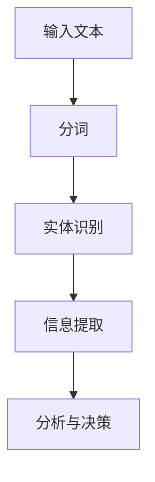

                 


# 目录大纲：《智能财务报告关键信息提取与分析系统》

---

## 第一部分：智能财务报告关键信息提取与分析系统概述

### 第1章：智能财务报告关键信息提取与分析系统概述

#### 1.1 问题背景
- 1.1.1 传统财务报告处理的痛点
- 1.1.2 智能化财务报告处理的需求
- 1.1.3 关键信息提取与分析的核心价值

#### 1.2 问题描述
- 1.2.1 财务报告结构化处理的挑战
- 1.2.2 关键信息提取的复杂性
- 1.2.3 分析与决策支持的需求

#### 1.3 问题解决
- 1.3.1 自然语言处理技术的应用
- 1.3.2 机器学习在财务分析中的作用
- 1.3.3 智能系统构建的关键步骤

#### 1.4 边界与外延
- 1.4.1 系统功能的边界
- 1.4.2 相关领域的外延
- 1.4.3 与其他系统的区别与联系

#### 1.5 核心概念与组成
- 1.5.1 关键信息提取的核心要素
- 1.5.2 分析系统的主要组成部分
- 1.5.3 系统架构的核心逻辑

---

## 第二部分：智能财务报告关键信息提取与分析系统的理论基础

### 第2章：关键信息提取的核心概念与原理

#### 2.1 核心概念与原理
- 2.1.1 自然语言处理（NLP）在信息提取中的应用
- 2.1.2 实体识别（NER）模型的原理
- 2.1.3 文本分类与关键信息识别的关系

#### 2.2 核心概念对比分析
- 2.2.1 实体识别与文本分类的对比
- 2.2.2 不同信息提取方法的优缺点
- 2.2.3 系统性能指标对比表格

#### 2.3 实体关系图


### 第3章：智能分析系统的算法原理

#### 3.1 算法原理
- 3.1.1 基于深度学习的NER模型
- 3.1.2 文本分类与关键信息识别的流程
- 3.1.3 系统的数学模型与公式

#### 3.2 算法流程图


#### 3.3 核心代码实现
```python
import spacy
nlp = spacy.load("en_core_web_sm")
doc = nlp("公司2022年净利润为100万元。")
for ent in doc.ents:
    print(f"实体：{ent.text}, 类型：{ent.label_}")
```

---

## 第三部分：智能财务报告分析系统的系统架构与实现

### 第4章：系统架构设计

#### 4.1 问题场景介绍
- 4.1.1 系统目标
- 4.1.2 使用场景
- 4.1.3 用户角色

#### 4.2 系统功能设计
- 4.2.1 文档分

---

**注：** 由于篇幅限制，以上目录大纲仅为部分内容。完整的目录将包含更多章节，例如数学公式、系统架构图、项目实战代码等。

