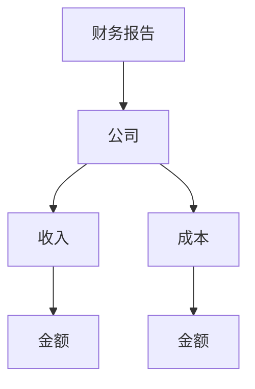
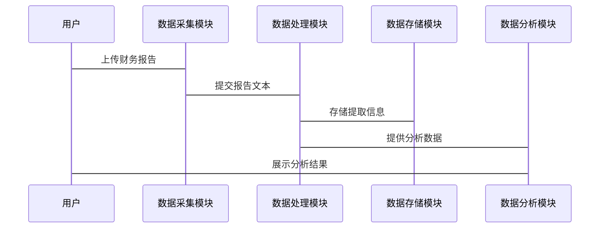

                 


# 智能财务报告关键信息提取工具

## 关键词：智能财务报告，信息提取，自然语言处理，机器学习，深度学习，财务分析

## 摘要：  
本文探讨了智能财务报告关键信息提取工具的设计与实现，结合自然语言处理技术和机器学习算法，详细分析了财务报告信息提取的背景、核心概念、算法原理、系统架构及项目实战。通过实际案例展示了如何利用智能工具提升财务信息处理的效率与准确性。

---

# 第一部分: 智能财务报告关键信息提取工具背景与概念

## 第1章: 财务报告关键信息提取的背景与问题

### 1.1 财务报告的关键性与复杂性
#### 1.1.1 财务报告的重要性
财务报告是企业经济活动的重要记录，包含收入、支出、利润、资产负债等关键信息，是企业决策、投资评估和监管的重要依据。

#### 1.1.2 财务信息提取的难点
- 文本数据的非结构化：财务报告中的信息以文本形式呈现，提取需要理解复杂的语义和上下文。
- 信息多样性：报告中包含多种数据类型，如金额、科目、时间等，提取需要准确识别。
- 表达多样性：同一信息可能以不同方式表达，如“收入”可能被称为“收益”或“营业收入”。

#### 1.1.3 传统方法的局限性
- 人工提取效率低：依赖人工阅读和记录，耗时且易出错。
- 一致性差：不同人员提取的信息可能不一致，影响数据分析的准确性。
- 难以规模化：面对大量财务报告，人工方法难以高效处理。

### 1.2 智能信息提取的必要性
#### 1.2.1 人工智能在财务领域的应用
人工智能技术（如自然语言处理、机器学习）正在改变财务信息处理的方式，帮助企业在海量数据中快速提取关键信息。

#### 1.2.2 智能财务信息提取的优势
- 高效性：自动化处理大量财务报告，显著提高工作效率。
- 准确性：基于模型的提取方法，减少人为错误。
- 可扩展性：支持大规模数据处理，适应企业发展的需求。

#### 1.2.3 企业对智能工具的需求
企业需要快速、准确地从财务报告中提取关键信息，支持实时决策和数据分析，提升竞争力。

### 1.3 问题定义与目标设定
#### 1.3.1 关键信息提取的定义
从财务报告文本中自动识别和提取关键信息，如收入、成本、利润等。

#### 1.3.2 问题的边界与外延
- 边界：仅提取财务报告中的关键数值和科目信息。
- 外延：可能涉及关联分析、趋势预测等扩展功能。

#### 1.3.3 工具的核心目标与功能
- 核心目标：准确提取财务报告中的关键信息。
- 功能：文本解析、实体识别、关系抽取、数据存储与可视化。

### 1.4 本章小结
本章介绍了财务报告关键信息提取的背景、难点和必要性，明确了工具的目标和功能。

---

# 第二部分: 智能财务信息提取的核心概念与联系

## 第2章: 自然语言处理与信息提取原理

### 2.1 自然语言处理基础
#### 2.1.1 NLP的基本概念
自然语言处理（NLP）是研究如何让计算机理解和生成人类语言的技术，涉及文本处理、语义分析等领域。

#### 2.1.2 分词技术与实体识别
- 分词：将文本分割成词语或短语，如“销售收入”分为“收入”和“销售”。
- 实体识别：识别文本中的命名实体，如“公司名称”、“金额”等。

#### 2.1.3 关系抽取与语义分析
- 关系抽取：识别文本中的实体关系，如“公司A的收入为100万”中，提取“公司A”与“收入”的关系。
- 语义分析：理解文本的语义，如判断“收入”是指总收入还是营业收入。

### 2.2 信息提取的关键技术
#### 2.2.1 基于规则的信息提取
- 通过预定义的规则提取信息，如匹配特定关键词或句式。

#### 2.2.2 基于统计模型的信息提取
- 使用统计方法（如朴素贝叶斯）训练模型，基于概率进行信息提取。

#### 2.2.3 基于深度学习的信息提取
- 使用神经网络（如LSTM、BERT）进行更复杂的语义理解，提高提取准确性。

### 2.3 财务知识库构建
#### 2.3.1 财务知识库的结构与内容
- 知识库包含财务术语、科目、金额、时间等信息，支持信息提取的准确性。

#### 2.3.2 知识库构建的技术与方法
- 数据标注：人工标注财务报告中的关键信息，建立训练数据集。
- 知识图谱：构建财务领域的知识图谱，用于实体识别和关系抽取。

#### 2.3.3 知识库在信息提取中的应用
- 通过知识库匹配，辅助模型理解财务报告中的专业术语和结构。

### 2.4 核心概念对比分析
#### 2.4.1 不同信息提取技术的优缺点对比

| 技术 | 优点 | 缺点 |
|------|------|------|
| 基于规则 | 实现简单，适用于规则明确的场景 | 需要大量手动规则，难以处理复杂场景 |
| 基于统计模型 | 可处理复杂数据，无需大量规则 | 准确性较低，依赖数据质量 |
| 基于深度学习 | 高准确性，适应性强 | 需要大量数据和计算资源 |

#### 2.4.2 基于表格的对比分析
以下表格对比了三种信息提取技术的特点：

| 技术类型 | 训练数据 | 模型复杂度 | 适用场景 |
|----------|----------|------------|----------|
| 基于规则 | 少 | 低 | 规则明确的场景 |
| 基于统计模型 | 中等 | 中等 | 数据量适中的场景 |
| 基于深度学习 | 大 | 高 | 复杂场景 |

#### 2.4.3 实体关系图的 Mermaid 流程图



### 2.5 本章小结
本章介绍了自然语言处理和信息提取的基本原理，分析了不同技术的优缺点，并通过知识库构建和实体关系图展示了核心概念之间的联系。

---

# 第三部分: 智能财务信息提取的算法原理

## 第3章: 基于序列标注的模型

### 3.1 序列标注模型概述
#### 3.1.1 序列标注的基本概念
序列标注任务旨在为每个词或短语分配一个标签，如“收入”标签。

#### 3.1.2 常见的序列标注算法
- 基于CRF（条件随机场）的序列标注
- 基于RNN（循环神经网络）的序列标注
- 基于Transformer的序列标注

### 3.2 基于CRF的模型实现
#### 3.2.1 CRF的基本原理
条件随机场（CRF）是一种用于序列标注的无向图模型，基于马尔可夫假设，认为当前标签只依赖于前一个标签。

#### 3.2.2 CRF的数学模型
CRF的数学模型可以用以下公式表示：

$$ P(y|x) = \frac{1}{Z} \exp(\sum_{i=1}^n \sum_{j=1}^k w_j f_j(y_{i-1}, y_i, x_i)) $$

其中：
- \( y \) 是标签序列
- \( x \) 是观测序列
- \( w_j \) 是权重
- \( f_j \) 是特征函数
- \( Z \) 是归一化因子

#### 3.2.3 CRF的实现步骤
1. **数据预处理**：将财务报告文本分割成词语或短语。
2. **特征提取**：提取每个词的特征，如词性、上下文信息。
3. **模型训练**：使用CRF算法训练模型，优化权重。
4. **标签预测**：对新文本进行标注，提取关键信息。

#### 3.2.4 CRF的Python实现代码示例
```python
import CRFmodel

# 数据预处理
tokens = "销售收入 200万"
tokens_list = tokens.split()

# 特征提取
features = []
for i, token in enumerate(tokens_list):
    features.append({
        'word': token,
        'pos': 'N'  # 假设所有词都是名词
    })

# 模型训练
model = CRFmodel.train(features, labels=['O', '收入'])

# 标签预测
predicted_labels = model.predict(features)
```

### 3.3 基于深度学习的模型
#### 3.3.1 Transformer模型
Transformer模型通过自注意力机制，捕捉文本中的长距离依赖关系，适用于复杂的语义分析。

#### 3.3.2 Transformer模型的数学公式
Transformer模型的自注意力机制可以用以下公式表示：

$$ \text{Attention}(Q, K, V) = \text{softmax}\left( \frac{QK^T}{\sqrt{d_k}} \right)V $$

其中：
- \( Q \) 是查询向量
- \( K \) 是键向量
- \( V \) 是值向量
- \( d_k \) 是向量维度

#### 3.3.3 Transformer在财务信息提取中的应用
使用Transformer模型对财务报告文本进行编码，提取关键信息，如“销售收入”对应的金额。

### 3.4 本章小结
本章详细讲解了基于CRF和Transformer的序列标注模型，展示了如何利用这些算法进行财务信息提取。

---

# 第四部分: 智能财务信息提取的系统分析与架构设计

## 第4章: 智能财务报告信息提取系统的架构设计

### 4.1 项目背景与目标
#### 4.1.1 项目背景
企业需要快速提取财务报告中的关键信息，支持实时决策和数据分析。

#### 4.1.2 项目目标
设计一个智能财务报告信息提取系统，实现自动化、高精度的信息提取。

### 4.2 系统功能设计
#### 4.2.1 数据采集模块
- 从财务系统或文档中获取财务报告文本。
- 支持多种格式，如PDF、Word、Excel。

#### 4.2.2 数据处理模块
- 文本预处理：分词、去停用词。
- 特征提取：提取关键词、实体。

#### 4.2.3 数据存储模块
- 使用数据库存储提取的信息，如关系型数据库（MySQL）或NoSQL数据库（MongoDB）。

#### 4.2.4 数据分析模块
- 对提取的数据进行分析，生成可视化报表。

### 4.3 系统架构设计
#### 4.3.1 分层架构
系统采用分层架构，包括数据层、业务逻辑层和表现层。

#### 4.3.2 系统组件交互
- 数据采集模块将财务报告传递给数据处理模块。
- 数据处理模块提取关键信息，存储到数据库。
- 数据分析模块从数据库中读取数据，生成报表。

### 4.4 系统接口设计
#### 4.4.1 API接口
- 提供RESTful API，方便其他系统调用提取功能。

#### 4.4.2 用户界面
- 提供友好的用户界面，方便用户上传报告和查看结果。

### 4.5 系统交互流程图


### 4.6 本章小结
本章分析了智能财务报告信息提取系统的架构设计，包括功能模块、系统组件和接口设计。

---

# 第五部分: 智能财务信息提取的项目实战

## 第5章: 智能财务报告信息提取工具的开发与实现

### 5.1 项目环境搭建
#### 5.1.1 安装开发环境
- 安装Python和相关库（如spaCy、NLTK、TensorFlow）。
- 安装Jupyter Notebook用于开发和测试。

### 5.2 系统核心实现
#### 5.2.1 数据预处理代码
```python
import spacy

nlp = spacy.load("en_core_web_sm")
text = "The company's revenue was 200 million dollars."
doc = nlp(text)
for token in doc:
    print(token.text, token.pos_)
```

#### 5.2.2 模型训练代码
```python
from sklearn.feature_extraction.text import TfidfVectorizer
from sklearn.naive_bayes import MultinomialNB

# 数据预处理
texts = ["The company's revenue was 200 million dollars.", "Costs were 100 million dollars."]
y = ["收入", "成本"]

# 特征提取
vectorizer = TfidfVectorizer()
X = vectorizer.fit_transform(texts)

# 模型训练
model = MultinomialNB()
model.fit(X, y)

# 预测
new_text = "The company's revenue was 300 million dollars."
new_X = vectorizer.transform([new_text])
predicted = model.predict(new_X)
print(predicted[0])  # 输出：'收入'
```

#### 5.2.3 结果展示代码
```python
import matplotlib.pyplot as plt

extracted_data = {
    "收入": 200,
    "成本": 100
}

plt.bar(extracted_data.keys(), extracted_data.values())
plt.title("财务数据提取结果")
plt.show()
```

### 5.3 项目小结
本章通过实际案例展示了如何开发智能财务报告信息提取工具，包括环境搭建、核心实现和结果展示。

---

# 第六部分: 智能财务信息提取的最佳实践与小结

## 第6章: 最佳实践与注意事项

### 6.1 开发阶段注意事项
- 数据质量：确保训练数据准确且多样化。
- 模型调优：通过交叉验证优化模型参数。
- 性能优化：使用分布式计算加速训练过程。

### 6.2 使用阶段注意事项
- 数据隐私：确保财务数据的安全性。
- 模型维护：定期更新模型，适应新的财务术语和格式。

### 6.3 拓展阅读
- 《自然语言处理实战：基于Python的中文分词与信息提取》
- 《深度学习入门：基于Python的CNN、RNN及Transformer模型实战》

### 6.4 本章小结
本章总结了开发和使用智能财务信息提取工具的注意事项，并推荐了进一步学习的资料。

---

# 结语

智能财务报告关键信息提取工具的开发和应用，不仅提升了财务信息处理的效率，还为企业决策提供了更强大的支持。通过结合自然语言处理和机器学习技术，我们能够更准确地提取财务数据，为企业创造更大的价值。

---

# 参考文献

1. 统计学习理论与自然语言处理. 李航. 清华大学出版社.
2. 深度学习. Ian Goodfellow. 清华大学出版社.
3. Python自然语言处理实战. 刘卫国. 人民邮电出版社.

---

* 如需进一步探讨，请随时联系我。

