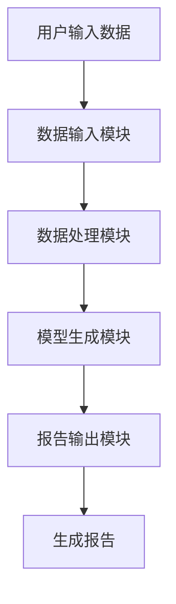

                 


```markdown
# 智能财务报告自动生成系统

> 关键词：智能财务报告，自动生成系统，自然语言处理，生成模型，财务数据分析

> 摘要：本文详细探讨了智能财务报告自动生成系统的背景、核心概念、算法原理、系统架构、项目实现以及最佳实践。通过结合自然语言处理技术和生成模型，本文为财务领域的智能化转型提供了理论基础和实践指导。

---

## 第一部分: 智能财务报告自动生成系统的背景与概念

### 第1章: 智能财务报告自动生成系统概述

#### 1.1 问题背景与需求分析
财务报告的生成过程通常繁琐且耗时，传统方式依赖人工操作，容易出现错误且效率低下。随着企业规模的扩大和数据量的增加，手动生成财务报告的局限性日益显现。

- **传统方式的痛点**：
  - 数据处理效率低，人工操作容易出错。
  - 不同部门或业务单元的报告格式不统一，难以标准化。
  - 需要大量人力资源，成本高。

- **智能化生成的必要性**：
  - 提高数据处理效率，降低人工错误。
  - 实现报告格式标准化，满足不同场景需求。
  - 为企业节省成本，提升整体运营效率。

#### 1.2 智能财务报告生成的核心概念
智能财务报告自动生成系统通过自然语言处理（NLP）和生成模型，将结构化的财务数据转化为自然语言描述的报告。

- **数据源与输入格式**：
  - 数据源可以是ERP系统、财务数据库或其他结构化数据源。
  - 输入格式包括表格数据、JSON、CSV等。

- **生成模型与算法**：
  - 使用生成式模型（如GPT、BERT）对财务数据进行理解和生成。

- **输出格式与标准化**：
  - 输出格式包括文本报告、PDF、Word文档等。
  - 需要遵循会计准则和行业标准。

#### 1.3 系统目标与功能定位
智能财务报告自动生成系统的目标是将财务数据转化为结构化、标准化的报告，同时具备灵活性和可扩展性。

- **系统目标**：
  - 提供高效的报告生成工具，减少人工干预。
  - 支持多种数据源和输出格式。
  - 提供实时数据更新和报告生成能力。

- **核心功能模块**：
  - 数据采集与处理：从多种数据源采集财务数据，并进行清洗和预处理。
  - 数据分析与理解：通过NLP技术理解数据内容，并生成自然语言描述。
  - 报告生成与输出：根据生成的文本内容输出不同格式的报告。

- **系统边界与外延**：
  - 系统不直接处理原始数据，而是依赖外部数据源。
  - 系统生成的报告需要符合相关行业标准和法规要求。

---

## 第二部分: 智能财务报告生成的核心技术与算法

### 第2章: 自然语言处理与生成算法

#### 2.1 自然语言处理基础
自然语言处理（NLP）是实现智能财务报告生成的核心技术。

- **NLP的核心任务**：
  - 信息抽取：从文本中提取关键信息。
  - 文本生成：将结构化数据转化为自然语言文本。

- **生成式模型的原理**：
  - 基于概率模型，通过最大化条件概率$P(y|x)$生成文本。

#### 2.2 基于Transformer的生成模型
Transformer模型在自然语言处理领域取得了显著成果，广泛应用于文本生成任务。

- **Transformer的结构与特点**：
  - 由编码器和解码器组成。
  - 使用自注意力机制，捕捉文本中的长距离依赖关系。

- **解码器的生成机制**：
  - 解码器通过自注意力和交叉注意力生成目标文本。
  - 使用贪心算法或蒙特卡洛采样生成多样化的文本。

#### 2.3 智能财务报告生成的算法实现
结合财务数据的特点，对生成模型进行优化和调整。

- **数据预处理与特征提取**：
  - 对财务数据进行清洗和标准化。
  - 提取关键特征，如财务指标、时间戳等。

- **模型训练与调优**：
  - 使用财务领域的标注数据进行监督学习。
  - 通过调整超参数（如学习率、批次大小）优化模型性能。

- **生成结果的评估与优化**：
  - 使用BLEU、ROUGE等指标评估生成文本的质量。
  - 基于财务领域的业务逻辑，对生成结果进行校验和优化。

---

## 第三部分: 系统架构与实现

### 第3章: 系统架构设计

#### 3.1 项目背景与目标
智能财务报告自动生成系统的开发旨在为企业提供高效、准确的财务报告生成工具。

- **项目背景**：
  - 传统财务报告生成方式效率低下，容易出错。
  - 企业对自动化、智能化的需求日益增加。

- **项目目标**：
  - 实现财务数据到报告的自动转换。
  - 提供灵活的定制化功能，满足不同业务需求。

#### 3.2 系统功能设计
系统功能模块划分为以下几个部分：

- **数据输入模块**：
  - 提供多种数据源接口，支持多种数据格式。
  - 数据预处理与清洗。

- **数据处理模块**：
  - 数据分析与特征提取。
  - 生成自然语言描述。

- **模型生成模块**：
  - 调用生成模型生成报告内容。
  - 结果校验与优化。

- **报告输出模块**：
  - 支持多种报告格式（文本、PDF、Word）。
  - 提供定制化输出选项。

#### 3.3 系统架构设计
系统架构采用模块化设计，各组件之间通过接口进行交互。

- **模块划分与交互**：
  - 数据输入模块 -> 数据处理模块 -> 模型生成模块 -> 报告输出模块。

- **数据流与控制流**：
  - 数据输入 -> 数据清洗 -> 数据分析 -> 文本生成 -> 报告输出。

- **系统组件与依赖关系**：
  - 数据输入依赖数据源接口。
  - 数据处理依赖NLP库（如spaCy、NLTK）。
  - 模型生成依赖生成模型（如GPT）。

#### 3.4 系统接口设计
系统接口设计包括输入接口、输出接口和内部接口。

- **输入接口**：
  - 支持多种数据格式（CSV、JSON、XML）。
  - 提供API接口供外部系统调用。

- **输出接口**：
  - 提供文本、PDF、Word等多种格式的输出接口。
  - 支持API接口返回生成结果。

- **内部接口**：
  - 数据处理模块与模型生成模块之间的接口。
  - 模型生成模块与报告输出模块之间的接口。

#### 3.5 系统交互流程图
以下是一个简化的系统交互流程图：



---

## 第四部分: 项目实战与案例分析

### 第4章: 项目实现与案例分析

#### 4.1 环境安装与配置
- **安装Python环境**：
  - 使用Anaconda或虚拟环境管理Python版本。
  - 安装必要的库（如TensorFlow、Keras、spaCy）。

- **安装NLP库**：
  - 安装spaCy和模型：`pip install spacy transformers`

- **安装生成模型**：
  - 下载并安装预训练模型（如GPT）。

#### 4.2 系统核心代码实现
以下是一个简单的生成模型实现示例：

```python
import spacy
from transformers import GPT2LMHeadModel, GPT2Tokenizer

# 初始化模型
nlp = spacy.load("en_core_web_sm")
tokenizer = GPT2Tokenizer.from_pretrained("gpt2")
model = GPT2LMHeadModel.from_pretrained("gpt2")

# 数据处理
def process_data(finance_data):
    doc = nlp(finance_data)
    # 提取关键实体
    entities = [ent.text for ent in doc.ents]
    return entities

# 模型生成
def generate_report(entities):
    inputs = tokenizer.encode("Financial Report:", add_special_tokens=False, return_tensors="pt")
    outputs = model.generate(inputs, max_length=100, num_beams=5, temperature=0.7)
    report = tokenizer.decode(outputs[0], skip_special_tokens=True)
    return report

# 主函数
def main():
    finance_data = "公司2023年Q1收入为1000万美元，净利润为200万美元。"
    entities = process_data(finance_data)
    report = generate_report(entities)
    print(report)

if __name__ == "__main__":
    main()
```

#### 4.3 代码解读与分析
- **数据处理模块**：
  - 使用spaCy提取文本中的实体信息。
  - 生成自然语言描述需要结合上下文理解。

- **生成模型**：
  - 使用GPT模型生成报告内容。
  - 通过调整温度和beam宽度控制生成结果的多样性和质量。

#### 4.4 实际案例分析
以公司季度报告为例，分析系统如何生成财务报告：

- **输入数据**：
  - 财务数据：收入、利润、成本等。
  - 业务背景：行业趋势、市场动态。

- **生成过程**：
  - 数据预处理：清洗和结构化。
  - 模型生成：基于预训练模型生成自然语言文本。
  - 报告输出：生成标准化的报告格式。

- **案例结果**：
  - 生成报告内容准确，符合财务规范。
  - 提供多种格式输出，满足不同需求。

---

## 第五部分: 最佳实践与总结

### 第5章: 最佳实践与总结

#### 5.1 小结
智能财务报告自动生成系统通过自然语言处理和生成模型，实现了财务数据到报告的自动转换。系统的实现依赖于高效的算法和合理的架构设计。

- **系统优势**：
  - 提高效率，降低人工成本。
  - 实现标准化报告，提升数据准确性。
  - 支持实时数据更新，增强决策能力。

- **系统不足**：
  - 生成内容的创造性有限，需要结合业务逻辑进行校验。
  - 对数据质量和格式要求较高，需要依赖高质量的数据源。

#### 5.2 注意事项
- 数据安全：确保财务数据的安全性，避免数据泄露。
- 模型优化：定期更新模型，提升生成质量。
- 用户反馈：收集用户反馈，优化系统功能。

#### 5.3 拓展阅读
- 《深度学习入门：基于Python和Keras的实践》
- 《自然语言处理实战：基于Python的自然语言处理项目》
- 《生成式AI：从原理到应用》

---

## 总结
智能财务报告自动生成系统是财务领域智能化转型的重要工具。通过结合自然语言处理技术和生成模型，系统能够高效地将财务数据转化为结构化报告，为企业节省时间和成本，提升整体运营效率。随着技术的不断进步，智能财务报告生成系统将在更多领域发挥重要作用。
```

