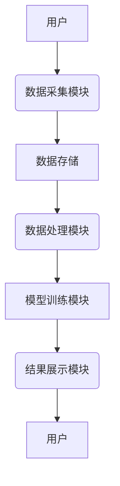

                 


# 智能财务报表分析与解读

## 关键词：智能财务分析、机器学习、财务报表、数据分析、风险管理

## 摘要：  
智能财务报表分析与解读是企业财务管理的重要组成部分，随着人工智能和大数据技术的发展，传统财务分析方法逐渐被智能化、自动化的方法所取代。本文将从智能财务报表分析的背景与概念入手，详细讲解财务报表分析的核心概念与联系，介绍智能分析的关键技术，探讨数据获取与预处理的方法，分析财务指标与趋势预测的实现，设计智能财务分析系统的架构，最后通过项目实战展示智能财务分析的落地应用。本文旨在为企业提供一套高效、准确的智能财务分析解决方案，帮助企业在复杂多变的商业环境中做出明智的决策。

---

# 第一部分: 智能财务报表分析与解读基础

---

## 第1章: 智能财务报表分析的背景与概念

### 1.1 传统财务报表分析的局限性

#### 1.1.1 财务报表分析的传统方法  
传统财务报表分析主要依赖人工审查和计算，包括对利润表、资产负债表和现金流量表的逐一核对，以及对各项财务指标的计算和对比。这种方法虽然能够提供基本的财务信息，但存在效率低下、主观性强、难以量化分析等问题。

#### 1.1.2 传统方法的局限性与不足  
- **效率低下**：人工分析需要大量时间，尤其在面对海量数据时，容易出错且效率低。  
- **主观性强**：分析结果依赖于分析师的经验和判断，存在主观偏差。  
- **难以量化**：传统方法难以对财务数据进行深度挖掘和量化分析，难以发现隐藏的趋势和风险。  

#### 1.1.3 智能技术如何弥补传统方法的不足  
智能技术（如机器学习、自然语言处理和大数据分析）可以通过自动化数据处理、模式识别和预测建模，显著提高财务报表分析的效率和准确性。

---

### 1.2 智能财务报表分析的核心概念  

#### 1.2.1 什么是智能财务报表分析  
智能财务报表分析是利用人工智能技术，对企业的财务数据进行自动化处理、分析和解读的过程。它结合了机器学习、自然语言处理和大数据分析，能够从海量数据中提取有价值的信息，帮助管理者做出更明智的决策。

#### 1.2.2 智能分析与传统分析的主要区别  
| **方面**       | **传统分析**                   | **智能分析**                        |  
|----------------|-------------------------------|------------------------------------|  
| 数据处理       | 人工处理，效率低               | 自动化处理，效率高                   |  
| 模式识别       | 依赖人工经验                   | 通过算法识别隐藏模式                 |  
| 预测能力       | 简单预测，准确性有限           | 可以进行复杂预测，准确性高            |  
| 数据范围       | 数据量小，分析范围有限         | 数据量大，覆盖全面                    |  

#### 1.2.3 智能分析的边界与外延  
智能财务报表分析的边界主要在于财务数据的处理和分析，其外延则包括与企业运营相关的其他数据（如市场数据、供应链数据等），通过多维度数据分析，为企业提供更全面的决策支持。

---

### 1.3 智能财务报表分析的必要性与价值  

#### 1.3.1 企业财务管理的智能化需求  
随着企业规模的扩大和业务复杂度的增加，传统财务分析方法已经难以满足企业的需求，尤其是在数据量庞大、业务场景多样化的背景下，智能化分析成为必然趋势。

#### 1.3.2 智能分析对企业决策的支持作用  
智能分析能够快速识别财务数据中的异常情况，预测未来财务趋势，并为企业优化资源配置、降低风险提供支持。

#### 1.3.3 智能分析的经济效益与竞争优势  
通过智能分析，企业可以显著提高财务分析的效率和准确性，降低人工成本，同时能够更快地响应市场变化，获得竞争优势。

---

## 第2章: 财务报表分析的核心概念与联系  

### 2.1 财务报表分析的核心要素  

#### 2.1.1 利润表、资产负债表、现金流量表的构成  
- **利润表**：反映企业在一定会计期间的经营成果。  
- **资产负债表**：反映企业在某一特定日期的财务状况。  
- **现金流量表**：反映企业在一定会计期间的现金流入和流出情况。  

#### 2.1.2 财务指标的核心计算公式  
- **净利润率**：净利润 / 营业收入 × 100%  
- **资产负债率**：负债总额 / 资产总额 × 100%  
- **流动比率**：流动资产 / 流动负债  

#### 2.1.3 财务报表分析的逻辑关系  
通过分析三张报表之间的关联，可以全面了解企业的财务状况、经营成果和现金流量情况。

---

### 2.2 核心概念的属性特征对比  

#### 2.2.1 利润表与资产负债表的对比分析  
| **属性**       | **利润表**                | **资产负债表**                 |  
|----------------|---------------------------|------------------------------|  
| 数据类型       | 财务指标（收入、成本等）   | 账户余额（资产、负债等）       |  
| 时间维度       | 一定会计期间              | 某一特定日期                   |  
| 主要用途       | 反映经营成果              | 反映财务状况                   |  

#### 2.2.2 财务指标的分类与特征  
- **盈利能力指标**：如净利润率、ROE（净资产收益率）。  
- **偿债能力指标**：如资产负债率、流动比率。  
- **营运能力指标**：如存货周转率、应收账款周转率。  

#### 2.2.3 不同报表的实体关系图  

```mermaid
er
  %% 财务报表分析的ER实体关系图
  entity 财务报表 {
    key 财务报表ID
    attribute 年份
    attribute 季度
  }
  entity 利润表 {
    key 利润表ID
    attribute 营业收入
    attribute 净利润
    attribute 毛利率
  }
  entity 资产负债表 {
    key 资产负债表ID
    attribute 总资产
    attribute 净资产
    attribute 流动资产
  }
  entity 现金流量表 {
    key 现金流量表ID
    attribute 经营活动现金流
    attribute 投资活动现金流
    attribute 筹资活动现金流
  }
  relation 财务报表与利润表 (
    财务报表.财务报表ID - ref 利润表.利润表ID
  )
  relation 财务报表与资产负债表 (
    财务报表.财务报表ID - ref 资产负债表.资产负债表ID
  )
  relation 财务报表与现金流量表 (
    财务报表.财务报表ID - ref 现金流量表.现金流量表ID
  )
```

---

## 第3章: 智能财务报表分析的关键技术  

### 3.1 机器学习在财务分析中的应用  

#### 3.1.1 机器学习的基本原理  
机器学习是一种人工智能技术，通过训练模型从数据中学习规律，并用于预测或分类。在财务分析中，机器学习可以用于财务数据的分类、预测和异常检测。

#### 3.1.2 常见的机器学习算法在财务分析中的应用  
- **线性回归**：用于预测财务指标，如净利润预测。  
- **支持向量机（SVM）**：用于分类问题，如财务健康状况分类。  
- **随机森林**：用于特征重要性分析和分类/回归问题。  

#### 3.1.3 机器学习在财务分析中的实现步骤  
1. **数据收集**：获取财务数据和相关业务数据。  
2. **数据预处理**：清洗数据、处理缺失值、标准化数据。  
3. **特征工程**：选择关键特征，如净利润率、资产负债率等。  
4. **模型训练**：使用训练数据训练模型。  
5. **模型评估**：通过测试数据评估模型性能。  
6. **部署应用**：将模型部署到实际业务中，用于实时分析和预测。  

#### 3.1.4 机器学习在财务分析中的案例  
假设我们使用随机森林算法来预测企业的财务健康状况。我们可以通过对企业财务数据的特征提取和模型训练，构建一个分类模型，预测企业是否可能破产。

---

### 3.2 自然语言处理在财务报告解读中的应用  

#### 3.2.1 自然语言处理的基本原理  
自然语言处理（NLP）是人工智能的一个分支，旨在理解和处理人类语言。在财务分析中，NLP可以用于分析财务报告中的文本信息，提取关键信息。

#### 3.2.2 NLP在财务报告中的应用  
- **关键词提取**：从财务报告中提取关键财务指标。  
- **情感分析**：分析管理层的语气，评估企业信心。  
- **实体识别**：识别报告中的公司名称、金额等实体信息。  

---

### 3.3 数据可视化在财务分析中的应用  

#### 3.3.1 数据可视化的基本原理  
数据可视化是通过图表、图形等方式将数据可视化，帮助用户更直观地理解和分析数据。

#### 3.3.2 常见的财务数据可视化方法  
- **柱状图**：比较不同期间的财务指标。  
- **折线图**：显示财务指标的趋势变化。  
- **饼图**：展示资产、负债和所有者权益的构成比例。  

---

## 第4章: 数据获取与预处理  

### 4.1 数据获取的常见方法  

#### 4.1.1 数据库查询  
通过SQL查询财务数据，例如：
```sql
SELECT * FROM 财务报表 WHERE 年份 = '2023';
```

#### 4.1.2 API接口调用  
通过API获取实时财务数据，例如使用Yahoo Finance API。

#### 4.1.3 文件导入  
将财务数据从Excel或CSV文件导入分析工具。

---

### 4.2 数据预处理的关键步骤  

#### 4.2.1 数据清洗  
- **处理缺失值**：使用均值、中位数或删除缺失值。  
- **处理异常值**：通过Z-score或IQR方法识别并处理异常值。  

#### 4.2.2 数据标准化  
- **归一化**：将数据缩放到0-1范围。  
- **标准化**：将数据转换为均值为0、标准差为1的分布。  

#### 4.2.3 数据增强  
通过数据增强技术（如随机删除部分数据）提高模型的泛化能力。

---

## 第5章: 财务指标分析与趋势预测  

### 5.1 财务指标分析的核心方法  

#### 5.1.1 财务指标分析的逻辑  
通过分析各项财务指标，评估企业的盈利能力、偿债能力和营运能力。

---

### 5.2 财务指标趋势预测的实现  

#### 5.2.1 时间序列分析  
使用ARIMA模型进行时间序列预测，例如预测企业的净利润率。

#### 5.2.2 LSTM网络  
使用长短期记忆网络（LSTM）进行时间序列预测，能够更好地捕捉数据的长期依赖关系。

---

## 第6章: 系统架构设计与实现  

### 6.1 系统架构设计  

#### 6.1.1 系统功能设计  
- **数据采集模块**：从数据库、API或文件中获取数据。  
- **数据处理模块**：清洗、标准化和增强数据。  
- **模型训练模块**：训练机器学习模型。  
- **结果展示模块**：可视化分析结果。  

#### 6.1.2 系统架构图  



---

### 6.2 系统实现  

#### 6.2.1 核心代码实现  
```python
import pandas as pd
from sklearn.ensemble import RandomForestClassifier
from sklearn.metrics import accuracy_score

# 数据加载
data = pd.read_csv('financial_data.csv')

# 特征选择
features = data[['净利润率', '资产负债率', '流动比率']]
target = data['财务健康状况']

# 模型训练
model = RandomForestClassifier()
model.fit(features, target)

# 模型预测
predictions = model.predict(features)
print("模型准确率:", accuracy_score(target, predictions))
```

---

## 第7章: 项目实战与案例分析  

### 7.1 项目背景与目标  
本项目旨在利用机器学习技术，构建一个智能财务分析系统，帮助企业管理者快速分析财务数据，识别潜在风险，优化决策。

---

### 7.2 实战环境搭建  

#### 7.2.1 安装必要的库  
```bash
pip install pandas scikit-learn matplotlib
```

---

### 7.3 核心代码实现  

#### 7.3.1 数据加载与预处理  
```python
import pandas as pd
import numpy as np

# 加载数据
data = pd.read_csv('financial_data.csv')

# 处理缺失值
data = data.dropna()

# 标准化数据
from sklearn.preprocessing import StandardScaler
scaler = StandardScaler()
scaled_data = scaler.fit_transform(data[['净利润率', '资产负债率', '流动比率']])
```

#### 7.3.2 模型训练与预测  
```python
from sklearn.ensemble import RandomForestClassifier
from sklearn.metrics import classification_report

# 训练模型
model = RandomForestClassifier()
model.fit(scaled_data, data['财务健康状况'])

# 预测结果
 predictions = model.predict(scaled_data)
 print(classification_report(data['财务健康状况'], predictions))
```

---

## 第8章: 总结与展望  

### 8.1 本章总结  
智能财务报表分析通过结合机器学习和大数据技术，显著提高了财务分析的效率和准确性。本文从理论到实践，详细讲解了智能财务分析的关键技术、系统架构设计和项目实现。

---

### 8.2 未来展望  
随着人工智能技术的不断发展，智能财务分析将更加智能化、自动化。未来的研究方向包括更复杂的模型优化、多模态数据融合以及实时分析能力的提升。

---

## 注意事项  

- 在实际项目中，数据预处理和特征工程是关键，需要根据具体业务场景进行调整。  
- 模型的选择和优化需要结合实际数据特点和业务需求。  
- 系统设计时要考虑可扩展性和可维护性，避免过于耦合的设计。  

---

## 最佳实践  

- 定期更新模型，避免因数据变化导致模型失效。  
- 使用可视化工具（如Tableau）进行数据展示，提升用户体验。  
- 结合业务知识，合理选择和解释模型结果。  

---

通过本文的系统讲解，读者可以全面掌握智能财务报表分析的核心概念、关键技术及实现方法，为企业财务管理的智能化转型提供有力支持。

