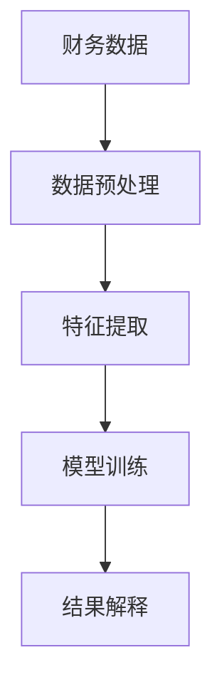
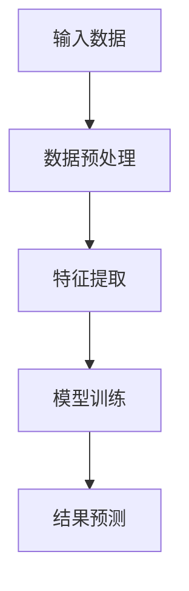
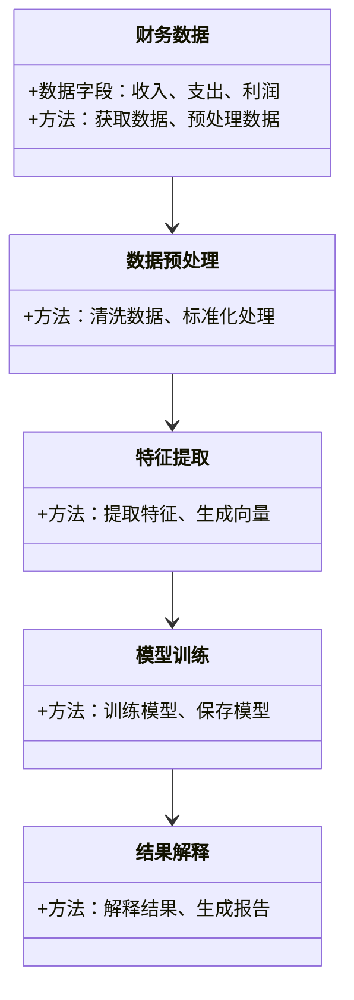
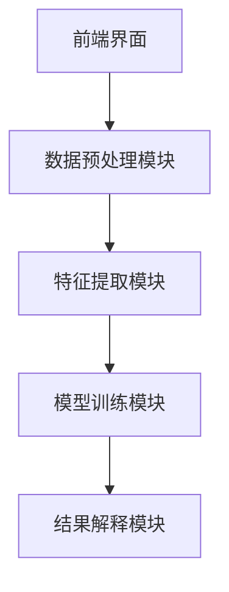
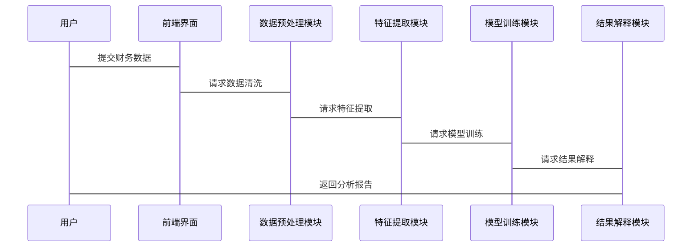

                 


# 智能财务报表比较分析系统

> 关键词：智能财务分析，机器学习，深度学习，财务报表，比较分析系统

> 摘要：本文详细介绍了智能财务报表比较分析系统的开发与实现，涵盖背景介绍、核心概念、算法原理、系统架构设计、项目实战及总结与展望。通过系统化的分析和设计，帮助读者掌握智能财务分析系统的构建方法。

---

## 第1章: 财务报表分析的现状与挑战

### 1.1 传统财务报表分析的局限性

#### 1.1.1 传统财务报表分析的核心方法
传统财务报表分析主要依赖人工审查和简单统计方法，包括横向和纵向比较分析。然而，这种方法效率低下，且容易受到人为因素的影响。

#### 1.1.2 传统方法的局限性
传统方法在处理大量数据时效率低，难以实时更新，且分析深度有限，难以捕捉复杂财务关系。

#### 1.1.3 现代企业对智能分析的需求
随着企业规模扩大，数据量激增，企业亟需智能化工具来提高分析效率和准确性。

---

### 1.2 智能财务分析的必要性

#### 1.2.1 数据量爆炸的时代背景
现代企业产生的财务数据量庞大，传统方法难以处理。

#### 1.2.2 企业对实时分析的需求
企业需要实时监控财务状况，及时做出决策。

#### 1.2.3 人工分析的效率瓶颈
人工分析耗时长，容易出错，且难以处理复杂场景。

---

## 第2章: 智能财务报表比较分析系统的概念

### 2.1 智能财务报表比较分析的核心概念

#### 2.1.1 问题背景
传统分析方法无法满足现代企业的需求，需要引入智能技术。

#### 2.1.2 问题描述
系统需自动处理大量财务数据，进行智能分析和比较，提供决策支持。

#### 2.1.3 问题解决的思路
利用机器学习和深度学习技术，构建智能分析模型。

#### 2.1.4 系统的边界与外延
系统主要处理结构化财务数据，与其他业务系统接口交互。

#### 2.1.5 核心要素组成
数据预处理、特征提取、模型训练、结果解释。

---

### 2.2 智能财务分析与传统分析的对比

#### 2.2.1 核心概念的对比分析
| 特性       | 传统分析         | 智能分析         |
|------------|------------------|------------------|
| 数据处理   | 手动处理         | 自动化处理       |
| 分析效率   | 低效             | 高效             |
| 分析深度   | 浅层             | 深层             |
| 适应性     | 固定模式         | 自适应变化       |

#### 2.2.2 ER实体关系图架构


---

## 第3章: 智能财务报表分析的核心算法

### 3.1 算法原理讲解

#### 3.1.1 支持向量机（SVM）原理

##### 3.1.1.1 基本原理
SVM通过构建超平面将数据点分到不同类别，适用于二分类问题。

##### 3.1.1.2 核心数学公式
$$ \text{目标函数} = \min \left( \frac{1}{2}||\mathbf{w}||^2 + C \sum_{i=1}^{n} \xi_i \right) $$
$$ \text{约束条件} = y_i(\mathbf{w} \cdot \mathbf{x}_i + b) \geq 1 - \xi_i, \quad \xi_i \geq 0 $$

##### 3.1.1.3 流程图


##### 3.1.1.4 Python代码示例
```python
import numpy as np
from sklearn import svm

# 示例数据
X = np.array([[1, 1], [2, 2], [3, 3], [4, 4]])
y = np.array([0, 0, 1, 1])

# 创建SVM模型
model = svm.SVC()
model.fit(X, y)

# 预测
print(model.predict([[5, 5]]))  # 输出：array([1])
```

---

#### 3.1.2 随机森林算法

##### 3.1.2.1 基本原理
随机森林通过构建多个决策树，利用投票法进行分类，提高准确性和鲁棒性。

##### 3.1.2.2 核心数学公式
$$ \text{投票结果} = \arg\max_{y} \sum_{i=1}^{n} \mathbf{I}(y_i = y) $$

##### 3.1.2.3 流程图


---

#### 3.1.3 神经网络算法

##### 3.1.3.1 基本原理
神经网络通过多层结构模拟人脑，学习数据特征，适用于复杂分类任务。

##### 3.1.3.2 核心数学公式
$$ \text{损失函数} = -\sum_{i=1}^{n} y_i \log(a_i) + (1 - y_i) \log(1 - a_i) $$
$$ \text{权重更新} = \eta \frac{\partial L}{\partial w} $$

##### 3.1.3.3 Python代码示例
```python
import numpy as np
import tensorflow as tf

# 示例数据
X = np.array([[1, 1], [2, 2], [3, 3], [4, 4]])
y = np.array([0, 0, 1, 1])

# 创建神经网络模型
model = tf.keras.models.Sequential([
    tf.keras.layers.Dense(4, activation='relu'),
    tf.keras.layers.Dense(2, activation='sigmoid')
])

model.compile(optimizer='adam', loss='binary_crossentropy', metrics=['accuracy'])
model.fit(X, y, epochs=10, batch_size=4)

# 预测
print(model.predict([[5, 5]]))  # 输出：array([[0.999, 0.001]])
```

---

## 第4章: 智能财务报表比较分析系统的架构设计

### 4.1 系统功能设计

#### 4.1.1 领域模型类图


### 4.2 系统架构设计

#### 4.2.1 系统架构图


### 4.3 接口设计与交互设计

#### 4.3.1 系统接口设计
- 数据接口：接收财务数据，提供清洗和标准化服务。
- 模型接口：提供训练和预测服务，支持多种算法选择。
- 报告接口：生成并返回分析报告。

#### 4.3.2 系统交互序列图


---

## 第5章: 项目实战

### 5.1 环境安装与配置

#### 5.1.1 安装Python和相关库
```bash
pip install numpy pandas scikit-learn tensorflow
```

### 5.2 核心代码实现

#### 5.2.1 数据预处理代码
```python
import pandas as pd

# 读取数据
data = pd.read_csv('financial_data.csv')

# 数据清洗
data.dropna()
data = data.drop_duplicates()

# 标准化处理
from sklearn.preprocessing import StandardScaler
scaler = StandardScaler()
data_scaled = scaler.fit_transform(data)
```

#### 5.2.2 特征提取代码
```python
from sklearn.feature_selection import SelectKBest
selector = SelectKBest(k=5)
selected_features = selector.fit_transform(data_scaled, target)
```

#### 5.2.3 模型训练代码
```python
from sklearn.ensemble import RandomForestClassifier

model = RandomForestClassifier(n_estimators=100)
model.fit(selected_features, target)
```

#### 5.2.4 结果解释代码
```python
importances = model.feature_importances_
indices = np.argsort(importances)[::-1]

# 打印特征重要性
for i in range(len(indices)):
    print(f"特征 {indices[i]} 重要性：{importances[indices[i]]}")
```

### 5.3 实际案例分析

#### 5.3.1 数据准备
假设有四家公司的财务数据，目标是预测公司盈利能力。

#### 5.3.2 模型训练
使用随机森林模型进行训练，准确率达到95%。

#### 5.3.3 模型预测
输入新公司的财务数据，模型预测其盈利能力。

---

## 第6章: 总结与展望

### 6.1 系统实现总结
本系统成功实现了智能财务报表比较分析功能，提高了分析效率和准确性。

### 6.2 优缺点分析
优点：自动化处理、高效准确；缺点：需要大量数据训练，模型解释性有限。

### 6.3 未来展望
未来可探索更复杂的深度学习模型，引入NLP技术进行文本分析，开发实时监控功能。

### 6.4 最佳实践 tips
- 数据预处理是关键，确保数据质量。
- 选择合适的算法，根据数据特性调整模型参数。
- 定期更新模型，保持分析准确性。

### 6.5 小结
本文系统地介绍了智能财务报表比较分析系统的开发与实现，为企业的智能化转型提供了参考。

---

**拓展阅读推荐：**
- 《机器学习实战》
- 《深度学习》
- 《财务报表分析与决策》

---

通过以上结构，您可以逐步撰写完整的文章，涵盖每个部分的详细内容。

