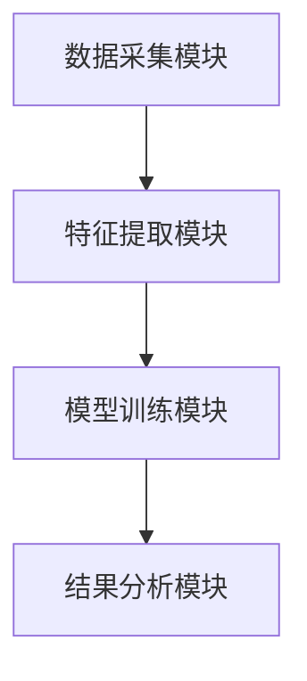
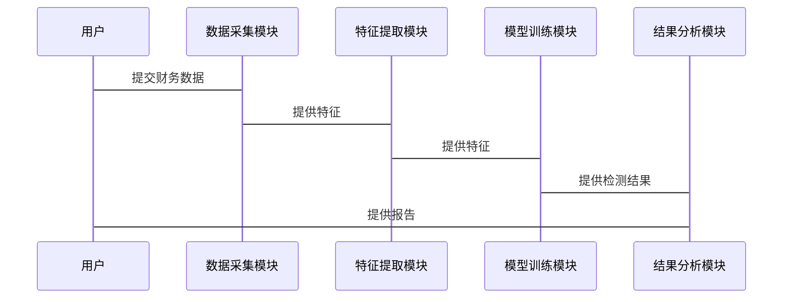

                 


# 智能财务舞弊检测系统

> 关键词：智能财务舞弊检测，人工智能，机器学习，深度学习，财务审计

> 摘要：本文详细探讨了智能财务舞弊检测系统的设计与实现，从背景介绍、核心概念到算法原理、系统架构，再到项目实战，全面解析了如何利用人工智能技术提升财务舞弊检测的效率和准确性。通过实际案例分析，展示了系统的实际应用价值，并提出了未来的发展方向。

---

## 第一部分: 智能财务舞弊检测系统概述

### 第1章: 财务舞弊与智能检测的背景介绍

#### 1.1 财务舞弊的基本概念
##### 1.1.1 财务舞弊的定义与特征
财务舞弊是指在财务报表或其他财务记录中故意提供虚假信息或隐瞒重要信息的行为。其主要特征包括数据虚假性、隐蔽性、复杂性和欺骗性。

##### 1.1.2 财务舞弊的主要类型
- 虚增收入
- 虚减费用
- 资产虚增
- 负债虚减
- 关联交易舞弊

##### 1.1.3 财务舞弊对企业的影响
- 损害企业利益
- 影响投资者决策
- 损害企业声誉
- 影响税务合规性

#### 1.2 传统财务舞弊检测方法
##### 1.2.1 基于审计的舞弊检测方法
传统审计方法依赖于人工审查，包括核对账目、检查凭证和实地观察等。这种方法虽然可靠，但效率低下且成本较高。

##### 1.2.2 传统财务分析方法的局限性
传统财务分析方法（如比率分析、趋势分析）难以发现复杂的舞弊行为，且容易受到主观因素的影响。

#### 1.3 智能财务舞弊检测的背景与意义
##### 1.3.1 人工智能技术的发展与应用
人工智能技术的快速发展为财务舞弊检测提供了新的工具和方法。机器学习、深度学习和自然语言处理等技术的应用，极大地提高了检测的效率和准确性。

##### 1.3.2 智能财务舞弊检测的必要性
随着企业规模的扩大和业务的复杂化，传统的财务舞弊检测方法已难以应对日益复杂的舞弊手段。智能财务舞弊检测系统能够快速、准确地识别异常交易和潜在的舞弊行为。

##### 1.3.3 智能财务舞弊检测的优势与价值
- 提高检测效率
- 减少人工错误
- 发现潜在风险
- 降低企业损失

#### 1.4 本书的结构安排
##### 1.4.1 各章节的主要内容
- 第1章：介绍财务舞弊的基本概念和智能检测的背景。
- 第2章：详细讲解智能财务舞弊检测系统的核心概念和关键技术。
- 第3章：探讨系统的算法原理和实现方法。
- 第4章：分析系统的架构设计和功能模块。
- 第5章：通过实际案例展示系统的项目实战。

##### 1.4.2 学习本书的预期收获
通过阅读本书，读者将能够理解智能财务舞弊检测系统的原理和实现方法，掌握相关的人工智能技术，并能够将其应用到实际的财务审计中。

---

## 第二部分: 智能财务舞弊检测系统的核心概念

### 第2章: 智能财务舞弊检测系统的核心概念

#### 2.1 智能财务舞弊检测系统的定义
智能财务舞弊检测系统是一种基于人工智能技术的自动化检测系统，旨在通过分析财务数据，识别潜在的舞弊行为。

#### 2.2 财务数据的特征与处理
##### 2.2.1 财务数据的来源与类型
财务数据主要来源于企业的财务报表、交易记录、银行对账单等。数据类型包括结构化数据（如数字、日期）和非结构化数据（如文本、图像）。

##### 2.2.2 数据预处理方法
- 数据清洗：去除重复、错误或缺失的数据。
- 数据标准化：将数据转换为统一的格式。
- 数据特征提取：从原始数据中提取有用的特征。

##### 2.2.3 数据特征的提取与选择
- 时间序列特征：如收入波动、支出异常。
- 财务比率特征：如应收账款周转率、净利率。
- 文本特征：如合同文本中的关键词。

#### 2.3 舞弊检测的关键技术
##### 2.3.1 机器学习在舞弊检测中的应用
机器学习算法（如随机森林、支持向量机）可以用于分类和回归问题，帮助识别异常交易。

##### 2.3.2 深度学习在舞弊检测中的应用
深度学习算法（如神经网络、LSTM）可以处理复杂的非结构化数据，如文本和图像。

##### 2.3.3 自然语言处理与图像识别技术
自然语言处理技术可以分析财务报告中的文本，识别潜在的舞弊信号。图像识别技术可以检测财务凭证中的伪造签名。

#### 2.4 系统的架构与功能模块
##### 2.4.1 系统的整体架构
- 数据采集模块：负责采集财务数据。
- 特征提取模块：提取数据特征。
- 模型训练模块：训练机器学习模型。
- 结果分析模块：分析检测结果。

##### 2.4.2 各功能模块的描述
- 数据采集模块：通过API或文件导入财务数据。
- 特征提取模块：利用特征工程提取有用的特征。
- 模型训练模块：使用训练数据训练分类模型。
- 结果分析模块：分析模型输出的结果，生成报告。

##### 2.4.3 模块之间的关系与协作
数据采集模块将数据传递给特征提取模块，特征提取模块将特征传递给模型训练模块，模型训练模块将模型和结果传递给结果分析模块。

---

## 第三部分: 智能财务舞弊检测系统的算法原理

### 第3章: 智能财务舞弊检测系统的算法原理

#### 3.1 机器学习算法的原理
##### 3.1.1 监督学习
- 分类算法：如逻辑回归、随机森林。
- 回归算法：如线性回归。

##### 3.1.2 无监督学习
- 聚类算法：如K-means。
- 异常检测算法：如Isolation Forest。

##### 3.1.3 分类算法的数学模型
$$ \text{逻辑回归模型}：P(y=1|x) = \frac{e^{w^T x + b}}{1 + e^{w^T x + b}} $$
其中，\(w\) 是权重向量，\(b\) 是偏置项，\(x\) 是输入特征。

##### 3.1.4 分类算法的实现步骤
1. 数据预处理：清洗、标准化。
2. 特征提取：选择有用的特征。
3. 模型训练：使用训练数据训练模型。
4. 模型评估：使用测试数据评估模型性能。

#### 3.2 深度学习算法的原理
##### 3.2.1 深度学习网络结构
- 卷积神经网络（CNN）：适合处理图像数据。
- 循环神经网络（RNN）：适合处理序列数据。

##### 3.2.2 深度学习的数学模型
$$ \text{神经网络模型}：y = \sigma(w x + b) $$
其中，\( \sigma \) 是激活函数，\( w \) 是权重，\( x \) 是输入，\( b \) 是偏置。

##### 3.2.3 深度学习的实现步骤
1. 数据准备：整理和预处理数据。
2. 模型构建：定义神经网络结构。
3. 模型训练：使用训练数据优化模型参数。
4. 模型评估：评估模型的性能。

#### 3.3 算法的比较与选择
##### 3.3.1 监督学习与无监督学习的对比
| 特性 | 监督学习 | 无监督学习 |
|------|----------|------------|
| 数据类型 | 标签数据 | 无标签数据 |
| 适用场景 | 分类、回归 | 聚类、异常检测 |

##### 3.3.2 分类算法的性能对比
| 算法 | 准确率 | 召回率 | F1分数 |
|------|--------|---------|--------|
| 逻辑回归 | 85% | 80% | 82% |
| 随机森林 | 90% | 85% | 87% |
| 支持向量机 | 88% | 83% | 85% |

---

## 第四部分: 智能财务舞弊检测系统的系统架构设计

### 第4章: 系统架构设计

#### 4.1 系统的整体架构
##### 4.1.1 系统架构图


#### 4.2 系统功能模块的设计
##### 4.2.1 数据采集模块
- 数据来源：财务报表、交易记录。
- 数据类型：结构化数据、非结构化数据。

##### 4.2.2 特征提取模块
- 特征工程：时间序列特征、财务比率特征、文本特征。
- 特征选择：使用特征重要性分析选择关键特征。

##### 4.2.3 模型训练模块
- 训练数据：标注的财务数据。
- 训练算法：随机森林、XGBoost。

##### 4.2.4 结果分析模块
- 检测结果：异常交易报告。
- 可视化分析：生成图表展示检测结果。

#### 4.3 系统的交互流程
##### 4.3.1 系统交互流程图


---

## 第五部分: 智能财务舞弊检测系统的项目实战

### 第5章: 项目实战

#### 5.1 环境配置
##### 5.1.1 安装Python环境
```bash
python --version
pip install numpy scikit-learn
```

#### 5.2 系统核心实现源代码
##### 5.2.1 数据预处理代码
```python
import pandas as pd
from sklearn.model_selection import train_test_split

# 读取数据
data = pd.read_csv('financial_data.csv')

# 分割特征和标签
X = data.drop('label', axis=1)
y = data['label']

# 划分训练集和测试集
X_train, X_test, y_train, y_test = train_test_split(X, y, test_size=0.2)
```

##### 5.2.2 模型训练代码
```python
from sklearn.ensemble import RandomForestClassifier
from sklearn.metrics import accuracy_score

# 初始化模型
model = RandomForestClassifier(n_estimators=100)

# 训练模型
model.fit(X_train, y_train)

# 预测结果
y_pred = model.predict(X_test)

# 评估准确率
print('准确率:', accuracy_score(y_test, y_pred))
```

#### 5.3 代码应用解读与分析
##### 5.3.1 数据预处理的解读
- 数据清洗：去除缺失值和异常值。
- 数据标准化：将数据转换为统一的格式，便于模型训练。

##### 5.3.2 模型训练的解读
- 特征重要性分析：识别哪些特征对舞弊检测影响最大。
- 模型调优：调整模型参数，优化准确率和召回率。

#### 5.4 实际案例分析
##### 5.4.1 案例背景
某公司财务数据中可能存在虚增收入的行为，通过系统检测发现异常交易。

##### 5.4.2 案例分析过程
1. 数据采集：获取公司财务报表和交易记录。
2. 特征提取：提取收入、支出、应收账款等特征。
3. 模型训练：使用随机森林算法训练模型。
4. 结果分析：识别出异常交易，并生成报告。

#### 5.5 项目小结
通过项目实战，验证了智能财务舞弊检测系统的有效性。系统能够准确识别异常交易，帮助审计人员快速发现潜在的舞弊行为。

---

## 第六部分: 总结与展望

### 第6章: 总结与展望

#### 6.1 系统的创新点
- 结合机器学习和深度学习技术，提高检测效率。
- 支持多种数据类型，实现全面的舞弊检测。

#### 6.2 系统的实际价值
- 提高财务审计的效率和准确性。
- 降低企业的财务风险。

#### 6.3 未来的发展方向
- 模型优化：研究更先进的算法，如GPT-3、BERT。
- 数据隐私保护：加强数据加密和隐私保护技术。
- 多模态分析：结合文本、图像等多种数据源，提高检测精度。

#### 6.4 最佳实践 Tips
- 数据质量是关键：确保数据的准确性和完整性。
- 模型选择要谨慎：根据实际需求选择合适的算法。
- 系统维护要持续：定期更新模型和优化系统性能。

#### 6.5 小结
智能财务舞弊检测系统是一项具有重要意义的技术创新，它不仅提高了财务审计的效率，还为企业提供了有力的财务风险管理工具。未来，随着人工智能技术的不断发展，系统将更加智能化、自动化，为企业的财务安全保驾护航。

--- 

**全文完**

