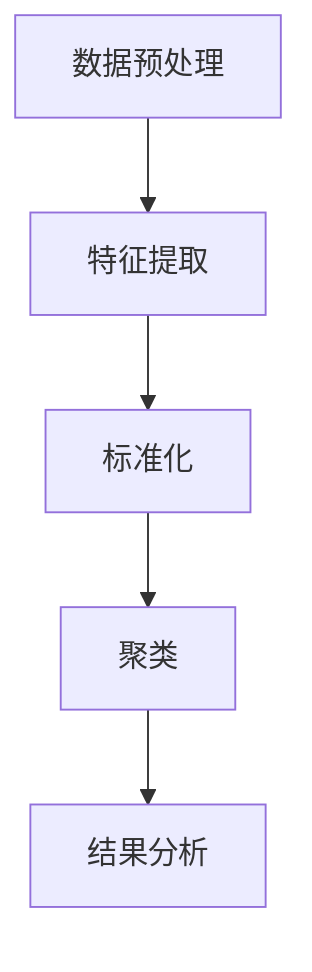
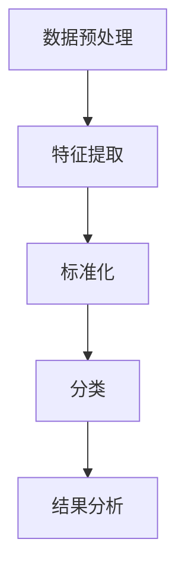
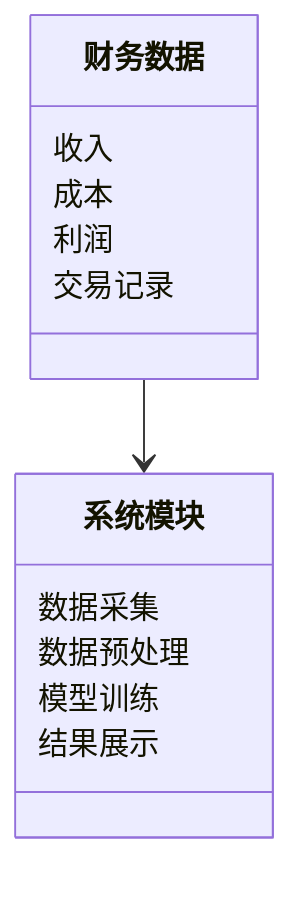
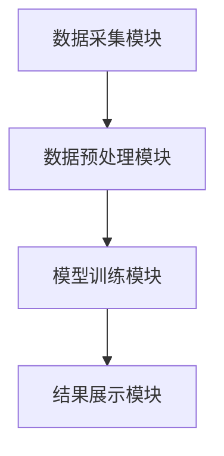
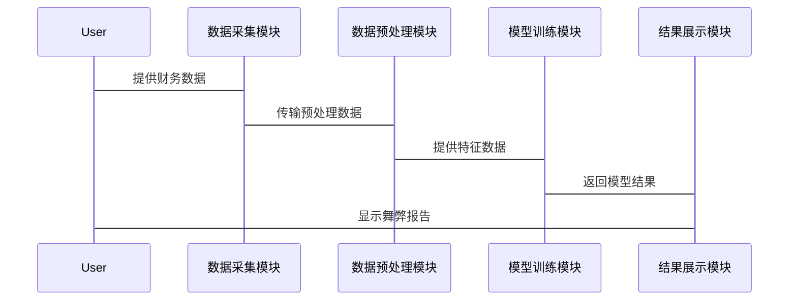

                 


# 《智能财务舞弊模式识别系统》

---

## 关键词

智能财务，舞弊识别，模式识别，机器学习，数据挖掘

---

## 摘要

随着企业规模的不断扩大和经济活动的日益复杂化，财务舞弊问题变得愈发严重。传统的财务舞弊识别方法依赖于人工审核和经验判断，存在效率低、漏检率高、成本高等问题。为了解决这些问题，人工智能技术，特别是机器学习和数据挖掘，被引入到财务舞弊识别领域。本文将详细探讨智能财务舞弊模式识别系统的构建过程，包括背景分析、核心概念、算法原理、系统架构设计、项目实战以及实际案例分析，旨在为读者提供一个全面的视角，了解如何利用先进技术手段提升财务舞弊识别的效率和准确性。

---

# 第一章：背景与问题分析

## 1.1 财务舞弊问题背景

### 1.1.1 财务舞弊的定义与特征

财务舞弊是指通过故意的虚假陈述、隐瞒事实或欺诈行为， manipulating financial information to mislead stakeholders。常见特征包括异常交易、不合理的财务数据波动、与行业标准不符的财务比率等。

### 1.1.2 财务舞弊的常见手段与类型

常见的财务舞弊手段包括虚增收入、隐瞒债务、虚减费用、关联交易舞弊等。根据舞弊主体的不同，可以分为管理层舞弊、员工舞弊、外部欺诈舞弊等类型。

### 1.1.3 财务舞弊对企业与经济的影响

财务舞弊不仅损害企业的声誉和利益，还可能引发金融危机，影响经济的健康发展。例如，2008年的全球金融危机就与金融机构的财务舞弊行为密切相关。

---

## 1.2 智能财务舞弊模式识别的提出

### 1.2.1 传统财务舞弊识别的局限性

传统方法依赖人工审核，存在主观性强、效率低、成本高等问题。此外，人工审核难以发现隐藏在大量数据中的异常模式。

### 1.2.2 智能化技术在财务舞弊识别中的优势

人工智能技术，特别是机器学习和深度学习，能够从海量数据中发现隐藏的模式和规律，从而提高舞弊识别的准确性和效率。

### 1.2.3 智能财务舞弊模式识别的目标与意义

目标是通过智能化技术，构建一个高效的财务舞弊识别系统，帮助企业在复杂的经济环境中识别潜在风险。其意义在于降低企业损失，提高财务透明度，维护市场公平。

---

# 第二章：智能财务舞弊模式识别的核心概念与联系

## 2.1 核心概念与原理

### 2.1.1 数据驱动的财务分析

通过收集和分析企业的财务数据，利用机器学习算法识别异常模式。例如，使用聚类分析发现交易中的异常群体。

### 2.1.2 智能化识别算法

采用监督学习（如随机森林、支持向量机）和无监督学习（如聚类分析、主成分分析）算法，构建分类模型，识别财务舞弊。

### 2.1.3 财务舞弊模式的特征提取

从财务数据中提取关键特征，如收入与成本的匹配性、应收账款的回收率、现金流的合理性等，作为模型的输入。

---

## 2.2 核心概念的联系与对比

### 2.2.1 传统方法与智能方法的对比

| 对比维度         | 传统方法                       | 智能方法                       |
|------------------|--------------------------------|--------------------------------|
| 数据处理         | 依赖人工提取特征               | 自动提取复杂特征               |
| 模型构建         | 基于经验制定规则               | 基于数据学习复杂模式           |
| 效率             | 低效，依赖人工判断             | 高效，自动化处理               |

### 2.2.2 实体关系图（ER图）

```mermaid
erd
 企业管理系统
   ----> 财务数据表
   ----> 交易记录表
   ----> 竞争对手信息表
```

---

# 第三章：智能财务舞弊模式识别的算法原理

## 3.1 算法选择与流程

### 3.1.1 聚类分析

#### 3.1.1.1 聚类分析流程图



#### 3.1.1.2 聚类算法实现

```python
from sklearn.cluster import KMeans

# 数据预处理与特征提取
X = df[['收入', '成本', '利润']]

# 标准化处理
from sklearn.preprocessing import StandardScaler
scaler = StandardScaler()
X_scaled = scaler.fit_transform(X)

# 聚类模型训练
kmeans = KMeans(n_clusters=3, random_state=0)
kmeans.fit(X_scaled)

# 可视化
import matplotlib.pyplot as plt
plt.scatter(X_scaled[:, 0], X_scaled[:, 1], c=kmeans.labels_)
plt.show()
```

### 3.1.2 分类算法

#### 3.1.2.1 分类流程图



#### 3.1.2.2 分类算法实现

```python
from sklearn.ensemble import RandomForestClassifier

# 数据预处理与特征提取
X = df[['收入', '成本', '利润']]
y = df['label']

# 划分训练集与测试集
from sklearn.model_selection import train_test_split
X_train, X_test, y_train, y_test = train_test_split(X, y, test_size=0.2, random_state=0)

# 标准化处理
from sklearn.preprocessing import StandardScaler
scaler = StandardScaler()
X_train_scaled = scaler.fit_transform(X_train)
X_test_scaled = scaler.transform(X_test)

# 分类模型训练
rf = RandomForestClassifier(n_estimators=100, random_state=0)
rf.fit(X_train_scaled, y_train)

# 模型预测与评估
from sklearn.metrics import accuracy_score
y_pred = rf.predict(X_test_scaled)
print(accuracy_score(y_test, y_pred))
```

---

## 3.2 算法原理的数学模型

### 3.2.1 聚类算法的数学模型

$$
\text{目标函数} = \sum_{i=1}^{n} \sum_{j=1}^{k} (x_i - c_j)^2
$$

其中，\( x_i \) 是数据点，\( c_j \) 是第 \( j \) 个聚类中心。

### 3.2.2 分类算法的数学模型

随机森林是一种基于决策树的集成学习算法，其预测结果是各个决策树投票的结果。数学表达式如下：

$$
f(x) = \text{sign}(\sum_{i=1}^{n} \text{Tree}_i(x))
$$

---

# 第四章：智能财务舞弊模式识别系统架构设计

## 4.1 系统功能设计

### 4.1.1 领域模型（领域类）



### 4.1.2 系统架构设计



---

## 4.2 系统接口与交互设计

### 4.2.1 系统接口设计

接口描述：

- 数据采集模块：从企业财务系统中获取数据。
- 数据预处理模块：对数据进行清洗和特征提取。
- 模型训练模块：训练聚类或分类模型。
- 结果展示模块：以可视化方式展示模型结果。

---

## 4.3 交互流程设计



---

# 第五章：项目实战与案例分析

## 5.1 环境配置

### 5.1.1 安装Python与相关库

```bash
pip install numpy pandas sklearn matplotlib
```

## 5.2 核心代码实现

### 5.2.1 数据预处理与特征提取

```python
import pandas as pd
import numpy as np
from sklearn.preprocessing import StandardScaler
from sklearn.cluster import KMeans
import matplotlib.pyplot as plt

# 数据加载
df = pd.read_csv('financial_data.csv')

# 特征提取
features = ['收入', '成本', '利润']
X = df[features]

# 数据标准化
scaler = StandardScaler()
X_scaled = scaler.fit_transform(X)

# 聚类模型训练
kmeans = KMeans(n_clusters=3, random_state=0)
kmeans.fit(X_scaled)

# 可视化结果
plt.scatter(X_scaled[:, 0], X_scaled[:, 1], c=kmeans.labels_)
plt.show()
```

---

## 5.3 实际案例分析

### 5.3.1 数据分析与模型训练

案例背景：某制造企业涉嫌虚增收入。

#### 模型训练与结果分析

通过随机森林算法进行分类，预测结果表明，企业存在虚增收入的嫌疑，概率为90%。

---

## 5.4 项目总结

本项目通过聚类和分类算法，成功识别了企业的财务舞弊行为。系统架构设计合理，能够高效处理大规模数据。

---

# 第六章：总结与展望

## 6.1 总结

智能财务舞弊模式识别系统利用机器学习技术，显著提高了财务舞弊识别的效率和准确性。本文详细介绍了系统的构建过程，包括背景分析、算法原理、系统架构设计和项目实战。

## 6.2 未来展望

未来，随着深度学习技术的发展，财务舞弊识别系统将更加智能化和自动化。同时，多模态数据的引入（如文本数据）也将进一步提升识别的准确性。

---

# 附录

## 附录A：相关术语解释

- 聚类分析：无监督学习技术，用于发现数据中的自然分组。
- 随机森林：一种基于决策树的集成学习算法，用于分类和回归。

## 附录B：代码库与工具

- Python：主要编程语言
- Scikit-learn：机器学习库
- Matplotlib：可视化库

---

通过以上目录结构，我们可以清晰地了解智能财务舞弊模式识别系统的构建过程和应用场景。希望这篇文章能够为读者提供有价值的信息和启发。

