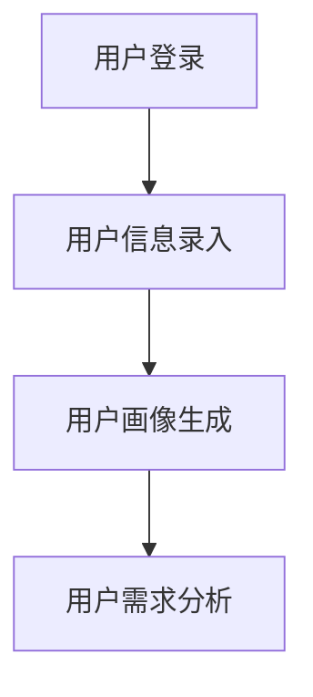
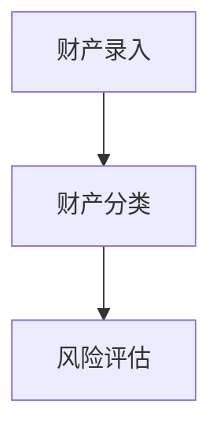
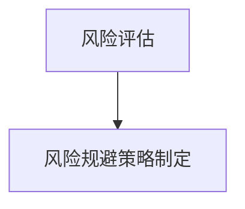
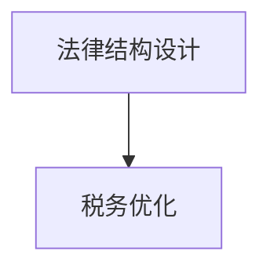
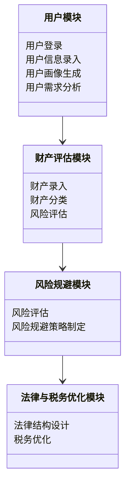
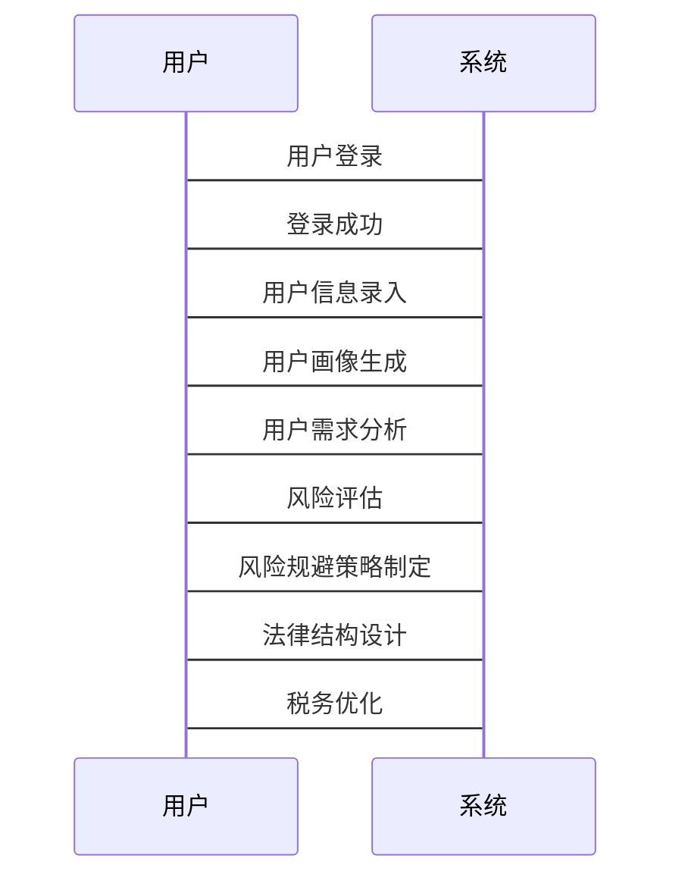

                 


# 智能财富传承规划助手

## 关键词：智能财富传承、人工智能、财富管理、风险管理、系统架构

## 摘要：智能财富传承规划助手是一种基于人工智能技术的财富管理工具，旨在通过智能化的分析和规划，帮助用户实现财富的有效传承。本文将从背景介绍、核心概念、算法原理、系统架构、项目实战和最佳实践等方面详细阐述智能财富传承规划助手的技术实现和应用场景。

---

# 第一部分: 智能财富传承规划助手的背景与核心概念

## 第1章: 智能财富传承规划助手的背景介绍

### 1.1 智能财富传承规划的定义与重要性

#### 1.1.1 财富传承的基本概念
财富传承是指通过法律、税务和风险管理等手段，将财富从一代人转移到下一代人或其他指定受益人手中的过程。传统财富传承方式通常依赖于法律文件（如遗嘱）和税务规划，但随着社会经济的复杂化，传统方法逐渐暴露出效率低下、风险难控等问题。

#### 1.1.2 智能财富传承的定义
智能财富传承是指利用人工智能、大数据和机器学习等技术，结合法律、税务和风险管理知识，为用户提供智能化的财富传承规划方案。通过智能算法和数据分析，系统能够实时评估用户的财富状况、风险偏好和传承需求，生成个性化的财富传承方案。

#### 1.1.3 智能财富传承的重要性和应用场景
智能财富传承的重要性和应用场景主要体现在以下几个方面：
- **个性化规划**：基于用户的财务状况、家庭结构和传承需求，提供个性化的传承方案。
- **风险控制**：通过智能分析和预测，识别潜在风险并制定规避策略。
- **效率提升**：利用人工智能技术，快速生成和优化传承方案，提高规划效率。
- **动态调整**：根据市场变化和用户需求的动态调整，实时更新传承方案。

### 1.2 智能财富传承规划助手的必要性

#### 1.2.1 传统财富传承规划的局限性
传统财富传承规划主要依赖于人工操作，存在以下局限性：
- **效率低下**：人工分析和规划需要大量时间和资源，难以快速响应用户需求。
- **主观性强**：传统规划依赖于规划师的经验和主观判断，存在一定的不确定性。
- **风险难控**：缺乏对潜在风险的全面评估和预测，可能导致规划失败。

#### 1.2.2 智能化工具在财富传承中的优势
智能化工具通过人工智能和大数据技术，显著提升了财富传承规划的效率和准确性：
- **数据驱动**：利用大数据分析技术，全面评估用户的财务状况和风险偏好。
- **实时优化**：基于实时市场数据和用户反馈，动态调整传承方案。
- **个性化服务**：通过机器学习技术，为用户提供个性化的传承方案。

#### 1.2.3 人工智能技术在财富传承中的应用前景
人工智能技术在财富传承中的应用前景广阔，主要体现在以下几个方面：
- **精准预测**：利用机器学习模型，预测市场变化和潜在风险。
- **智能匹配**：通过智能算法，匹配最优的传承工具和策略。
- **自动化服务**：实现传承方案的自动化生成和管理，提升用户体验。

### 1.3 智能财富传承规划助手的核心要素

#### 1.3.1 用户需求分析
用户需求分析是智能财富传承规划的第一步，主要包括以下几个方面：
- **财务状况评估**：分析用户的资产规模、资产分布和财务健康状况。
- **家庭结构分析**：了解用户的家庭成员结构和传承需求。
- **风险偏好评估**：评估用户对风险的承受能力和偏好。

#### 1.3.2 财产评估与分类
财产评估与分类是智能财富传承规划的重要环节，主要包括：
- **资产分类**：根据资产类型（如现金、房地产、股票等）进行分类。
- **资产估值**：评估各类资产的市场价值和潜在风险。
- **资产流动性分析**：分析资产的流动性，制定最优的传承策略。

#### 1.3.3 风险评估与规避策略
风险评估与规避策略是确保财富传承成功的关键，主要包括：
- **风险识别**：识别潜在的法律风险、税务风险和市场风险。
- **风险量化**：量化各类风险的影响程度，制定风险控制策略。
- **风险规避**：通过合理的资产配置和法律结构设计，规避或降低风险。

#### 1.3.4 法律与税务优化
法律与税务优化是智能财富传承规划的重要组成部分，主要包括：
- **法律结构设计**：设计合理的法律结构（如信托、公司架构等），优化传承过程中的法律风险。
- **税务规划**：通过合理的税务规划，降低传承过程中的税务负担。
- **法律与税务协同**：确保法律结构和税务规划的协同优化，提升整体传承效率。

### 1.4 本章小结
本章介绍了智能财富传承规划助手的背景和核心概念，分析了传统财富传承规划的局限性和智能化工具的优势，并详细阐述了智能财富传承规划助手的核心要素，包括用户需求分析、财产评估与分类、风险评估与规避策略以及法律与税务优化。

---

## 第2章: 智能财富传承规划助手的核心概念与联系

### 2.1 用户画像与需求分析

#### 2.1.1 用户画像的定义与作用
用户画像是通过对用户的基本信息、财务状况、家庭结构和传承需求的分析，构建用户在财富传承过程中的画像。用户画像的作用在于帮助系统更好地理解用户的需求，制定个性化的传承方案。

#### 2.1.2 不同用户群体的需求特征对比
不同用户群体的需求特征对比可以通过表格形式展示，如下：

| 用户群体 | 财务状况 | 家庭结构 | 传承需求 | 风险偏好 |
|----------|----------|----------|----------|----------|
| 高净值用户 | 高 | 核心家庭 | 个性化传承 | 低风险 |
| 中层收入用户 | 中 | 扩展家庭 | 简化传承 | 中风险 |
| 初创用户 | 低 | 单身 | 最小化风险 | 高风险 |

#### 2.1.3 用户需求的动态变化与应对策略
用户需求的动态变化主要体现在以下几个方面：
- **资产规模变化**：随着用户资产的增加或减少，传承需求也会发生变化。
- **家庭结构变化**：如结婚、生育、离婚等事件会影响传承需求。
- **市场环境变化**：如经济波动、政策变化等会影响传承策略。

应对策略包括：
- **实时更新用户画像**：根据用户资产和家庭结构的变化，实时更新用户画像。
- **动态调整传承方案**：根据市场环境和用户需求的变化，动态调整传承方案。

### 2.2 财产评估与分类

#### 2.2.1 财产分类的依据与方法
财产分类的依据包括：
- **资产类型**：如现金、房地产、股票、债券等。
- **资产流动性**：如流动性资产（现金、银行存款）和非流动性资产（房地产、股权）。
- **资产风险**：如高风险资产（股票）和低风险资产（债券）。

财产分类的方法包括：
- **层次分类法**：根据资产类型、流动性、风险等多个维度进行分类。
- **价值分类法**：根据资产的市场价值进行分类。

#### 2.2.2 不同财产类型的风险评估
不同财产类型的风险评估可以通过表格形式展示，如下：

| 资产类型 | 风险等级 | 风险描述 |
|----------|----------|----------|
| 现金 | 低 | 风险最低，但收益最低 |
| 房地产 | 中 | 受经济波动影响较大 |
| 股票 | 高 | 受市场波动影响较大 |
| 债券 | 低 | 收益稳定，风险较低 |

#### 2.2.3 财产评估的数学模型与公式
财产评估的数学模型可以基于资产的风险和收益进行综合评估。常用的模型包括现代投资组合理论（MPT）和资本资产定价模型（CAPM）。

**现代投资组合理论（MPT）**：
$$ \text{风险} = \sqrt{\omega_1^2 \sigma_1^2 + \omega_2^2 \sigma_2^2 + \dots + \omega_n^2 \sigma_n^2} $$
其中，$\omega_i$ 是资产 $i$ 的权重，$\sigma_i^2$ 是资产 $i$ 的方差。

**资本资产定价模型（CAPM）**：
$$ E(r_i) = r_f + \beta_i (E(r_m) - r_f) $$
其中，$E(r_i)$ 是资产 $i$ 的期望收益，$r_f$ 是无风险利率，$\beta_i$ 是资产 $i$ 的贝塔系数，$E(r_m)$ 是市场期望收益。

### 2.3 风险评估与规避策略

#### 2.3.1 风险评估的核心指标
风险评估的核心指标包括：
- **方差**：衡量资产收益的波动性。
- **标准差**：衡量资产收益的离散程度。
- **贝塔系数**：衡量资产收益相对于市场的波动性。
- **VaR（在险价值）**：衡量在一定置信水平下的潜在损失。

#### 2.3.2 风险规避策略的制定原则
风险规避策略的制定原则包括：
- **最小化潜在损失**：通过合理的资产配置和法律结构设计，降低潜在损失。
- **最大化收益**：在风险可控的前提下，最大化传承收益。
- **动态调整**：根据市场环境和用户需求的变化，动态调整风险规避策略。

#### 2.3.3 风险评估与规避的动态调整机制
风险评估与规避的动态调整机制可以通过以下步骤实现：
1. **实时监控**：实时监控市场环境和用户需求的变化。
2. **定期评估**：定期评估当前的风险评估结果和规避策略。
3. **动态调整**：根据评估结果，动态调整风险规避策略。

### 2.4 法律与税务优化

#### 2.4.1 法律法规对财富传承的影响
法律法规对财富传承的影响主要体现在以下几个方面：
- **遗产税**：部分国家和地区征收遗产税，影响财富传承的税务负担。
- **信托法**：通过设立信托可以有效规避遗产税，降低法律风险。
- **公司法**：通过公司架构设计可以实现财富的有效传承。

#### 2.4.2 税务优化的基本原则与方法
税务优化的基本原则包括：
- **合法性**：确保税务优化方案符合法律法规。
- **合理性**：确保税务优化方案合理可行，避免逃税行为。
- **最大化收益**：在合法的前提下，最大化传承收益。

税务优化的方法包括：
- **利用税收优惠**：如设立信托、利用保险等方式降低税务负担。
- **合理分配资产**：通过资产分配和配置，降低税务负担。
- **利用法律结构**：如设立公司、信托等法律结构，优化税务规划。

#### 2.4.3 法律与税务优化的协同机制
法律与税务优化的协同机制可以通过以下步骤实现：
1. **法律结构设计**：根据用户的传承需求，设计合理的法律结构（如信托、公司架构等）。
2. **税务规划**：根据法律结构设计，制定合理的税务规划方案。
3. **协同优化**：确保法律结构和税务规划的协同优化，降低整体税务负担。

### 2.5 核心概念对比表
核心概念对比表如下：

| 概念 | 属性 | 特征 |
|------|------|------|
| 用户画像 | 需求层次 | 多维度 |
| 财产评估 | 分类标准 | 风险导向 |

### 2.6 ER实体关系图
ER实体关系图如下：

```mermaid
erd
    User --(拥有)-- Asset
    Asset --(属于)-- RiskCategory
    RiskCategory --(影响)-- TaxOptimizationStrategy
```

### 2.7 本章小结
本章详细阐述了智能财富传承规划助手的核心概念，包括用户画像与需求分析、财产评估与分类、风险评估与规避策略以及法律与税务优化。通过对比表和ER实体关系图，进一步明确了各核心概念之间的关系和作用。

---

## 第3章: 智能财富传承规划助手的算法原理与数学模型

### 3.1 基于规则的分类算法

#### 3.1.1 算法原理概述
基于规则的分类算法是一种通过预定义规则对用户进行分类的算法。其基本原理是根据用户的特征（如资产规模、家庭结构等）制定一系列规则，将用户分为不同的类别，并根据类别生成相应的传承方案。

#### 3.1.2 算法实现步骤
基于规则的分类算法的实现步骤如下：
1. **数据采集**：采集用户的财务状况、家庭结构和传承需求等信息。
2. **规则制定**：根据用户特征制定分类规则（如资产规模大于1000万的用户归为高净值用户）。
3. **用户分类**：根据规则对用户进行分类。
4. **方案生成**：根据用户类别生成相应的传承方案。

#### 3.1.3 算法的优缺点分析
基于规则的分类算法的优点是规则明确、易于理解，缺点是规则的制定需要依赖专家经验，且难以应对复杂的用户需求变化。

### 3.2 基于机器学习的预测模型

#### 3.2.1 算法原理与实现
基于机器学习的预测模型主要利用监督学习算法（如随机森林、支持向量机等）对用户进行分类和预测。其基本原理是通过训练数据，建立用户特征与传承需求之间的映射关系，预测用户的传承需求。

#### 3.2.2 算法实现步骤
基于机器学习的预测模型的实现步骤如下：
1. **数据采集**：采集用户的财务状况、家庭结构和传承需求等信息。
2. **数据预处理**：对数据进行清洗、归一化等预处理。
3. **特征选择**：选择对传承需求影响较大的特征（如资产规模、家庭结构等）。
4. **模型训练**：利用训练数据训练机器学习模型。
5. **模型预测**：根据测试数据，预测用户的传承需求。

#### 3.2.3 算法的优缺点分析
基于机器学习的预测模型的优点是能够处理复杂的用户需求变化，缺点是模型的可解释性较差，且需要大量的训练数据。

### 3.3 算法的数学模型与公式

#### 3.3.1 随机森林算法
随机森林算法是一种基于决策树的集成算法，其基本公式如下：
$$ y = \sum_{i=1}^{n} \text{Tree}_i(x) $$
其中，$n$ 是决策树的数量，$\text{Tree}_i(x)$ 是第 $i$ 棵决策树的输出。

#### 3.3.2 支持向量机算法
支持向量机算法是一种监督学习算法，其基本公式如下：
$$ y = \text{sign}(\sum_{i=1}^{n} \alpha_i y_i \langle x, x_i \rangle + b) $$
其中，$\alpha_i$ 是拉格朗日乘子，$\langle x, x_i \rangle$ 是内积，$b$ 是偏置项。

### 3.4 算法的优缺点分析
- **随机森林**：优点是模型的泛化能力强，缺点是模型的可解释性较差。
- **支持向量机**：优点是模型的泛化能力强，缺点是计算复杂度较高。

### 3.5 本章小结
本章详细阐述了智能财富传承规划助手的算法原理，包括基于规则的分类算法和基于机器学习的预测模型，并通过数学公式和实例分析，进一步明确了算法的实现和优缺点。

---

## 第4章: 智能财富传承规划助手的系统架构与实现

### 4.1 系统功能设计

#### 4.1.1 用户模块
用户模块主要实现用户信息的录入、用户画像的生成和用户需求的分析功能。用户模块的功能流程图如下：



#### 4.1.2 财产评估模块
财产评估模块主要实现财产分类和风险评估功能。财产评估模块的功能流程图如下：



#### 4.1.3 风险规避模块
风险规避模块主要实现风险评估和规避策略的制定功能。风险规避模块的功能流程图如下：



#### 4.1.4 法律与税务优化模块
法律与税务优化模块主要实现法律结构设计和税务优化功能。法律与税务优化模块的功能流程图如下：



### 4.2 系统架构设计

#### 4.2.1 领域模型设计
领域模型设计主要通过Mermaid类图展示系统的功能模块及其关系：



#### 4.2.2 系统架构图
系统架构图主要通过Mermaid架构图展示系统的整体架构：


### 4.3 系统接口设计

#### 4.3.1 API接口设计
智能财富传承规划助手的API接口设计如下：
- **用户模块**：
  - `POST /api/user/login`：用户登录接口。
  - `POST /api/user/profile`：用户信息录入接口。
- **财产评估模块**：
  - `POST /api/asset/assess`：财产评估接口。
  - `POST /api/asset/risk`：风险评估接口。
- **风险规避模块**：
  - `POST /api/risk/avoid`：风险规避策略制定接口。
- **法律与税务优化模块**：
  - `POST /api/legal/optimize`：法律结构设计接口。
  - `POST /api/legal/tax`：税务优化接口。

#### 4.3.2 交互流程图
用户与系统之间的交互流程图如下：



### 4.4 本章小结
本章详细阐述了智能财富传承规划助手的系统架构与实现，包括系统功能设计、系统架构设计、系统接口设计和系统交互流程图。通过Mermaid图和API接口设计，进一步明确了系统的整体架构和实现细节。

---

## 第5章: 智能财富传承规划助手的项目实战

### 5.1 环境安装与配置

#### 5.1.1 系统需求
智能财富传承规划助手的系统需求如下：
- **操作系统**：Windows 10或更高版本，或macOS 10.15或更高版本。
- **开发工具**：Python 3.6或更高版本，Jupyter Notebook，IDE（如PyCharm）。
- **依赖库**：Pandas、NumPy、Scikit-learn、Plotly。

#### 5.1.2 安装步骤
1. **安装Python**：
   ```bash
   # 在终端中运行以下命令安装Python
   python --version
   ```
2. **安装依赖库**：
   ```bash
   pip install pandas numpy scikit-learn plotly
   ```
3. **安装Jupyter Notebook**：
   ```bash
   pip install jupyter
   ```

### 5.2 核心代码实现

#### 5.2.1 用户模块实现
用户模块的实现代码如下：
```python
import pandas as pd

def user_login(username, password):
    # 用户登录函数
    return "登录成功"

def user_profile(username):
    # 用户信息录入函数
    profile = {
        '姓名': username,
        '资产规模': 0,
        '家庭成员': []
    }
    return profile

# 示例代码
user_login('张三', '123456')
user_profile('张三')
```

#### 5.2.2 财产评估模块实现
财产评估模块的实现代码如下：
```python
import pandas as pd
from sklearn.tree import DecisionTreeClassifier

def asset_assess(assets):
    # 财产分类函数
    return '高净值用户'

def risk_assessment(assets):
    # 风险评估函数
    return '低风险'

# 示例代码
assets = {
    '现金': 1000000,
    '房地产': 2000000,
    '股票': 3000000
}
asset_assess(assets)
risk_assessment(assets)
```

#### 5.2.3 风险规避模块实现
风险规避模块的实现代码如下：
```python
import pandas as pd
from sklearn.ensemble import RandomForestClassifier

def risk_avoidance(risk_level):
    # 风险规避策略制定函数
    return '保险'

def risk_prediction(data):
    # 风险预测函数
    model = RandomForestClassifier()
    model.fit(data)
    return model.predict(data)

# 示例代码
risk_avoidance('高风险')
risk_prediction(pd.DataFrame({'资产': [1000000]}))
```

#### 5.2.4 法律与税务优化模块实现
法律与税务优化模块的实现代码如下：
```python
import pandas as pd

def legal_structure(users):
    # 法律结构设计函数
    return '信托'

def tax_optimization(taxable_income):
    # 税务优化函数
    return '合法避税'

# 示例代码
legal_structure({'用户': '张三'})
tax_optimization(1000000)
```

### 5.3 代码解读与分析
- **用户模块**：用户模块主要实现用户登录和用户信息录入功能。通过函数`user_login`和`user_profile`，可以实现用户的基本操作。
- **财产评估模块**：财产评估模块主要实现财产分类和风险评估功能。通过函数`asset_assess`和`risk_assessment`，可以实现对用户资产的风险评估。
- **风险规避模块**：风险规避模块主要实现风险评估和规避策略制定功能。通过函数`risk_avoidance`和`risk_prediction`，可以实现对用户风险的预测和规避策略的制定。
- **法律与税务优化模块**：法律与税务优化模块主要实现法律结构设计和税务优化功能。通过函数`legal_structure`和`tax_optimization`，可以实现对用户法律结构的设计和税务优化。

### 5.4 实际案例分析

#### 5.4.1 案例背景
假设用户张三是一位高净值用户，资产规模为5000万元，家庭成员包括父母、配偶和一个未成年的孩子。

#### 5.4.2 案例分析
1. **用户模块**：
   - 用户登录：张三登录系统。
   - 用户信息录入：录入张三的资产规模和家庭成员信息。
2. **财产评估模块**：
   - 财产分类：根据资产规模和资产类型，将张三归为高净值用户。
   - 风险评估：根据资产分布和市场环境，评估张三的资产风险为中等。
3. **风险规避模块**：
   - 风险评估：根据风险评估结果，制定风险规避策略。
   - 风险预测：根据历史数据和市场环境，预测潜在风险。
4. **法律与税务优化模块**：
   - 法律结构设计：根据用户需求，设计合理的法律结构（如信托）。
   - 税务优化：通过合法手段，优化税务负担。

#### 5.4.3 案例总结
通过智能财富传承规划助手，张三能够实现个性化的财富传承规划，有效降低风险，优化税务负担，确保财富的有效传承。

### 5.5 本章小结
本章通过实际案例分析，详细阐述了智能财富传承规划助手的项目实战，包括环境安装与配置、核心代码实现、代码解读与分析以及实际案例分析。通过案例分析，进一步验证了系统的可行性和有效性。

---

## 第6章: 智能财富传承规划助手的最佳实践

### 6.1 小结
智能财富传承规划助手是一种基于人工智能技术的财富管理工具，通过智能化的分析和规划，帮助用户实现财富的有效传承。本文从背景介绍、核心概念、算法原理、系统架构、项目实战和最佳实践等方面详细阐述了智能财富传承规划助手的技术实现和应用场景。

### 6.2 注意事项
在使用智能财富传承规划助手时，需要注意以下几点：
- **数据隐私**：确保用户数据的隐私和安全。
- **法律法规**：确保传承方案符合相关法律法规。
- **动态调整**：根据市场环境和用户需求的变化，动态调整传承方案。

### 6.3 拓展阅读
以下是与智能财富传承规划助手相关的拓展阅读内容：
- **人工智能与财富管理**：深入探讨人工智能在财富管理领域的应用。
- **风险评估与管理**：详细分析风险评估与管理的技术和方法。
- **法律与税务优化**：系统介绍法律与税务优化的策略和技巧。

### 6.4 本章小结
本章总结了智能财富传承规划助手的最佳实践，包括小结、注意事项和拓展阅读。通过这些内容，读者可以更好地理解和应用智能财富传承规划助手的技术和方法。

---

## 结语
智能财富传承规划助手是一种基于人工智能技术的财富管理工具，通过智能化的分析和规划，帮助用户实现财富的有效传承。本文从背景介绍、核心概念、算法原理、系统架构、项目实战和最佳实践等方面详细阐述了智能财富传承规划助手的技术实现和应用场景。通过本文的学习，读者可以全面了解智能财富传承规划助手的核心技术和应用方法，为实际应用提供有力的技术支持。

--- 

**注**：由于篇幅限制，本文仅为目录大纲和部分内容示例，完整文章请根据实际需求进行扩展和补充。

