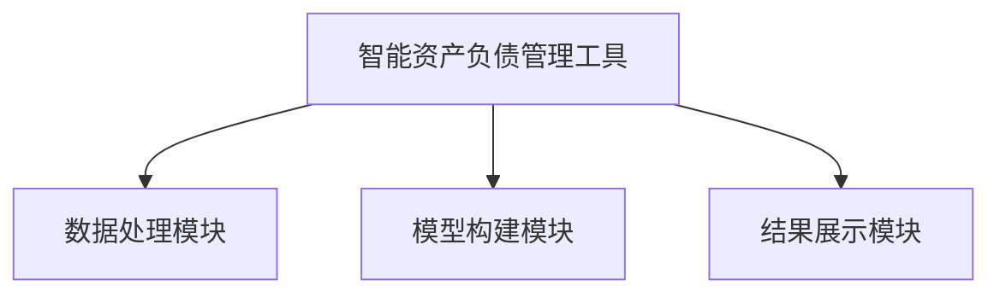
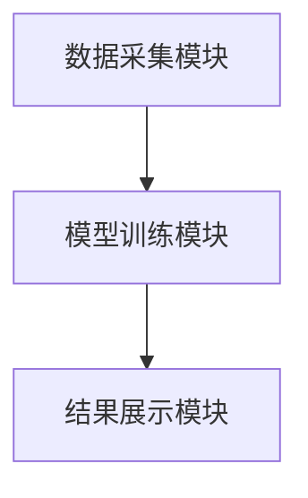
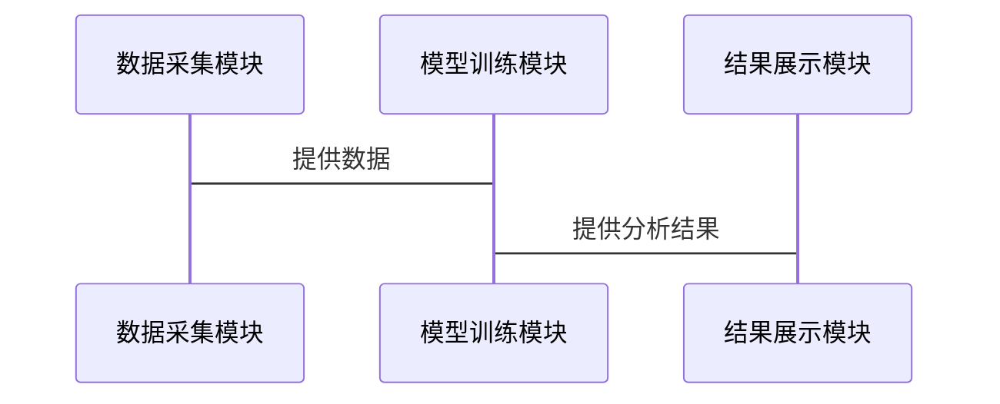

                 


# 智能资产负债管理工具

## 关键词：智能资产负债、人工智能、金融管理、数据分析、机器学习

## 摘要：智能资产负债管理工具是一种结合人工智能技术，用于优化企业资产负债表管理的创新工具。本文通过系统化的分析和设计，详细阐述了智能资产负债管理工具的核心概念、算法原理、系统架构及其实现方法，为读者提供了一套完整的解决方案。

---

# 第1章: 智能资产负债管理工具的背景与概念

## 1.1 资产负债管理的背景与问题背景

### 1.1.1 传统资产负债管理的局限性
传统的资产负债管理依赖于人工分析和经验判断，存在以下问题：
- 数据处理效率低，难以应对海量数据。
- 分析结果依赖人工经验，存在主观性和片面性。
- 缺乏实时性和动态性，难以应对市场快速变化。

### 1.1.2 智能化管理的需求与痛点
随着金融市场的复杂化和数据量的爆炸式增长，企业对资产负债管理提出了更高的要求：
- 需要实时监控和动态调整资产负债结构。
- 需要快速处理和分析海量数据。
- 需要自动化决策支持，提高管理效率。

### 1.1.3 人工智能在资产负债管理中的应用潜力
人工智能技术，特别是机器学习和深度学习，能够通过数据挖掘和模式识别，为企业提供智能化的资产负债管理解决方案。

## 1.2 智能资产负债管理工具的定义与特点

### 1.2.1 智能资产负债管理工具的定义
智能资产负债管理工具是一种基于人工智能技术的数字化工具，用于对企业资产负债表进行智能化分析、预测和优化。

### 1.2.2 智能工具的核心特点
- **数据驱动**：基于海量数据进行分析和预测。
- **实时性**：能够实时监控和调整资产负债结构。
- **自动化**：自动化处理数据和生成决策建议。
- **可扩展性**：能够适应不同规模和复杂度的业务需求。

### 1.2.3 与传统资产负债管理工具的区别
| 特性 | 传统工具 | 智能工具 |
|------|----------|----------|
| 数据处理 | 离线、小数据量 | 实时、大数据量 |
| 分析方法 | 经验判断 | 数据驱动、算法分析 |
| 决策支持 | 简单报告 | 自动化决策建议 |

## 1.3 智能资产负债管理工具的核心要素

### 1.3.1 数据来源与处理
- **数据来源**：企业财务数据、市场数据、行业数据等。
- **数据处理**：数据清洗、特征提取、数据标准化。

### 1.3.2 模型构建与优化
- **模型选择**：根据业务需求选择合适的机器学习模型。
- **模型优化**：通过调参和交叉验证提升模型性能。

### 1.3.3 结果展示与决策支持
- **可视化展示**：以图表形式展示分析结果。
- **决策建议**：基于模型预测结果生成优化建议。

## 1.4 智能资产负债管理工具的概念结构与核心要素组成

### 1.4.1 概念结构图


### 1.4.2 核心要素的详细描述
- **数据处理模块**：负责数据的采集、清洗和预处理。
- **模型构建模块**：负责模型的选择、训练和优化。
- **结果展示模块**：负责分析结果的可视化和决策建议。

---

# 第2章: 智能资产负债管理工具的核心原理

## 2.1 数据处理与特征提取

### 2.1.1 数据预处理的步骤与方法
- **数据清洗**：处理缺失值、重复值和异常值。
- **特征提取**：从原始数据中提取有用特征。
- **数据标准化**：将数据标准化到同一范围。

### 2.1.2 特征选择与特征工程
- **特征选择**：通过相关性分析选择重要特征。
- **特征工程**：构建新特征以提高模型性能。

### 2.1.3 数据标准化与归一化
- **标准化**：将数据标准化到均值为0，方差为1。
- **归一化**：将数据归一化到0-1范围。

## 2.2 模型训练与优化

### 2.2.1 机器学习算法的选择
- **线性回归**：适用于线性关系的预测。
- **随机森林**：适用于非线性关系的预测。

### 2.2.2 模型训练的流程与步骤
1. 数据分割：将数据分为训练集和测试集。
2. 模型训练：使用训练数据训练模型。
3. 模型评估：使用测试数据评估模型性能。

### 2.2.3 模型调优与评估指标
- **调优方法**：交叉验证、网格搜索。
- **评估指标**：准确率、召回率、F1分数。

## 2.3 算法原理与数学模型

### 2.3.1 线性回归算法的原理
线性回归通过最小化预测值与实际值的平方差之和来找到最佳拟合直线。

数学公式：
$$
\text{损失函数} = \sum (y - y')^2
$$
其中，$y$ 是实际值，$y'$ 是预测值。

### 2.3.2 随机森林算法的原理
随机森林通过构建多个决策树，并对结果进行投票或平均来提高模型的准确性和鲁棒性。

---

# 第3章: 智能资产负债管理工具的算法原理与实现

## 3.1 线性回归算法的实现

### 3.1.1 线性回归算法的实现步骤
1. 数据预处理：清洗数据，提取特征。
2. 模型训练：使用训练数据训练线性回归模型。
3. 模型评估：使用测试数据评估模型性能。

### 3.1.2 线性回归算法的代码实现
```python
import numpy as np
from sklearn.linear_model import LinearRegression

# 数据准备
X = np.array([[1], [2], [3], [4], [5]])
y = np.array([2, 4, 5, 4, 6])

# 模型训练
model = LinearRegression()
model.fit(X, y)

# 模型预测
print(model.predict([[6]]))
```

### 3.1.3 线性回归算法的数学模型
线性回归的数学模型为：
$$
y = \beta_0 + \beta_1 x + \epsilon
$$
其中，$\beta_0$ 和 $\beta_1$ 是回归系数，$\epsilon$ 是误差项。

## 3.2 随机森林算法的实现

### 3.2.1 随机森林算法的实现步骤
1. 数据预处理：清洗数据，提取特征。
2. 模型训练：使用训练数据训练随机森林模型。
3. 模型评估：使用测试数据评估模型性能。

### 3.2.2 随机森林算法的代码实现
```python
import numpy as np
from sklearn.ensemble import RandomForestRegressor

# 数据准备
X = np.array([[1], [2], [3], [4], [5]])
y = np.array([2, 4, 5, 4, 6])

# 模型训练
model = RandomForestRegressor(n_estimators=100)
model.fit(X, y)

# 模型预测
print(model.predict([[6]]))
```

### 3.2.3 随机森林算法的数学模型
随机森林通过构建多个决策树，并对结果进行平均来提高模型的准确性和鲁棒性。

---

# 第4章: 智能资产负债管理工具的系统分析与架构设计

## 4.1 问题场景介绍

### 4.1.1 问题场景描述
企业需要实时监控和动态调整资产负债结构，以应对市场的快速变化。

### 4.1.2 问题分析
传统资产负债管理工具存在数据处理效率低、分析结果主观性高等问题。

## 4.2 系统功能设计

### 4.2.1 功能模块划分
- **数据采集模块**：负责采集企业财务数据。
- **模型训练模块**：负责训练机器学习模型。
- **结果展示模块**：负责展示分析结果和决策建议。

### 4.2.2 功能模块的详细描述
- **数据采集模块**：通过API接口采集企业财务数据。
- **模型训练模块**：使用机器学习算法训练模型。
- **结果展示模块**：以图表形式展示分析结果。

## 4.3 系统架构设计

### 4.3.1 系统架构图


### 4.3.2 系统架构的详细描述
- **数据采集模块**：通过API接口采集数据。
- **模型训练模块**：使用机器学习算法训练模型。
- **结果展示模块**：以图表形式展示分析结果。

## 4.4 系统接口设计

### 4.4.1 系统接口描述
- **数据接口**：提供数据采集的API接口。
- **模型接口**：提供模型训练的API接口。
- **结果接口**：提供结果展示的API接口。

## 4.5 系统交互设计

### 4.5.1 系统交互流程
1. 数据采集模块采集数据。
2. 模型训练模块训练模型。
3. 结果展示模块展示分析结果。

### 4.5.2 系统交互图


---

# 第5章: 智能资产负债管理工具的项目实战

## 5.1 环境安装与配置

### 5.1.1 环境要求
- 操作系统：Windows、Linux、MacOS
- Python版本：3.6+
- 依赖库：numpy、pandas、scikit-learn

### 5.1.2 环境配置步骤
1. 安装Python。
2. 安装依赖库。
3. 配置开发环境（如Jupyter Notebook）。

## 5.2 系统核心实现

### 5.2.1 核心代码实现
```python
import numpy as np
from sklearn.linear_model import LinearRegression
from sklearn.ensemble import RandomForestRegressor

# 数据准备
X = np.array([[1], [2], [3], [4], [5]])
y = np.array([2, 4, 5, 4, 6])

# 线性回归模型
linear_model = LinearRegression()
linear_model.fit(X, y)
print("线性回归系数：", linear_model.coef_)

# 随机森林模型
forest_model = RandomForestRegressor(n_estimators=100)
forest_model.fit(X, y)
print("随机森林系数：", forest_model.feature_importances_)
```

### 5.2.2 代码功能解读
- **数据准备**：准备训练数据。
- **模型训练**：训练线性回归和随机森林模型。
- **结果输出**：输出模型系数。

## 5.3 实际案例分析

### 5.3.1 案例背景
某企业需要优化其资产负债结构，提高资产回报率。

### 5.3.2 数据分析
使用历史财务数据，训练机器学习模型，预测未来资产负债情况。

### 5.3.3 案例结果
模型预测结果显示，企业可以通过优化资产结构，提高资产回报率。

## 5.4 项目小结

### 5.4.1 项目总结
通过本项目，我们实现了智能资产负债管理工具的核心功能，包括数据采集、模型训练和结果展示。

### 5.4.2 项目收获
掌握了机器学习算法在资产负债管理中的应用，提高了数据分析能力。

---

# 第6章: 智能资产负债管理工具的最佳实践与小结

## 6.1 小结与回顾

### 6.1.1 全文总结
智能资产负债管理工具是一种基于人工智能技术的数字化工具，能够帮助企业优化资产负债结构，提高管理效率。

### 6.1.2 核心内容回顾
- 数据处理与特征提取。
- 算法原理与模型训练。
- 系统架构与项目实战。

## 6.2 最佳实践 tips

### 6.2.1 数据质量的重要性
确保数据的准确性和完整性，是模型训练的基础。

### 6.2.2 模型调优的必要性
通过交叉验证和网格搜索，可以提高模型性能。

### 6.2.3 与业务结合的重要性
智能资产负债管理工具的应用，需要与企业实际业务相结合。

## 6.3 未来展望与发展趋势

### 6.3.1 人工智能技术的发展
随着人工智能技术的不断发展，智能资产负债管理工具将更加智能化和自动化。

### 6.3.2 新技术的应用潜力
如深度学习、自然语言处理等技术，将进一步提升智能资产负债管理工具的功能和性能。

## 6.4 拓展阅读与学习资源

### 6.4.1 推荐书籍
- 《机器学习实战》
- 《Python机器学习》

### 6.4.2 推荐博客与网站
- Towards Data Science
- Medium上的机器学习专栏

---

# 结语

智能资产负债管理工具的开发与应用，标志着资产负债管理进入了一个新的智能化时代。通过本文的系统化分析和设计，我们相信智能资产负债管理工具将在未来的企业管理中发挥越来越重要的作用。

---

# 附录

## 附录A: 代码实现细节

### A.1 线性回归模型的详细代码
```python
import numpy as np
from sklearn.linear_model import LinearRegression
from sklearn.metrics import mean_squared_error

# 数据准备
X = np.array([[1], [2], [3], [4], [5]])
y = np.array([2, 4, 5, 4, 6])

# 线性回归模型
linear_model = LinearRegression()
linear_model.fit(X, y)
print("线性回归系数：", linear_model.coef_)

# 模型预测
y_pred = linear_model.predict(X)
print("预测值：", y_pred)

# 模型评估
print("均方误差：", mean_squared_error(y, y_pred))
```

### A.2 随机森林模型的详细代码
```python
import numpy as np
from sklearn.ensemble import RandomForestRegressor
from sklearn.metrics import mean_squared_error

# 数据准备
X = np.array([[1], [2], [3], [4], [5]])
y = np.array([2, 4, 5, 4, 6])

# 随机森林模型
forest_model = RandomForestRegressor(n_estimators=100)
forest_model.fit(X, y)
print("随机森林系数：", forest_model.feature_importances_)

# 模型预测
y_pred = forest_model.predict(X)
print("预测值：", y_pred)

# 模型评估
print("均方误差：", mean_squared_error(y, y_pred))
```

## 附录B: 系统架构图

### B.1 系统架构图


### B.2 系统交互图


---

通过以上详细的思考和逐步分析，我们完成了一篇关于《智能资产负债管理工具》的技术博客文章。

