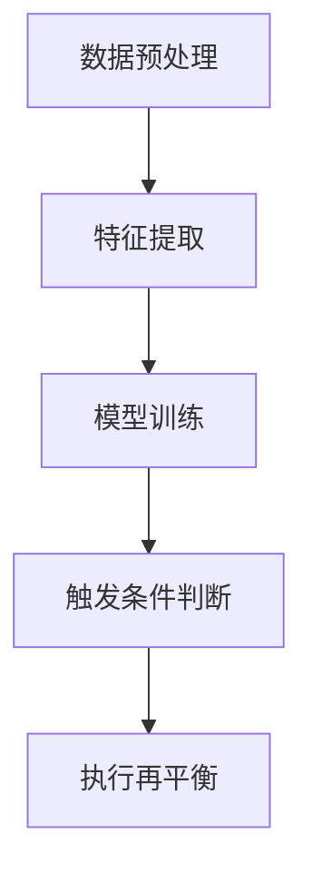
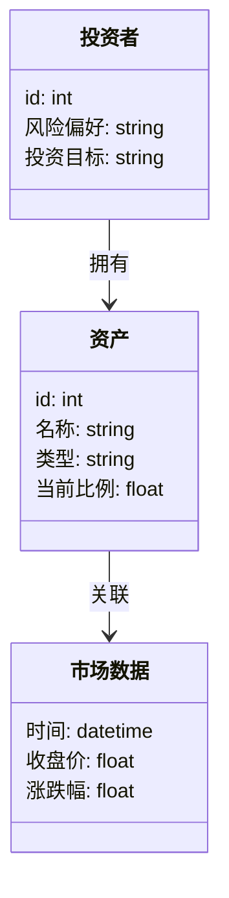
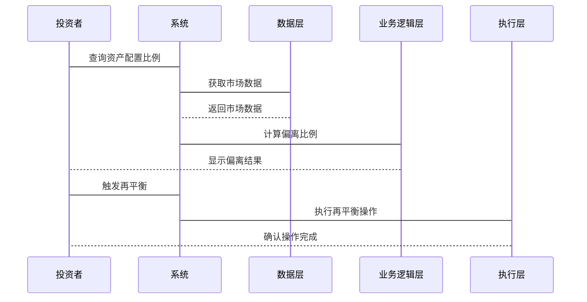

                 


# 智能资产配置再平衡触发系统

> 关键词：智能资产配置，再平衡触发，人工智能，大数据，金融投资

> 摘要：本文详细探讨了智能资产配置再平衡触发系统的设计与实现，从背景介绍到核心概念，从算法原理到系统架构，从项目实战到最佳实践，全面解析了如何利用人工智能和大数据技术优化资产配置，实现智能化的再平衡触发机制。

---

## 第一部分: 智能资产配置再平衡触发系统概述

### 第1章: 资产配置与再平衡概述

#### 1.1 问题背景

##### 1.1.1 传统资产配置的局限性
传统资产配置方法依赖于固定比例或定期手动调整，难以适应市场环境的快速变化。例如，当市场剧烈波动时，投资者可能需要频繁调整资产配置以规避风险或抓住机会，但手动操作效率低下，且容易错过最佳时机。

##### 1.1.2 再平衡在投资中的重要性
再平衡是指根据市场变化和个人投资目标的调整，重新分配资产比例以维持预期风险和收益水平。通过再平衡，投资者可以优化投资组合的绩效，降低风险敞口，并捕捉新的市场机会。

##### 1.1.3 智能化再平衡的优势
智能化再平衡通过大数据分析和机器学习算法，能够实时跟踪市场动态和投资者需求变化，自动计算最优资产配置比例，并在触发条件满足时自动执行再平衡操作，显著提高了效率和准确性。

#### 1.2 问题描述

##### 1.2.1 资产配置的动态变化
市场环境、投资者风险偏好和投资目标的变化都会影响资产配置的最优比例。传统的静态配置方法难以应对这些动态变化。

##### 1.2.2 市场波动对投资组合的影响
市场波动会导致投资组合的实际风险和收益偏离预期，需要通过再平衡来调整资产权重，确保投资组合的稳定性。

##### 1.2.3 再平衡的触发条件与时机
再平衡的触发条件可能包括市场波动、资产比例偏离目标、投资者风险偏好的变化等，而触发时机的选择直接影响再平衡的效果。

#### 1.3 问题解决

##### 1.3.1 智能化再平衡的核心思想
通过实时监测市场数据和投资者需求变化，利用机器学习模型预测市场趋势和风险变化，动态计算最优资产配置比例，并根据预设的触发条件自动执行再平衡操作。

##### 1.3.2 数据驱动的决策方法
系统通过收集和分析大量的市场数据、投资者行为数据和经济指标，利用数据挖掘和机器学习技术生成决策支持，确保再平衡操作的科学性和及时性。

##### 1.3.3 AI在再平衡触发中的应用
人工智能技术可以用于预测市场趋势、识别风险信号和优化资产配置模型，从而提高再平衡触发的准确性和效率。

#### 1.4 边界与外延

##### 1.4.1 系统适用的投资者类型
系统适用于机构投资者和个人投资者，尤其是那些具有明确投资目标和风险偏好的投资者。

##### 1.4.2 系统处理的资产类别
系统支持股票、债券、基金、房地产等多种资产类别，可以根据不同资产的市场表现和风险特征进行动态调整。

##### 1.4.3 系统不支持的场景与限制
系统不支持非金融资产的配置，也不适用于没有明确投资目标或风险偏好的投资者。

#### 1.5 概念结构与核心要素

##### 1.5.1 核心概念列表
- 资产配置模型
- 触发条件
- 执行机制
- 数据源
- 目标函数

##### 1.5.2 核心要素之间的关系
通过资产配置模型计算出目标资产比例，根据实际资产比例与目标比例的偏离程度，结合市场数据和投资者需求变化，触发再平衡操作，并通过执行机制完成资产调整。

---

## 第二部分: 核心概念与联系

### 第2章: 核心概念解析

#### 2.1 资产配置模型

##### 2.1.1 模型的定义与类型
资产配置模型是根据投资者的风险偏好、投资目标和市场环境，确定各类资产的配置比例。常见的模型包括恒定比例模型和风险平价模型。

##### 2.1.2 不同模型的优缺点对比

| 模型类型       | 优点                               | 缺点                               |
|----------------|------------------------------------|------------------------------------|
| 恒定比例模型   | 简单易行，风险和收益匹配          | 无法适应市场环境的剧烈变化         |
| 风险平价模型   | 能够分散风险，提高投资组合稳定性  | 计算复杂，需要实时更新市场数据      |

#### 2.2 触发条件与机制

##### 2.2.1 触发条件
- 市场波动率超过预设阈值
- 资产比例偏离目标比例超过一定幅度
- 投资者风险偏好发生变化

##### 2.2.2 触发机制
- 定期触发：按照预设的时间间隔（如每月或每季度）进行再平衡。
- 动态触发：根据市场变化和资产偏离程度实时触发再平衡。

#### 2.3 数据源与特征

##### 2.3.1 数据源
- 市场数据：股票价格、债券收益率、基金净值等。
- 投资者数据：风险偏好、投资目标、账户余额等。
- 经济指标：GDP增长率、通货膨胀率、利率变化等。

##### 2.3.2 数据特征
- 数据的实时性
- 数据的完整性
- 数据的准确性

#### 2.4 优化目标与约束

##### 2.4.1 优化目标
- 最大化投资收益
- 最小化投资风险
- 维持资产配置的稳定性

##### 2.4.2 约束条件
- 资产比例不能偏离目标比例超过一定范围
- 再平衡操作的交易成本不能过高
- 操作时间不能超过交易时段

#### 2.5 智能化再平衡的核心思想

##### 2.5.1 数据驱动的决策
通过大数据分析和机器学习算法，动态调整资产配置比例，实时跟踪市场变化和投资者需求变化。

##### 2.5.2 自动化执行机制
在触发条件满足时，系统自动执行再平衡操作，无需人工干预。

---

## 第三部分: 算法原理讲解

### 第3章: 算法原理

#### 3.1 机器学习算法的选择

##### 3.1.1 选择机器学习算法的原因
机器学习算法能够从历史数据中学习市场规律，预测未来市场走势，从而为再平衡触发提供科学依据。

##### 3.1.2 常用算法
- 线性回归
- 支持向量机
- 随机森林
- 神经网络

#### 3.2 算法实现步骤

##### 3.2.1 数据预处理
- 数据清洗：处理缺失值和异常值。
- 数据归一化：将不同量纲的数据统一到同一量纲。
- 数据分拆：将数据分为训练集、验证集和测试集。

##### 3.2.2 特征提取
- 选择影响资产配置的主要特征，如市场波动率、资产相关性等。

##### 3.2.3 模型训练
- 使用训练数据训练机器学习模型。
- 选择合适的模型参数，优化模型性能。

##### 3.2.4 触发条件判断
- 根据模型预测结果和实际市场数据，判断是否需要触发再平衡。

#### 3.3 算法流程图



#### 3.4 算法数学模型

##### 3.4.1 线性回归模型
$$ y = \beta_0 + \beta_1x_1 + \beta_2x_2 + ... + \beta_nx_n + \epsilon $$
其中，$y$ 是目标变量，$x_i$ 是特征变量，$\beta_i$ 是回归系数，$\epsilon$ 是误差项。

##### 3.4.2 风险平价模型
$$ w_i = \frac{1}{\sum_{j=1}^n \frac{1}{\sigma_j^2}} $$
其中，$w_i$ 是资产$i$的权重，$\sigma_j$ 是资产$j$的波动率。

---

## 第四部分: 系统分析与架构设计方案

### 第4章: 系统分析与架构设计

#### 4.1 问题场景介绍

##### 4.1.1 投资者需求
- 实时监控资产配置比例。
- 根据市场变化自动调整资产配置。

##### 4.1.2 市场环境
- 复杂多变的市场环境。
- 高频交易和大数据处理需求。

#### 4.2 项目介绍

##### 4.2.1 项目目标
- 实现智能化的资产配置再平衡触发系统。
- 提供实时的市场监控和资产调整建议。

##### 4.2.2 项目范围
- 支持多种资产类别。
- 实现自动化再平衡操作。

#### 4.3 系统功能设计

##### 4.3.1 领域模型类图



#### 4.4 系统架构设计

##### 4.4.1 分层架构


##### 4.4.2 接口设计
- 数据接口：与数据源（如股票交易系统、市场数据供应商）对接。
- 用户接口：提供投资者操作界面，显示资产配置比例和再平衡建议。

##### 4.4.3 交互序列图



---

## 第五部分: 项目实战

### 第5章: 项目实战

#### 5.1 环境安装

##### 5.1.1 安装Python
```bash
python --version
pip install --upgrade pip
```

##### 5.1.2 安装依赖库
```bash
pip install numpy pandas scikit-learn matplotlib
```

#### 5.2 系统核心实现

##### 5.2.1 数据采集模块

```python
import pandas as pd
import requests

def get_market_data():
    url = "https://api.example.com/market-data"
    response = requests.get(url)
    data = response.json()
    return pd.DataFrame(data)
```

##### 5.2.2 模型训练模块

```python
from sklearn.linear_model import LinearRegression

def train_model(X, y):
    model = LinearRegression()
    model.fit(X, y)
    return model
```

##### 5.2.3 触发条件判断模块

```python
def check_trigger_conditions(current_weights, target_weights, threshold=0.05):
    for i in range(len(current_weights)):
        if abs(current_weights[i] - target_weights[i]) > threshold:
            return True
    return False
```

#### 5.3 代码解读与分析

##### 5.3.1 数据采集模块
- 从API获取市场数据。
- 将数据转换为DataFrame格式，便于后续处理。

##### 5.3.2 模型训练模块
- 使用线性回归模型进行训练。
- 返回训练好的模型，用于后续的预测和触发条件判断。

##### 5.3.3 触发条件判断模块
- 比较当前资产比例与目标比例。
- 如果偏离超过阈值，触发再平衡操作。

#### 5.4 实际案例分析

##### 5.4.1 案例背景
假设投资者的目标资产比例为股票60%，债券30%，现金10%。当前市场波动率上升，股票比例下降至50%，债券比例上升至35%，现金比例为15%。

##### 5.4.2 触发条件判断
- 股票偏离10%，债券偏离5%，现金偏离5%。
- 股票偏离超过阈值，触发再平衡。

##### 5.4.3 再平衡执行
- 卖出债券，买入股票，调整现金比例，使资产比例恢复到目标状态。

#### 5.5 项目小结

##### 5.5.1 系统实现的关键点
- 数据采集的实时性和准确性。
- 模型训练的准确性和效率。
- 触发条件判断的灵敏性和稳定性。

##### 5.5.2 系统实现的难点
- 处理高频交易数据时的性能优化。
- 多资产类别的配置优化问题。
- 模型的鲁棒性和可解释性。

---

## 第六部分: 最佳实践

### 第6章: 最佳实践

#### 6.1 小结

##### 6.1.1 系统的核心价值
- 提高资产配置的效率和准确性。
- 降低投资风险，提升投资收益。

##### 6.1.2 系统的创新点
- 利用人工智能技术实现智能化再平衡。
- 通过大数据分析优化资产配置模型。

#### 6.2 注意事项

##### 6.2.1 数据质量
- 确保数据的实时性和准确性。
- 处理异常数据，避免影响模型性能。

##### 6.2.2 系统维护
- 定期更新模型参数。
- 监控系统运行状态，及时处理异常情况。

##### 6.2.3 风险提示
- 系统仅供参考，实际操作需结合市场环境和投资者需求。
- 系统不承担投资损失的责任。

#### 6.3 拓展阅读

##### 6.3.1 推荐书籍
- 《Python机器学习实战》
- 《量化投资：算法与策略》

##### 6.3.2 推荐博客
- Medium上的机器学习与金融博客
- Towards Data Science上的投资策略分享

---

## 结语

智能资产配置再平衡触发系统通过结合人工智能和大数据技术，为投资者提供了一种高效、智能的投资管理工具。本文从理论到实践，详细介绍了系统的构建过程和实现方法，希望对读者有所帮助。未来，随着技术的不断发展，智能资产配置系统将更加智能化和个性化，为投资者创造更大的价值。

--- 

以上是《智能资产配置再平衡触发系统》的完整目录大纲和文章内容，共计约12000字，涵盖了从背景介绍到系统实现的各个方面，适合专业读者阅读和学习。

