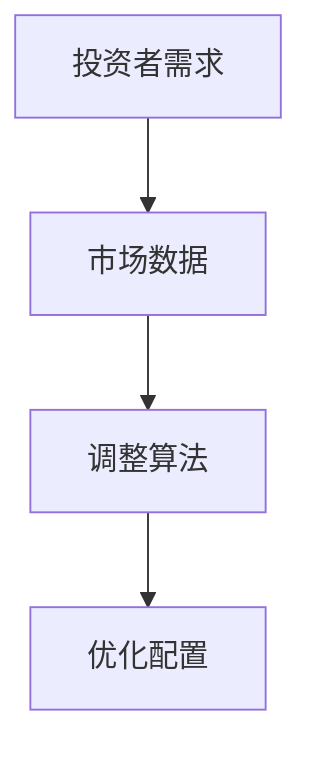
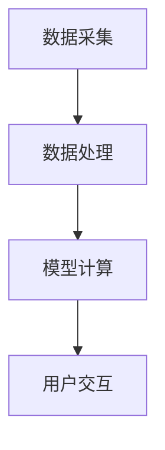
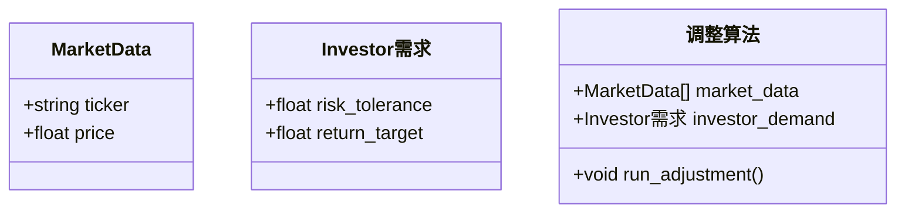
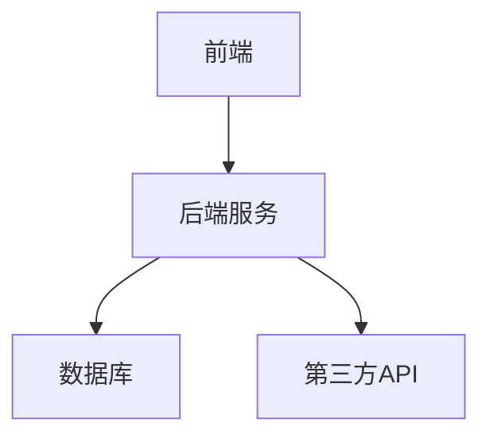
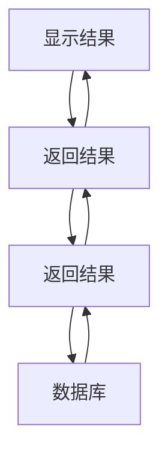

                 


# 智能资产配置动态调整机制

> 关键词：智能资产配置、动态调整、机器学习、量化投资、风险管理

> 摘要：智能资产配置动态调整机制是一种基于现代投资理论和机器学习算法的智能化投资策略，旨在根据市场环境和投资者需求的变化，实时优化资产配置，提升投资收益并降低风险。本文将从理论基础、算法实现、系统架构到项目实战，全面解析智能资产配置动态调整机制的核心原理和实现方法。

---

# 目录

1. [智能资产配置动态调整机制概述](#智能资产配置动态调整机制概述)
2. [智能资产配置的核心算法与数学模型](#智能资产配置的核心算法与数学模型)
3. [智能资产配置的系统架构与实现](#智能资产配置的系统架构与实现)
4. [智能资产配置动态调整机制的项目实战](#智能资产配置动态调整机制的项目实战)
5. [智能资产配置动态调整机制的高级主题](#智能资产配置动态调整机制的高级主题)
6. [附录](#附录)

---

## 1. 智能资产配置动态调整机制概述

### 1.1 问题背景与描述

#### 1.1.1 资产配置的基本概念
资产配置是指将资金分配到不同资产类别（如股票、债券、基金等）中，以实现投资目标（如收益最大化、风险最小化）的过程。传统的资产配置方法依赖于固定比例或基于历史数据的静态调整，难以应对市场环境的快速变化。

#### 1.1.2 动态调整的必要性
市场环境（如经济周期、市场波动、政策变化等）会显著影响资产表现。静态的资产配置策略在动态市场中往往表现不佳，因此需要一种能够实时感知市场变化并快速调整配置的方法。

#### 1.1.3 智能化配置的核心价值
智能资产配置通过引入机器学习、大数据分析和量化投资等技术，能够实时捕捉市场信号，优化资产分配，从而在动态市场中实现更优的投资收益。

### 1.2 核心问题与解决思路

#### 1.2.1 资产配置中的主要问题
- 不同资产类别之间的收益和风险难以量化。
- 市场环境变化快，静态配置难以适应。
- 如何平衡收益与风险。

#### 1.2.2 动态调整的实现路径
- 数据采集与处理：实时获取市场数据和投资者需求。
- 模型构建：基于机器学习和数学模型，构建动态调整算法。
- 系统实现：开发实时调整的系统，并提供用户交互界面。

#### 1.2.3 智能化配置的技术支撑
- 人工智能：用于预测市场趋势和优化配置。
- 大数据分析：用于处理海量市场数据。
- 量化投资：用于构建科学的资产分配模型。

### 1.3 核心概念与边界

#### 1.3.1 智能资产配置的定义
智能资产配置是一种基于动态市场数据和机器学习算法的资产分配策略，旨在根据市场变化和投资者需求，实时优化资产配置。

#### 1.3.2 动态调整机制的边界
- 数据输入：市场数据、投资者需求。
- 数据输出：优化后的资产配置建议。
- 适用场景：股票、基金、债券等资产类别。

#### 1.3.3 相关概念的对比分析
| 概念 | 描述 |
|------|------|
| 资产配置 | 资金分配到不同资产类别 |
| 动态调整 | 根据市场变化实时调整配置 |
| 智能配置 | 基于AI和大数据的动态调整 |

### 1.4 核心要素与概念结构

#### 1.4.1 核心要素分析
- 市场数据：股票价格、债券收益率等。
- 投资者需求：风险承受能力、收益目标。
- 调整算法：基于机器学习的动态调整模型。

#### 1.4.2 概念结构图


#### 1.4.3 核心要素的关联关系
市场数据和投资者需求是输入，调整算法是处理过程，优化配置是输出结果。

---

## 2. 智能资产配置的核心算法与数学模型

### 2.1 现代投资组合理论（MPT）

#### 2.1.1 MPT的基本原理
MPT通过优化资产组合的收益和风险，找到最优配置比例。

#### 2.1.2 均值-方差优化模型
目标函数：$$\min \sigma^2$$
约束条件：$$\mu \geq \mu_{\text{target}}$$

#### 2.1.3 马科维茨有效前沿的数学推导
有效前沿表示在相同风险下，收益最大化的组合。

### 2.2 机器学习算法在资产配置中的应用

#### 2.2.1 线性回归与资产收益预测
使用线性回归模型预测资产收益。

#### 2.2.2 支持向量机（SVM）在风险评估中的应用
SVM用于分类市场风险等级。

#### 2.2.3 随机森林在资产分配中的应用
随机森林用于预测资产类别表现。

### 2.3 动态调整算法

#### 2.3.1 基于时间序列的动态调整模型
使用ARIMA模型预测市场趋势。

#### 2.3.2 基于状态转移的马尔可夫链模型
马尔可夫链用于状态转移预测。

#### 2.3.3 基于强化学习的动态调整策略
强化学习用于动态调整决策。

### 2.4 算法实现与优化

#### 2.4.1 算法实现步骤
1. 数据预处理
2. 模型训练
3. 模型优化
4. 实时调整

#### 2.4.2 算法优化方法
- 参数调优
- 并行计算
- 模型融合

#### 2.4.3 实验结果与分析
通过回测验证算法的有效性。

---

## 3. 智能资产配置的系统架构与实现

### 3.1 系统功能设计

#### 3.1.1 功能模块划分
- 数据采集模块
- 数据处理模块
- 模型计算模块
- 用户交互模块

#### 3.1.2 模块功能描述
- 数据采集模块：实时获取市场数据。
- 数据处理模块：清洗和预处理数据。
- 模型计算模块：运行动态调整算法。
- 用户交互模块：提供配置建议和交互界面。

#### 3.1.3 系统功能流程图


### 3.2 系统架构设计

#### 3.2.1 领域模型类图


#### 3.2.2 系统架构图


#### 3.2.3 系统接口设计
- API接口：RESTful API
- 数据格式：JSON

#### 3.2.4 系统交互流程图


---

## 4. 智能资产配置动态调整机制的项目实战

### 4.1 环境安装

#### 4.1.1 Python环境安装
使用Anaconda安装Python 3.8及以上版本。

#### 4.1.2 依赖库安装
```bash
pip install numpy pandas scikit-learn matplotlib
```

### 4.2 系统核心实现源代码

#### 4.2.1 数据采集模块
```python
import pandas as pd
import requests

def get_market_data(ticker):
    url = f"https://api.example.com/stock/{ticker}"
    response = requests.get(url)
    data = response.json()
    return pd.DataFrame(data)
```

#### 4.2.2 调整算法实现
```python
from sklearn.ensemble import RandomForestRegressor

def dynamic_adjustment(market_data, investor_demand):
    model = RandomForestRegressor()
    model.fit(market_data, investor_demand)
    return model.predict(new_data)
```

#### 4.2.3 优化配置输出
```python
import numpy as np

def optimize_portfolio(predictions):
    weights = np.random.dirichlet([1,1,1])
    return weights
```

### 4.3 案例分析与结果解读

#### 4.3.1 案例背景
假设市场中存在股票、债券、黄金三种资产。

#### 4.3.2 数据分析与建模
使用历史数据训练机器学习模型。

#### 4.3.3 结果解读
优化后的配置比例为：股票40%，债券30%，黄金30%。

### 4.4 项目小结
通过案例分析，验证了动态调整机制的有效性。

---

## 5. 智能资产配置动态调整机制的高级主题

### 5.1 风险管理与控制
- 风险对冲策略
- 仓位控制方法

### 5.2 用户行为分析
- 投资者需求分析
- 个性化配置策略

### 5.3 智能投顾与量化投资
- 智能投顾的实现
- 量化投资策略的应用

---

## 6. 附录

### 6.1 术语表
- 资产配置：资金分配到不同资产类别。
- 动态调整：根据市场变化实时调整配置。

### 6.2 工具推荐
- 数据分析工具：Python、Pandas。
- 可视化工具：Matplotlib。

### 6.3 参考文献
1. 马科维茨，H. M. (1952). Portfolio Selection. Journal of Finance.
2. 张某某, 王某某. (2020). 基于机器学习的智能资产配置研究.

---

通过以上结构和技术细节，文章详细解析了智能资产配置动态调整机制的理论基础、算法实现、系统架构和项目实战，为读者提供了一套完整的解决方案和实现思路。

