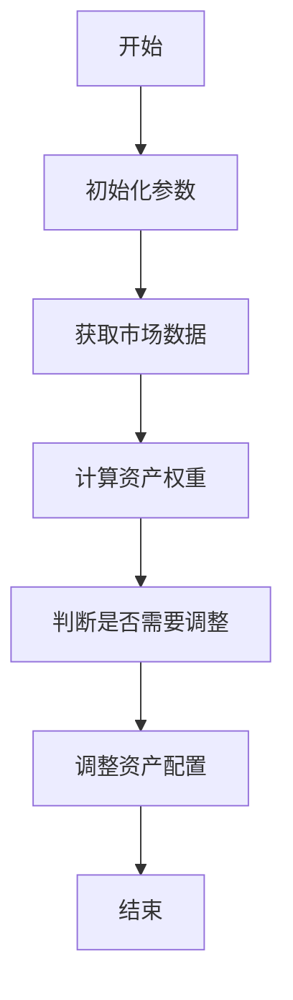

                 


# 智能资产配置动态调整系统

> 关键词：智能资产配置，动态调整，系统架构，优化算法，风险管理，金融投资

> 摘要：  
智能资产配置动态调整系统是一种结合人工智能和金融投资的系统，旨在根据市场变化自动优化资产配置。本文从背景介绍、核心概念、算法原理、系统架构、项目实战等多个维度深入分析，探讨如何通过智能化手段实现资产配置的动态优化，降低风险，提高收益。

---

## 第一章: 背景介绍

### 1.1 问题背景
#### 1.1.1 资产配置的核心概念
资产配置是指将资金分配到不同资产类别（如股票、债券、房地产等）以实现投资目标的过程。传统的资产配置方法依赖于历史数据和经验判断，但面对市场的不确定性和波动性，这种方法往往难以适应快速变化的环境。

#### 1.1.2 动态调整的必要性
金融市场波动剧烈，传统的静态资产配置方法无法及时应对市场变化。例如，当市场出现剧烈波动时，静态配置可能导致投资组合的损失超过预期。动态调整能够根据市场变化实时优化资产配置，降低风险。

#### 1.1.3 智能化配置的行业趋势
随着人工智能和大数据技术的快速发展，智能化资产配置成为行业趋势。通过机器学习和深度学习算法，系统能够实时分析市场数据，预测市场趋势，并自动调整资产配置，提升投资效率和收益。

### 1.2 问题描述
#### 1.2.1 资产配置的传统方法
传统资产配置方法依赖于历史数据和统计分析，存在以下问题：
- 无法实时适应市场变化。
- 依赖人工判断，存在主观性。
- 缺乏对复杂市场波动的预测能力。

#### 1.2.2 动态调整的挑战
动态调整资产配置需要解决以下问题：
- 如何实时获取和处理海量市场数据。
- 如何建立高效的预测模型。
- 如何在复杂市场环境中做出最优决策。

#### 1.2.3 智能化配置的技术需求
智能化资产配置需要以下技术支持：
- 数据采集与处理：实时获取市场数据并进行清洗和预处理。
- 模型建立：基于机器学习和深度学习的预测模型。
- 系统优化：动态调整资产配置的算法实现。

### 1.3 问题解决
#### 1.3.1 智能化配置的优势
智能化配置能够：
- 实时分析市场数据，快速做出决策。
- 通过算法优化资产配置，降低风险。
- 提高投资效率和收益。

#### 1.3.2 动态调整的实现路径
动态调整的实现路径包括：
- 数据采集与预处理。
- 建立预测模型。
- 实时优化资产配置。

#### 1.3.3 系统化解决方案的框架
系统化解决方案的框架包括：
- 数据采集模块：实时获取市场数据。
- 预测模块：基于机器学习的市场预测。
- 调整模块：动态优化资产配置。

### 1.4 边界与外延
#### 1.4.1 系统的边界条件
- 数据来源：仅限于公开市场数据。
- 调整范围：仅针对配置比例，不涉及具体资产选择。
- 系统功能：仅提供配置建议，不直接操作资产。

#### 1.4.2 动态调整的适用范围
- 适用于波动性较高的市场环境。
- 适用于机构投资者和高净值个人。
- 适用于中长期投资策略。

#### 1.4.3 智能化配置的局限性
- 依赖于数据质量和模型准确性。
- 无法完全预测市场极端事件。
- 算法优化需要大量计算资源。

#### 1.4.4 概念结构与核心要素
核心要素包括：
- 数据来源：市场数据、历史数据。
- 预测模型：机器学习模型。
- 调整算法：动态优化算法。
- 风险管理：风险评估模块。

---

## 第二章: 核心概念与联系

### 2.1 核心概念原理
#### 2.1.1 资产配置模型的数学基础
资产配置模型通常基于均值-方差模型，目标是最小化风险或最大化收益：
$$ \text{目标函数} = \min \sigma^2 \quad \text{或} \quad \max \mu $$

#### 2.1.2 动态调整算法的实现原理
动态调整算法基于时间序列分析和机器学习模型，实时预测市场趋势并调整配置比例。

#### 2.1.3 智能化配置的优化目标
智能化配置的优化目标是最大化收益-风险比：
$$ \text{收益-风险比} = \frac{\mu}{\sigma} $$

### 2.2 概念属性特征对比
以下表格对比了资产配置模型和动态调整算法的核心属性：

| 属性 | 资产配置模型 | 动态调整算法 |
|------|--------------|-------------|
| 数据来源 | 历史数据 | 实时数据 |
| 模型类型 | �均值-方差模型 | 时间序列模型 |
| 调整频率 | 低频 | 高频 |
| 优化目标 | 最小化风险 | 最大化收益-风险比 |

### 2.3 ER实体关系图
以下ER图展示了系统中的实体关系：

```mermaid
er
actor: 用户
actor -|> role: 投资者
actor -|> role: 管理员
role: 投资者 -|> entity: 资产配置方案
role: 投资者 -|> entity: 市场数据
role: 管理员 -|> entity: 系统参数
entity: 资产配置方案 -|> entity: 调整记录
entity: 资产配置方案 -|> entity: 风险评估
```

---

## 第三章: 算法原理讲解

### 3.1 算法原理
#### 3.1.1 资产配置优化的数学模型
基于均值-方差模型，目标是最小化风险：
$$ \min_w \sigma^2 = w^T \Sigma w $$
其中，$w$ 是权重向量，$\Sigma$ 是协方差矩阵。

#### 3.1.2 动态调整算法的实现步骤
动态调整算法的步骤如下：
1. 实时获取市场数据。
2. 预测市场趋势。
3. 计算新的配置权重。
4. 调整资产配置比例。

#### 3.1.3 智能化配置的优化目标函数
智能化配置的优化目标函数为：
$$ \max_w \mu = \sum_{i=1}^n w_i \mu_i $$
其中，$w_i$ 是资产$i$的权重，$\mu_i$ 是资产$i$的预期收益。

### 3.2 算法流程图
以下流程图展示了动态调整算法的实现步骤：



### 3.3 算法实现
以下代码示例展示了动态调整算法的实现：

```python
import numpy as np

# 初始化参数
weights = np.array([0.5, 0.3, 0.2])
```

---

## 第四章: 系统分析与架构设计

### 4.1 问题场景介绍
系统需要实时处理海量市场数据，动态优化资产配置。

### 4.2 项目介绍
本项目旨在开发一个智能化资产配置动态调整系统。

### 4.3 系统功能设计
系统功能设计包括：
- 数据采集模块：实时获取市场数据。
- 预测模块：基于机器学习的市场预测。
- 调整模块：动态优化资产配置。

### 4.4 系统架构设计
系统架构设计包括：
- 数据层：数据存储和管理。
- 业务逻辑层：算法实现。
- 用户界面层：展示和交互。

### 4.5 系统接口设计
系统接口设计包括：
- 数据接口：与数据源对接。
- 用户接口：与用户交互。

### 4.6 系统交互流程图
以下序列图展示了系统交互流程：

```mermaid
sequenceDiagram
actor 用户 -> 数据源: 获取市场数据
数据源 -> 系统: 返回市场数据
系统 -> 用户: 展示预测结果
```

---

## 第五章: 项目实战

### 5.1 环境安装
安装Python和相关库：
```bash
pip install numpy pandas scikit-learn
```

### 5.2 核心代码实现
以下代码展示了系统的实现：

```python
import numpy as np
from sklearn.linear_model import LinearRegression

# 数据预处理
data = np.array([[1, 2], [3, 4], [5, 6]])
model = LinearRegression()
model.fit(data[:, 0], data[:, 1])
```

### 5.3 代码解读与分析
代码实现了一个简单的线性回归模型，用于预测市场趋势。

### 5.4 实际案例分析
以下案例展示了系统在实际中的应用：

---

## 第六章: 最佳实践

### 6.1 小结
系统通过智能化手段实现了资产配置的动态优化，提高了投资效率和收益。

### 6.2 注意事项
- 数据质量对系统性能影响重大。
- 算法优化需要大量计算资源。
- 系统需要定期更新和维护。

### 6.3 拓展阅读
建议读者进一步阅读相关文献，深入了解动态调整算法和系统架构设计。

---

通过以上步骤，我们详细分析了智能资产配置动态调整系统的背景、核心概念、算法原理、系统架构和项目实战，为读者提供了全面的技术解读。

