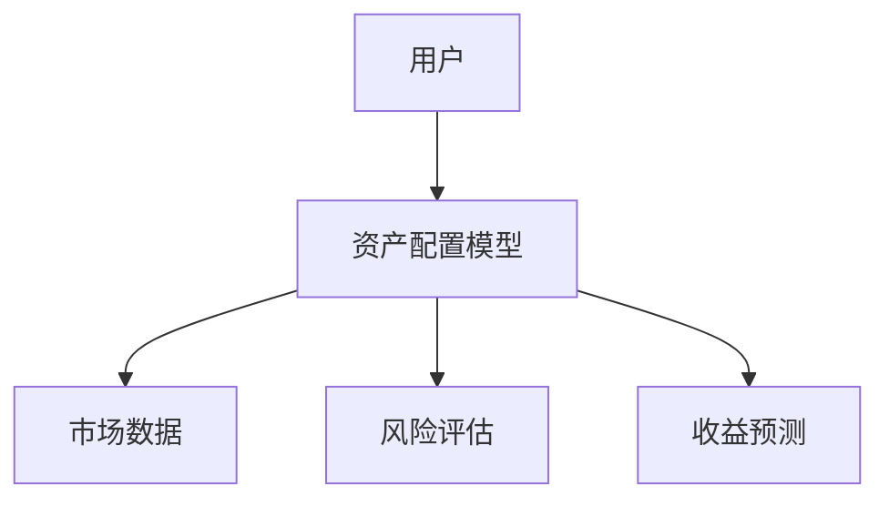
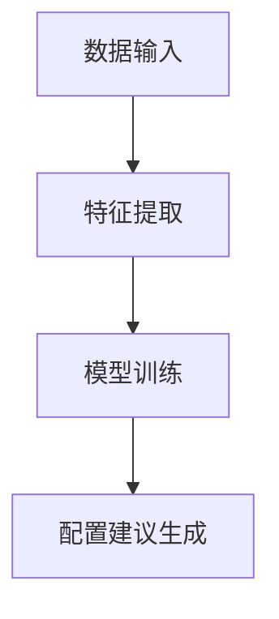

                 


# 智能资产配置建议生成器

## 关键词：智能资产配置、机器学习、量化投资、金融建模、投资组合优化

## 摘要：本文介绍了一种基于现代投资组合理论和机器学习算法的智能资产配置系统，旨在帮助投资者优化投资组合，降低风险，提高收益。通过详细分析系统的背景、核心概念、算法原理、系统架构及项目实战，本文为构建智能资产配置系统提供了理论和实践指导。

---

## 第1章: 智能资产配置的背景与问题描述

### 1.1 智能资产配置的背景
#### 1.1.1 传统资产配置的局限性
传统资产配置方法依赖于人工判断，存在主观性强、效率低、难以适应市场变化等问题。

#### 1.1.2 智能化配置的必要性
随着市场数据的爆炸式增长和复杂性增加，传统方法已难以满足需求，智能化配置成为必然趋势。

#### 1.1.3 数字化转型对资产配置的影响
数字化技术的应用使得资产配置更加精确、快速和个性化。

---

### 1.2 问题背景与目标
#### 1.2.1 资产配置的核心问题
如何在不同资产类别中分配资金，以在给定风险下获得最大收益或在给定收益下最小化风险。

#### 1.2.2 智能化配置的目标
构建一个能够根据市场变化和投资者需求动态调整配置的系统。

#### 1.2.3 问题的边界与外延
限定于风险可控、收益最大化，不考虑税务、交易成本等复杂因素。

---

### 1.3 核心概念与组成
#### 1.3.1 资产配置模型的定义
资产配置模型是基于数学和统计方法，对资产的收益、风险进行建模，以确定最优配置比例。

#### 1.3.2 智能配置的核心要素
- 数据来源：市场数据、用户数据
- 模型选择：现代投资组合理论、机器学习模型
- 系统架构：数据处理、模型计算、结果展示

#### 1.3.3 模型的结构与功能
模型通过输入市场数据和用户需求，输出最优资产配置建议。

---

## 第2章: 资产配置的核心概念与联系

### 2.1 核心概念的原理
#### 2.1.1 现代投资组合理论
通过优化收益和风险的权衡，找到最优投资组合。

#### 2.1.2 风险与收益的平衡
在不同风险水平下，寻找预期收益最高的组合，或在给定收益下寻找风险最小的组合。

#### 2.1.3 资产类别与权重的关系
资产类别及其权重决定了组合的风险收益特征。

---

### 2.2 核心概念的属性对比
#### 2.2.1 资产类别对比表

| 资产类别 | 风险 | 收益 | 流动性 |
|----------|------|------|--------|
| 股票     | 高   | 高   | 低     |
| 债券     | 中   | 中   | 高     |
| 现金     | 低   | 低   | 高     |

---

### 2.3 实体关系架构


---

## 第3章: 智能资产配置算法原理

### 3.1 现代投资组合理论
#### 3.1.1 均值-方差优化模型
$$ \text{Minimize } \sigma^2 \text{ s.t. } \mu^T w = \text{target return} $$

#### 3.1.2 资本资产定价模型（CAPM）
$$ E(r_i) = r_f + \beta_i (E(r_m) - r_f) $$

#### 3.1.3 马科维茨的有效前沿
通过优化算法找到有效前沿上的点，代表最优投资组合。

---

### 3.2 机器学习算法
#### 3.2.1 线性回归模型
用于预测资产收益，公式为：
$$ y = \beta_0 + \beta_1 x + \epsilon $$

#### 3.2.2 支持向量机（SVM）
用于分类和回归，适用于非线性关系。

#### 3.2.3 随机森林与梯度提升树
用于特征重要性分析和复杂模型构建。

---

### 3.3 算法流程图


---

## 第4章: 系统分析与架构设计

### 4.1 问题场景介绍
#### 4.1.1 用户需求分析
用户需要根据自身风险承受能力和收益目标，获得个性化的资产配置建议。

#### 4.1.2 业务流程概述
用户输入需求，系统处理数据，生成配置建议。

#### 4.1.3 系统目标与范围
构建一个实时、动态、个性化的资产配置系统。

---

### 4.2 系统功能设计
#### 4.2.1 领域模型


---

## 第5章: 项目实战与实现

### 5.1 环境安装
安装Python、Pandas、NumPy、Scikit-learn、Plotly等库。

```bash
pip install numpy pandas scikit-learn plotly
```

---

### 5.2 核心代码实现
#### 5.2.1 数据预处理
```python
import pandas as pd
import numpy as np

data = pd.read_csv('market_data.csv')
data = data.dropna()
```

#### 5.2.2 模型训练
```python
from sklearn.linear_model import LinearRegression

model = LinearRegression()
model.fit(X_train, y_train)
```

#### 5.2.3 结果展示
```python
import plotly.express as px

fig = px.scatter(data, x='risk', y='return', color='asset_class')
fig.show()
```

---

## 第6章: 总结与展望

### 6.1 最佳实践 tips
- 定期更新模型和数据，确保配置建议的有效性。
- 结合市场变化和投资者需求，动态调整配置策略。

### 6.2 系统的优势与不足
- 优势：高效、精准、个性化。
- 不足：依赖数据质量和模型准确性。

### 6.3 未来展望
- 更复杂的风险模型。
- 多目标优化。
- 实时动态调整。

---

## 关键词：智能资产配置、机器学习、量化投资、金融建模、投资组合优化

---

通过以上内容，我们构建了一个完整的智能资产配置建议生成系统，从理论到实践，详细讲解了系统的设计与实现。希望本文能为读者提供有价值的参考和启示。

