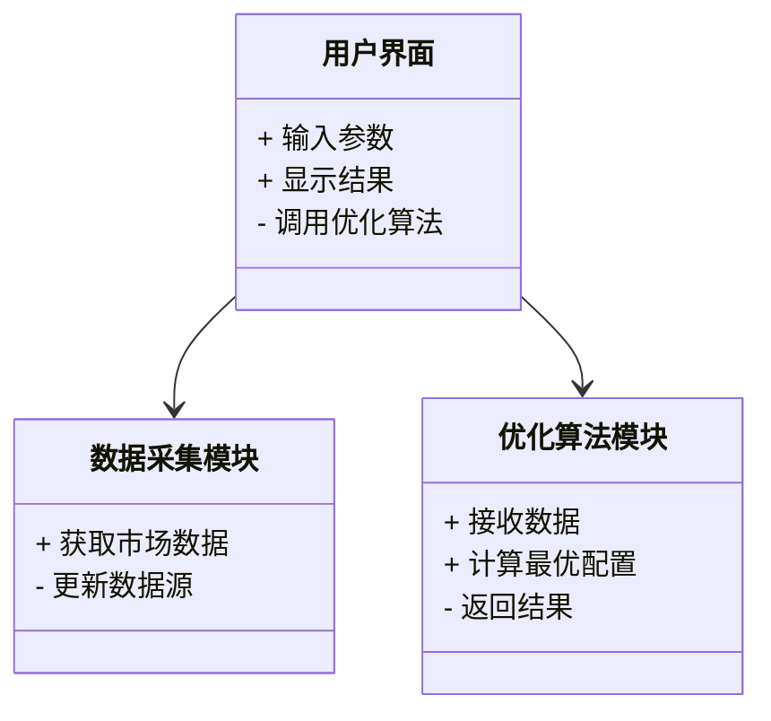
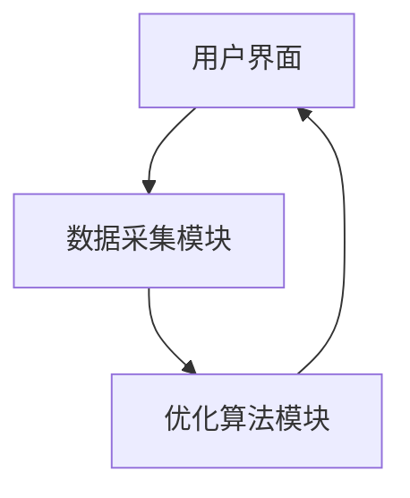
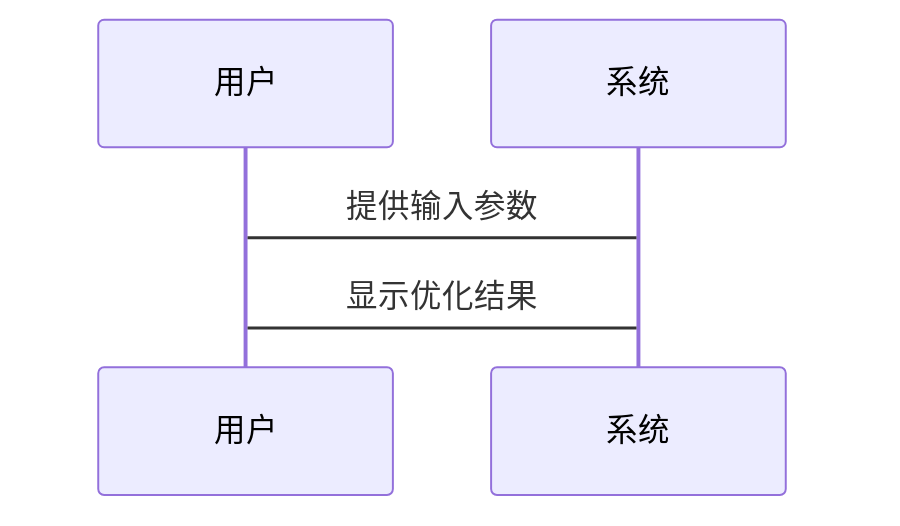

                 


# 智能资产配置策略动态优化器

> 关键词：智能资产配置，动态优化器，优化算法，数学模型，系统架构，Python实现

> 摘要：智能资产配置策略动态优化器是一种结合了人工智能和优化算法的系统，旨在动态调整资产配置策略，以应对市场变化和投资者需求。本文将从概念、算法、系统架构等多个方面详细阐述这一技术，提供具体的实现方法和案例分析。

---

# 第1章: 智能资产配置与动态优化器背景介绍

## 1.1 问题背景与描述
### 1.1.1 资产配置的基本概念
资产配置是投资过程中至关重要的一环，涉及将资金分配到不同的资产类别（如股票、债券、房地产等）以实现收益最大化和风险最小化。传统资产配置方法通常基于静态模型，难以适应市场环境的快速变化。

### 1.1.2 动态优化的必要性
金融市场具有高度不确定性，投资者的需求和市场条件也会随时间变化。动态优化能够实时调整资产配置策略，帮助投资者在复杂多变的市场中保持最优投资组合。

### 1.1.3 智能技术在资产配置中的应用
人工智能和大数据技术的发展为资产配置提供了新的工具。通过智能算法，可以快速处理海量数据，发现潜在的市场趋势，并实时优化投资策略。

## 1.2 核心概念与问题解决
### 1.2.1 智能资产配置的定义
智能资产配置是指利用人工智能技术，根据市场数据和投资者需求，动态调整资产分配比例的过程。

### 1.2.2 动态优化器的核心目标
动态优化器的目标是通过实时数据分析和智能算法，找到最优的资产配置方案，最大化收益并最小化风险。

### 1.2.3 问题解决的边界与外延
动态优化器的边界包括数据输入、模型构建和结果输出。外延则涉及数据来源的多样性、模型的可扩展性以及结果的可解释性。

## 1.3 核心要素与概念结构
### 1.3.1 资产配置的多目标优化
资产配置需要在收益、风险和流动性等多个目标之间找到平衡点。

### 1.3.2 动态优化器的系统架构
动态优化器通常由数据采集、模型计算和结果输出三个部分组成。

### 1.3.3 智能算法与数据驱动的结合
通过机器学习算法和大数据分析，动态优化器能够快速适应市场变化，提供实时的优化建议。

## 1.4 本章小结
本章介绍了智能资产配置和动态优化器的基本概念，分析了其必要性和核心目标，并探讨了其在实际应用中的优势和挑战。

---

# 第2章: 智能资产配置的核心概念与联系

## 2.1 核心概念原理
### 2.1.1 资产配置的数学模型
资产配置的数学模型通常包括目标函数和约束条件。目标函数可能是最大化收益或最小化风险，而约束条件则涉及资金分配的比例限制。

### 2.1.2 动态优化器的算法原理
动态优化器通常采用遗传算法、模拟退火等智能算法，通过迭代优化找到最优解。

### 2.1.3 智能技术的核心作用
智能技术能够处理复杂的数据关系，发现潜在的市场规律，并快速调整优化策略。

## 2.2 核心概念属性对比
### 2.2.1 资产配置与投资组合优化的对比
资产配置更注重长期战略，而投资组合优化则关注短期调整。

### 2.2.2 动态优化器与静态优化器的差异
动态优化器能够实时调整，而静态优化器则基于固定假设。

### 2.2.3 智能算法与传统算法的优劣分析
智能算法具有更强的适应性和全局优化能力，但计算复杂度较高。

## 2.3 ER实体关系图
### 2.3.1 实体关系图的构建
通过ER图可以清晰展示系统中的实体及其关系，例如投资者、资产类别和配置策略。

### 2.3.2 实体关系图的分析
分析ER图有助于理解系统的数据结构和逻辑关系。

### 2.3.3 实体关系图的优化
优化ER图可以提高系统的数据处理效率和准确性。

## 2.4 本章小结
本章通过对比和分析，深入探讨了智能资产配置的核心概念及其在系统中的作用。

---

# 第3章: 智能资产配置策略动态优化器的算法原理

## 3.1 算法原理概述
### 3.1.1 动态优化器的核心算法
动态优化器通常采用遗传算法或模拟退火等方法，通过迭代优化找到最优解。

### 3.1.2 智能算法的实现步骤
包括初始化种群、适应度评估、选择、交叉和变异等步骤。

### 3.1.3 算法的收敛性分析
分析算法的收敛速度和稳定性，确保其在实际应用中的有效性。

## 3.2 算法原理的数学模型
### 3.2.1 目标函数的定义
例如，最大化收益函数：$$ \text{Maximize} \sum w_i r_i $$
其中，$w_i$ 是资产i的权重，$r_i$ 是资产i的预期收益。

### 3.2.2 约束条件的建立
例如，权重之和为1：$$ \sum w_i = 1 $$

### 3.2.3 数学模型的求解方法
使用拉格朗日乘数法或梯度下降法求解优化问题。

## 3.3 算法实现的Python代码
### 3.3.1 环境安装与配置
安装必要的Python库，如NumPy、Pandas和Scikit-learn。

### 3.3.2 核心算法的实现代码
```python
import numpy as np
from sklearn.gaussian_process import GaussianProcessRegressor

# 示例代码：基于高斯过程回归的资产配置优化
def optimize_portfolio(returns):
    n = len(returns)
    # 初始化模型
    model = GaussianProcessRegressor()
    # 拟合模型
    model.fit(np.arange(n).reshape(-1, 1), returns)
    # 预测最优权重
    weights = model.predict(np.arange(n).reshape(-1, 1))
    return weights / np.sum(weights)
```

### 3.3.3 代码的功能解读与分析
上述代码利用高斯过程回归模型预测最优权重，确保权重之和为1。

## 3.4 算法的优化与改进
### 3.4.1 算法的优化策略
采用并行计算和自适应步长等方法提高算法效率。

### 3.4.2 算法的改进方向
引入深度学习模型，如强化学习，进一步提升优化效果。

### 3.4.3 算法的性能评估
通过回测和风险指标（如夏普比率）评估算法的性能。

## 3.5 本章小结
本章详细讲解了动态优化器的算法原理，并通过Python代码展示了其实现过程。

---

# 第4章: 智能资产配置策略动态优化器的系统分析与架构设计

## 4.1 问题场景介绍
### 4.1.1 资产配置的复杂性
市场环境变化快，投资者需求多样。

### 4.1.2 动态优化器的应用场景
适用于实时交易、风险管理等领域。

### 4.1.3 系统设计的目标与需求
实现高效的数据处理、智能优化和用户交互。

## 4.2 系统功能设计
### 4.2.1 用户需求分析
用户需要实时的优化建议和可视化界面。

### 4.2.2 功能模块划分
包括数据采集、模型计算、结果展示和用户交互模块。

### 4.2.3 功能流程的设计
从数据输入到结果输出的完整流程。

## 4.3 系统架构设计
### 4.3.1 领域模型类图
使用Mermaid绘制领域模型类图，展示各模块之间的关系。



### 4.3.2 系统架构图
使用Mermaid绘制系统架构图，展示系统的整体结构。



### 4.3.3 系统交互序列图
使用Mermaid绘制系统交互序列图，展示用户与系统之间的交互流程。



## 4.4 本章小结
本章通过系统分析和架构设计，展示了智能资产配置策略动态优化器的实现框架。

---

# 第5章: 项目实战

## 5.1 环境安装与配置
### 5.1.1 安装Python和相关库
安装Python 3.8及以上版本，安装NumPy、Pandas、Scikit-learn等库。

### 5.1.2 数据源获取
获取历史市场数据，如股票价格和经济指标。

## 5.2 核心代码实现
### 5.2.1 数据预处理
对历史数据进行清洗和标准化处理。

### 5.2.2 优化算法实现
编写优化算法代码，如遗传算法或模拟退火。

### 5.2.3 结果展示
将优化结果可视化，展示资产配置比例和收益风险指标。

## 5.3 代码解读与分析
### 5.3.1 代码功能解读
详细解读每部分代码的功能和作用。

### 5.3.2 代码优化建议
提出代码优化的建议，如提高计算效率和增强可读性。

## 5.4 实际案例分析
### 5.4.1 数据回测
使用历史数据进行回测，验证算法的有效性。

### 5.4.2 结果分析
分析优化结果，比较不同策略的收益和风险。

## 5.5 本章小结
本章通过实际项目实战，展示了智能资产配置策略动态优化器的实现过程和应用效果。

---

# 第6章: 最佳实践与总结

## 6.1 关键点总结
### 6.1.1 系统设计的关键点
强调系统架构设计的重要性。

### 6.1.2 算法实现的关键点
突出优化算法的核心作用。

## 6.2 小结与注意事项
### 6.2.1 小结
总结全文的主要内容和结论。

### 6.2.2 注意事项
提醒读者在实际应用中注意数据质量和模型风险。

## 6.3 拓展阅读
推荐相关领域的书籍和论文，供读者进一步学习。

---

# 结束语

通过本文的详细讲解，读者可以全面了解智能资产配置策略动态优化器的设计与实现。从理论到实践，结合具体案例，为读者提供了丰富的知识和实用的技能。希望本文能为智能资产配置领域的发展提供有价值的参考。

