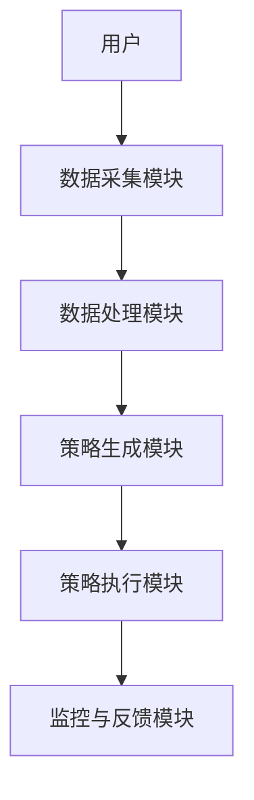

                 


# 智能资产配置策略动态调整与再平衡系统

## 关键词：智能资产配置，动态调整，再平衡系统，投资组合优化，机器学习

## 摘要：  
智能资产配置是一种基于动态调整和再平衡的投资策略，旨在根据市场变化和投资者需求，实时优化投资组合。本文详细阐述了智能资产配置的核心概念、算法原理、系统架构以及实际应用，通过数学模型和代码示例，展示了如何利用机器学习和优化算法实现智能资产配置的动态调整与再平衡。文章还结合实际案例，分析了系统的实现细节和最佳实践。

---

# 第1章 智能资产配置的背景与核心概念

## 1.1 问题背景与定义  
### 1.1.1 资产配置的传统方法与局限性  
传统的资产配置方法主要依赖于固定比例或静态模型，难以适应市场波动和投资者需求的变化。例如，经典的马科维茨均值-方差模型虽然奠定了现代投资组合理论的基础，但其静态特性在实际应用中存在诸多限制。  

### 1.1.2 智能资产配置的定义与特点  
智能资产配置是一种基于动态调整的投资策略，通过实时分析市场数据和投资者目标，优化投资组合。其核心特点包括：  
- **动态性**：能够根据市场变化和投资者需求实时调整。  
- **智能化**：利用机器学习和优化算法实现自动化决策。  
- **高效性**：通过数学模型快速计算最优配置。  

### 1.1.3 智能资产配置的核心目标与边界  
智能资产配置的目标是在风险可控的前提下，最大化投资收益。其边界包括：  
- **风险约束**：设定最大风险承受能力。  
- **收益目标**：设定最低收益要求。  
- **流动性需求**：确保资产的流动性。  

## 1.2 智能资产配置与动态调整的关系  
### 1.2.1 动态调整的必要性  
市场环境不断变化，静态配置难以应对突发事件和市场波动。动态调整能够实时优化投资组合，降低风险并提高收益。  

### 1.2.2 再平衡的定义与作用  
再平衡是指根据市场变化和投资者目标，调整资产比例以恢复初始配置。其作用包括：  
- **降低风险**：通过调整资产比例，避免单一资产的大幅波动。  
- **提高收益**：通过动态调整，抓住市场机会。  
- **适应需求**：根据投资者目标变化进行调整。  

### 1.2.3 智能资产配置中的动态调整机制  
动态调整机制包括：  
1. **市场数据采集**：获取实时市场数据。  
2. **目标函数计算**：基于当前数据计算最优配置。  
3. **策略执行**：根据计算结果调整投资组合。  

## 1.3 智能资产配置系统的构成要素  
### 1.3.1 数据输入与处理  
数据输入包括市场数据、投资者目标和约束条件。数据处理包括清洗、特征提取和预处理。  

### 1.3.2 策略生成与优化  
策略生成基于数学模型和优化算法，生成最优配置方案。优化过程需要考虑目标函数和约束条件。  

### 1.3.3 执行与监控  
策略执行包括下单和资产调整。监控包括实时跟踪和风险控制。  

## 1.4 本章小结  
智能资产配置是一种基于动态调整的投资策略，通过实时优化投资组合，实现风险可控下的收益最大化。其核心在于动态调整和再平衡机制，利用数学模型和机器学习算法，确保投资组合的高效性和适应性。

---

# 第2章 智能资产配置的核心概念与数学模型

## 2.1 核心概念与原理  
### 2.1.1 资产配置的目标函数  
目标函数通常包括收益最大化和风险最小化。数学表达式为：  
$$ \text{收益} = \sum_{i=1}^{n} w_i r_i $$  
$$ \text{风险} = \sum_{i=1}^{n} \sum_{j=1}^{n} w_i w_j \sigma_i \sigma_j $$  

其中，$w_i$ 是资产 $i$ 的权重，$r_i$ 是资产 $i$ 的预期收益，$\sigma_i$ 是资产 $i$ 的波动率。  

### 2.1.2 约束条件与优化目标  
优化目标是最大化收益或最小化风险。约束条件包括：  
- **权重约束**：$\sum_{i=1}^{n} w_i = 1$  
- **风险约束**：$\text{风险} \leq \text{风险上限}$  
- **收益约束**：$\text{收益} \geq \text{收益下限}$  

### 2.1.3 动态调整的数学模型  
动态调整模型基于时间序列分析，通过实时数据更新权重。数学表达式为：  
$$ w_t = f(t, w_{t-1}) $$  
其中，$f$ 是优化函数，$t$ 是时间，$w_t$ 是调整后的权重。  

## 2.2 核心概念对比分析  
### 2.2.1 资产配置与投资组合优化的对比  
资产配置是战略性的配置决策，而投资组合优化是战术性的调整过程。  

### 2.2.2 动态调整与定期再平衡的差异  
动态调整是实时优化，而定期再平衡是定期调整。  

### 2.2.3 智能算法与传统算法的对比  
智能算法（如机器学习）具有更强的适应性和非线性处理能力，而传统算法（如拉格朗日乘数法）适用于线性优化问题。  

## 2.3 系统架构的核心要素  
### 2.3.1 数据流与信息处理  
数据流包括市场数据、投资者目标和反馈信息。信息处理包括数据清洗、特征提取和模型训练。  

### 2.3.2 策略生成与执行  
策略生成基于数学模型和优化算法，生成最优配置方案。策略执行包括下单和资产调整。  

### 2.3.3 监控与反馈机制  
监控包括实时跟踪和风险控制。反馈机制用于优化模型和调整策略。  

## 2.4 本章小结  
智能资产配置的核心在于数学模型和优化算法，通过动态调整和再平衡，实现投资组合的高效优化。

---

# 第3章 智能资产配置的算法原理与实现

## 3.1 算法原理概述  
### 3.1.1 基于动态调整的优化算法  
动态调整算法基于时间序列分析和优化理论，实时更新投资组合权重。  

### 3.1.2 再平衡策略的数学模型  
再平衡策略基于目标函数和约束条件，通过优化算法调整权重。  

### 3.1.3 算法的收敛性与稳定性  
算法的收敛性取决于优化目标和约束条件，稳定性取决于模型的鲁棒性。  

## 3.2 算法实现的步骤  
### 3.2.1 数据预处理与特征提取  
数据预处理包括清洗和标准化，特征提取包括主成分分析。  

### 3.2.2 策略生成与优化  
策略生成基于数学模型和优化算法，生成最优配置方案。  

### 3.2.3 执行与监控  
策略执行包括下单和资产调整，监控包括实时跟踪和风险控制。  

## 3.3 算法的优化与改进  
### 3.3.1 基于机器学习的优化方法  
机器学习算法（如强化学习）可以提高优化效率和适应性。  

### 3.3.2 算法的并行化与分布式计算  
并行化和分布式计算可以提高计算效率，适用于大规模数据。  

### 3.3.3 算法的鲁棒性与适应性  
鲁棒性是指算法对噪声和异常值的抵抗能力，适应性是指算法对环境变化的适应能力。  

## 3.4 本章小结  
智能资产配置的算法实现需要结合优化理论和机器学习，通过动态调整和再平衡，实现投资组合的高效优化。

---

# 第4章 智能资产配置的系统架构与设计

## 4.1 系统架构设计  
### 4.1.1 系统整体架构图  


### 4.1.2 模块划分与功能分配  
- 数据采集模块：负责获取市场数据和投资者目标。  
- 数据处理模块：负责数据清洗和特征提取。  
- 策略生成模块：负责生成最优配置方案。  
- 策略执行模块：负责执行策略和调整资产。  
- 监控与反馈模块：负责实时监控和优化模型。  

### 4.1.3 系统的可扩展性与可维护性  
系统架构设计需要考虑模块化和松耦合，确保可扩展性和可维护性。  

## 4.2 系统功能设计  
### 4.2.1 数据采集与处理模块  
数据采集模块包括API接口和数据存储。数据处理模块包括清洗和特征提取。  

### 4.2.2 策略生成与优化模块  
策略生成模块基于数学模型和优化算法，生成最优配置方案。  

### 4.2.3 策略执行与监控模块  
策略执行模块包括下单和资产调整。监控模块包括实时跟踪和风险控制。  

## 4.3 系统接口设计  
### 4.3.1 数据接口  
数据接口包括市场数据接口和投资者目标接口。  

### 4.3.2 策略接口  
策略接口包括策略生成接口和策略执行接口。  

### 4.3.3 监控接口  
监控接口包括实时监控接口和反馈接口。  

## 4.4 本章小结  
智能资产配置系统的架构设计需要模块化和松耦合，确保系统的可扩展性和可维护性。通过合理的接口设计，实现数据流和信息处理的高效性。

---

# 第5章 项目实战与最佳实践

## 5.1 环境安装与配置  
### 5.1.1 Python环境安装  
安装Python和必要的库（如NumPy、Pandas、Scikit-learn）。  

### 5.1.2 数据源配置  
配置市场数据源（如Yahoo Finance）和投资者目标。  

## 5.2 核心代码实现  
### 5.2.1 数据处理代码  
```python
import pandas as pd
import numpy as np

# 数据清洗
data = pd.read_csv('market_data.csv')
data = data.dropna()
data = data[~data.index.duplicated()]
```

### 5.2.2 策略生成代码  
```python
from sklearn.decomposition import PCA

# 特征提取
pca = PCA(n_components=5)
features = pca.fit_transform(data)
```

### 5.2.3 策略执行代码  
```python
import numpy as np

# 动态调整算法
def dynamic_adjust(features):
    # 优化函数
    def objective(weights, features):
        # 收益函数
        return -np.sum(weights * features.mean(axis=0))
    
    # 约束条件
    constraints = {'type': 'eq', 'fun': lambda x: np.sum(x) - 1}
    
    # 优化求解
    from scipy.optimize import minimize
    result = minimize(objective, np.ones(features.shape[1]) / features.shape[1], 
                      constraints=constraints, bounds=[(0, 1)] * features.shape[1])
    return result.x
```

## 5.3 实际案例分析  
### 5.3.1 案例背景  
假设投资者的目标是收益最大化，风险承受能力为中等。  

### 5.3.2 数据分析与策略解读  
通过动态调整算法，生成最优配置方案，并实时监控和调整。  

### 5.3.3 优化结果与策略执行  
通过优化算法，生成最优权重，并执行策略。  

## 5.4 本章小结  
智能资产配置的实现需要结合理论和实践，通过代码实现和案例分析，验证算法的有效性和实用性。

---

# 第6章 总结与展望

## 6.1 总结  
智能资产配置是一种基于动态调整的投资策略，通过实时优化投资组合，实现收益最大化和风险可控。其核心在于数学模型和优化算法，通过动态调整和再平衡，确保投资组合的高效性和适应性。

## 6.2 展望  
未来，智能资产配置将更加智能化和自动化，结合大数据和人工智能技术，实现更精准的预测和优化。同时，随着区块链等技术的发展，智能资产配置将更加安全和高效。

---

## 附录  
### 附录A：数学公式总结  
- 收益函数：$$ \text{收益} = \sum_{i=1}^{n} w_i r_i $$
- 风险函数：$$ \text{风险} = \sum_{i=1}^{n} \sum_{j=1}^{n} w_i w_j \sigma_i \sigma_j $$
- 优化目标：$$ \min_w \text{风险} \quad \text{subject to} \quad \sum_{i=1}^{n} w_i = 1 $$

### 附录B：代码示例  
```python
import numpy as np
from scipy.optimize import minimize

def dynamic_adjust(features):
    def objective(weights, features):
        return -np.sum(weights * features.mean(axis=0))
    
    constraints = [{'type': 'eq', 'fun': lambda x: np.sum(x) - 1}]
    bounds = [(0, 1)] * features.shape[1]
    
    result = minimize(objective, np.ones(features.shape[1]) / features.shape[1], 
                      constraints=constraints, bounds=bounds)
    return result.x

features = np.random.rand(5, 10)
weights = dynamic_adjust(features)
print(weights)
```

### 附录C：参考文献  
1. Markowitz, H. (1952). Portfolio Selection.  
2. Sharpe, W. F. (1964). The Sharpe Ratio.  
3. Fama, E. F. (1970). Efficient Diversification: A Reexamination of
 Modern Portfolio Theory.

---

# END

