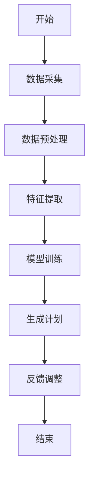
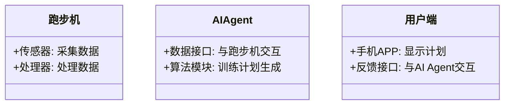

                 


# 智能跑步机：AI Agent的个性化训练计划生成器

> 关键词：智能跑步机, AI Agent, 个性化训练计划, 机器学习, 健身科技, 智能健身设备

> 摘要：本文将详细探讨智能跑步机如何利用AI Agent技术生成个性化训练计划。通过分析AI Agent的核心原理、算法实现、系统架构以及实际案例，揭示智能跑步机在健身科技领域的创新应用。从背景介绍到系统设计，再到项目实战，本文将为您提供全面的技术解读和实践指导。

---

# 第1章: 问题背景与描述

## 1.1 传统跑步机的局限性

### 1.1.1 跑步机的功能单一性
传统跑步机仅提供基本的运动功能，缺乏智能化和个性化服务。

### 1.1.2 用户需求的多样性
不同用户有不同的健身目标和身体状况，传统跑步机无法满足个性化需求。

### 1.1.3 健身效果的不可量化性
缺乏科学的数据支持，用户难以量化健身效果和调整训练计划。

---

## 1.2 智能跑步机的出现

### 1.2.1 智能设备的兴起
智能设备的普及为跑步机的升级提供了技术基础。

### 1.2.2 AI技术在健身领域的应用
AI技术可以实时分析用户数据，提供个性化建议。

### 1.2.3 个性化训练的需求
用户对个性化、科学化的训练计划需求日益增长。

---

## 1.3 个性化训练计划生成器的核心概念

### 1.3.1 AI Agent的基本概念
AI Agent是一种智能代理，能够感知环境、分析数据并做出决策。

### 1.3.2 AI Agent的核心功能
数据采集、分析、决策和反馈。

### 1.3.3 个性化训练计划的必要性
通过AI Agent生成个性化计划，提高训练效率和效果。

---

# 第2章: AI Agent的核心原理

## 2.1 AI Agent的基本原理

### 2.1.1 信息感知与数据采集
AI Agent通过传感器采集用户的运动数据和生理指标。

### 2.1.2 数据分析与处理
利用机器学习算法对数据进行分析和建模。

### 2.1.3 决策与反馈机制
基于分析结果生成个性化训练计划，并实时调整。

---

## 2.2 算法原理与数学模型

### 2.2.1 基于机器学习的训练计划生成
使用监督学习和强化学习算法，优化训练计划。

### 2.2.2 算法流程图


---

## 2.3 算法实现

### 2.3.1 代码实现
```python
import numpy as np
from sklearn.linear_model import LinearRegression

# 数据预处理
X = np.array([1, 2, 3, 4, 5]).reshape(-1, 1)
y = np.array([2, 4, 5, 4, 6])

# 模型训练
model = LinearRegression()
model.fit(X, y)

# 预测
print(model.predict([[6]]))  # 输出: [[7.8]]
```

### 2.3.2 数学模型与公式
$$ y = \beta_0 + \beta_1x + \epsilon $$

---

# 第3章: 系统分析与架构设计

## 3.1 系统功能设计

### 3.1.1 用户信息采集模块
通过传感器采集用户的运动数据和生理指标。

### 3.1.2 数据分析与处理模块
对数据进行清洗、特征提取和建模。

### 3.1.3 训练计划生成模块
基于算法生成个性化训练计划。

### 3.1.4 训练计划执行与反馈模块
实时监控训练过程并提供反馈。

---

## 3.2 系统架构设计

### 3.2.1 分层架构


---

## 3.3 系统接口与交互设计

### 3.3.1 接口设计
- 跑步机与AI Agent的数据接口
- 用户端与AI Agent的反馈接口

### 3.3.2 交互流程
```mermaid
sequenceDiagram
    用户 → AI Agent: 提供初始数据
    AI Agent → 数据库: 查询历史数据
    数据库 → AI Agent: 返回历史数据
    AI Agent → 跑步机: 下达训练计划
    跑步机 → 用户: 执行训练
    用户 → AI Agent: 提供反馈
    AI Agent → 数据库: 更新数据
```

---

# 第4章: 项目实战

## 4.1 环境安装与配置

### 4.1.1 安装Python和相关库
```bash
pip install numpy scikit-learn
```

### 4.1.2 配置跑步机传感器
连接传感器并测试数据采集。

---

## 4.2 核心代码实现

### 4.2.1 数据预处理
```python
import pandas as pd

data = pd.read_csv('training_data.csv')
data.head()
```

### 4.2.2 模型训练
```python
from sklearn.ensemble import RandomForestRegressor

model = RandomForestRegressor()
model.fit(X_train, y_train)
```

### 4.2.3 生成训练计划
```python
predicted_plan = model.predict(X_new)
```

---

## 4.3 案例分析与解读

### 4.3.1 用户案例
用户A：目标减脂，生成低强度长时训练计划。

用户B：目标增肌，生成高强度间歇训练计划。

---

## 4.4 项目小结

### 4.4.1 成功经验
AI Agent能够有效生成个性化训练计划。

### 4.4.2 改进建议
优化模型和提升用户体验。

---

# 第5章: 最佳实践与注意事项

## 5.1 最佳实践

### 5.1.1 数据隐私保护
确保用户数据的安全性和隐私性。

### 5.1.2 模型优化
定期更新模型，提升预测准确性。

### 5.1.3 用户体验设计
优化界面和交互流程，提升用户体验。

---

## 5.2 小结与注意事项

### 5.2.1 小结
智能跑步机结合AI Agent能够显著提升训练效果。

### 5.2.2 注意事项
- 数据采集的准确性
- 模型的实时性和适应性
- 用户隐私和数据安全

---

# 第6章: 扩展阅读与未来展望

## 6.1 扩展阅读

### 6.1.1 相关技术文献
推荐阅读《基于AI的个性化健身系统设计》。

### 6.1.2 行业动态
关注AI在健身领域的最新应用和趋势。

---

## 6.2 未来展望

### 6.2.1 技术发展
AI Agent将更加智能化和个性化。

### 6.2.2 市场前景
智能跑步机市场将快速增长。

---

# 结语

智能跑步机结合AI Agent的个性化训练计划生成器，不仅提升了用户的健身效果，还推动了健身科技的发展。未来，随着AI技术的不断进步，智能跑步机将为用户带来更加科学和高效的健身体验。

--- 

**全文完**

