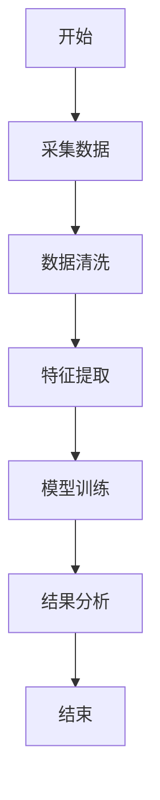
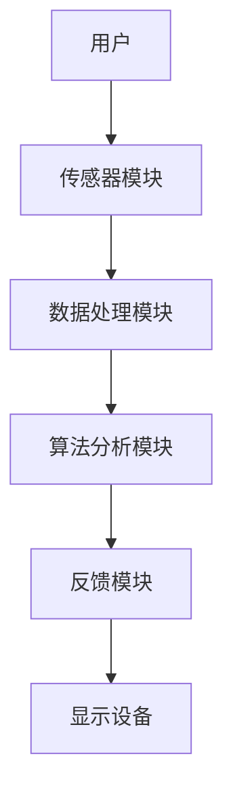

                 


# 智能跳绳：AI Agent的有氧运动效果分析

## 关键词：智能跳绳，AI Agent，有氧运动，运动数据分析，机器学习，系统架构

## 摘要：  
本文探讨了AI Agent在智能跳绳中的应用，分析了其对有氧运动效果的影响。通过背景介绍、AI Agent的核心原理、算法实现、系统架构设计、项目实战和优化展望，全面解析了AI Agent在运动数据分析中的作用。本文结合理论与实践，为智能跳绳的设计与优化提供了新的思路。

---

# 第一部分: 背景与概念

## 第1章: 背景介绍

### 1.1 智能跳绳的背景与现状

#### 1.1.1 有氧运动的普及与需求  
有氧运动（Aerobic Exercise）是一种以提升心肺功能为核心的运动方式，如跑步、游泳、跳绳等。随着健康意识的增强，人们越来越重视有氧运动对身体的益处，尤其是跳绳这种简单、高效的运动方式，因其便于随时随地进行而备受推崇。然而，传统的跳绳运动缺乏科学的指导和数据分析，难以满足人们对运动效果的精准需求。

#### 1.1.2 跳绳运动的特点与局限性  
跳绳作为一种简单但高效的有氧运动，具有以下特点：  
- **便捷性**：无需复杂的设备，随时随地可进行。  
- **高效性**：短时间内即可达到较高的燃脂效果。  
- **多样性**：可进行花样跳绳，增加趣味性。  

然而，传统跳绳运动也存在一些局限性：  
- 缺乏科学的运动计划和个性化指导。  
- 无法实时反馈运动数据，难以量化运动效果。  
- 用户容易因动作不规范或过度疲劳而受伤。  

#### 1.1.3 智能化运动设备的发展趋势  
近年来，随着人工智能（AI）和物联网（IoT）技术的快速发展，运动设备逐渐向智能化方向迈进。智能跳绳通过集成传感器、AI算法和大数据分析，能够实时采集运动数据并提供个性化建议，从而帮助用户更科学地进行有氧运动。

---

### 1.2 AI Agent的核心概念

#### 1.2.1 AI Agent的基本定义  
AI Agent（人工智能代理）是指能够感知环境、自主决策并执行任务的智能体。它能够通过传感器获取数据，利用算法进行分析，并通过执行器完成目标。在智能跳绳中，AI Agent主要用于分析用户的运动数据并提供实时反馈。

#### 1.2.2 AI Agent的核心属性与特征  
AI Agent的核心属性包括：  
1. **感知能力**：通过传感器获取环境和用户行为数据。  
2. **决策能力**：基于数据进行分析和决策，制定个性化运动计划。  
3. **执行能力**：通过执行器（如显示设备、语音助手）提供反馈或建议。  
4. **学习能力**：通过机器学习算法不断优化自身的分析和决策能力。  

#### 1.2.3 AI Agent与传统运动数据分析的区别  
传统的运动数据分析通常依赖于人工记录和事后分析，而AI Agent能够实时采集数据并提供即时反馈。此外，AI Agent还能够根据用户的个性化需求，动态调整运动计划，从而实现更高效的运动效果。

---

### 1.3 问题背景与目标

#### 1.3.1 有氧运动效果分析的难点  
有氧运动效果的分析涉及多个因素，包括运动强度、持续时间、心率变化、动作规范性等。然而，传统方法难以实时捕捉这些数据，并进行综合分析。

#### 1.3.2 AI Agent在运动效果分析中的作用  
AI Agent通过实时采集运动数据，结合机器学习算法，能够对运动效果进行全面分析，并提供个性化建议。例如，AI Agent可以根据用户的心率变化和运动时间，推荐适合的运动强度和时长。

#### 1.3.3 本研究的目标与意义  
本研究旨在探讨AI Agent在智能跳绳中的应用，分析其对有氧运动效果的影响。通过结合AI技术和运动科学，提出一种智能化的运动分析方法，为用户和运动设备的设计提供参考。

---

## 第2章: AI Agent与有氧运动的结合

### 2.1 AI Agent的基本原理

#### 2.1.1 AI Agent的感知机制  
AI Agent通过集成在跳绳中的传感器（如加速度计、心率传感器）实时采集用户的运动数据，包括跳绳次数、心率、运动时间等。

#### 2.1.2 AI Agent的决策机制  
基于采集的数据，AI Agent利用机器学习算法（如时间序列分析、回归分析）对运动效果进行评估，并根据用户的个性化需求（如健康目标、运动习惯）制定运动计划。

#### 2.1.3 AI Agent的执行机制  
AI Agent通过显示设备、语音助手等方式向用户反馈运动数据和建议，帮助用户优化运动效果。

### 2.2 AI Agent在运动数据分析中的应用

#### 2.2.1 数据采集与处理  
AI Agent通过传感器实时采集用户的运动数据，并对其进行清洗和特征提取。例如，跳绳次数、心率变化、运动时间等数据需要经过去噪和标准化处理。

#### 2.2.2 数据分析与效果评估  
通过机器学习算法对运动数据进行分析，评估用户的有氧运动效果。例如，AI Agent可以分析用户的跳绳次数与心率变化之间的关系，评估其运动强度是否合理。

#### 2.2.3 个性化运动建议的生成  
根据用户的运动数据和分析结果，AI Agent可以生成个性化的运动建议。例如，建议用户在某一时间段内增加运动强度，或减少运动时间以避免过度疲劳。

### 2.3 智能跳绳的系统架构

#### 2.3.1 系统整体架构  
智能跳绳系统通常包括以下模块：  
- **传感器模块**：采集用户的运动数据。  
- **数据处理模块**：对数据进行清洗和特征提取。  
- **算法分析模块**：利用机器学习算法对数据进行分析。  
- **反馈模块**：向用户反馈运动数据和建议。  

#### 2.3.2 系统功能模块划分  
1. **数据采集模块**：通过传感器采集用户的运动数据。  
2. **数据处理模块**：对数据进行预处理和特征提取。  
3. **算法分析模块**：利用时间序列分析、回归分析等算法对数据进行分析。  
4. **反馈模块**：通过显示设备、语音助手向用户反馈结果和建议。  

#### 2.3.3 系统交互流程  
1. 用户开始运动，AI Agent启动传感器采集数据。  
2. 数据传输到数据处理模块进行清洗和特征提取。  
3. 算法分析模块对数据进行分析，评估运动效果。  
4. 反馈模块向用户反馈分析结果和建议。  

---

## 第3章: AI Agent的核心算法与数学模型

### 3.1 运动数据的采集与预处理

#### 3.1.1 数据采集方法  
通过加速度计、心率传感器等设备采集用户的跳绳次数、心率、运动时间等数据。

#### 3.1.2 数据清洗与特征提取  
对采集的数据进行去噪和标准化处理，提取关键特征（如跳绳频率、心率变化率）。

#### 3.1.3 数据预处理的数学模型  
例如，利用滑动平均法对数据进行平滑处理：

$$ y_i = \frac{y_{i-1} + y_i + y_{i+1}}{3} $$

---

### 3.2 有氧运动效果分析的算法

#### 3.2.1 时间序列分析  
时间序列分析是一种常用的运动数据分析方法，用于分析运动数据的变化趋势。例如，利用ARIMA模型对跳绳次数进行预测。

#### 3.2.2 机器学习模型的构建  
通过机器学习算法（如随机森林、支持向量机）对运动数据进行分类或回归分析，评估用户的运动效果。

#### 3.2.3 算法流程图  
以下是时间序列分析的流程图：



---

### 3.3 数学模型与公式

#### 3.3.1 时间序列分析的数学公式  
ARIMA模型的数学表达式为：

$$
\phi(\theta) \cdot (1 - \theta L)^d y_t = \mu + \theta_t
$$

其中，$\phi(\theta)$ 是自回归多项式，$\theta$ 是移动平均多项式，$d$ 是差分阶数，$y_t$ 是观测值。

#### 3.3.2 机器学习模型的数学表达  
随机森林算法的数学表达较为复杂，但其核心思想是通过决策树的组合实现特征的非线性分类或回归。

---

## 第4章: 系统架构与设计

### 4.1 系统架构设计

#### 4.1.1 系统整体架构图  
以下是智能跳绳系统的整体架构图：



#### 4.1.2 系统功能模块划分  
1. **传感器模块**：负责采集用户的运动数据。  
2. **数据处理模块**：对数据进行清洗和特征提取。  
3. **算法分析模块**：利用机器学习算法对数据进行分析。  
4. **反馈模块**：向用户反馈分析结果和建议。  

---

## 第5章: 项目实战与案例分析

### 5.1 环境搭建

#### 5.1.1 硬件设备  
需要的硬件设备包括：智能跳绳（带传感器）、计算机、显示设备等。

#### 5.1.2 软件环境  
需要的软件环境包括：Python编程语言、机器学习库（如scikit-learn）、数据可视化工具（如Matplotlib）。

---

### 5.2 核心代码实现

#### 5.2.1 数据采集与处理  
以下是Python代码示例：

```python
import numpy as np
import pandas as pd

# 数据采集
data = pd.read_csv('jump_rope_data.csv')
# 数据清洗
data_clean = data.dropna()
# 特征提取
features = data_clean[['jump_count', 'heart_rate']]
```

#### 5.2.2 算法实现  
以下是时间序列分析的Python代码示例：

```python
from statsmodels.tsa.arima_model import ARIMA

# 训练模型
model = ARIMA(features, order=(5,1,0))
model_fit = model.fit(disp=0)
# 预测结果
 forecast = model_fit.forecast(steps=10)
```

---

### 5.3 案例分析

#### 5.3.1 实际案例分析  
以一名用户为例，分析其跳绳次数与心率变化之间的关系。通过算法分析，发现用户的运动强度较低，建议增加运动时间。

#### 5.3.2 分析结果与建议  
根据分析结果，AI Agent向用户反馈以下建议：  
- 建议将运动时间从10分钟增加到15分钟。  
- 建议在运动中保持心率在目标范围内。  

---

## 第6章: 优化与展望

### 6.1 系统优化策略  
1. **算法优化**：尝试不同的机器学习算法，如LSTM网络，以提高预测精度。  
2. **硬件优化**：优化传感器的灵敏度和响应速度，提高数据采集的准确性。  

### 6.2 未来发展方向  
1. **多模态数据融合**：结合心率、加速度、心率变异性等多种数据，实现更全面的运动分析。  
2. **个性化运动计划**：根据用户的健康状况和运动偏好，制定更加个性化的运动计划。  

### 6.3 实际应用中的注意事项  
1. **数据隐私**：注意保护用户的运动数据，避免泄露。  
2. **用户体验**：确保系统的反馈简洁明了，便于用户理解和执行。  

---

## 第7章: 结语

AI Agent在智能跳绳中的应用为有氧运动效果的分析提供了新的思路。通过实时数据采集、智能分析和个性化反馈，AI Agent能够帮助用户更科学地进行运动，提升运动效果。未来，随着技术的不断发展，AI Agent在运动分析中的应用将更加广泛和深入。

