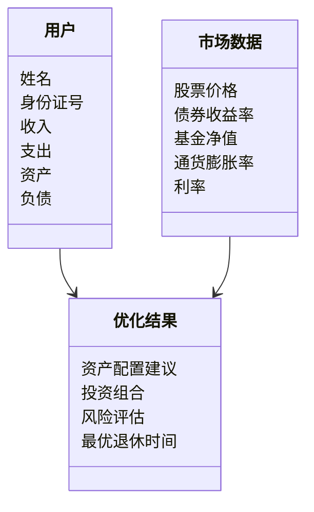

                 


# 智能退休计划优化器

> 关键词：智能退休计划优化器，人工智能，退休规划，强化学习，系统架构

> 摘要：智能退休计划优化器是一种基于人工智能技术的退休规划工具，通过数据采集、特征提取、模型训练和优化算法，为用户提供个性化的退休计划建议。本文将从背景、核心概念、算法原理、系统架构和项目实战等多个方面，详细探讨智能退休计划优化器的设计与实现。

---

## 第1章 智能退休计划优化器的背景与意义

### 1.1 退休规划的重要性

退休规划是每个人生活中重要的财务决策之一。传统的退休规划方法依赖于人工计算和经验判断，存在效率低、覆盖面窄、个性化不足等问题。随着人工智能技术的发展，智能退休计划优化器应运而生，它能够通过大数据分析和智能算法，为用户提供更加精准和个性化的退休规划建议。

#### 1.1.1 退休规划的核心问题

- 资产配置：如何在不同资产类别（股票、债券、房地产等）中分配资金，以实现最大收益。
- 风险控制：如何在市场波动中降低投资风险，确保退休生活资金的安全性。
- 时间规划：如何根据退休时间表，合理分配资金，实现长期财务目标。

#### 1.1.2 传统退休规划方法的局限性

- 依赖人工计算，效率低下。
- 缺乏数据支持，难以实现个性化建议。
- 市场波动和经济环境变化难以实时调整。

#### 1.1.3 智能技术在退休规划中的优势

- 数据驱动：通过大数据分析，提供精准的市场预测和资产配置建议。
- 实时优化：根据市场变化和用户需求，实时调整退休计划。
- 个性化服务：基于用户的财务状况、风险偏好和生命周期，提供定制化建议。

### 1.2 智能退休计划优化器的定义与目标

智能退休计划优化器是一种基于人工智能技术的退休规划工具，旨在通过数据采集、特征提取、模型训练和优化算法，为用户提供个性化的退休计划建议。其核心目标包括：

- 提供精准的资产配置建议。
- 实时监控市场变化，动态调整退休计划。
- 帮助用户实现财务自由和退休生活的质量保障。

### 1.3 本章小结

本章介绍了智能退休计划优化器的背景和意义，分析了传统退休规划方法的局限性，并阐述了智能技术在退休规划中的优势。通过本章，读者可以理解智能退休计划优化器的核心目标和应用场景。

---

## 第2章 智能退休计划优化器的核心概念

### 2.1 数据采集与处理

智能退休计划优化器的核心功能依赖于高质量的数据支持。数据来源包括金融市场数据（股票、债券、基金等）、用户个人信息（收入、支出、资产等）以及其他相关数据（通货膨胀率、利率等）。

#### 2.1.1 数据来源与类型

- 金融市场数据：包括股票价格、债券收益率、基金净值等。
- 用户个人信息：包括收入、支出、资产、负债等。
- 宏观经济数据：包括通货膨胀率、利率、GDP增长率等。

#### 2.1.2 数据预处理方法

- 数据清洗：处理缺失值、异常值和重复值。
- 数据转换：对数据进行标准化、归一化处理。
- 数据增强：通过数据扩展技术，增加数据多样性。

#### 2.1.3 数据隐私与安全

- 数据加密：确保用户数据的安全性。
- 访问控制：严格控制数据访问权限。
- 合法合规：确保数据处理符合相关法律法规。

### 2.2 特征提取与建模

特征提取是将原始数据转化为能够反映问题本质的特征向量，建模则是基于这些特征构建数学模型，用于预测和优化。

#### 2.2.1 特征选择的策略

- 主成分分析（PCA）：通过降维技术，提取最重要的特征。
- 特征重要性排序：基于模型表现，对特征进行排序。

#### 2.2.2 模型构建的步骤

1. 数据预处理：清洗、转换和增强数据。
2. 特征提取：选择对目标变量有重要影响的特征。
3. 模型训练：基于训练数据，训练回归模型或分类模型。
4. 模型评估：通过交叉验证等方法，评估模型的性能。

#### 2.2.3 模型评估与优化

- 模型评估指标：均方误差（MSE）、R平方值等。
- 超参数优化：通过网格搜索或随机搜索，优化模型参数。

### 2.3 智能优化算法

智能优化算法是智能退休计划优化器的核心技术之一，常用的算法包括粒子群优化（PSO）和遗传算法（GA）。

#### 2.3.1 粒子群优化算法（PSO）

粒子群优化算法是一种基于群体智能的优化算法，模拟鸟群觅食行为。其核心思想是通过粒子之间的信息共享，找到全局最优解。

1. 初始化：随机生成一群粒子，每个粒子代表一个可能的解。
2. 评估：计算每个粒子的适应度值。
3. 更新：根据全局最优解和个体最优解，更新粒子的速度和位置。
4. 迭代：重复评估和更新，直到满足终止条件。

#### 2.3.2 遗传算法（GA）

遗传算法是一种基于生物进化论的优化算法，模拟自然选择和遗传变异过程。

1. 初始化：随机生成初始种群。
2. 适应度评估：计算每个个体的适应度值。
3. 选择：根据适应度值，选择优质个体进行繁殖。
4. 交叉：对选中的个体进行基因交叉，生成新个体。
5. 变异：对新个体进行随机变异，增加多样性。
6. 迭代：重复选择、交叉和变异过程，直到满足终止条件。

### 2.4 本章小结

本章详细介绍了智能退休计划优化器的核心概念，包括数据采集与处理、特征提取与建模以及智能优化算法。通过本章，读者可以理解优化器如何从数据中提取特征，并利用智能算法进行优化。

---

## 第3章 智能退休计划优化器的算法原理

### 3.1 强化学习的基本原理

强化学习是一种基于奖励机制的机器学习方法，通过智能体与环境的交互，学习最优策略。

#### 3.1.1 状态空间

状态空间是智能体所处环境的所有可能状态的集合。在退休计划优化器中，状态可以是当前的资产配置情况、市场环境等。

#### 3.1.2 动作空间

动作空间是智能体在每个状态下可以执行的所有动作。在退休计划优化器中，动作可以是调整资产配置、选择投资组合等。

#### 3.1.3 奖励函数

奖励函数是智能体在执行动作后获得的奖励或惩罚。在退休计划优化器中，奖励函数可以是投资收益、风险值等。

### 3.2 基于强化学习的退休规划算法

#### 3.2.1 算法实现步骤

1. 初始化：定义状态空间、动作空间和奖励函数。
2. 环境与代理交互：智能体在环境中执行动作，获得奖励。
3. 策略网络训练：基于经验回放和策略梯度方法，更新策略网络参数。
4. 模型收敛性分析：通过理论分析和实验验证，确保模型收敛性。

#### 3.2.2 算法的数学模型

1. 状态值函数：
$$ V(s) = \max_a Q(s,a) $$

2. 动作值函数：
$$ Q(s,a) = r + \gamma \max_{a'} Q(s',a') $$

其中，$s$ 表示状态，$a$ 表示动作，$r$ 表示奖励，$\gamma$ 表示折扣因子，$s'$ 表示下一个状态。

### 3.3 本章小结

本章详细介绍了基于强化学习的退休规划算法，包括状态空间、动作空间、奖励函数以及算法实现步骤。通过本章，读者可以理解如何利用强化学习技术优化退休计划。

---

## 第4章 智能退休计划优化器的系统架构

### 4.1 系统模块划分

智能退休计划优化器的系统架构包括以下几个模块：

1. 用户界面模块：提供友好的用户界面，方便用户输入信息和查看结果。
2. 数据处理模块：负责数据的采集、清洗和转换。
3. 优化引擎模块：基于智能算法，优化退休计划。
4. 报告生成模块：生成优化后的退休计划报告。

#### 4.1.1 用户界面模块

用户界面模块是用户与系统交互的接口，包括以下功能：

- 用户信息输入：用户输入个人信息、财务状况等。
- 数据可视化：显示数据处理结果和优化建议。
- 报告下载：用户可以下载生成的退休计划报告。

#### 4.1.2 数据处理模块

数据处理模块负责数据的预处理工作，包括：

- 数据清洗：处理缺失值、异常值和重复值。
- 数据转换：对数据进行标准化、归一化处理。
- 数据增强：通过数据扩展技术，增加数据多样性。

#### 4.1.3 优化引擎模块

优化引擎模块是系统的核心模块，负责基于智能算法，优化退休计划。其主要功能包括：

- 状态空间定义：定义智能体所处环境的所有可能状态。
- 动作空间定义：定义智能体在每个状态下可以执行的所有动作。
- 奖励函数定义：定义智能体执行动作后获得的奖励或惩罚。

#### 4.1.4 报告生成模块

报告生成模块负责生成优化后的退休计划报告，包括：

- 资产配置建议：基于优化结果，生成资产配置建议。
- 风险评估报告：评估退休计划的风险和不确定性。
- 优化建议：提供进一步优化的建议和策略。

### 4.2 系统架构设计

#### 4.2.1 系统功能设计

智能退休计划优化器的系统功能设计可以用以下领域模型类图表示：



#### 4.2.2 系统架构设计

智能退休计划优化器的系统架构可以用以下架构图表示：

```mermaid
archiitectureDiagram
    客户端 ---(HTTP)--> 服务器
    服务器 ---(数据库连接)--> 数据库
    服务器 ---(API调用)--> 第三方服务
```

其中，客户端负责接收用户输入和展示结果，服务器负责处理业务逻辑，数据库负责存储数据，第三方服务负责提供市场数据和计算服务。

### 4.3 本章小结

本章详细介绍了智能退休计划优化器的系统架构，包括模块划分、功能设计和系统架构设计。通过本章，读者可以理解系统如何通过各个模块协同工作，实现退休计划的优化。

---

## 第5章 智能退休计划优化器的项目实战

### 5.1 环境安装

为了运行智能退休计划优化器，需要安装以下环境：

- Python 3.8+
- PyTorch 1.9+
- Pandas 1.3+
- Scikit-learn 0.24+
- Plotly 5.14+

### 5.2 系统核心实现

以下是系统核心实现的代码示例：

```python
import numpy as np
import pandas as pd
import torch
from torch import nn
from torch.optim import Adam
from sklearn.model_selection import train_test_split
from sklearn.metrics import mean_squared_error

# 数据加载
data = pd.read_csv('retire_data.csv')

# 数据预处理
X = data.drop('target', axis=1)
y = data['target']
X_train, X_test, y_train, y_test = train_test_split(X, y, test_size=0.2)

# 模型定义
class RetireModel(nn.Module):
    def __init__(self, input_dim, hidden_dim, output_dim):
        super(RetireModel, self).__init__()
        self.fc1 = nn.Linear(input_dim, hidden_dim)
        self.fc2 = nn.Linear(hidden_dim, output_dim)

    def forward(self, x):
        x = torch.relu(self.fc1(x))
        x = self.fc2(x)
        return x

# 模型训练
input_dim = X_train.shape[1]
hidden_dim = 64
output_dim = 1
model = RetireModel(input_dim, hidden_dim, output_dim)
criterion = nn.MSELoss()
optimizer = Adam(model.parameters(), lr=0.001)

num_epochs = 100
for epoch in range(num_epochs):
    outputs = model(X_train)
    loss = criterion(outputs, y_train)
    optimizer.zero_grad()
    loss.backward()
    optimizer.step()

# 模型评估
with torch.no_grad():
    outputs = model(X_test)
    loss_test = criterion(outputs, y_test)
    print(f'Test Loss: {loss_test.item()}')

print('Training completed.')
```

### 5.3 实际案例分析

以下是一个实际案例的分析：

1. **数据准备**：加载用户提供的数据，包括收入、支出、资产、负债等。
2. **模型训练**：基于训练数据，训练回归模型。
3. **优化建议**：根据模型预测结果，生成个性化的退休计划建议。

### 5.4 本章小结

本章通过实际案例分析，详细展示了如何使用智能退休计划优化器进行退休计划的优化。通过本章，读者可以理解如何将理论知识应用到实际项目中。

---

## 第6章 总结与展望

### 6.1 总结

智能退休计划优化器是一种基于人工智能技术的退休规划工具，通过数据采集、特征提取、模型训练和优化算法，为用户提供个性化的退休计划建议。本文详细探讨了智能退休计划优化器的设计与实现，包括背景、核心概念、算法原理、系统架构和项目实战。

### 6.2 展望

未来，智能退休计划优化器将在以下几个方面进一步发展：

- **多目标优化**：考虑更多因素，如医疗费用、通货膨胀等。
- **实时更新**：根据市场变化和用户需求，实时更新退休计划。
- **个性化服务**：基于用户的生命周期和风险偏好，提供更加个性化的服务。

### 6.3 最佳实践 Tips

- **数据收集**：确保数据的全面性和准确性。
- **模型选择**：根据具体需求选择合适的模型和算法。
- **系统优化**：通过并行计算和分布式训练，提高系统的运行效率。

### 6.4 小结

智能退休计划优化器是一种高效、精准的退休规划工具，未来将在金融领域发挥越来越重要的作用。通过本文的探讨，读者可以更好地理解其设计与实现，并将其应用到实际项目中。

---

## 附录

### 附录 A：数学公式汇总

- 状态值函数：
$$ V(s) = \max_a Q(s,a) $$

- 动作值函数：
$$ Q(s,a) = r + \gamma \max_{a'} Q(s',a') $$

### 附录 B：系统架构图

```mermaid
archiectureDiagram
    客户端 ---(HTTP)--> 服务器
    服务器 ---(数据库连接)--> 数据库
    服务器 ---(API调用)--> 第三方服务
```

---

# 结语

智能退休计划优化器是一种基于人工智能技术的退休规划工具，通过数据采集、特征提取、模型训练和优化算法，为用户提供个性化的退休计划建议。本文详细探讨了智能退休计划优化器的设计与实现，包括背景、核心概念、算法原理、系统架构和项目实战。未来，随着人工智能技术的不断发展，智能退休计划优化器将在金融领域发挥越来越重要的作用。

