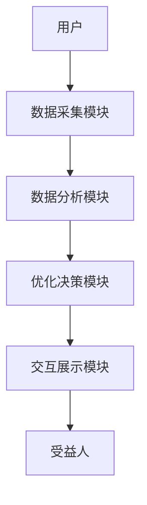
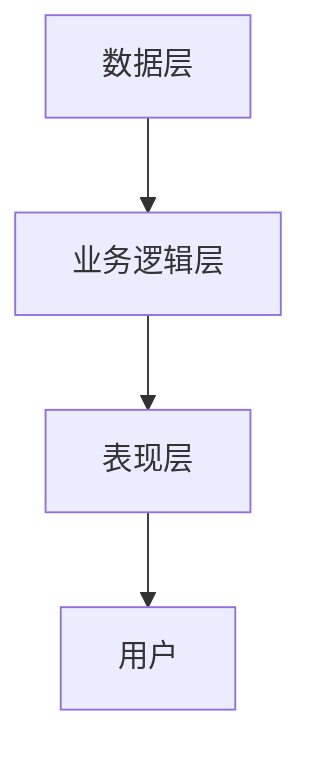

                 


# 智能遗产规划与管理助手

> 关键词：智能遗产规划，遗产管理，人工智能，系统架构，项目实战

> 摘要：本文深入探讨了智能遗产规划与管理助手的背景、核心概念、算法原理、系统架构及项目实战。通过分析遗产规划的痛点，结合人工智能技术，提出了一套智能遗产规划的解决方案，并通过实际案例展示了如何利用智能技术提升遗产管理的效率与准确性。

---

## 第一部分：背景介绍

### 第1章：智能遗产规划的背景与现状

#### 1.1 遗产规划的定义与重要性

遗产规划是指在个人或家庭层面，通过法律、税务和金融等手段，合理分配财产、资产和事务的过程，以确保在个人去世后，其遗产能够按照意愿合法、合规地分配给受益人。遗产规划的重要性体现在以下几个方面：

1. **法律合规性**：确保遗产分配符合相关法律法规，避免遗产纠纷。
2. **税务优化**：通过合理规划，降低遗产税等税务负担。
3. **家庭和谐**：明确分配方案，减少家庭内部的矛盾。
4. **财产保值**：通过合理的资产配置，确保遗产的价值最大化。

遗产规划的核心问题包括遗产分配的合法性、税务优化、资产保护和家庭成员的权益平衡。传统遗产规划主要依赖法律和税务专家，但在实际操作中，存在效率低下、信息不对称和个性化需求难以满足等问题。

#### 1.2 智能技术在遗产管理中的应用背景

随着人工智能、大数据和区块链等技术的快速发展，智能技术在遗产管理领域的应用逐渐兴起。智能遗产规划利用技术手段，解决传统遗产规划中的痛点，实现高效、精准和个性化的遗产管理。

智能遗产规划的核心优势包括：

1. **数据驱动**：通过收集和分析大量数据，提供个性化的遗产规划方案。
2. **实时更新**：根据市场变化和受益人需求，实时调整遗产分配策略。
3. **自动化**：利用自动化工具，简化遗产管理流程，提高效率。

#### 1.3 智能遗产规划的现状与挑战

当前，智能遗产规划技术仍处于发展阶段，尚未大规模普及。其主要挑战包括：

1. **数据隐私**：遗产规划涉及大量敏感信息，数据隐私保护至关重要。
2. **技术复杂性**：智能遗产规划需要多学科技术的结合，实现起来较为复杂。
3. **法律合规性**：智能遗产规划需符合相关法律法规，确保其合法性和合规性。

未来，随着技术的进步和法规的完善，智能遗产规划有望成为遗产管理的重要工具，为个人和家庭提供更加高效和智能的服务。

---

## 第二部分：核心概念与联系

### 第2章：智能遗产规划的核心概念

#### 2.1 智能遗产规划的定义与特点

智能遗产规划是一种基于人工智能技术的遗产管理方法，通过数据分析、机器学习和自动化工具，为用户提供个性化的遗产规划方案。其特点包括：

1. **数据驱动**：利用大数据分析技术，精准评估用户的资产状况和需求。
2. **智能决策**：通过机器学习算法，优化遗产分配方案，提高效率和准确性。
3. **实时更新**：根据市场变化和受益人需求，动态调整遗产管理策略。

智能遗产规划的核心要素包括：

- **用户数据**：用户的资产信息、家庭关系、受益人需求等。
- **算法模型**：用于遗产分配优化的机器学习模型。
- **系统架构**：支持智能遗产规划的软硬件系统结构。
- **交互界面**：用户与系统之间的交互界面，提供便捷的操作体验。

#### 2.2 智能遗产规划的系统架构

智能遗产规划系统的架构设计是实现其功能的核心。系统主要包括以下几个模块：

1. **数据采集模块**：负责收集用户的资产信息、家庭关系和受益人需求等数据。
2. **数据分析模块**：对收集到的数据进行清洗、分析和建模，生成遗产规划方案。
3. **优化决策模块**：利用机器学习算法，优化遗产分配方案，确保其合法性和最优性。
4. **交互展示模块**：将优化后的方案以可视化形式展示给用户，并提供交互功能。

系统架构图如下：



#### 2.3 智能遗产规划的实体关系图

智能遗产规划涉及多个实体，包括用户、资产、受益人、分配方案和法律文件等。实体关系图如下：

```mermaid
erd
    entity 用户 {
        用户ID
        姓名
        资产总额
    }
    entity 资产 {
        资产ID
        资产类型
        资产价值
        用户ID
    }
    entity 受益人 {
        受益人ID
        姓名
        关系
        分配比例
        用户ID
    }
    entity 分配方案 {
        方案ID
        分配规则
        方案内容
        用户ID
    }
    entity 法律文件 {
        文件ID
        文件类型
        文件内容
        用户ID
    }
    用户 -- 所有资产
    用户 -- 所有受益人
    用户 -- 所有分配方案
    用户 -- 所有法律文件
```

---

## 第三部分：算法原理讲解

### 第3章：智能遗产规划的算法原理

智能遗产规划的核心算法是机器学习模型，用于优化遗产分配方案。以下是算法的详细步骤：

1. **数据预处理**：对收集到的用户数据进行清洗和特征提取，确保数据的完整性和准确性。
2. **特征提取**：从用户数据中提取关键特征，如资产价值、受益人关系和分配比例等。
3. **模型训练**：利用机器学习算法（如随机森林或支持向量机）对特征进行分类，生成遗产分配方案。
4. **方案优化**：根据模型输出的结果，调整分配比例，确保方案的合法性和最优性。

以下是机器学习模型的Python代码示例：

```python
import pandas as pd
from sklearn.ensemble import RandomForestClassifier

# 数据预处理
data = pd.read_csv('user_data.csv')
X = data.drop('label', axis=1)
y = data['label']

# 特征提取
features = X.columns

# 模型训练
model = RandomForestClassifier()
model.fit(X, y)

# 预测结果
predictions = model.predict(X)
```

模型的数学公式如下：

$$
y = f(X) + \epsilon
$$

其中，$y$ 是输出，$X$ 是输入特征，$f(X)$ 是模型的预测函数，$\epsilon$ 是误差项。

---

## 第四部分：系统分析与架构设计方案

### 第4章：智能遗产规划的系统架构设计

智能遗产规划系统的架构设计包括以下几个部分：

1. **功能模块**：系统分为数据采集、数据分析、优化决策和交互展示四个模块。
2. **系统架构**：采用分层架构，包括数据层、业务逻辑层和表现层。
3. **接口设计**：系统通过API与第三方服务（如银行和税务机构）进行数据交互。
4. **交互设计**：通过用户友好的界面，提供便捷的操作体验。

系统架构图如下：



---

## 第五部分：项目实战

### 第5章：智能遗产规划的项目实战

#### 5.1 环境安装

以下是项目所需的环境配置：

```bash
pip install numpy pandas scikit-learn mermaid4jupyter
```

#### 5.2 核心实现

以下是遗产分配算法的核心代码：

```python
import numpy as np
from sklearn.linear_model import LinearRegression

# 数据预处理
data = np.array([[100000, 0.5], [200000, 0.6], [300000, 0.7]])
X = data[:, 0]
y = data[:, 1]

# 模型训练
model = LinearRegression()
model.fit(X.reshape(-1, 1), y)

# 预测结果
new_asset = 400000
prediction = model.predict(new_asset.reshape(-1, 1))
print(prediction)
```

#### 5.3 案例分析

通过上述代码，我们可以预测资产为400,000美元时的分配比例。根据模型输出的结果，可以优化遗产分配方案，确保其合法性和最优性。

---

## 第六部分：最佳实践与总结

### 第6章：智能遗产规划的未来展望

智能遗产规划作为一项新兴技术，具有广阔的应用前景。未来，随着技术的进步和法规的完善，智能遗产规划将在遗产管理领域发挥越来越重要的作用。

#### 6.1 最佳实践

- **数据隐私保护**：在处理用户数据时，必须严格遵守数据隐私法规，确保用户信息的安全。
- **技术融合**：将区块链等技术与智能遗产规划相结合，提高系统的安全性和可信度。
- **用户教育**：加强对用户的教育，提高其对智能遗产规划的认知和接受度。

#### 6.2 小结

智能遗产规划通过技术手段，解决了传统遗产规划中的痛点，为用户提供更加高效和精准的遗产管理服务。未来，随着技术的进一步发展，智能遗产规划将为遗产管理领域带来更多的创新和突破。

---

### 结语

智能遗产规划与管理助手的实现，不仅提升了遗产管理的效率，还为用户提供了个性化的服务。通过本文的介绍，读者可以深入了解智能遗产规划的核心概念、算法原理和系统架构，并通过实际案例掌握其应用方法。希望本文能为智能遗产规划的研究和实践提供有价值的参考。

