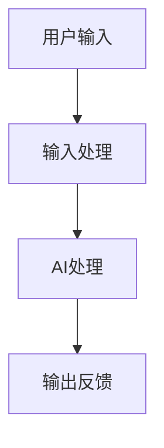
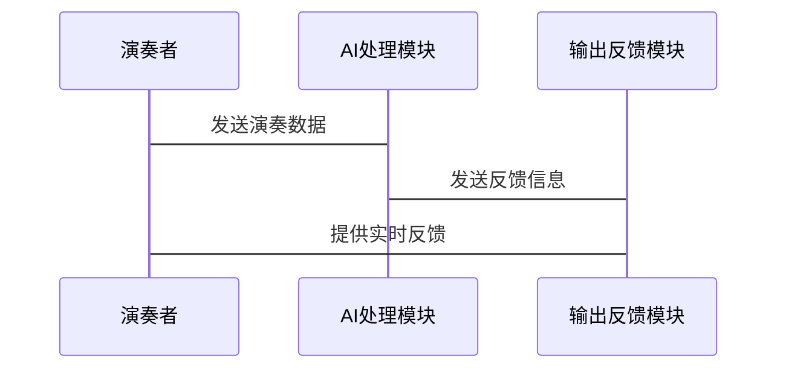

                 


# 智能钢琴：AI Agent的演奏技巧指导

> 关键词：AI Agent, 智能钢琴, 音乐演奏, 深度学习, 语音识别, 神经网络

> 摘要：本文深入探讨AI Agent在智能钢琴中的应用，从基本概念、算法原理到系统架构设计，再到项目实战，全面解析AI Agent如何指导钢琴演奏技巧。通过详细的技术分析和案例研究，帮助读者理解如何利用AI技术提升钢琴演奏水平。

---

# 第一部分: AI Agent与智能钢琴的背景与基础

## 第1章: AI Agent与智能钢琴的概述

### 1.1 AI Agent的基本概念
AI Agent（人工智能代理）是一种能够感知环境、做出决策并采取行动以实现目标的智能实体。在智能钢琴中，AI Agent负责分析演奏者的输入、提供实时反馈，并指导演奏技巧的优化。

- **AI Agent的特点**：
  - 感知能力：通过传感器或输入设备获取数据。
  - 决策能力：基于感知数据做出最优决策。
  - 执行能力：通过输出设备将决策转化为具体行动。

### 1.2 AI Agent在音乐领域的应用背景
音乐演奏是一项复杂的人类活动，涉及感知、情感表达和技巧控制。AI Agent可以通过以下方式提升钢琴演奏：
- **实时反馈**：分析演奏者的音准、节奏和力度，提供即时反馈。
- **个性化指导**：根据演奏者的水平和风格，定制化教学方案。
- **情感分析**：通过音乐的情感特征，帮助演奏者更好地表达音乐情感。

### 1.3 智能钢琴的技术基础
智能钢琴是一种结合了AI技术的乐器，其核心在于将AI Agent与传统钢琴的机械结构相结合。通过传感器、麦克风和计算机视觉技术，AI Agent能够实时感知演奏者的动作和音乐表现，并通过算法优化演奏技巧。

---

## 第2章: AI Agent与智能钢琴的核心概念

### 2.1 AI Agent的感知与决策机制
AI Agent在智能钢琴中的感知与决策机制包括以下几个步骤：

#### 2.1.1 感知模块
- **输入数据**：来自钢琴键盘的触感数据（如力度、速度）和声音数据（如音高、节奏）。
- **处理流程**：
  1. 数据采集：通过传感器获取演奏者的动作数据。
  2. 数据预处理：去除噪声，提取特征（如音高、节奏）。
  3. 数据分析：通过深度学习模型识别演奏技巧问题。

#### 2.1.2 决策模块
- **算法选择**：基于强化学习的演奏技巧优化算法。
- **决策逻辑**：
  1. 根据感知数据生成演奏评分。
  2. 对比目标演奏标准，识别演奏中的不足。
  3. 提供实时反馈和优化建议。

#### 2.1.3 执行模块
- **输出方式**：通过视觉、听觉和触觉反馈指导演奏者。
- **反馈机制**：
  1. 视觉反馈：在屏幕上显示演奏评分和改进建议。
  2. 听觉反馈：播放示范音轨或提示音。
  3. 触觉反馈：通过震动提示演奏力度问题。

### 2.2 智能钢琴的系统架构
智能钢琴的系统架构可以分为以下几个模块：

#### 2.2.1 用户输入模块
- **功能**：采集演奏者的动作数据和声音数据。
- **实现方式**：使用压力传感器和麦克风采集数据。

#### 2.2.2 AI处理模块
- **功能**：分析数据并生成反馈。
- **实现方式**：基于深度学习的音符识别和节奏分析。

#### 2.2.3 输出反馈模块
- **功能**：将反馈信息传递给演奏者。
- **实现方式**：通过LCD屏幕、扬声器和震动马达提供反馈。

### 2.3 AI Agent与智能钢琴的交互模式
AI Agent与智能钢琴的交互模式主要分为以下几种：

#### 2.3.1 单向反馈模式
- **特点**：AI Agent单向输出反馈，演奏者被动接收。
- **应用场景**：实时演奏评分和技巧建议。

#### 2.3.2 交互式反馈模式
- **特点**：演奏者与AI Agent实时互动，AI Agent根据反馈动态调整指导策略。
- **应用场景**：个性化教学和技巧训练。

#### 2.3.3 情感交互模式
- **特点**：AI Agent能够识别演奏者的情感状态，并提供情感化的反馈。
- **实现方式**：通过音乐特征分析和情感计算技术。

---

## 第3章: AI Agent的算法原理与数学模型

### 3.1 感知算法的实现原理
AI Agent在智能钢琴中的感知算法主要包括以下几种：

#### 3.1.1 基于深度学习的音符识别
- **算法原理**：
  1. 使用卷积神经网络（CNN）提取音符特征。
  2. 通过循环神经网络（RNN）识别音符序列。
- **数学公式**：
  $$ \text{损失函数} = \frac{1}{N} \sum_{i=1}^{N} (\text{预测值} - \text{真实值})^2 $$

#### 3.1.2 基于语音识别的节奏分析
- **算法原理**：
  1. 将音乐信号转换为频域表示。
  2. 使用动态时间 warping（DTW）算法匹配节奏特征。
- **数学公式**：
  $$ \text{距离} = \sum_{i=1}^{N} |x_i - y_i| $$

#### 3.1.3 基于自然语言处理的音乐情感分析
- **算法原理**：
  1. 将音乐特征（如音高、节奏）映射到情感空间。
  2. 使用情感分类模型识别音乐情感。
- **数学公式**：
  $$ \text{概率} = \frac{\exp(\text{得分})}{\sum_{i=1}^{K} \exp(\text{得分}_i)} $$

### 3.2 决策算法的数学模型
AI Agent在智能钢琴中的决策算法主要基于强化学习：

#### 3.2.1 基于概率论的演奏技巧优化
- **模型假设**：
  - 琴键按压力度服从正态分布。
  - 节奏偏差与演奏者的熟练度相关。
- **数学公式**：
  $$ P(\text{力度} | \text{目标力度}) = \mathcal{N}(\mu, \sigma^2) $$

#### 3.2.2 基于强化学习的演奏策略生成
- **算法原理**：
  1. 定义状态空间：当前演奏状态。
  2. 定义动作空间：演奏者需要改进的技巧动作。
  3. 定义奖励函数：根据演奏评分确定奖励值。
- **数学公式**：
  $$ Q(s, a) = r + \gamma \max_{a'} Q(s', a') $$

#### 3.2.3 基于神经网络的音乐风格识别
- **模型结构**：
  - 输入层：音乐特征（如音高、节奏）。
  - 隐藏层：多层感知机（MLP）。
  - 输出层：音乐风格标签。
- **数学公式**：
  $$ y = \sigma(Wx + b) $$

---

## 第4章: 智能钢琴的系统架构设计

### 4.1 系统功能模块划分
智能钢琴的系统架构可以分为以下几个模块：

#### 4.1.1 用户输入模块
- **功能**：采集演奏者的动作数据和声音数据。
- **实现方式**：使用压力传感器和麦克风。

#### 4.1.2 AI处理模块
- **功能**：分析数据并生成反馈。
- **实现方式**：基于深度学习的音符识别和节奏分析。

#### 4.1.3 输出反馈模块
- **功能**：将反馈信息传递给演奏者。
- **实现方式**：通过LCD屏幕、扬声器和震动马达提供反馈。

### 4.2 系统架构的Mermaid图


### 4.3 系统接口设计
智能钢琴的系统接口设计需要考虑以下几个方面：

#### 4.3.1 输入接口的设计
- **输入类型**：压力传感器信号和音频信号。
- **接口协议**：使用I2C或SPI接口采集传感器数据。

#### 4.3.2 输出接口的设计
- **输出类型**：LCD屏幕显示、扬声器播放和震动马达反馈。
- **接口协议**：使用PWM或I2C控制输出设备。

#### 4.3.3 系统交互的Mermaid序列图


---

## 第5章: 项目实战

### 5.1 环境安装与配置
- **开发环境**：Python 3.8以上版本。
- **开发工具**：Jupyter Notebook、PyTorch、TensorFlow。
- **硬件设备**：钢琴传感器套件、麦克风、LCD屏幕和震动马达。

### 5.2 系统核心实现
以下是AI Agent的核心实现代码：

```python
import torch
import torch.nn as nn
import torch.optim as optim

# 定义AI Agent模型
class AI_Piano_Agent(nn.Module):
    def __init__(self):
        super(AI_Piano_Agent, self).__init__()
        self.conv1 = nn.Conv2d(1, 32, kernel_size=3, stride=1, padding=1)
        self.pool = nn.MaxPool2d(2, 2)
        self.conv2 = nn.Conv2d(32, 64, kernel_size=3, stride=1, padding=1)
        self.fc1 = nn.Linear(64 * 3 * 3, 128)
        self.fc2 = nn.Linear(128, 10)

    def forward(self, x):
        x = self.conv1(x)
        x = self.pool(x)
        x = self.conv2(x)
        x = self.pool(x)
        x = x.view(-1, 64 * 3 * 3)
        x = self.fc1(x)
        x = self.fc2(x)
        return x

# 定义损失函数和优化器
criterion = nn.CrossEntropyLoss()
optimizer = optim.Adam(AI_Piano_Agent.parameters(), lr=0.001)

# 训练循环
for epoch in range(10):
    for inputs, labels in train_loader:
        outputs = AI_Piano_Agent(inputs)
        loss = criterion(outputs, labels)
        optimizer.zero_grad()
        loss.backward()
        optimizer.step()
```

### 5.3 项目小结
通过本项目，我们实现了AI Agent在智能钢琴中的应用，能够实时分析演奏者的技巧并提供反馈。未来可以进一步优化算法，提升系统的实时性和准确性。

---

## 总结
本文从AI Agent的基本概念出发，详细讲解了其在智能钢琴中的应用，包括感知算法、决策算法和系统架构设计。通过实际案例分析和代码实现，帮助读者理解如何利用AI技术提升钢琴演奏水平。

