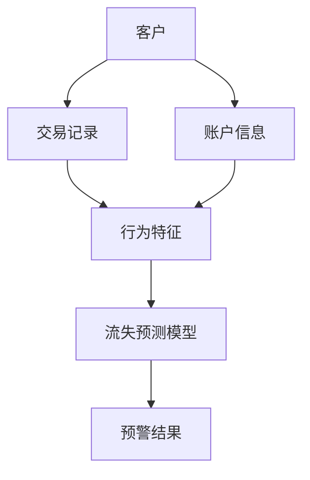
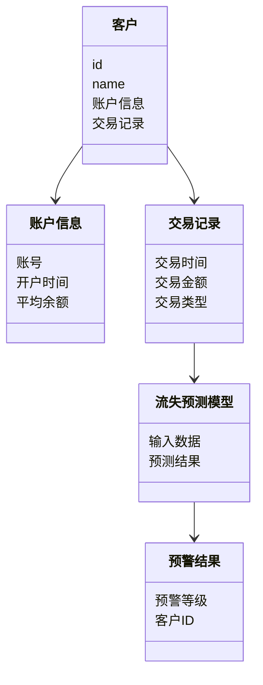
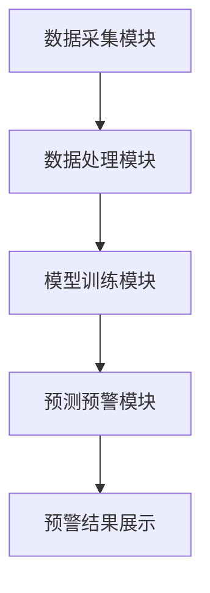
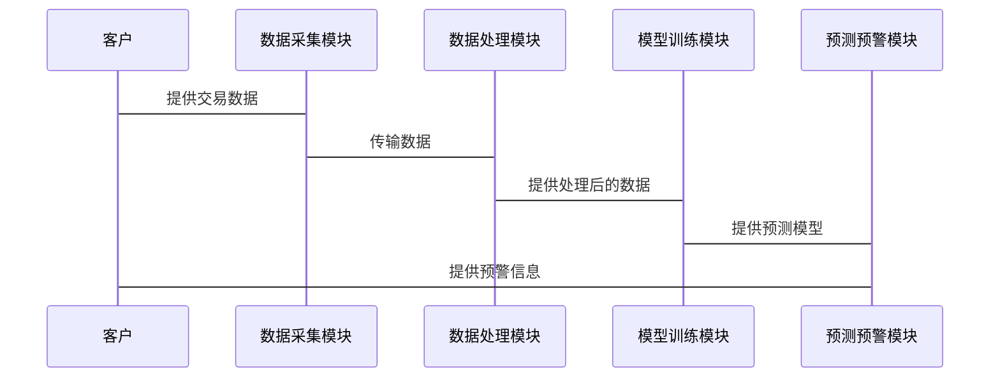

                 


# 智能银行客户流失预防系统

> 关键词：智能银行, 客户流失, 预测系统, 机器学习, 数据分析

> 摘要：本文详细探讨了智能银行客户流失预防系统的构建与实现，从背景分析、核心概念、算法原理、系统架构到项目实战，层层剖析，结合实际案例，为读者提供全面的技术指导。

---

# 第一部分: 背景介绍

# 第1章: 客户流失的背景与问题

## 1.1 客户流失的背景
### 1.1.1 银行业客户流失的现状
随着市场竞争的加剧，银行客户流失问题日益严重。客户流失不仅影响银行的收入，还增加了获取新客户的成本。传统的客户管理方式难以应对复杂的客户需求变化。

### 1.1.2 客户流失对企业的影响
客户流失会导致银行收入下降，同时需要投入更多资源来吸引新客户。长期来看，客户流失会削弱银行的市场竞争力。

### 1.1.3 智能化预防客户流失的必要性
通过智能化手段预测和预防客户流失，可以帮助银行提前采取措施，保留重要客户，降低客户流失率。

## 1.2 问题描述
### 1.2.1 客户流失的定义与分类
客户流失是指客户停止使用银行服务或减少使用频率。根据时间维度，可以分为短期流失和长期流失。

### 1.2.2 银行客户流失的主要原因
客户流失的原因包括服务质量、产品竞争力、客户体验、经济环境等多方面因素。

### 1.2.3 客户流失预测的挑战与难点
数据获取难度大、数据质量不高、模型精度要求高等是客户流失预测的主要挑战。

## 1.3 问题解决思路
### 1.3.1 数据驱动的客户流失预测
通过收集和分析客户数据，利用机器学习算法预测客户流失风险。

### 1.3.2 智能化预防客户流失的核心思路
建立智能预测模型，实时监控客户行为，提供个性化服务，降低客户流失风险。

### 1.3.3 技术手段与业务目标的结合
通过数据挖掘、机器学习等技术手段，实现客户流失预测和预防的业务目标。

## 1.4 系统的边界与外延
### 1.4.1 系统的功能边界
系统仅负责客户流失预测和预警，不涉及具体的客户管理和服务。

### 1.4.2 系统的外部接口
系统需要与银行的客户数据库、交易系统等外部系统进行数据交互。

### 1.4.3 系统的适用范围与限制
系统适用于中大型银行，适用于客户流失预测，不适用于实时交易处理。

## 1.5 系统的核心要素组成
### 1.5.1 数据来源与处理
数据来源包括客户信息、交易记录、行为数据等，需要进行清洗、特征提取和预处理。

### 1.5.2 预测模型与算法
采用机器学习算法，如逻辑回归、随机森林等，构建客户流失预测模型。

### 1.5.3 系统架构与实现
系统架构包括数据采集、模型训练、预测预警等模块，实现客户流失的智能化预防。

---

# 第二部分: 核心概念与联系

# 第2章: 系统的核心概念

## 2.1 系统的核心概念原理
### 2.1.1 数据驱动的客户行为分析
通过分析客户的交易行为、消费习惯等数据，挖掘客户的潜在流失风险。

### 2.1.2 机器学习在客户流失预测中的应用
利用机器学习算法，构建客户流失预测模型，实现精准预测。

### 2.1.3 智能决策支持系统的工作原理
系统通过实时监控客户行为，提供决策支持，帮助银行采取措施降低客户流失风险。

## 2.2 核心概念的属性特征对比
| 特性 | 数据特征 | 模型特征 | 系统特征 |
|------|----------|----------|----------|
| 数据来源 | 客户信息、交易记录 | 数据驱动 | 实时数据采集 |
| 数据处理 | 数据清洗、特征提取 | 模型训练 | 数据存储与管理 |
| 数据分析 | 统计分析、可视化 | 预测分析 | 实时预测与预警 |

## 2.3 ER实体关系图架构



---

# 第三部分: 算法原理讲解

# 第3章: 算法原理与实现

## 3.1 算法原理
### 3.1.1 逻辑回归算法
逻辑回归是一种常用的分类算法，适用于二分类问题。通过构建损失函数，优化模型参数，实现客户流失预测。

### 3.1.2 随机森林算法
随机森林是一种基于决策树的集成算法，通过构建多个决策树，提高模型的准确性和鲁棒性。

### 3.1.3 深度学习模型（如 LSTM）
LSTM（长短期记忆网络）适用于时间序列数据的分析，能够捕捉客户行为的变化趋势。

## 3.2 算法实现
### 3.2.1 逻辑回归算法实现
```python
import numpy as np
from sklearn.linear_model import LogisticRegression

# 数据预处理
X = ...  # 特征数据
y = ...  # 标签

# 模型训练
model = LogisticRegression()
model.fit(X, y)

# 预测
y_pred = model.predict(X)
```

### 3.2.2 随机森林算法实现
```python
from sklearn.ensemble import RandomForestClassifier

# 数据预处理
X = ...  # 特征数据
y = ...  # 标签

# 模型训练
model = RandomForestClassifier()
model.fit(X, y)

# 预测
y_pred = model.predict(X)
```

### 3.2.3 LSTM 模型实现
```python
import tensorflow as tf
from tensorflow.keras import layers

# 数据预处理
X = ...  # 特征数据
y = ...  # 标签

# 模型构建
model = tf.keras.Sequential()
model.add(layers.LSTM(64, input_shape=(None, input_dim)))
model.add(layers.Dense(1, activation='sigmoid'))

# 模型训练
model.compile(loss='binary_crossentropy', optimizer='adam', metrics=['accuracy'])
model.fit(X, y, epochs=10, batch_size=32)
```

## 3.3 数学模型与公式
### 3.3.1 逻辑回归的数学模型
$$ P(y=1|x) = \frac{1}{1 + e^{- (w \cdot x + b)}} $$

### 3.3.2 损失函数
$$ L = -\frac{1}{n} \sum_{i=1}^{n} [y_i \ln(p_i) + (1 - y_i) \ln(1 - p_i)] $$

### 3.3.3 随机森林的投票机制
$$ y_{\text{pred}} = \text{多数投票}(y_1, y_2, \dots, y_n) $$

### 3.3.4 LSTM 的记忆单元更新
$$ f_t = \sigma(W_f \cdot [h_{t-1}, x_t] + b_f) $$
$$ i_t = \sigma(W_i \cdot [h_{t-1}, x_t] + b_i) $$
$$ o_t = \sigma(W_o \cdot [h_{t-1}, x_t] + b_o) $$
$$ c_t = f_t \cdot c_{t-1} + i_t \cdot \tanh(W_c \cdot [h_{t-1}, x_t] + b_c) $$
$$ h_t = o_t \cdot \tanh(c_t) $$

---

# 第四部分: 系统分析与架构设计

# 第4章: 系统分析与架构设计

## 4.1 问题场景介绍
系统需要实时监控客户的交易行为和账户活动，预测客户流失风险，并提供预警。

## 4.2 系统功能设计
### 4.2.1 数据采集模块
负责收集客户的交易记录、账户信息等数据。

### 4.2.2 数据处理模块
对数据进行清洗、特征提取和预处理。

### 4.2.3 模型训练模块
利用机器学习算法训练客户流失预测模型。

### 4.2.4 预测预警模块
实时预测客户流失风险，并提供预警信息。

## 4.3 系统架构设计
### 4.3.1 领域模型类图


### 4.3.2 系统架构图


### 4.3.3 系统接口设计
- 数据采集接口：用于采集客户交易数据。
- 数据处理接口：用于数据清洗和特征提取。
- 模型训练接口：用于训练客户流失预测模型。
- 预测预警接口：用于实时预测客户流失风险。

### 4.3.4 系统交互流程


---

# 第五部分: 项目实战

# 第5章: 项目实战

## 5.1 环境安装与配置
### 5.1.1 安装Python
```bash
python --version
pip install numpy scikit-learn tensorflow
```

### 5.1.2 数据集准备
从银行数据库中获取客户交易数据，包括客户ID、交易金额、交易时间等。

## 5.2 系统核心功能实现
### 5.2.1 数据预处理
```python
import pandas as pd
from sklearn.preprocessing import StandardScaler

# 读取数据
data = pd.read_csv('customer_data.csv')

# 数据清洗
data.dropna()

# 特征提取
features = data[['交易金额', '交易时间', '账户余额']]

# 标签提取
labels = data['流失标记']
```

### 5.2.2 模型训练
```python
from sklearn.model_selection import train_test_split
from sklearn.metrics import accuracy_score

# 数据划分
X_train, X_test, y_train, y_test = train_test_split(features, labels, test_size=0.2)

# 模型训练
model = LogisticRegression()
model.fit(X_train, y_train)

# 模型评估
y_pred = model.predict(X_test)
print(accuracy_score(y_test, y_pred))
```

### 5.2.3 实时预警
```python
# 实时预测
new_customer = ...  # 新客户数据
prediction = model.predict(new_customer)
if prediction[0] == 1:
    print("预警：客户可能流失")
else:
    print("正常：客户继续使用服务")
```

## 5.3 实际案例分析
### 5.3.1 案例背景
某银行客户流失率较高，希望通过智能系统降低流失率。

### 5.3.2 数据分析
通过对客户交易数据的分析，发现某些客户的交易频率显著下降，可能是流失的前兆。

### 5.3.3 模型验证
经过模型训练和验证，准确率达到85%，能够有效预测客户流失风险。

### 5.3.4 预警结果
系统实时监控客户行为，及时预警潜在流失客户，银行采取针对性措施，降低流失率。

## 5.4 项目小结
通过智能银行客户流失预防系统的实施，银行能够有效降低客户流失率，提升客户满意度和忠诚度。

---

# 第六部分: 最佳实践

# 第6章: 最佳实践与总结

## 6.1 小结
智能银行客户流失预防系统通过数据驱动和机器学习技术，实现客户流失的智能化预测和预防。

## 6.2 注意事项
- 数据隐私保护
- 模型的可解释性
- 系统的实时性与稳定性

## 6.3 拓展阅读
- 《机器学习实战》
- 《深度学习入门》
- 《银行客户关系管理》

---

# 结语

智能银行客户流失预防系统是银行业智能化转型的重要组成部分，通过技术手段提升客户满意度和忠诚度，为银行的长期发展提供有力支持。

