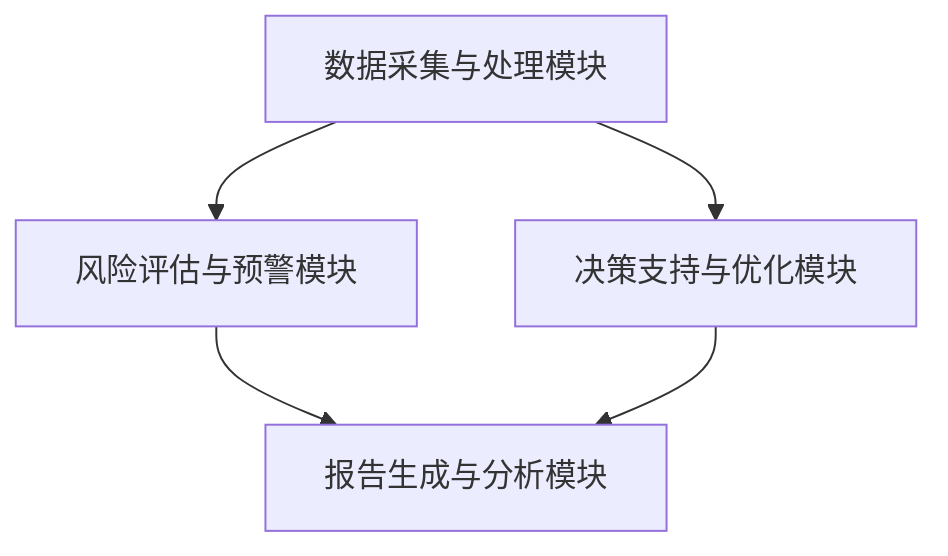
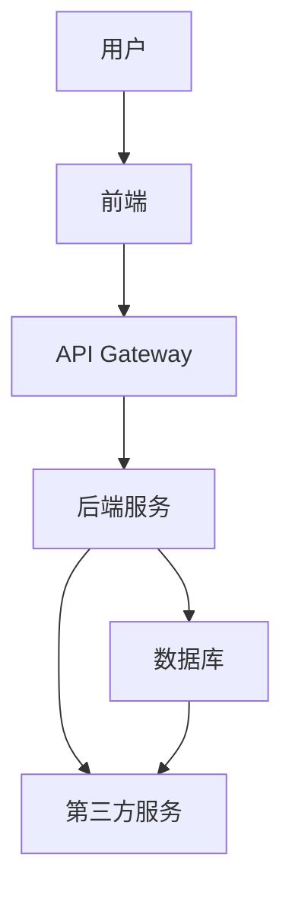
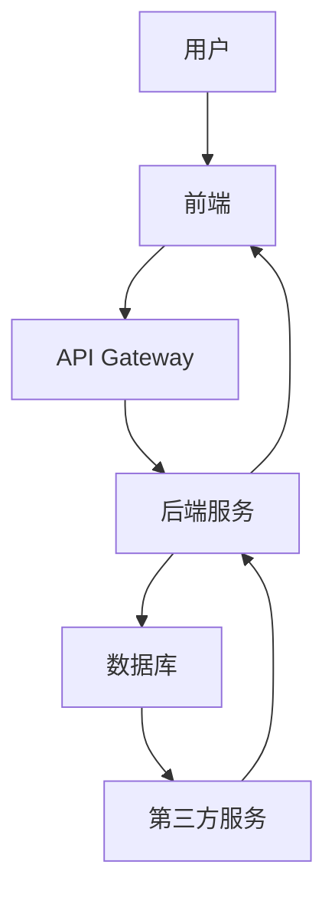

                 


# 智能银行资产负债管理优化系统

> 关键词：智能银行，资产负债管理，优化系统，人工智能，风险管理，系统架构

> 摘要：随着人工智能和大数据技术的快速发展，智能银行在金融领域的应用越来越广泛。智能银行资产负债管理优化系统通过整合先进的技术手段，如机器学习、深度学习等，实现对银行资产负债的智能分析、风险评估和优化决策。本文将详细介绍智能银行资产负债管理优化系统的背景、核心概念、算法原理、系统架构、项目实战及最佳实践，帮助读者全面理解该系统的开发与应用。

---

# 第一部分: 智能银行资产负债管理优化系统概述

## 第1章: 智能银行资产负债管理优化系统背景介绍

### 1.1 智能银行的定义与特点
智能银行是传统银行与现代信息技术深度融合的产物，具有以下特点：
- **智能化**：利用人工智能技术实现自动化服务和智能决策。
- **数据驱动**：依赖于大数据分析和处理，提升业务效率和客户体验。
- **实时性**：能够实时处理交易和数据分析，提供即时反馈。
- **个性化**：根据客户需求提供定制化的产品和服务。

智能银行与传统银行的对比如下：

| **对比维度** | **传统银行** | **智能银行** |
|--------------|--------------|--------------|
| 服务方式    | 线下为主      | 线上线下结合 |
| 交易效率    | 较低          | 高            |
| 客户体验    | 标准化        | 个性化        |
| 数据处理    | 人工为主      | 自动化        |

### 1.2 资产负债管理的基本概念
资产负债管理是银行管理的核心内容之一，主要包括以下内容：
- **资产**：银行持有的各项资产，如贷款、投资等。
- **负债**：银行的债务，如存款、借款等。
- **资本**：银行的自有资金，用于承担风险和吸收损失。

资产负债管理的主要目标是实现资产和负债的匹配，确保银行的流动性、安全性和盈利性。

### 1.3 智能银行资产负债管理优化的必要性
传统资产负债管理存在以下问题：
- **效率低**：依赖人工操作，效率低下，容易出错。
- **风险高**：难以及时发现和应对市场波动带来的风险。
- **决策慢**：决策过程复杂，难以快速响应市场变化。

通过引入人工智能和大数据技术，智能银行可以实现以下优化：
- **实时监控**：实时分析资产和负债的变化，及时发现风险。
- **智能决策**：基于数据和模型，提供最优的资产配置和负债管理策略。
- **自动化处理**：自动化完成部分业务流程，提高效率和准确性。

---

## 第2章: 智能银行资产负债管理优化系统的组成与功能

### 2.1 系统组成模块
智能银行资产负债管理优化系统主要包括以下模块：
1. **数据采集与处理模块**：负责收集和处理银行的资产、负债、市场等数据。
2. **风险评估与预警模块**：基于数据，评估和预警潜在的金融风险。
3. **决策支持与优化模块**：提供决策支持，优化资产和负债的配置。
4. **报告生成与分析模块**：生成报告，分析系统运行的效果。

### 2.2 系统功能模块的详细说明
#### 数据采集与处理模块
- **数据来源**：包括银行内部数据（如存款、贷款数据）和外部数据（如市场利率、经济指标）。
- **数据清洗**：去除噪声数据，确保数据的准确性和完整性。
- **数据存储**：将处理后的数据存储在数据库中，便于后续分析。

#### 风险评估与预警模块
- **风险评估模型**：基于机器学习算法，评估资产和负债的风险。
- **风险预警**：当风险超过设定阈值时，触发预警机制，提醒相关人员采取措施。

#### 决策支持与优化模块
- **优化算法**：选择合适的优化算法（如遗传算法、模拟退火等），优化资产和负债的配置。
- **决策建议**：根据优化结果，提供具体的决策建议，帮助银行实现资产和负债的最优配置。

#### 报告生成与分析模块
- **报告生成**：根据系统运行数据，生成详细的报告，包括资产和负债的变化趋势、风险评估结果等。
- **报告分析**：对报告进行分析，总结系统的运行效果，并提出改进建议。

### 2.3 系统功能模块之间的关系
- **数据流**：数据采集与处理模块将数据传递给风险评估与预警模块和决策支持与优化模块。
- **模块依赖**：风险评估与预警模块依赖于数据采集与处理模块的数据，决策支持与优化模块依赖于风险评估结果。
- **系统架构**：系统整体架构图如下：



---

## 第3章: 智能银行资产负债管理优化系统的算法原理

### 3.1 优化算法的选择与比较
在智能银行资产负债管理优化系统中，优化算法的选择至关重要。常用的优化算法包括：
1. **遗传算法**：模拟生物进化的过程，通过选择、交叉和变异操作生成新的解。
2. **模拟退火**：通过逐步降温的方式，找到全局最优解。
3. **粒子群优化算法**：通过模拟鸟群飞行的行为，找到最优解。

### 3.2 基于机器学习的优化算法
#### 机器学习在资产负债管理中的应用
机器学习可以用于风险评估和资产配置。例如，使用支持向量机（SVM）进行风险分类，使用随机森林进行资产配置。

#### 常用机器学习算法的原理
- **支持向量机（SVM）**：通过找到一个超平面，将数据分为两类，适用于分类问题。
- **随机森林**：通过构建多个决策树，集成得到最终结果，适用于分类和回归问题。

#### 算法在智能银行中的具体实现
以下是一个基于SVM的风险分类示例：

```python
from sklearn.svm import SVC
import numpy as np

# 生成训练数据
X_train = np.array([[1, 2], [3, 4], [5, 6]])
y_train = np.array([0, 1, 0])

# 训练模型
model = SVC()
model.fit(X_train, y_train)

# 预测新数据
X_test = np.array([[2, 3]])
y_test = model.predict(X_test)
print(y_test)  # 输出结果
```

### 3.3 基于深度学习的优化算法
#### 深度学习在智能银行中的应用
深度学习可以用于复杂的金融模型，如时间序列预测和风险评估。

#### 常用深度学习算法的原理
- **长短期记忆网络（LSTM）**：通过记忆单元和遗忘门，处理时间序列数据，适用于金融时间序列预测。
- **卷积神经网络（CNN）**：通过卷积操作，提取图像特征，适用于图像识别和金融数据分析。

#### 算法在智能银行中的具体实现
以下是一个基于LSTM的时间序列预测示例：

```python
from keras.layers import LSTM, Dense
from keras.models import Sequential
import numpy as np

# 生成训练数据
X_train = np.array([[[1, 2], [3, 4], [5, 6]]])
y_train = np.array([7])

# 构建模型
model = Sequential()
model.add(LSTM(32, input_shape=(3, 2)))
model.add(Dense(1))
model.compile(loss='mean_squared_error', optimizer='adam')

# 训练模型
model.fit(X_train, y_train, epochs=10, batch_size=1)

# 预测新数据
X_test = np.array([[[7, 8], [9, 10], [11, 12]]])
y_test = model.predict(X_test)
print(y_test)  # 输出结果
```

### 3.4 算法的优化与调优
- **参数调整**：通过调整算法的参数（如学习率、批量大小等），提高模型的性能。
- **模型评估**：使用交叉验证等方法，评估模型的泛化能力。
- **模型调优**：通过网格搜索等方法，找到最优的模型参数。

---

## 第4章: 智能银行资产负债管理优化系统的系统架构设计

### 4.1 系统架构图
系统整体架构图如下：



### 4.2 系统功能设计
- **前端**：负责与用户交互，展示系统功能。
- **后端服务**：负责处理业务逻辑，调用优化算法，生成报告。
- **数据库**：存储系统数据，如资产、负债、市场数据等。
- **第三方服务**：集成外部数据源，如金融数据API。

### 4.3 系统接口设计
- **API接口**：提供RESTful API，供前端和第三方服务调用。
- **数据接口**：与数据库和第三方服务对接，确保数据的流通。

### 4.4 系统交互流程图
系统交互流程图如下：



---

## 第5章: 智能银行资产负债管理优化系统的项目实战

### 5.1 环境安装
- **Python**：安装Python 3.8及以上版本。
- **库依赖**：安装numpy、pandas、scikit-learn、keras等库。

### 5.2 核心代码实现
#### 数据处理
```python
import pandas as pd
import numpy as np

# 读取数据
data = pd.read_csv('data.csv')

# 数据清洗
data.dropna(inplace=True)
data = pd.get_dummies(data)
```

#### 风险评估
```python
from sklearn.svm import SVC
from sklearn.model_selection import train_test_split

# 划分数据集
X = data.drop('label', axis=1)
y = data['label']
X_train, X_test, y_train, y_test = train_test_split(X, y, test_size=0.2)

# 训练模型
model = SVC()
model.fit(X_train, y_train)

# 预测结果
y_pred = model.predict(X_test)
print(y_pred)
```

#### 优化决策
```python
from sklearn.ensemble import RandomForestRegressor
import numpy as np

# 数据准备
X = np.array([[1, 2], [3, 4], [5, 6]])
y = np.array([7, 8, 9])

# 训练模型
model = RandomForestRegressor()
model.fit(X, y)

# 预测结果
X_new = np.array([[2, 3]])
y_new = model.predict(X_new)
print(y_new)
```

### 5.3 案例分析
假设某银行的资产和负债数据如下：

| 资产 | 负债 | 利率 | 风险等级 |
|------|------|------|----------|
| 100  | 90   | 5%   | 低       |
| 200  | 150  | 6%   | 中       |
| 300  | 210  | 7%   | 高       |

通过系统优化，可以调整资产和负债的配置，使风险最小化，收益最大化。

### 5.4 项目小结
- **系统实现**：实现了智能银行资产负债管理优化系统的各个模块。
- **效果分析**：通过案例分析，验证了系统的优化效果。
- **经验总结**：在实际应用中，需要根据具体情况调整算法和参数，以达到最佳效果。

---

## 第6章: 智能银行资产负债管理优化系统的最佳实践

### 6.1 小结
智能银行资产负债管理优化系统通过整合先进的技术手段，实现对银行资产和负债的智能分析和优化管理。

### 6.2 注意事项
- **数据安全**：确保数据的安全性，防止数据泄露。
- **系统稳定性**：保证系统的稳定运行，避免因故障导致业务中断。
- **模型更新**：定期更新模型，确保模型的有效性。

### 6.3 拓展阅读
- 《机器学习实战》
- 《深度学习入门：基于Python》
- 《金融风险管理》

---

通过以上内容，我们详细介绍了智能银行资产负债管理优化系统的背景、组成、算法、架构、实现和最佳实践。希望本文能够为读者提供有价值的信息和启发，帮助他们在智能银行领域取得更好的成果。

