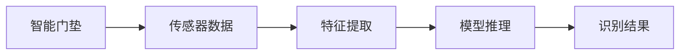

                 


```markdown
# 智能门垫：AI Agent的访客识别系统

> 关键词：智能门垫、AI Agent、访客识别、物联网、深度学习

> 摘要：本文探讨了智能门垫与AI Agent结合的访客识别系统，分析了其在智能家居中的应用，详细讲解了AI Agent的核心原理、算法设计、系统架构及项目实现。

---

# 第1章: 智能门垫与AI Agent概述

## 1.1 问题背景与描述
### 1.1.1 当前访客识别系统的痛点
传统访客识别系统依赖于刷卡、密码等方法，存在以下问题：
- 易遗忘：密码和卡片易丢失。
- 易泄露：密码可能被窃取。
- 体验差：访客每次访问都需要手动操作。

### 1.1.2 智能门垫的概念与目标
智能门垫是一种智能硬件，通过感知人体重量变化，实时监测访客的到来，并结合AI Agent进行识别。

### 1.1.3 AI Agent在访客识别中的作用
AI Agent通过分析门垫传感器数据，结合用户行为模型，实现智能识别和决策。

## 1.2 问题解决与边界
### 1.2.1 智能门垫的解决方案
- 实时感知：通过压力传感器实时监测访客。
- 智能识别：AI Agent分析访客行为特征。

### 1.2.2 系统的边界与外延
- 边界：仅限于访客识别，不涉及开门控制。
- 外延：可与其他智能家居设备联动。

### 1.2.3 核心概念与组成要素
- 智能门垫：硬件部分，负责数据采集。
- AI Agent：软件部分，负责数据处理和决策。
- 访客数据库：存储用户信息和行为特征。

---

# 第2章: AI Agent的核心原理与算法

## 2.1 AI Agent的基本原理
### 2.1.1 感知机制
AI Agent通过门垫传感器获取压力数据，转换为数字信号。

### 2.1.2 决策机制
基于历史数据，AI Agent判断访客身份，生成识别结果。

### 2.1.3 执行机制
通过API将识别结果传递给其他设备，如智能门锁。

## 2.2 访客识别算法
### 2.2.1 深度学习模型
使用卷积神经网络（CNN）训练访客特征。

### 2.2.2 特征提取流程
1. 传感器数据采集。
2. 数据预处理：归一化、降噪。
3. 特征提取：提取压力分布、步频等特征。

### 2.2.3 模型训练方法
使用Keras框架训练模型，损失函数：交叉熵，优化器：Adam。

```python
import keras
from keras.layers import Dense, Input, Activation
from keras.models import Model

input_tensor = Input(shape=(n_features,))
x = Dense(64, activation='relu')(input_tensor)
x = Dense(32, activation='relu')(x)
output_tensor = Dense(1, activation='sigmoid')(x)
model = Model(inputs=input_tensor, outputs=output_tensor)
model.compile(optimizer='adam', loss='binary_crossentropy', metrics=['accuracy'])
```

---

# 第3章: 系统分析与架构设计

## 3.1 系统功能设计
- 数据采集：传感器数据采集。
- 数据处理：特征提取、数据存储。
- 识别与反馈：生成识别结果，反馈至其他设备。

## 3.2 系统架构设计


## 3.3 接口设计
- 传感器接口：SPI/I2C。
- 数据接口：RESTful API。

---

# 第4章: 项目实战

## 4.1 环境安装
- 硬件：Raspberry Pi、压力传感器。
- 软件：Python 3.8+，TensorFlow 2.0+。

## 4.2 核心代码实现
```python
import numpy as np
import tensorflow as tf

# 数据预处理
def preprocess_data(data):
    return (data - np.mean(data)) / np.std(data)

# 模型训练
model = tf.keras.Sequential([
    tf.keras.layers.Dense(64, activation='relu'),
    tf.keras.layers.Dense(1, activation='sigmoid')
])

model.compile(optimizer='adam', loss='binary_crossentropy')
```

---

# 第5章: 总结与展望

## 5.1 系统总结
智能门垫通过AI Agent实现高效访客识别，提升智能家居体验。

## 5.2 注意事项
- 数据隐私：确保访客数据加密存储。
- 系统稳定性：确保传感器和模型的可靠性。

---

通过以上内容，读者可以全面理解智能门垫与AI Agent结合的访客识别系统，掌握其设计原理和实现方法。
```

