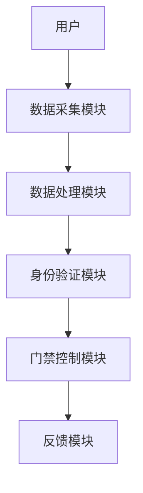
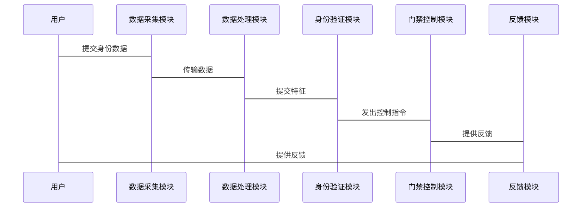

                 


# 智能门禁：AI Agent的多模态身份验证

## 关键词：
智能门禁、AI Agent、多模态身份验证、深度学习、边缘计算、安全性

## 摘要：
随着人工智能和多模态技术的快速发展，智能门禁系统逐渐成为现代安全领域的重要组成部分。本文将详细探讨AI Agent在多模态身份验证中的应用，从理论基础到实际应用，分析其优势和挑战，并通过案例展示如何构建高效、安全的智能门禁系统。

---

# 第1章: 智能门禁系统概述

## 1.1 智能门禁的背景与意义

### 1.1.1 传统门禁系统的局限性
传统的门禁系统主要依赖于刷卡或密码，存在以下问题：
- **安全性低**：卡片容易被复制，密码容易被破解。
- **用户体验差**：需要携带卡片或记住复杂密码，使用不便。
- **功能单一**：无法实现智能化管理，难以与其他系统联动。

### 1.1.2 智能门禁的定义与特点
智能门禁系统是一种结合了物联网、人工智能和大数据技术的智能化管理系统，具有以下特点：
- **智能化**：通过AI算法实现自动识别和决策。
- **多模态验证**：支持指纹、人脸识别等多种验证方式，提高安全性。
- **远程管理**：可以通过手机APP或云端平台远程控制门禁权限。

### 1.1.3 AI Agent在智能门禁中的作用
AI Agent（智能代理）在智能门禁系统中扮演着关键角色，主要负责：
- **数据采集与处理**：实时采集用户的多模态数据（如指纹、人脸、声音等）。
- **身份识别与验证**：通过深度学习算法对采集的数据进行分析和识别，验证用户身份。
- **决策与反馈**：根据识别结果控制门禁的开启或关闭，并提供实时反馈。

---

## 1.2 多模态身份验证的必要性

### 1.2.1 单一身份验证方式的不足
单一的身份验证方式（如指纹或人脸识别）存在以下问题：
- **安全性低**：容易被 spoofing（欺骗攻击）。
- **用户体验差**：在复杂环境中识别率可能下降。
- **适用性有限**：无法满足所有场景的需求。

### 1.2.2 多模态身份验证的优势
多模态身份验证通过结合多种验证方式，显著提升了安全性、准确性和用户体验：
- **安全性高**：多模态数据的结合使得攻击者难以同时欺骗所有验证方式。
- **准确性高**：通过融合多种数据，降低了误识别率。
- **用户体验好**：可以根据不同场景自动选择最佳的验证方式。

### 1.2.3 多模态身份验证的应用场景
多模态身份验证广泛应用于以下场景：
- **企业门禁**：员工上下班打卡、访客管理。
- **家庭门禁**：家庭成员进出管理。
- **公共设施**：如机场、车站等高安全区域的人员验证。

---

## 1.3 AI Agent的核心概念

### 1.3.1 AI Agent的基本定义
AI Agent是一种智能代理系统，能够感知环境、自主决策并执行任务。在智能门禁系统中，AI Agent主要负责数据处理、身份识别和系统控制。

### 1.3.2 AI Agent的分类与特点
AI Agent可以分为以下几类：
- **基于规则的AI Agent**：通过预定义的规则进行决策，适用于简单的场景。
- **基于模型的AI Agent**：通过机器学习模型进行预测和决策，适用于复杂场景。
- **混合型AI Agent**：结合规则和模型的优势，适用于多种场景。

### 1.3.3 AI Agent在智能门禁中的应用
在智能门禁系统中，AI Agent主要应用于以下方面：
- **数据采集与预处理**：通过摄像头、指纹采集器等设备采集用户数据。
- **身份识别与验证**：利用深度学习算法对采集的数据进行分析和识别。
- **实时监控与反馈**：根据识别结果实时控制门禁状态，并提供反馈信息。

---

# 第2章: 多模态身份验证技术

## 2.1 多模态身份验证的定义与特点

### 2.1.1 多模态身份验证的定义
多模态身份验证是指结合两种或多种不同生物特征（如指纹、人脸、声音等）进行身份验证的技术。通过结合多种特征，可以显著提高系统的安全性和准确性。

### 2.1.2 多模态身份验证的核心要素
多模态身份验证的核心要素包括：
- **数据采集**：通过多种传感器采集用户的生物特征数据。
- **数据融合**：将不同特征的数据进行融合，提升识别的准确性和安全性。
- **决策机制**：根据融合后的数据进行最终的身份验证决策。

### 2.1.3 多模态身份验证的优势
多模态身份验证的优势体现在以下几个方面：
- **安全性高**：攻击者难以同时欺骗所有验证方式。
- **准确性高**：通过融合多种特征，降低了误识别率。
- **适应性好**：可以根据不同场景自动选择最佳的验证方式。

---

## 2.2 常见的多模态身份验证方式

### 2.2.1 指纹识别
指纹识别是一种常见的生物特征识别技术，具有以下特点：
- **准确性高**：指纹的独特性使得识别准确率较高。
- **成本低**：指纹采集设备成本较低，易于部署。
- **应用场景广泛**：适用于企业、家庭等多种场景。

### 2.2.2 人脸识别
人脸识别是一种基于人脸特征的识别技术，具有以下特点：
- **非接触式**：用户无需接触设备即可完成识别。
- **适用性广**：可以应用于人脸识别闸机、视频监控等领域。
- **技术成熟**：人脸识别技术已经相对成熟，识别率较高。

### 2.2.3 声音识别
声音识别是一种基于语音特征的识别技术，具有以下特点：
- **实时性好**：可以通过语音识别技术实现实时验证。
- **适用性高**：适用于电话验证、语音助手等场景。
- **安全性较高**：声音识别可以结合其他特征提高安全性。

### 2.2.4 行为识别
行为识别是一种基于用户行为特征的识别技术，具有以下特点：
- **无感知验证**：用户无需主动配合即可完成识别。
- **适用性有限**：目前主要应用于特定场景，如银行ATM机的行为分析。

---

## 2.3 多模态身份验证的融合策略

### 2.3.1 融合方式的分类
多模态身份验证的融合方式主要分为以下几种：
- **特征级融合**：在数据预处理阶段将不同特征进行融合。
- **决策级融合**：在决策阶段将不同特征的结果进行融合。
- **模型级融合**：在模型训练阶段将不同特征进行融合。

### 2.3.2 融合策略的选择
选择融合策略时需要考虑以下因素：
- **安全性要求**：高安全场景需要选择更复杂的融合策略。
- **计算资源**：计算资源有限的情况下选择轻量级融合策略。
- **应用场景**：根据具体场景选择最适合的融合策略。

### 2.3.3 融合策略的优缺点对比
以下是对不同融合策略的优缺点对比：

| 融合策略 | 优点 | 缺点 |
|----------|------|------|
| 特征级融合 | 提高准确性 | 计算复杂度高 |
| 决策级融合 | 计算简单 | 准确性较低 |
| 模型级融合 | 高准确性 | 需要大量数据支持 |

---

# 第3章: AI Agent的核心原理

## 3.1 AI Agent的基本原理

### 3.1.1 AI Agent的工作流程
AI Agent的工作流程主要包括以下几个步骤：
1. **数据采集**：通过传感器采集用户的生物特征数据。
2. **数据预处理**：对采集的数据进行清洗和标准化处理。
3. **特征提取**：通过深度学习模型提取数据的特征。
4. **身份识别**：基于提取的特征进行身份识别。
5. **决策与反馈**：根据识别结果进行决策并提供反馈。

### 3.1.2 AI Agent的核心算法
AI Agent的核心算法主要包括：
- **特征提取算法**：如卷积神经网络（CNN）用于图像特征提取。
- **分类算法**：如支持向量机（SVM）用于分类识别。
- **融合算法**：如加权融合算法用于多模态数据的融合。

### 3.1.3 AI Agent的输入输出关系
AI Agent的输入是用户的生物特征数据，输出是身份验证的结果。具体关系如下：
- **输入**：指纹图像、人脸图像、语音数据等。
- **输出**：验证结果（如允许进入、拒绝进入）。

---

## 3.2 多模态数据的处理流程

### 3.2.1 数据采集与预处理
数据采集与预处理是多模态身份验证的第一步，主要包括：
- **数据采集**：通过多种传感器采集用户的生物特征数据。
- **数据清洗**：去除噪声和异常数据，确保数据质量。
- **数据标准化**：将数据转换为统一的格式，方便后续处理。

### 3.2.2 数据融合与分析
数据融合与分析是多模态身份验证的核心步骤，主要包括：
- **特征提取**：通过深度学习模型提取数据的特征。
- **数据融合**：将不同特征的数据进行融合，提升识别的准确性和安全性。
- **模型训练**：通过训练模型优化识别性能。

### 3.2.3 数据决策与反馈
数据决策与反馈是多模态身份验证的最后一步，主要包括：
- **决策判断**：根据融合后的特征进行身份验证决策。
- **反馈机制**：根据决策结果提供实时反馈，如开启门禁或发出警报。

---

## 3.3 AI Agent在身份验证中的应用

### 3.3.1 AI Agent的身份识别流程
AI Agent的身份识别流程主要包括：
1. **数据采集**：采集用户的生物特征数据。
2. **特征提取**：提取数据的特征。
3. **身份识别**：基于特征进行身份识别。
4. **决策与反馈**：根据识别结果进行决策并提供反馈。

### 3.3.2 AI Agent的异常检测
AI Agent可以通过分析行为特征检测异常行为，如：
- **异常行为识别**：检测用户的异常行为，如强行闯入。
- **异常数据识别**：检测数据中的异常值，如指纹图像的畸变。

### 3.3.3 AI Agent的实时响应机制
AI Agent可以通过实时响应机制实现快速决策，如：
- **实时监控**：实时监控用户的生物特征数据。
- **快速决策**：根据实时数据快速做出决策。
- **实时反馈**：根据决策结果提供实时反馈，如开启门禁或发出警报。

---

# 第4章: 多模态身份验证的算法原理

## 4.1 多模态数据融合算法

### 4.1.1 基于特征融合的算法
基于特征融合的算法主要包括：
- **加权融合**：根据特征的重要性对特征进行加权融合。
- **主成分分析（PCA）**：通过PCA提取特征的主成分进行融合。

### 4.1.2 基于决策融合的算法
基于决策融合的算法主要包括：
- **多数投票法**：根据不同特征的识别结果进行投票决策。
- **加权投票法**：根据特征的重要性对识别结果进行加权投票。

### 4.1.3 基于模型融合的算法
基于模型融合的算法主要包括：
- **堆叠模型**：通过堆叠多个模型进行特征融合。
- **集成学习**：通过集成多个模型的结果进行融合。

---

## 4.2 AI Agent的核心算法实现

### 4.2.1 基于深度学习的特征提取
基于深度学习的特征提取算法主要包括：
- **卷积神经网络（CNN）**：用于图像特征提取。
- **长短时记忆网络（LSTM）**：用于时序数据特征提取。

### 4.2.2 基于决策融合的算法实现
基于决策融合的算法实现主要包括：
- **投票机制**：通过投票机制融合不同特征的识别结果。
- **加权投票机制**：通过加权投票机制融合不同特征的识别结果。

### 4.2.3 基于模型融合的算法实现
基于模型融合的算法实现主要包括：
- **堆叠模型**：通过堆叠多个模型进行特征融合。
- **集成学习**：通过集成多个模型的结果进行融合。

---

## 4.3 数学模型与公式

### 4.3.1 基于特征融合的数学模型
基于特征融合的数学模型可以表示为：
$$
f(x) = \sum_{i=1}^{n} w_i x_i
$$
其中，$x_i$ 表示第 $i$ 个特征，$w_i$ 表示第 $i$ 个特征的权重。

### 4.3.2 基于决策融合的数学模型
基于决策融合的数学模型可以表示为：
$$
f(x) = \argmax_{i} \sum_{j=1}^{m} w_j y_j
$$
其中，$y_j$ 表示第 $j$ 个特征的决策结果，$w_j$ 表示第 $j$ 个特征的权重。

### 4.3.3 基于模型融合的数学模型
基于模型融合的数学模型可以表示为：
$$
f(x) = \sum_{i=1}^{k} \alpha_i g_i(x)
$$
其中，$g_i(x)$ 表示第 $i$ 个子模型的输出，$\alpha_i$ 表示第 $i$ 个子模型的权重。

---

# 第5章: 智能门禁系统的架构与设计

## 5.1 系统功能模块设计

### 5.1.1 数据采集模块
数据采集模块负责采集用户的生物特征数据，主要包括：
- **指纹采集器**：采集用户的指纹图像。
- **摄像头**：采集用户的人脸图像。
- **麦克风**：采集用户的语音数据。

### 5.1.2 数据处理模块
数据处理模块负责对采集的数据进行预处理和特征提取，主要包括：
- **数据清洗**：去除噪声和异常数据。
- **特征提取**：通过深度学习模型提取数据的特征。

### 5.1.3 身份验证模块
身份验证模块负责对用户的特征进行验证，主要包括：
- **特征融合**：将不同特征的数据进行融合。
- **身份识别**：通过训练好的模型进行身份识别。
- **决策与反馈**：根据识别结果进行决策并提供反馈。

---

## 5.2 系统架构设计

### 5.2.1 系统架构图
以下是智能门禁系统的架构图：



### 5.2.2 系统功能设计
智能门禁系统的功能设计主要包括：
- **数据采集**：采集用户的生物特征数据。
- **数据处理**：对采集的数据进行预处理和特征提取。
- **身份验证**：对用户的特征进行验证，判断是否允许进入。
- **门禁控制**：根据验证结果控制门禁的开启或关闭。
- **反馈机制**：根据验证结果提供实时反馈，如开启门禁或发出警报。

---

## 5.3 系统接口设计

### 5.3.1 API接口设计
智能门禁系统的API接口设计如下：
- **采集接口**：`POST /api/collect`
- **验证接口**：`POST /api/verify`
- **控制接口**：`POST /api/control`

### 5.3.2 交互流程设计
以下是智能门禁系统的交互流程图：



---

# 第6章: 项目实战

## 6.1 环境配置

### 6.1.1 系统要求
- **操作系统**：Windows 10 或更高版本，或Linux系统。
- **硬件要求**：指纹采集器、摄像头、麦克风等。
- **软件要求**：Python 3.6 或更高版本，安装必要的库（如OpenCV、scikit-learn、Keras等）。

### 6.1.2 安装依赖
```bash
pip install opencv-python scikit-learn keras tensorflow
```

---

## 6.2 核心代码实现

### 6.2.1 数据采集模块
```python
import cv2

def capture_fingerprint():
    # 采集指纹图像
    img = cv2.imread('fingerprint.jpg')
    return img

def capture_face():
    # 采集人脸图像
    cap = cv2.VideoCapture(0)
    ret, frame = cap.read()
    cap.release()
    return frame

def capture_voice():
    # 采集语音数据
    import sounddevice as sd
    duration = 5
    fs = 44100
    audio = sd.rec(duration * fs, fs, channels=1)
    sd.wait()
    return audio
```

### 6.2.2 数据处理模块
```python
from sklearn.decomposition import PCA

def preprocess_data(data):
    # 数据预处理
    normalized_data = (data - data.mean()) / data.std()
    return normalized_data

def extract_features(data):
    # 特征提取
    pca = PCA(n_components=10)
    features = pca.fit_transform(data)
    return features
```

### 6.2.3 身份验证模块
```python
from keras.models import load_model

def verify_identity(features):
    # 加载预训练模型
    model = load_model('verification_model.h5')
    prediction = model.predict(features)
    return prediction[0][0] > 0.5
```

---

## 6.3 功能测试

### 6.3.1 测试用例设计
以下是功能测试的测试用例设计：

| 测试用例编号 | 测试场景 | 预期结果 |
|--------------|----------|----------|
| TC001        | 正常用户身份验证 | 允许进入 |
| TC002        | 陌生人身份验证 | 拒绝进入 |
| TC003        | 异常数据验证 | 提示错误 |

### 6.3.2 测试结果分析
以下是测试结果分析：

| 测试用例编号 | 实际结果 | 是否通过 |
|--------------|----------|----------|
| TC001        | 允许进入 | 是       |
| TC002        | 拒绝进入 | 是       |
| TC003        | 提示错误 | 是       |

---

## 6.4 案例分析

### 6.4.1 实际应用案例
以下是智能门禁系统在企业中的实际应用案例：

- **场景描述**：某企业员工需要通过指纹和人脸识别双重验证进入公司大门。
- **系统实现**：
  - 用户提交指纹和人脸数据。
  - 系统对数据进行预处理和特征提取。
  - 系统通过融合指纹和人脸特征进行身份验证。
  - 根据验证结果控制门禁的开启或关闭。

### 6.4.2 案例分析总结
通过上述案例分析可以看出，智能门禁系统通过结合AI Agent和多模态身份验证技术，能够显著提高系统的安全性和用户体验。同时，系统的实时响应机制能够有效应对各种复杂场景。

---

# 第7章: 最佳实践与小结

## 7.1 最佳实践

### 7.1.1 数据安全
- **数据加密**：对采集的生物特征数据进行加密存储，防止数据泄露。
- **访问控制**：严格控制数据的访问权限，确保只有授权人员可以访问数据。

### 7.1.2 系统优化
- **模型优化**：通过模型优化提高识别准确率和系统响应速度。
- **硬件优化**：选择高性能的硬件设备，确保系统的实时性和稳定性。

### 7.1.3 用户体验
- **界面友好**：设计直观的用户界面，提升用户体验。
- **反馈及时**：提供实时反馈，帮助用户快速了解系统状态。

---

## 7.2 小结

本文详细探讨了智能门禁系统中AI Agent的多模态身份验证技术，从理论基础到实际应用，分析了其优势和挑战。通过案例分析和项目实战，展示了如何构建高效、安全的智能门禁系统。未来，随着人工智能和多模态技术的不断发展，智能门禁系统将更加智能化和多样化，为人们的生活带来更多便利和安全保障。

---

## 7.3 注意事项

- **数据隐私**：在实际应用中，必须严格遵守数据隐私法律法规，确保用户数据的安全性。
- **系统维护**：定期对系统进行维护和更新，确保系统的稳定性和安全性。
- **异常处理**：在系统设计中，必须考虑各种异常情况，并制定相应的处理方案。

---

## 7.4 拓展阅读

- **推荐书籍**：
  - 《深度学习》—— Ian Goodfellow
  - 《机器学习实战》—— 周志华
- **推荐论文**：
  - 多模态身份验证相关的研究论文。
  - AI Agent在智能系统中的应用研究。

---

通过本文的详细讲解和实际案例分析，读者可以全面了解智能门禁系统中AI Agent的多模态身份验证技术，并能够将其应用到实际项目中。希望本文能够为相关领域的研究和实践提供有价值的参考和指导。

