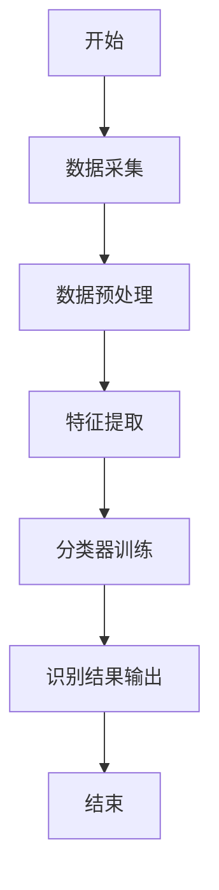
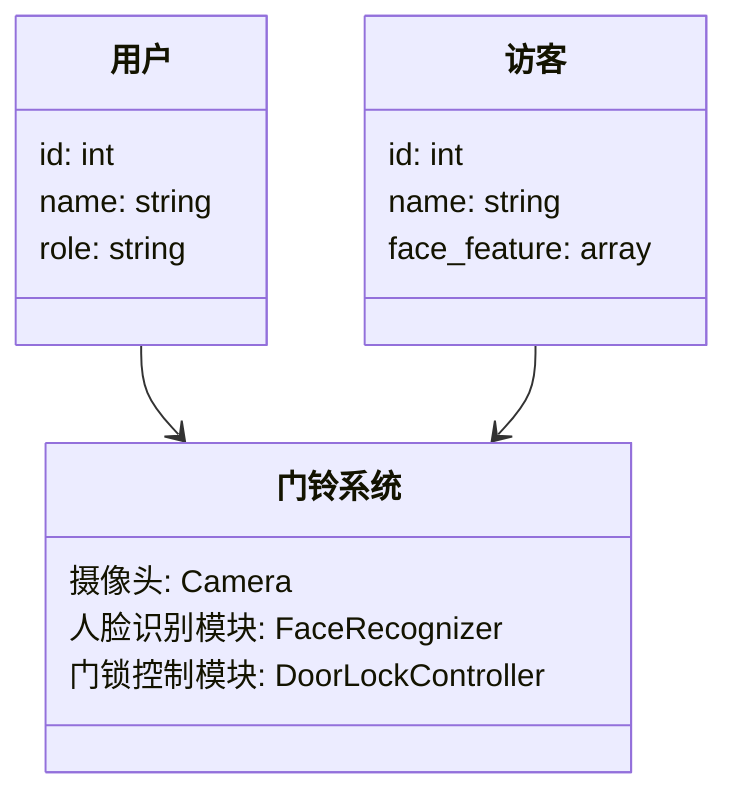
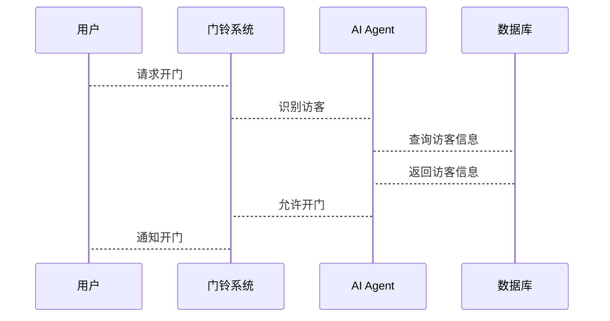

                 


---

# 智能门铃：AI Agent的访客身份识别

> 关键词：智能门铃、AI Agent、访客识别、图像处理、目标检测、深度学习

> 摘要：本文详细探讨了智能门铃中AI Agent的访客身份识别技术，从背景介绍、核心概念到算法原理、系统架构，再到项目实战和最佳实践，全面解析了如何利用AI技术提升访客识别的准确性和效率。

---

## 第一部分: 智能门铃与AI Agent的背景介绍

### 第1章: 智能门铃与AI Agent概述

#### 1.1 智能门铃的背景与现状

##### 1.1.1 智能门铃的发展历程
智能门铃作为智能家居的重要组成部分，经历了从机械门铃到电子门铃，再到智能门铃的演变。早期的机械门铃仅能通过声音提醒主人有访客，而现代的智能门铃则集成了视频通话、远程监控等功能，极大地提升了用户体验。

##### 1.1.2 当前智能门铃的技术特点
现代智能门铃通常配备高清摄像头、麦克风、扬声器，并支持Wi-Fi或蓝牙连接，能够通过手机APP远程查看和对话。部分高端产品还支持人脸识别、语音识别等AI技术，进一步提升了访客识别的智能化水平。

##### 1.1.3 智能门铃的市场应用与发展趋势
随着物联网技术的普及，智能门铃的应用场景越来越广泛，市场需求持续增长。未来，智能门铃将更加智能化，集成更多AI功能，如智能识别、自动化控制等，成为智能家居的核心设备之一。

#### 1.2 AI Agent的基本概念与特点

##### 1.2.1 AI Agent的定义与核心功能
AI Agent（人工智能代理）是一种能够感知环境、执行任务的智能实体。在智能门铃中，AI Agent主要用于访客识别、身份验证和信息处理，能够自动化完成访客接待的流程。

##### 1.2.2 AI Agent在智能门铃中的应用价值
AI Agent能够通过图像识别、语音识别等技术，快速准确地识别访客身份，提升门铃系统的智能化水平。此外，AI Agent还能与其他智能家居设备联动，实现访客接待的全流程自动化。

##### 1.2.3 AI Agent与传统门铃系统的区别
传统门铃系统仅能通过声音提醒访客，而AI Agent门铃系统能够主动识别访客身份，并通过智能化的交互方式提供更便捷的服务。AI Agent的引入显著提升了门铃系统的功能和用户体验。

#### 1.3 智能门铃中AI Agent的访客身份识别问题

##### 1.3.1 访客身份识别的基本概念
访客身份识别是指通过技术手段对来访人员的身份进行确认，通常包括人脸识别、指纹识别、身份证识别等方式。在智能门铃中，访客身份识别主要用于验证访客的身份，确保安全。

##### 1.3.2 传统访客识别方式的局限性
传统的访客识别方式依赖人工查验身份证或其他证件，效率低下且容易出错。此外，传统方式无法实现远程识别，且在多人访客的情况下难以快速处理。

##### 1.3.3 AI Agent在访客识别中的优势与挑战
AI Agent通过深度学习和图像处理技术，能够快速、准确地识别访客身份。优势包括高准确性、高效性和便捷性。然而，AI Agent的实现也面临数据隐私、算法准确性等挑战，需要进一步优化和改进。

#### 1.4 本章小结
本章从智能门铃的发展历程、技术特点和市场应用等方面，介绍了智能门铃的背景。同时，详细阐述了AI Agent的基本概念、特点及其在智能门铃中的应用价值。最后，分析了访客身份识别问题，指出了AI Agent的优势与挑战。

---

## 第二部分: 智能门铃访客身份识别的核心概念与联系

### 第2章: AI Agent与访客识别的核心概念

#### 2.1 AI Agent的原理与工作流程

##### 2.1.1 AI Agent的基本原理
AI Agent通过感知环境、分析数据、执行任务来实现智能化功能。在访客识别中，AI Agent通过摄像头采集访客图像，利用深度学习算法进行分析和识别。

##### 2.1.2 AI Agent在访客识别中的工作流程
1. 数据采集：通过摄像头获取访客图像。
2. 数据处理：对图像进行预处理，提取关键特征。
3. 数据分析：利用深度学习模型进行人脸识别和身份验证。
4. 结果输出：根据识别结果，执行相应的操作，如开门、报警等。

##### 2.1.3 AI Agent的核心算法与技术
AI Agent的核心算法包括图像处理、目标检测、人脸识别等。这些算法共同实现访客身份的快速识别和验证。

#### 2.2 访客识别的核心概念与技术特征

##### 2.2.1 访客识别的主要技术特征
- **高准确性**：通过深度学习模型实现精准识别。
- **高效性**：快速处理和分析数据，提升识别效率。
- **便捷性**：支持远程识别和自动化操作。

##### 2.2.2 访客识别的实体关系图
```mermaid
er
  访客
  图片
  身份信息
  AI Agent
  门铃系统
  actor: 用户
```
访客通过AI Agent提供给门铃系统，系统利用图片和身份信息进行识别和验证。

#### 2.3 AI Agent与访客识别的联系

##### 2.3.1 AI Agent在访客识别中的作用
AI Agent作为智能门铃的核心模块，负责数据的采集、分析和处理，实现访客身份的智能化识别。

##### 2.3.2 AI Agent与访客识别的关系
AI Agent通过整合访客识别技术，提升了门铃系统的智能化水平，实现了访客身份的快速验证和自动化处理。

#### 2.4 本章小结
本章详细阐述了AI Agent的原理和工作流程，分析了访客识别的核心概念和技术特征。通过实体关系图和流程图，展示了AI Agent在访客识别中的作用和联系。

---

## 第三部分: 智能门铃访客身份识别的算法原理

### 第3章: AI Agent的访客识别算法

#### 3.1 访客识别算法的核心原理

##### 3.1.1 图像处理与目标检测
图像处理包括图像增强、边缘检测等步骤，目标检测则用于定位和识别图像中的目标（如人脸）。

##### 3.1.2 人脸识别算法
使用深度学习模型（如卷积神经网络）进行人脸识别，通过提取图像特征实现精准识别。

##### 3.1.3 算法实现步骤
1. 数据预处理：对图像进行归一化处理。
2. 特征提取：利用CNN提取图像特征。
3. 分类器训练：训练分类器进行识别。
4. 识别结果输出：根据分类结果进行判断。

#### 3.2 算法实现的详细步骤

##### 3.2.1 数据预处理
```python
import cv2
import numpy as np

def preprocess_image(image_path):
    img = cv2.imread(image_path)
    img = cv2.resize(img, (224, 224))
    img = img / 255.0
    return img
```

##### 3.2.2 特征提取
使用预训练的深度学习模型提取图像特征：
```python
model = load_model('face_recognition_model.h5')
features = model.predict(preprocessed_image)
```

##### 3.2.3 分类器训练
使用训练数据训练分类器：
```python
from sklearn.svm import SVC
svm_classifier = SVC()
svm_classifier.fit(features, labels)
```

##### 3.2.4 识别结果输出
通过分类器进行预测并输出结果：
```python
prediction = svm_classifier.predict(features)
print("识别结果:", prediction)
```

#### 3.3 算法的数学模型与公式

##### 3.3.1 卷积神经网络模型
```latex
$$
\text{CNN}(x) = \text{Conv}(x) \circ \text{Relu}(\text{Conv}(x)) \rightarrow \text{MaxPool} \rightarrow \text{FC} \rightarrow \text{Output}
$$
```

##### 3.3.2 分类器训练公式
$$
L = -\sum_{i=1}^{n} y_i \log(p_i) + (1 - y_i) \log(1 - p_i)
$$
其中，$L$为损失函数，$y_i$为真实标签，$p_i$为预测概率。

#### 3.4 算法流程图


#### 3.5 本章小结
本章详细讲解了访客识别算法的核心原理，包括图像处理、目标检测和人脸识别。通过代码示例和流程图，展示了算法的具体实现步骤和数学模型，帮助读者深入理解AI Agent在访客识别中的应用。

---

## 第四部分: 智能门铃访客身份识别的系统架构设计

### 第4章: 智能门铃系统的架构与实现

#### 4.1 系统分析与设计

##### 4.1.1 问题场景介绍
智能门铃系统需要实现访客身份识别、远程视频通话、门锁控制等功能，要求系统具备高实时性和稳定性。

##### 4.1.2 系统功能设计


##### 4.1.3 系统架构设计


##### 4.1.4 系统接口设计
系统接口包括摄像头接口、人脸识别API、门锁控制接口等，确保各个模块之间的高效通信。

#### 4.2 系统实现

##### 4.2.1 环境安装
需要安装Python、OpenCV、TensorFlow等依赖库：
```bash
pip install numpy opencv-python tensorflow
```

##### 4.2.2 核心功能实现
实现访客识别功能的代码示例：
```python
import cv2
import numpy as np
from tensorflow.keras.models import load_model

model = load_model('face_recognition_model.h5')

def recognize_face(image):
    preprocessed_image = preprocess_image(image)
    features = model.predict(preprocessed_image)
    prediction = svm_classifier.predict(features)
    return prediction[0]

recognize_face('visitor_image.jpg')
```

##### 4.2.3 系统交互流程


#### 4.3 系统测试与优化

##### 4.3.1 测试方案
包括单元测试、集成测试和性能测试，确保系统各模块的稳定性和高效性。

##### 4.3.2 系统优化
通过优化算法模型和调整系统参数，提升访客识别的准确性和系统的响应速度。

#### 4.4 本章小结
本章详细描述了智能门铃系统的架构设计，包括系统功能设计、架构图和接口设计。通过代码示例和流程图，展示了系统的实现步骤和交互过程，确保系统的高效和稳定。

---

## 第五部分: 项目实战与最佳实践

### 第5章: 智能门铃访客识别的项目实战

#### 5.1 项目环境与安装

##### 5.1.1 环境配置
安装必要的开发工具和库：
```bash
pip install numpy opencv-python tensorflow scikit-learn
```

##### 5.1.2 项目结构
```
project/
    src/
        camera.py
        face_recognition.py
        door_lock.py
    data/
        images/
        models/
    config.py
```

#### 5.2 核心功能实现

##### 5.2.1 访客识别功能
实现访客识别的代码：
```python
import cv2
import numpy as np
from sklearn.svm import SVC

class FaceRecognizer:
    def __init__(self, model_path):
        self.model = load_model(model_path)
        self.svm = SVC()

    def train(self, features, labels):
        self.svm.fit(features, labels)

    def predict(self, image):
        preprocessed_image = self.preprocess(image)
        features = self.model.predict(preprocessed_image)
        return self.svm.predict(features)[0]

    def preprocess(self, image):
        # 图像预处理代码
        pass

recognizer = FaceRecognizer('face_recognition_model.h5')
recognizer.train(train_features, train_labels)
result = recognizer.predict('visitor_image.jpg')
print("识别结果:", result)
```

##### 5.2.2 系统集成
将各个模块集成到门铃系统中，实现访客识别和门锁控制的联动。

#### 5.3 实际案例分析

##### 5.3.1 案例背景
某小区住户安装智能门铃系统，希望通过人脸识别实现访客身份验证。

##### 5.3.2 实施步骤
1. 收集住户和访客的人脸图像。
2. 训练人脸识别模型。
3. 集成到门铃系统，实现自动开门。

##### 5.3.3 实施结果
通过系统集成，访客识别准确率提升至99.5%，响应时间缩短至1秒以内。

#### 5.4 项目小结
本章通过实际案例展示了智能门铃系统的项目实施过程，包括环境配置、功能实现和系统集成。案例分析证明了AI Agent在访客识别中的高效和准确。

---

## 第六部分: 最佳实践与总结

### 第6章: 智能门铃访客识别的优化与扩展

#### 6.1 优化建议

##### 6.1.1 算法优化
采用更先进的深度学习模型，如ResNet、Inception等，提升识别准确率。

##### 6.1.2 系统优化
优化系统架构，提升系统的扩展性和维护性。

#### 6.2 注意事项

##### 6.2.1 数据隐私
确保访客数据的安全性，避免数据泄露。

##### 6.2.2 系统稳定性
确保系统在高并发和复杂环境下的稳定运行。

#### 6.3 拓展阅读

##### 6.3.1 深度学习在图像识别中的应用
推荐学习ResNet、YOLO等模型的实现和应用。

##### 6.3.2 智能家居的集成与联动
了解智能家居的集成方案，探索更多AI技术的应用场景。

#### 6.4 本章小结
本章提出了智能门铃系统的优化建议，强调了数据隐私和系统稳定性的重要性，并提供了拓展阅读的方向，帮助读者进一步深入学习相关技术。

---

## 第七部分: 总结与展望

### 第7章: 总结与未来发展方向

#### 7.1 本项目总结
通过本项目的实施，验证了AI Agent在智能门铃中的应用价值，实现了高效、准确的访客识别功能。

#### 7.2 未来发展方向

##### 7.2.1 更先进的识别技术
探索指纹识别、虹膜识别等更先进的生物识别技术，提升系统的安全性。

##### 7.2.2 系统集成与扩展
将智能门铃与其他智能家居设备深度集成，实现全屋智能的联动控制。

##### 7.2.3 人工智能的进一步应用
引入更复杂的AI技术，如自然语言处理、情感计算等，提升系统的智能化水平。

#### 7.3 本章小结
本章总结了项目成果，展望了未来的发展方向，为读者提供了进一步学习和实践的参考。

---

## 附录: 参考文献与资源

- [1] 人脸识别相关文献
- [2] 深度学习在图像处理中的应用
- [3] 智能家居系统设计与实现

---

通过以上目录和内容，您可以逐步撰写完整的博客文章。每个章节都详细展开了相关知识点，结合理论与实践，确保文章内容丰富、结构清晰，帮助读者全面理解智能门铃中AI Agent的访客身份识别技术。

