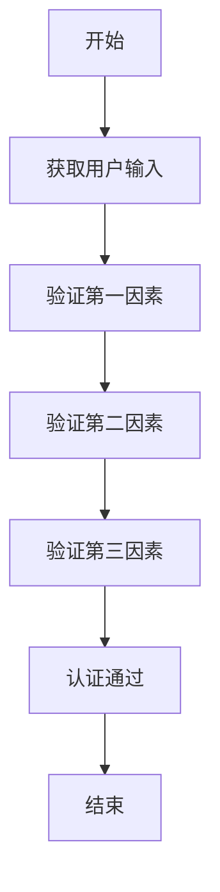
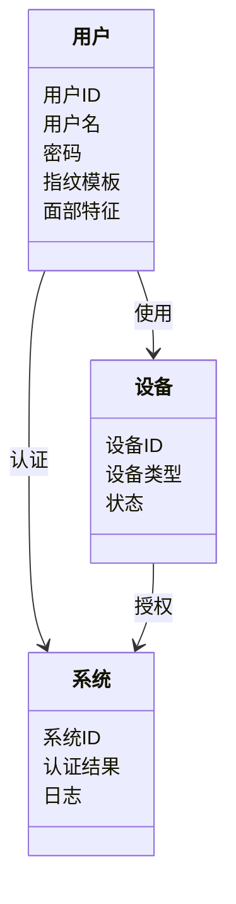
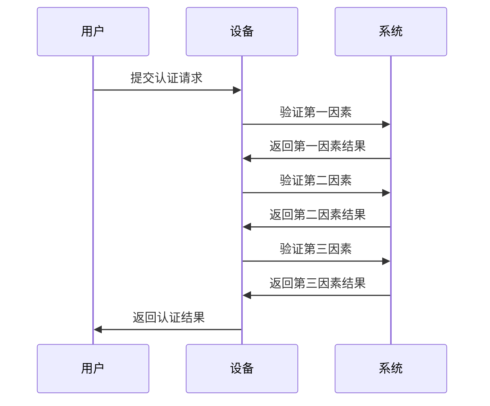

                 


# 智能门锁：AI Agent的多因素安全认证系统

## 关键词
智能门锁, AI Agent, 多因素安全认证, 系统架构设计, 项目实战

## 摘要
智能门锁作为智能家居的重要组成部分，正逐步向智能化、安全化方向发展。本文深入探讨了AI Agent在智能门锁中的应用，分析了多因素安全认证系统的实现原理，结合实际案例，详细讲解了系统架构设计和项目实战。通过本文的学习，读者将能够全面了解智能门锁的AI Agent多因素安全认证系统的实现细节，并掌握相关的技术要点。

---

# 第一部分: 背景介绍

## 第1章: 问题背景与描述

### 1.1 智能门锁的发展历程

#### 1.1.1 传统门锁的局限性
传统门锁主要依赖机械结构，存在以下问题：
- **安全性低**：容易被暴力破解或复制钥匙。
- **管理不便**：钥匙丢失或损坏需要重新配发，成本高。
- **功能单一**：仅能实现基本的开关功能。

#### 1.1.2 智能门锁的出现与演变
随着物联网技术的发展，智能门锁逐渐普及：
- **第一代**：基于RFID技术的电子门锁，支持刷卡开门。
- **第二代**：支持指纹识别、密码输入的智能门锁。
- **第三代**：结合AI技术的智能门锁，具备学习和自适应能力。

#### 1.1.3 当前智能门锁的应用场景
智能门锁广泛应用于家庭、办公场所、酒店等多种场景，尤其在智能家居中的应用越来越普遍。

### 1.2 AI Agent在智能门锁中的应用背景

#### 1.2.1 AI Agent的基本概念
AI Agent（智能代理）是指能够感知环境、自主决策并执行任务的智能实体。在智能门锁中，AI Agent可以用于用户识别、行为分析和异常检测。

#### 1.2.2 多因素认证的定义
多因素认证（Multi-factor Authentication，MFA）是指结合多种身份验证方式（如密码、指纹、面部识别等）来提高安全性的认证方法。

#### 1.2.3 智能门锁结合AI Agent的必要性
- 提高安全性：通过多因素认证，降低单一因素被破解的风险。
- 方便用户：AI Agent可以学习用户的使用习惯，提供更便捷的服务。
- 智能决策：AI Agent能够分析异常行为，及时发出警报。

### 1.3 问题解决与边界外延

#### 1.3.1 多因素安全认证的核心问题
- 如何实现多种认证方式的无缝集成？
- 如何保证认证过程的安全性和稳定性？
- 如何优化用户体验，降低误识别率？

#### 1.3.2 AI Agent在认证中的作用
- 自动识别用户的多种身份特征。
- 实时分析用户的操作行为，判断是否异常。
- 根据环境变化动态调整认证策略。

#### 1.3.3 系统的边界与外延
系统边界包括智能门锁、AI Agent、用户设备和云端服务器。外延部分涉及与智能家居平台的集成，如与智能灯、空调等设备联动。

---

## 第2章: 核心概念与联系

### 2.1 核心概念原理

#### 2.1.1 AI Agent的原理
AI Agent通过感知环境、分析数据、做出决策并执行操作，实现智能化的认证功能。

#### 2.1.2 多因素认证的原理
多因素认证通过结合多种认证方式，提高安全性。常见的认证方式包括：
- 知晓因素（What You Know）：密码、PIN码。
- 拥有因素（What You Have）：智能卡、手机验证码。
- 生物因素（What You Are）：指纹、面部识别。

### 2.2 核心概念属性特征对比

| 特性          | AI Agent                 | 多因素认证             |
|---------------|--------------------------|------------------------|
| 核心功能      | 智能感知、自主决策        | 多种认证方式结合        |
| 优势          | 学习能力强、适应性高       | 安全性高                |
| 应用场景      | 智能门锁、智能家居         | 用户登录、金融支付等    |

### 2.3 ER实体关系图
```mermaid
erDiagram
    用户 {
        +string 用户ID
        +string 用户名
        +string 密码
    }
    设备 {
        +string 设备ID
        +string 设备类型
    }
    系统 {
        +string 系统ID
        +string 系统名称
    }
    用户 --> 设备 : 使用
    用户 --> 系统 : 认证
    设备 --> 系统 : 授权
```

### 2.4 本章小结
本章通过对比分析AI Agent和多因素认证的核心概念，明确了它们在智能门锁中的作用和相互关系。

---

# 第二部分: 算法原理讲解

## 第3章: 多因素认证算法

### 3.1 算法流程


### 3.2 算法实现

#### 3.2.1 算法原理
多因素认证算法通常分为以下几个步骤：
1. 获取用户输入。
2. 验证第一因素（如密码）。
3. 验证第二因素（如指纹）。
4. 验证第三因素（如面部识别）。
5. 综合判断，决定是否通过认证。

#### 3.2.2 数学模型
假设我们使用线性回归模型来预测用户行为的异常性：
$$ y = \beta_0 + \beta_1x_1 + \beta_2x_2 + \epsilon $$
其中，$y$是预测的异常评分，$x_1$和$x_2$是输入特征，$\beta_0$、$\beta_1$、$\beta_2$是模型参数，$\epsilon$是误差项。

---

# 第三部分: 系统分析与架构设计方案

## 第4章: 系统分析与架构设计

### 4.1 问题场景介绍
智能门锁需要在复杂环境中实现多因素认证，确保安全性的同时提供便捷的用户体验。

### 4.2 系统功能设计

#### 4.2.1 领域模型


### 4.3 系统架构设计

#### 4.3.1 系统架构图
```mermaid
graph LR
    用户 --> AI Agent
    AI Agent --> 多因素认证系统
    多因素认证系统 --> 云端服务器
    云端服务器 --> 智能门锁
```

### 4.4 接口设计与交互流程

#### 4.4.1 接口设计
- 用户端接口：提供输入密码、指纹识别、面部识别的功能。
- 设备端接口：接收认证请求，控制门锁开关。
- 系统端接口：处理认证逻辑，返回认证结果。

#### 4.4.2 交互流程


---

## 第5章: 项目实战

### 5.1 环境安装

```bash
pip install python-mermaid
npm install -g mermaid-cli
```

### 5.2 核心代码实现

```python
# AI Agent认证系统核心代码
class AIAgent:
    def __init__(self):
        self.model = self.build_model()

    def build_model(self):
        # 构建线性回归模型
        return "y = β0 + β1x1 + β2x2 + ε"

    def authenticate(self, factor1, factor2, factor3):
        # 验证三个因素
        result = self.model.predict(factor1, factor2, factor3)
        return result > 0.5

# 多因素认证系统实现
class MultiFactorAuth:
    def __init__(self, agent):
        self.agent = agent

    def authenticate(self, user):
        if self.agent.authenticate(user.password, user.fingerprint, user.face):
            return "认证通过"
        else:
            return "认证失败"
```

### 5.3 案例分析

#### 5.3.1 案例场景
用户尝试使用密码、指纹和面部识别开门。

#### 5.3.2 认证过程
1. 用户输入密码。
2. 系统验证密码。
3. 系统验证指纹。
4. 系统验证面部识别。
5. 综合判断，返回认证结果。

#### 5.3.3 结果分析
如果所有因素都通过，则门锁打开；否则，系统提示认证失败。

### 5.4 本章小结
本章通过实际案例，详细讲解了AI Agent多因素认证系统的实现过程和注意事项。

---

## 第6章: 最佳实践

### 6.1 小结
本文详细讲解了智能门锁中AI Agent多因素认证系统的实现，从背景介绍到算法原理，再到系统设计和项目实战，帮助读者全面掌握相关技术。

### 6.2 注意事项
- 定期更新系统和模型，防止被破解。
- 保护用户隐私，避免数据泄露。
- 提供多因素认证的组合方式，提高安全性。

### 6.3 拓展阅读
- 《人工智能在物联网中的应用》
- 《多因素认证系统的设计与实现》
- 《智能门锁的未来发展》

---

以上是《智能门锁：AI Agent的多因素安全认证系统》的完整目录大纲和详细内容。通过以上分析，我们可以清晰地看到智能门锁的AI Agent多因素认证系统的实现过程和相关技术细节。

