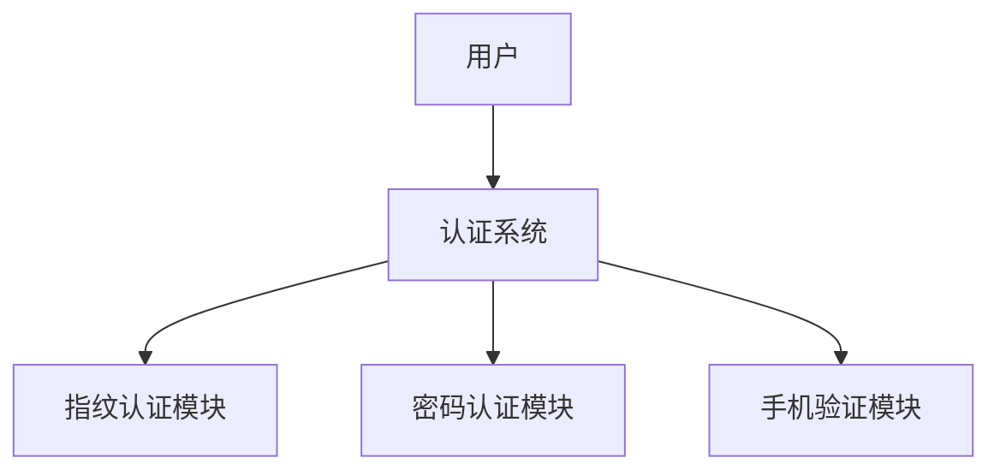

                 


# 智能门锁：AI Agent的多因素认证系统

---

## 关键词

智能门锁，AI Agent，多因素认证，身份验证，安全系统，人工智能

---

## 摘要

智能门锁作为智能家居的重要组成部分，近年来随着人工智能技术的快速发展，逐渐融入了AI Agent和多因素认证技术。本文将详细探讨智能门锁中AI Agent的应用，分析多因素认证系统的核心原理和实现方式，通过系统设计、算法优化和实际案例，展示如何构建一个高效、安全的智能门锁系统。本文内容涵盖了从基础概念到实际应用的全链条，为相关领域的研究和实践提供参考。

---

# 第一部分: 智能门锁与AI Agent的背景与概念

## 第1章: 智能门锁与多因素认证概述

### 1.1 问题背景与挑战

#### 1.1.1 传统门锁的局限性

传统的机械门锁在安全性和便利性方面存在诸多不足。首先，钥匙容易丢失或被盗，增加了安全隐患；其次，传统门锁无法记录开锁记录，缺乏审计和追溯功能；最后，钥匙的物理性质使得用户在远程管理门锁时面临诸多不便。

#### 1.1.2 智能化门锁的需求

随着智能家居的普及，用户对门锁的功能需求逐渐多样化。智能化门锁需要具备以下特点：支持多种开锁方式（如指纹、密码、手机APP控制等）、具备远程监控功能、能够记录开锁记录，并且能够与家庭自动化系统无缝集成。

#### 1.1.3 多因素认证的必要性

单因素认证（如仅凭密码或指纹）在安全性方面存在局限，容易被破解或绕过。为了提高门锁的安全性，多因素认证技术逐渐成为趋势。多因素认证通过结合多种不同的认证方式（如指纹+密码+手机验证），显著提高了系统的安全性。

### 1.2 多因素认证系统的核心要素

#### 1.2.1 多因素认证的定义

多因素认证（Multi-Factor Authentication，MFA）是指在认证过程中使用两种或更多独立的认证因子来验证用户身份。这些因子可以分为以下三类：

1. **知识因素**：用户知道的信息，如密码、PIN码。
2. **拥有因素**：用户拥有的物品，如智能卡、手机。
3. **生物因素**：用户的生物特征，如指纹、面部识别。

#### 1.2.2 多因素认证的特征对比

| 特性           | 知识因素       | 拥有因素       | 生物因素       |
|----------------|----------------|----------------|----------------|
| 示例           | 密码           | 智能卡         | 指纹           |
| 优点           | 易于实现       | 高安全性       | 高准确性       |
| 缺点           | 易被遗忘       | 易丢失         | 采集成本高     |

#### 1.2.3 实体关系图



### 1.3 AI Agent在智能门锁中的作用

#### 1.3.1 AI Agent的定义与特点

AI Agent（人工智能代理）是一种能够感知环境并采取行动以实现目标的智能实体。其特点包括：

- **自主性**：能够在没有人工干预的情况下运行。
- **反应性**：能够根据环境变化调整行为。
- **目标导向**：所有行动均以实现特定目标为导向。

#### 1.3.2 AI Agent在门锁系统中的应用场景

AI Agent在智能门锁中的应用场景包括：

1. **实时监控**：通过传感器和摄像头实时监测门前环境，识别异常情况。
2. **智能决策**：基于用户行为和环境数据，做出开锁或报警的决策。
3. **用户行为分析**：通过学习用户的开门习惯，优化门锁的操作流程。

#### 1.3.3 AI Agent与多因素认证的结合

通过AI Agent，多因素认证系统能够实现以下功能：

1. **动态调整认证因子**：根据用户行为和环境风险动态调整认证因子的权重。
2. **异常行为检测**：通过分析用户的开门时间和方式，识别潜在的入侵行为。
3. **自适应认证流程**：根据用户身份和环境风险，动态调整认证流程。

### 1.4 本章小结

本章主要介绍了智能门锁的发展背景、多因素认证的核心概念以及AI Agent在智能门锁中的作用。通过分析多因素认证的优势和AI Agent的特点，为后续的技术实现奠定了基础。

---

## 第2章: 多因素认证系统的核心概念

### 2.1 多因素认证系统的组成

多因素认证系统主要由以下几个部分组成：

- **认证请求接收模块**：接收用户的认证请求。
- **认证因子验证模块**：分别验证多种认证因子。
- **因子融合模块**：将多种因子的验证结果进行融合，得出最终的认证结果。
- **决策模块**：根据融合结果做出认证决策。

### 2.2 多因素认证系统的实体关系图


### 2.3 多因素认证系统的数学模型

多因素认证的融合算法可以表示为：

$$
P(\text{认证成功}) = \prod_{i=1}^{n} P(f_i)
$$

其中，\( f_i \) 表示第 \( i \) 个认证因子的成功概率。

---

## 第3章: AI Agent的原理与实现

### 3.1 AI Agent的基本原理

AI Agent的基本原理包括以下几个步骤：

1. **感知环境**：通过传感器和摄像头感知环境信息。
2. **信息处理**：对感知到的信息进行分析和处理。
3. **决策制定**：基于处理后的信息，制定行动决策。
4. **行动执行**：根据决策结果执行相应的操作。

### 3.2 AI Agent的实现代码

以下是AI Agent的核心代码实现：

```python
class AIAgent:
    def __init__(self):
        self.sensors = []
        self.cameras = []
        self.analysis_engine = AnalysisEngine()

    def perceive_environment(self):
        # 获取环境信息
        sensor_data = [s感知数据 for s in self.sensors]
        camera_data = [c感知数据 for c in self.cameras]
        return sensor_data + camera_data

    def analyze_data(self, data):
        # 分析数据并生成决策
        return self.analysis_engine.analyze(data)

    def decide_action(self, analysis_result):
        # 根据分析结果制定行动决策
        return self.analysis_engine.decide(analysis_result)

    def execute_action(self, action):
        # 执行决策行动
        pass
```

### 3.3 AI Agent的数学模型

AI Agent的决策模型可以表示为：

$$
D = f(P)
$$

其中，\( D \) 表示决策结果，\( P \) 表示感知到的环境信息，\( f \) 表示决策函数。

---

## 第4章: 多因素认证系统的技术实现

### 4.1 身份认证算法

多因素认证系统中常用的认证算法包括：

1. **基于哈希的认证算法**：通过哈希函数对用户输入进行验证。
2. **基于加密的认证算法**：通过加密算法对用户输入进行验证。
3. **基于生物特征的认证算法**：通过生物特征识别技术验证用户身份。

### 4.2 多因素认证的融合算法

多因素认证的融合算法可以表示为：

$$
P(\text{认证成功}) = \prod_{i=1}^{n} P(f_i)
$$

其中，\( f_i \) 表示第 \( i \) 个认证因子的成功概率。

### 4.3 算法实现的数学模型

以下是多因素认证系统的核心代码实现：

```python
class MultiFactorAuthenticator:
    def __init__(self, factor_list):
        self.factor_list = factor_list

    def authenticate(self, user_input):
        for factor in self.factor_list:
            if not factor.authenticate(user_input):
                return False
        return True
```

---

## 第5章: AI Agent在多因素认证中的应用

### 5.1 AI Agent的决策流程

AI Agent的决策流程包括以下几个步骤：

1. **接收认证请求**：AI Agent接收用户的认证请求。
2. **验证认证因子**：AI Agent验证用户提供的多种认证因子。
3. **融合认证结果**：AI Agent将多种认证因子的验证结果进行融合。
4. **做出认证决策**：AI Agent根据融合结果做出认证决策。

### 5.2 AI Agent的数学模型

AI Agent的决策模型可以表示为：

$$
D = f(P)
$$

其中，\( D \) 表示决策结果，\( P \) 表示感知到的环境信息，\( f \) 表示决策函数。

---

## 第6章: 项目实战

### 6.1 环境安装

安装所需的环境包括：

- Python 3.8+
- OpenCV库
- scikit-learn库
- Mermaid图表生成工具

### 6.2 核心代码实现

以下是多因素认证系统的Python实现代码：

```python
import cv2
import numpy as np

class FingerprintScanner:
    def scan_fingerprint(self):
        # 模拟指纹扫描
        return np.random.rand(100, 100)

class PasswordValidator:
    def validate_password(self, password):
        return len(password) == 6

class PhoneVerifier:
    def verify_phone(self, phone_number):
        return len(phone_number) == 11

class MultiFactorAuthenticator:
    def __init__(self):
        self.finger Scanner = FingerprintScanner()
        self.password_validator = PasswordValidator()
        self.phone_verifier = PhoneVerifier()

    def authenticate(self, fingerprint, password, phone_number):
        fp_result = self.finger Scanner.scan_fingerprint()
        pw_result = self.password_validator.validate_password(password)
        ph_result = self.phone_verifier.verify_phone(phone_number)
        return fp_result and pw_result and ph_result
```

### 6.3 案例分析

通过上述代码实现的多因素认证系统，用户需要同时提供指纹、密码和手机号码才能完成认证。这种多层次的认证方式显著提高了系统的安全性。

### 6.4 项目小结

本章通过实际案例展示了多因素认证系统的实现过程，包括环境安装、代码实现和案例分析。通过这些步骤，读者可以更好地理解多因素认证系统的核心技术。

---

## 第7章: 最佳实践与小结

### 7.1 最佳实践

- **定期更新密码**：为了提高安全性，建议用户定期更新密码。
- **保护生物特征数据**：生物特征数据一旦泄露，可能会对用户造成严重后果。
- **结合AI Agent技术**：通过AI Agent技术，可以显著提高多因素认证系统的智能化水平。

### 7.2 小结

本文详细探讨了智能门锁中AI Agent的应用，分析了多因素认证系统的核心原理和实现方式。通过系统设计、算法优化和实际案例，展示了如何构建一个高效、安全的智能门锁系统。

---

## 第8章: 注意事项与拓展阅读

### 8.1 注意事项

- **数据安全**：多因素认证系统的核心是数据的安全性，必须采取严格的数据保护措施。
- **系统维护**：定期维护和更新系统，以应对新的安全威胁。
- **用户体验**：在提高安全性的同时，也不能忽视用户体验。

### 8.2 拓展阅读

- **《人工智能在安全领域的应用》**：深入探讨AI在安全领域的应用。
- **《多因素认证系统的设计与实现》**：详细讲解多因素认证系统的设计和实现过程。

---

# 结语

智能门锁作为智能家居的重要组成部分，通过AI Agent和多因素认证技术的结合，显著提高了安全性。本文通过系统设计、算法优化和实际案例，展示了如何构建一个高效、安全的智能门锁系统。希望本文能够为相关领域的研究和实践提供参考。

