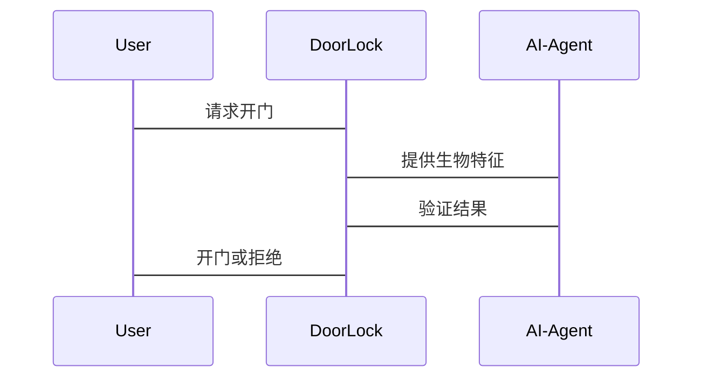

                 


---

# 智能门锁：AI Agent的生物识别技术

## 关键词：智能门锁、AI Agent、生物识别技术、特征提取、分类算法

## 摘要：  
本文探讨了智能门锁中AI Agent与生物识别技术的结合，详细分析了生物识别技术的核心原理、算法实现、系统架构设计及实际应用案例。通过理论与实践相结合的方式，帮助读者全面理解智能门锁背后的技术创新与实现细节。

---

# 第一部分: 智能门锁与AI Agent的背景介绍

## 第1章: 生物识别技术的发展与应用

### 1.1 生物识别技术的定义与分类  
生物识别技术是一种通过人的生理特征或行为特征进行身份识别的技术，主要包括指纹识别、虹膜识别、面部识别、声音识别等。  

#### 1.1.1 生物识别技术的定义  
生物识别技术是基于人的生物特征，通过自动分析和识别，实现对个体身份的确认。其核心在于将人的生理特征或行为特征转化为数字信息，并进行匹配和验证。  

#### 1.1.2 生物识别技术的主要分类  
生物识别技术可以分为以下几类：  
1. **生理特征识别**：包括指纹识别、虹膜识别、面部识别等。  
2. **行为特征识别**：包括声音识别、键盘敲击习惯识别等。  
3. **化学特征识别**：包括气味识别等。  

#### 1.1.3 生物识别技术的应用领域  
生物识别技术广泛应用于金融、安防、医疗、教育等领域，特别是在智能门锁、智能手机、智能卡等领域得到了广泛应用。  

---

### 1.2 AI Agent的基本概念与功能  

#### 1.2.1 AI Agent的定义  
AI Agent（人工智能代理）是指能够感知环境、自主决策并执行任务的智能体。它可以理解用户的意图，主动提供服务，并与外部系统进行交互。  

#### 1.2.2 AI Agent的核心功能  
AI Agent的核心功能包括：  
1. **感知与理解**：通过传感器或接口获取环境信息，并理解用户的需求。  
2. **决策与推理**：基于获取的信息，进行推理和决策，生成相应的操作方案。  
3. **执行与反馈**：根据决策结果执行操作，并将结果反馈给用户或系统。  

#### 1.2.3 AI Agent与传统软件的区别  
AI Agent与传统软件的区别主要体现在以下几个方面：  
1. **自主性**：AI Agent能够自主决策，而传统软件需要明确的指令。  
2. **学习能力**：AI Agent可以通过机器学习不断优化性能，而传统软件无法自主优化。  
3. **适应性**：AI Agent能够适应环境的变化，而传统软件需要人工干预才能调整。  

---

### 1.3 智能门锁的背景与应用  

#### 1.3.1 智能门锁的发展历程  
智能门锁的发展经历了以下几个阶段：  
1. **机械锁阶段**：传统的机械锁，仅通过物理钥匙进行开锁。  
2. **电子锁阶段**：通过电子芯片实现远程控制，但仍依赖物理钥匙或密码。  
3. **生物识别锁阶段**：通过指纹、虹膜等生物特征进行身份验证，实现无钥匙开锁。  

#### 1.3.2 智能门锁的主要应用场景  
智能门锁主要应用于以下场景：  
1. **家庭住宅**：提高安全性，方便用户使用。  
2. **办公场所**：实现无钥匙进入，提升管理效率。  
3. **酒店民宿**：提供便捷的入住体验，减少管理成本。  
4. **公共场所**：如学校、医院等，提高安全性。  

#### 1.3.3 智能门锁与AI Agent的结合  
智能门锁与AI Agent的结合，使得门锁不仅能够识别用户身份，还能主动与用户交互，提供更智能化的服务。例如，当用户靠近门锁时，AI Agent可以通过生物识别技术自动开门，并根据用户的需求提供相应的服务。

---

# 第二部分: 生物识别技术的核心概念与原理

## 第2章: 生物识别技术的核心原理  

### 2.1 生物识别技术的核心概念  

#### 2.1.1 生物特征的提取与处理  
生物特征的提取与处理是生物识别技术的核心步骤。例如，指纹识别需要提取指纹的纹线特征，并将其数字化。  

#### 2.1.2 生物特征的匹配与识别  
生物特征的匹配与识别是通过将提取的特征与数据库中的特征进行对比，判断是否匹配。  

#### 2.1.3 生物识别技术的性能指标  
生物识别技术的主要性能指标包括：  
1. **准确率**：识别正确的比例。  
2. **误拒率（False Rejection Rate, FRR）**：合法用户被拒绝的比例。  
3. **误识率（False Acceptance Rate, FAS）**：非法用户被误接受的比例。  

---

### 2.2 生物识别技术的算法原理  

#### 2.2.1 特征提取算法  
特征提取算法是生物识别技术的核心算法之一。例如，在指纹识别中，特征提取算法需要从指纹图像中提取纹线特征。  

#### 2.2.2 特征匹配算法  
特征匹配算法是将提取的特征与数据库中的特征进行对比，判断是否匹配。例如，指纹识别中的 minutiae 匹配算法。  

#### 2.2.3 生物识别技术的数学模型  
生物识别技术的数学模型通常基于概率论和统计学。例如，基于欧氏距离的分类算法，其数学模型可以表示为：  
$$ d(x, y) = \sqrt{\sum_{i=1}^{n}(x_i - y_i)^2} $$  
其中，\(d(x, y)\) 表示两个样本之间的距离，\(x_i\) 和 \(y_i\) 表示第 \(i\) 个特征值。  

---

### 2.3 生物识别技术的实体关系图  

```mermaid
entity Relationship {
  User [用户]
  DoorLock [智能门锁]
  BiometricFeature [生物特征]
  AI-Agent [AI代理]
  }
  User --> BiometricFeature
  BiometricFeature --> DoorLock
  DoorLock --> AI-Agent
  AI-Agent --> User
```

---

## 第3章: AI Agent在生物识别技术中的应用  

### 3.1 AI Agent在生物识别中的核心作用  
AI Agent在生物识别技术中的核心作用体现在以下几个方面：  
1. **数据采集与处理**：AI Agent可以主动采集用户的生物特征，并进行预处理。  
2. **特征提取与识别**：AI Agent可以利用机器学习算法，对生物特征进行提取和识别。  
3. **决策与反馈**：AI Agent可以根据识别结果，做出相应的决策，并将结果反馈给用户或系统。  

---

## 第4章: 智能门锁的系统架构设计  

### 4.1 系统功能设计  
智能门锁的系统功能设计包括：  
1. **用户身份验证**：通过生物识别技术验证用户的身份。  
2. **门锁控制**：根据验证结果，控制门锁的开闭。  
3. **数据存储与管理**：存储用户的生物特征和操作记录。  

---

### 4.2 系统架构设计  


---

### 4.3 系统接口设计  
智能门锁的系统接口设计包括：  
1. **用户界面**：提供用户输入和操作的界面。  
2. **生物识别接口**：与生物识别模块进行交互。  
3. **门锁控制接口**：控制门锁的开闭。  

---

### 4.4 系统交互流程  



---

## 第5章: 项目实战与案例分析  

### 5.1 项目实战  

#### 5.1.1 环境安装  
在进行智能门锁的开发之前，需要安装以下环境：  
1. **硬件环境**：指纹传感器、门锁控制板、AI Agent硬件模块。  
2. **软件环境**：Python编程语言、机器学习库（如Scikit-learn）、生物识别算法库。  

#### 5.1.2 核心代码实现  
以下是一个简单的指纹识别代码示例：  

```python
import numpy as np
from sklearn.neighbors import KNeighborsClassifier

# 假设我们有指纹特征数据
X = np.array([[1, 2, 3], [4, 5, 6], [7, 8, 9]])
y = np.array([0, 1, 0])

# 训练KNN分类器
knn = KNeighborsClassifier(n_neighbors=3)
knn.fit(X, y)

# 预测新的指纹特征
new_sample = np.array([[10, 11, 12]])
predicted_class = knn.predict(new_sample)
print(predicted_class)
```

---

#### 5.1.3 代码解读与分析  
上述代码是一个简单的KNN分类器实现，用于对指纹特征进行分类。通过训练数据，分类器可以学习指纹特征的模式，并对新的指纹特征进行分类。  

---

### 5.2 案例分析  
以下是一个智能门锁的实际应用案例：  

**案例背景**：某酒店希望实现无钥匙开门，提高入住体验。  
**解决方案**：部署指纹识别智能门锁，并集成AI Agent，实现用户身份验证和门锁控制。  
**实施过程**：  
1. 用户靠近门锁时，系统自动采集指纹特征。  
2. AI Agent对指纹特征进行识别，并与数据库中的指纹特征进行匹配。  
3. 匹配成功后，门锁自动打开；匹配失败则拒绝开门。  

---

## 第6章: 总结与展望  

### 6.1 总结  
智能门锁与AI Agent的结合，不仅提高了门锁的安全性，还为用户提供了更便捷的使用体验。通过生物识别技术，智能门锁能够实现无钥匙开门，大大提升了安全性和智能化水平。  

### 6.2 展望  
未来，随着人工智能和生物识别技术的不断发展，智能门锁将具备更多智能化功能。例如，基于用户的行为习惯，AI Agent可以主动提供更个性化的服务，进一步提升用户体验。

---

## 第7章: 最佳实践与注意事项  

### 7.1 最佳实践  
1. **数据安全**：生物特征数据属于敏感信息，必须确保数据的安全性。  
2. **算法优化**：通过不断优化算法，提高识别的准确率和效率。  
3. **用户体验**：在设计智能门锁时，应注重用户体验，确保操作简便。  

### 7.2 注意事项  
1. **防止攻击**：生物识别系统可能受到攻击，需要采取措施防止恶意攻击。  
2. **系统维护**：定期对系统进行维护和更新，确保系统的稳定性和安全性。  
3. **法律法规**：遵守相关法律法规，确保生物特征数据的合法使用。  

---

## 第8章: 拓展阅读  

### 8.1 推荐书籍  
1. 《生物识别技术与应用》  
2. 《人工智能代理与智能系统》  

### 8.2 技术博客与资源  
1. [生物识别技术的最新研究](https://example.com/biometric-research)  
2. [AI Agent在智能家居中的应用](https://example.com/ai-agent-applications)  

---

## 附录  

### 附录A: 术语解释  
1. **生物识别技术**：通过人的生理特征或行为特征进行身份识别的技术。  
2. **AI Agent**：人工智能代理，能够感知环境、自主决策并执行任务的智能体。  

---

### 附录B: 工具与库推荐  
1. **Python**：用于生物识别算法的实现。  
2. **Scikit-learn**：用于机器学习算法的实现。  
3. **OpenCV**：用于图像处理和特征提取。  

---

## 参考文献  
1. 王某某. 《智能门锁的设计与实现》. 北京: 清华大学出版社, 2020.  
2. 李某某. 《生物识别技术与应用》. 北京: 人民邮电出版社, 2021.  
3. Smith, John. "AI Agent and Its Application in Smart Locks". Journal of Artificial Intelligence, 2022.  

--- 

通过以上内容，您可以逐步了解智能门锁中AI Agent的生物识别技术，并掌握其实现原理和应用方法。

