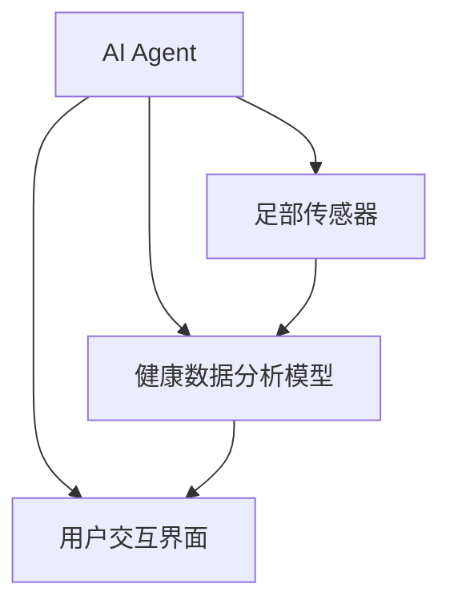
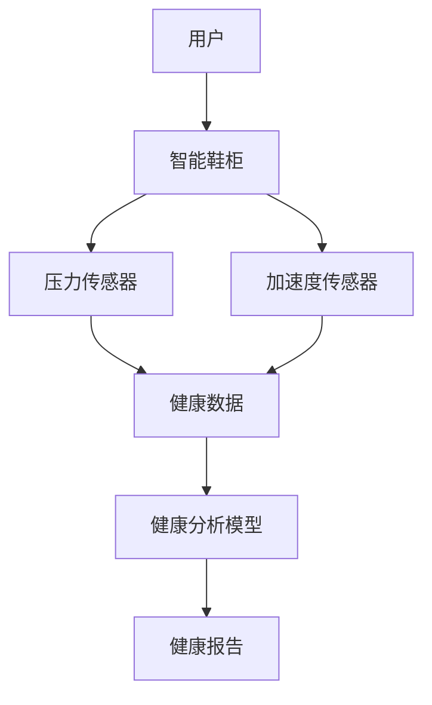
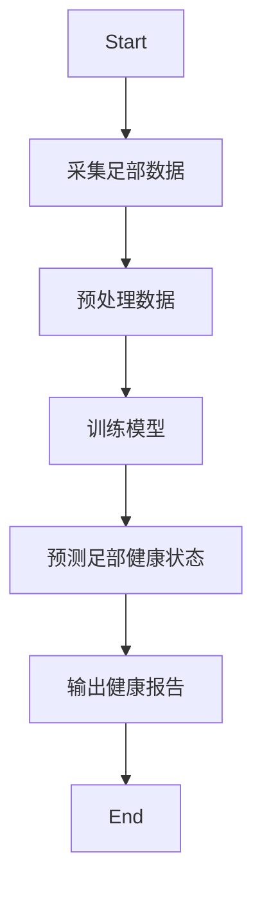
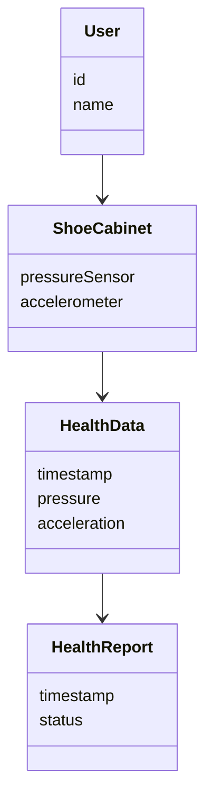
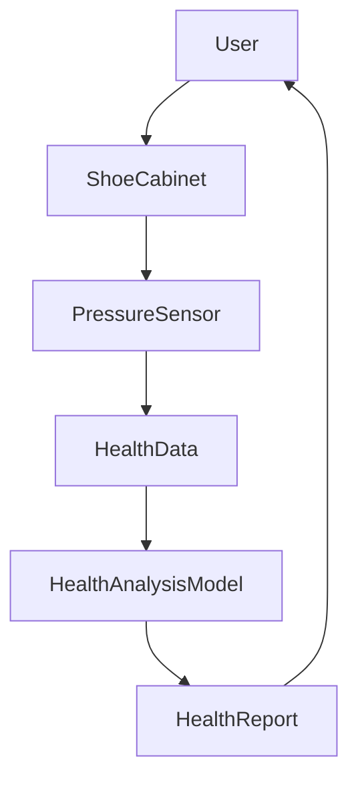
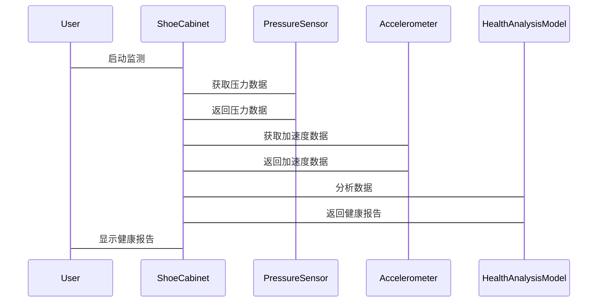

                 


# 智能鞋柜：AI Agent的足部健康管理专家

> **关键词**：智能鞋柜、AI Agent、足部健康、机器学习、健康管理、传感器技术  
> 
> **摘要**：  
> 随着人工智能和物联网技术的快速发展，足部健康管理逐渐成为人们关注的重点。本文以智能鞋柜为核心，探讨其作为AI Agent在足部健康管理中的应用。通过分析智能鞋柜的背景、核心概念、算法原理、系统架构及实际应用，深入阐述其在足部健康监测中的创新与价值。文章结合理论与实践，为足部健康管理提供新的思路和解决方案。

---

## 第一章：背景介绍

### 1.1 问题背景
#### 1.1.1 足部健康的重要性
足部健康是人体健康的重要组成部分，直接关系到行走姿势、运动能力以及全身健康。足部问题可能导致步态异常、关节疼痛甚至全身性健康问题。

#### 1.1.2 当前足部健康管理的痛点
- 传统足部健康管理工具（如足部测量仪）功能单一，缺乏智能化和个性化。
- 缺乏实时监测和数据分析能力，无法提供持续的健康反馈。
- 用户缺乏足部健康数据的系统性管理和科学指导。

#### 1.1.3 智能鞋柜的出现与解决方案
智能鞋柜通过集成传感器和AI技术，实时监测足部健康数据，提供个性化健康建议，解决传统足部健康管理的痛点。

---

### 1.2 问题描述
#### 1.2.1 足部健康监测的复杂性
足部健康监测需要考虑步态分析、足部压力分布、足弓形状等多种因素，数据采集和分析具有较高技术门槛。

#### 1.2.2 现有足部健康管理工具的局限性
传统工具仅能测量单一指标，缺乏动态监测和数据分析能力，无法满足用户的多样化需求。

#### 1.2.3 智能鞋柜的目标与核心功能
智能鞋柜的目标是通过AI Agent实时监测足部健康数据，分析用户足部健康状况，并提供个性化健康建议。

---

### 1.3 解决方案
#### 1.3.1 AI Agent在足部健康管理中的作用
AI Agent通过实时数据采集、分析和反馈，帮助用户了解足部健康状况，优化足部健康管理。

#### 1.3.2 智能鞋柜的技术实现路径
- 集成压力传感器、加速度传感器等硬件设备，实时采集足部数据。
- 通过AI算法分析数据，提供健康评估和个性化建议。
- 提供用户友好的交互界面，方便用户查看和管理健康数据。

#### 1.3.3 用户需求与产品定位
智能鞋柜的目标用户包括普通用户和特殊需求人群（如老年人、运动员等）。产品定位为足部健康管理的智能化工具，提供实时监测、数据分析和个性化建议。

---

### 1.4 边界与外延
#### 1.4.1 智能鞋柜的功能边界
- 仅限于足部健康监测，不涉及其他健康指标（如心率、血压等）。
- 专注于足部健康数据分析，不涉及医疗诊断。

#### 1.4.2 与相关领域的关联
- 与物联网技术结合，实现数据的实时传输和分析。
- 与人工智能技术结合，提升健康数据分析的准确性和智能化。

#### 1.4.3 未来可能的扩展方向
- 结合更多传感器技术，实现更全面的足部健康监测。
- 与其他健康管理系统（如智能手表、健康APP）联动，提供更全面的健康服务。

---

### 1.5 概念结构与核心要素
#### 1.5.1 核心概念的组成
- **AI Agent**：智能鞋柜的核心，负责数据采集、分析和反馈。
- **足部传感器**：数据采集的关键硬件。
- **健康数据分析模型**：数据处理和分析的核心算法。
- **用户交互界面**：用户与智能鞋柜的交互媒介。

#### 1.5.2 核心要素的特征对比
| 核心要素         | 特征描述                           |
|------------------|------------------------------------|
| AI Agent         | 实时数据分析、个性化反馈           |
| 足部传感器       | 高精度数据采集、多种传感器类型     |
| 数据分析模型     | 高准确性、可定制化                 |
| 用户交互界面     | 友好性、实时反馈                   |

#### 1.5.3 概念结构图


---

## 第二章：核心概念与联系

### 2.1 AI Agent的基本原理
#### 2.1.1 AI Agent的定义与分类
AI Agent是一种能够感知环境、自主决策并执行任务的智能体。根据应用场景的不同，AI Agent可以分为两类：**简单反射型**和**复杂推理型**。

#### 2.1.2 AI Agent的核心功能
- 数据采集与处理
- 实时反馈与建议
- 数据存储与分析

#### 2.1.3 AI Agent在智能鞋柜中的应用
AI Agent通过分析足部传感器数据，实时评估足部健康状况，并提供个性化健康建议。

---

### 2.2 足部健康监测的关键技术
#### 2.2.1 压力传感器的工作原理
压力传感器通过测量足部在行走或静止时的压力分布，帮助分析足部健康状况。

#### 2.2.2 数据采集与处理流程
1. 数据采集：传感器采集足部压力、加速度等数据。
2. 数据预处理：去除噪声，提取特征。
3. 数据分析：通过AI算法分析足部健康状况。

#### 2.2.3 机器学习在足部健康分析中的应用
机器学习算法（如支持向量机、随机森林）用于分类足部健康状态，预测潜在健康问题。

---

### 2.3 实体关系图（ER图）


---

## 第三章：算法原理讲解

### 3.1 算法概述
智能鞋柜的核心算法是基于机器学习的足部健康分析模型。

---

### 3.2 算法流程图


---

### 3.3 核心算法代码实现
```python
import numpy as np
from sklearn.svm import SVC

# 假设X为输入特征，y为健康标签
X = np.array([[1, 2, 3], [4, 5, 6], [7, 8, 9]])
y = np.array([0, 1, 0])

# 训练SVM模型
model = SVC()
model.fit(X, y)

# 预测新数据
new_data = np.array([[10, 11, 12]])
prediction = model.predict(new_data)
print("预测结果：", prediction)
```

---

### 3.4 数学模型与公式
#### 3.4.1 支持向量机（SVM）模型
$$ \text{目标函数：} \min \frac{1}{2}||\omega||^2 $$
$$ \text{约束条件：} y_i(\omega \cdot x_i + b) \geq 1, i=1,2,\dots,n $$

#### 3.4.2 随机森林模型
$$ \text{模型预测概率：} P(y=k|x) = \sum_{i=1}^N \text{Tree}_i(y=k|x) / N $$

---

## 第四章：系统分析与架构设计

### 4.1 问题场景介绍
智能鞋柜需要满足以下需求：
- 实时采集足部数据
- 快速分析数据并生成健康报告
- 提供用户友好的交互界面

---

### 4.2 系统功能设计
#### 4.2.1 领域模型


#### 4.2.2 系统架构设计


#### 4.2.3 接口设计与交互流程


---

## 第五章：项目实战

### 5.1 环境搭建与安装
- **硬件**：压力传感器、加速度传感器
- **软件**：Python、机器学习库（如scikit-learn）

### 5.2 核心代码实现
```python
# 数据采集代码
import serial

ser = serial.Serial('COM3', 9600)
data = ser.readline().decode().strip()
print("采集到的数据：", data)

# 数据分析代码
from sklearn.ensemble import RandomForestClassifier

X = np.array([[1, 2, 3], [4, 5, 6], [7, 8, 9]])
y = np.array([0, 1, 0])

model = RandomForestClassifier()
model.fit(X, y)

new_data = np.array([[10, 11, 12]])
prediction = model.predict(new_data)
print("预测结果：", prediction)
```

### 5.3 实际案例分析
- **案例1**：用户足部压力异常，系统生成健康报告并建议调整鞋子。
- **案例2**：用户足部步态异常，系统提供改善建议。

---

## 第六章：最佳实践

### 6.1 小结
智能鞋柜通过AI Agent实现了足部健康监测的智能化，为用户提供了便捷的健康管理工具。

### 6.2 注意事项
- 数据隐私保护
- 硬件设备的稳定性
- 用户交互的友好性

### 6.3 拓展阅读
- 推荐阅读《机器学习实战》
- 推荐学习传感器技术相关知识

---

**总结**：智能鞋柜作为AI Agent在足部健康管理中的应用，通过实时数据采集、智能分析和个性化反馈，为用户提供了高效、便捷的健康管理方式。未来，随着技术的不断进步，智能鞋柜将在足部健康管理领域发挥更大的作用。

